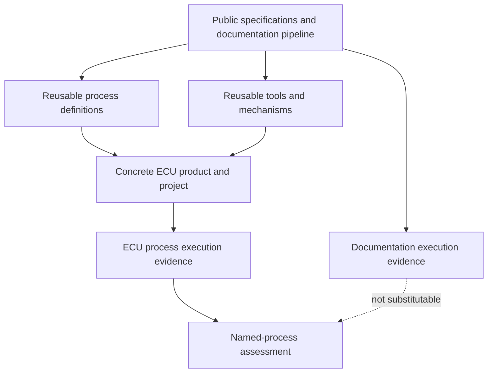
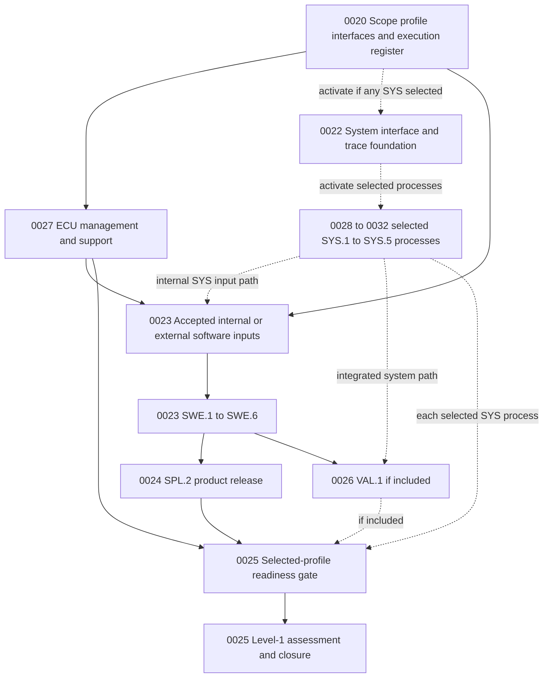
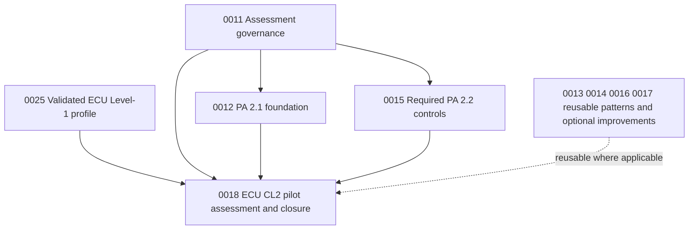

# Gap-remediation roadmap to Automotive SPICE Capability Levels 1 and 2

## 1. Goal state

The program intends to develop automotive ECU software. The current specification documentation/data-pipeline repository is an enabling process/tool foundation and a separate product; it is not the ECU process instance that will be rated.

The roadmap has two explicit gates:

### Gate A — ECU Capability Level 1

For each process in the approved ECU target profile:

- the process is actually performed on selected ECU process instances;
- validated evidence demonstrates its defined outcomes; and
- `PA 1.1 = L or F`.

The result is a named ECU process capability profile, not a repository-wide badge and not a product certification.

### Gate B — ECU Capability Level 2

For each process in the approved CL2 profile:

- all material process outcomes are fully achieved (`PA 1.1 = F`);
- performance is planned, resourced, monitored, communicated, and adjusted (`PA 2.1 ≥ L`);
- work products have defined requirements and are controlled, reviewed, and maintained (`PA 2.2 ≥ L`); and
- objective evidence is validated for approved process instances.

Level 2 builds on the validated Level-1 baseline. It must not conceal outcome gaps behind planning templates, configuration tooling, or artifact volume.

## 2. Product and evidence boundary

Documentation execution can prove outcomes only for its own process instance. Definitions and mechanisms can be reused after tailoring and control. Only evidence valid for the approved ECU product/process instance can support an ECU PA 1.1, PA 2.1, or PA 2.2 judgment.

Feature `0020` enforces this boundary with product, project, process, process-instance, baseline, revision, owner, origin, and validity metadata.

## 3. Workstreams and dependencies

### 3.1 ECU Level-1 workstreams

The selected profile, not a hard-coded 20-process graph, controls execution:

1. approve scope, responsibility, evidence validity, and exact completion gates;
2. establish project/configuration/support controls needed to retain trustworthy ECU work;
3. when any `SYS` process is internal, define its common interfaces/traces under Feature `0022` and execute only the selected process Features `0028`–`0032`; otherwise accept controlled allocated requirements, architecture/interface constraints, integration/verification feedback, and responsibility evidence;
4. perform `SWE.1`–`SWE.6` from the accepted software-development input baseline;
5. perform `SPL.2` for the supplied software/product without silently forcing `VAL.1` ownership;
6. execute Feature `0026` only when intended-use validation is in scope, or retain the approved external/shared validation and acceptance interface; and
7. block assessment until Feature `0025` verifies that every included process and every external/shared interface has its registered evidence gate satisfied.

This supports both the 14-process software-delivery nucleus and individually tailored system/validation responsibilities. Process evidence must not be invented internally for work performed elsewhere.

### 3.2 Progression to CL2

Feature `0018` is gated by the validated Feature `0025` ECU Level-1 profile, the assessment/governance foundation in Feature `0011`, PA 2.1 in Feature `0012`, and the required PA 2.2 controls ending in `0015-07`/`0015-08`. Features `0013`, `0014`, `0016`, and `0017` contain useful process patterns and documentation-product improvements, but their documentation-specific tasks are not hidden prerequisites for an ECU capability claim. Any reused mechanism must still be operated and evidenced in the ECU instance.

## 4. ECU Level-1 Feature outcomes

### Feature 0020 — ECU Scope, Responsibility, and Evidence Boundary

Purpose:

- select the concrete ECU/supplied product, variant, organizational unit, lifecycle, project/release, and assessment purpose;
- allocate system, software, hardware, ML, supplier, validation, cybersecurity, safety, release, and other responsibilities;
- select the PAM process profile from all 32 base-PAM processes;
- select separate cybersecurity and functional-safety lifecycles where applicable;
- prohibit cross-product evidence substitution; and
- instantiate official-outcome worksheets and an ECU work-product/evidence catalogue; and
- register an executable completion/evidence gate for every included process and every shared/external interface.

Key exit evidence:

- approved assessment input;
- responsibility/authority and interface matrix;
- included/shared/external/excluded process applicability matrix with rationale;
- product/process-instance/evidence-origin model;
- assessment method and official-outcome worksheets;
- selected-profile execution register with no uncovered included process; and
- initial gap baseline with no capability rating.

Why first: an automotive domain statement is not enough. Every later artifact must belong to an identified ECU product, process, process instance, baseline, owner, and responsibility.

### Feature 0027 — ECU Management and Supporting Process Performance

Purpose:

- perform `MAN.3`, `MAN.5`, `MAN.6`, `SUP.1`, `SUP.8`, `SUP.9`, and `SUP.10` on real ECU work;
- retain plans/status, risks, metrics/decisions, QA, configuration baselines/audits, problems, and changes; and
- reuse suitable schemas/tools without duplicating an ASPICE-only bureaucracy.

Key exit evidence:

- approved ECU project plan and actual-versus-plan control history;
- named qualified assignments, resources, interfaces, and commitments;
- ECU risk register/treatment history and measurement results/decisions;
- controlled ECU configuration-item catalogue, baselines, status and audits;
- independent QA results and closed nonconformances; and
- representative real problem/change records processed through closure.

These processes are themselves Level-1 targets. Their existence does not automatically establish PA 2.1 or PA 2.2 for every engineering process; those cross-cutting attributes are validated at CL2.

### Feature 0022 — ECU System Process Interface and Trace Foundation

Purpose:

- define included/shared/external/excluded status and exact evidence gates for each `SYS.1`–`SYS.5` process;
- define inputs/outputs, responsibility, authority, configuration, acceptance and change/problem/risk feedback without waiting for future execution outputs; and
- implement shared lifecycle trace/consistency controls with responsibility origin.

Key exit evidence:

- approved per-process system interface plan; and
- shared stakeholder ↔ system requirement ↔ architecture/element ↔ allocated implementation ↔ verification/validation/problem/change/release trace model and validators.

This foundation does not claim that a `SYS` process was performed.

### Features 0028–0032 — Independently Selectable SYS.1–SYS.5 Process Performance

Purpose:

- activate Feature `0028`, `0029`, `0030`, `0031`, or `0032` only for each `SYS.1`, `SYS.2`, `SYS.3`, `SYS.4`, or `SYS.5` process assigned to the assessed unit;
- use a process-specific input gate that accepts the internal predecessor output or validates an external/shared baseline and interface; and
- avoid an N/A state or false completion for unselected system processes.

Key exit evidence when selected:

- Feature `0028`: agreed stakeholder-requirement baseline and communication/change history;
- Feature `0029`: accepted stakeholder input and analyzed/agreed system-requirement baseline;
- Feature `0030`: accepted system requirements and evaluated/agreed system architecture/allocation trace;
- Feature `0031`: accepted architecture/element baselines, controlled integration builds, and `SYS.4` architecture/interface → measure → result traces; and
- Feature `0032`: accepted system requirements/integrated baseline and `SYS.5` system requirement → measure → result traces.

`SWE.5`/`SWE.6` and pipeline orchestration/validation do not substitute for `SYS.4`/`SYS.5`.

### Feature 0023 — ECU Software Engineering Process Performance

Purpose:

- perform `SWE.1`–`SWE.6` on actual ECU software;
- accept controlled allocated requirements and architecture/interface constraints from internal `SYS.2`/`SYS.3` outputs or approved external/shared owners;
- derive and agree software requirements and architecture without claiming external `SYS` work as internal performance;
- establish detailed design, coding principles, source/model construction, review, and traceability;
- verify units against detailed design;
- verify components/integration against architecture and detailed design; and
- verify integrated software against software requirements.

Key exit evidence:

- approved software-requirement, architecture, detailed-design/unit, source/model, executable, toolchain, target, and configuration baselines;
- bidirectional system allocation ↔ software requirement ↔ architecture ↔ detailed design/unit ↔ source trace;
- `SWE.4` detailed-design/unit → measure → result trace;
- `SWE.5` architecture/design/component/interface → measure → result trace; and
- `SWE.6` software requirement → measure → result trace.

Public AUTOSAR/S-Core records are inputs or domain references, not the ECU’s software-requirement baseline.

### Feature 0024 — ECU Product Release Process Performance

Purpose:

- perform `SPL.2` for the actual supplied ECU software/product;
- keep release scope tied to the supplied product rather than forcing complete-system or `VAL.1` ownership; and
- enforce every release prerequisite activated in the selected profile.

Key exit evidence:

- defined release content/eligibility and complete configuration-controlled package;
- release identity, compatibility, firmware/executable, calibration/configuration and flashing/delivery artifacts as applicable;
- selected-profile quality, risk, verification, validation/acceptance, problem/change, and deviation status;
- release approval, notes, known limitations, licenses/notices, support/update/rollback information; and
- delivery/receipt or deployment result.

### Feature 0025 — ECU Level-1 Assessment and Closure

Purpose:

- verify that the selected-profile execution register is satisfied, including every activated conditional process and every shared/external interface;
- freeze a valid ECU evidence population;
- assess every official outcome and `PA 1.1` for each selected process;
- correct material outcome weaknesses and reassess; and
- publish only a bounded, independently reviewed process capability profile.

Key exit evidence:

- approved pilot/process-instance sample and assessment schedule;
- passed selected-profile readiness gate with included-process completion and shared/external interface evidence;
- controlled evidence index with origin and product/process validity;
- versioned interview/observation records and official-outcome worksheets;
- reasoned per-process PA 1.1 ratings, not checklist arithmetic;
- finding/root-cause/correction/re-verification/effectiveness history; and
- independent readiness review and management capability-profile decision.

The gate is `PA 1.1 = L or F` for every declared Level-1 target process. A process outside scope receives no rating.

### Feature 0026 — Conditional ECU Intended-Use Validation Process Performance

Purpose:

- perform `VAL.1` only when the assessed unit owns intended-use validation;
- accept controlled stakeholder-expectation/intended-use and integrated-product baselines from the responsible lifecycle processes; and
- preserve the external/shared validation and acceptance interface without an internal rating when another party owns the process.

Key exit evidence when included:

- reviewed intended-use scenarios and representative environments/variants;
- validation measures, selection/regression rationale, criteria, infrastructure and stakeholder trace;
- results, findings/dispositions, communication and authorized acceptance decision; and
- exact integrated-product, configuration and environment identity.

Browser tests against the documentation site are not ECU intended-use validation.

## 5. Conditional lifecycle extensions

Feature `0020` must create dependency-linked implementation Features when one of these responsibilities is included:

| Trigger | Required extension direction |
|---|---|
| Intended-use validation is owned | Activate Feature `0026` and perform `VAL.1`; otherwise register the external/shared validation and acceptance interface without claiming an internal rating. |
| Development supplier is monitored | Perform `ACQ.4`: agree monitoring, milestones, deliverables, information exchange, responsibilities, acceptance/escalation; monitor and close deviations; identify accepted supplier baselines. |
| ECU electronics are developed/verified | Perform `HWE.1`–`HWE.4`: hardware requirements/design, design-based verification, requirements-based verification, trace, controlled samples/baselines and exact environment identity. |
| Automotive ML model/data lifecycle is in scope | Perform applicable `MLE.1`–`MLE.4` and `SUP.11`; allocate split supplier responsibilities process by process. External generative-AI assistance alone is not the trigger. |
| Cybersecurity is applicable | Select the Automotive SPICE for Cybersecurity model/version and implement applicable extension processes/interfaces to ISO/SAE 21434. Do not present them as PAM 4.0 base processes. |
| Functional safety is applicable | Create a separate ISO 26262 lifecycle backlog linked to common requirements, architecture, implementation, verification, configuration, issue, risk, QA, and release evidence. |
| Reuse product management is deliberate | Perform `REU.2` for supported contexts, suitability/qualification, limitations, provision, versions and feedback. |
| Process improvement itself is assessed | Perform `PIM.3`; do not make it a hidden prerequisite for all other processes. |

Conditional dependencies must be activated only after the scope decision. Tasks `0020-05`, `0020-06`, and `0020-09` must create/register exact execution and evidence gates, and `0025-02` must reject an incomplete selected profile. The TODO syntax has no conditional operator, so excluded processes must not be added as unconditional blockers.

## 6. CL2 foundation outcomes

### Feature 0011 — Assessment Governance Baseline

Provides the controlled assessment method, roles, evidence validation, outcome/attribute worksheets, process/work-product catalogue, and claim discipline. It must be reconciled with Feature `0020`’s concrete ECU scope.

### Feature 0012 — Managed Process Performance

Implements `PA 2.1` across every scoped ECU process: objectives/strategy, work packages/estimates/schedule, resources/competencies/assignments, interfaces/communication, monitoring, correction and replanning. It also strengthens full `MAN.3` performance.

### Feature 0013 — Requirements and Lifecycle Traceability

Provides reusable requirements, architecture, detailed-design, unit-construction and trace mechanisms. ECU system interface/trace controls are in Feature `0022`, selected system execution is in Features `0028`–`0032`, and software execution is in Feature `0023`.

### Feature 0014 — Verification, Validation, and Quality Assurance

Provides reusable lifecycle verification/validation/QA strategies, specifications, environments, retention, and gate controls. ECU execution evidence is produced by selected system Features `0028`–`0032`, software Feature `0023`, and conditional validation Feature `0026`; release evidence is produced by Feature `0024`.

### Feature 0015 — Work-Product and Configuration Management

Implements `PA 2.2` and `SUP.8` controls: work-product requirements, storage/control, baselines, status, reviews/adjustment, dependency/input/tool identities, immutable evidence retention, audits and restore tests.

### Feature 0016 — Problem, Change, and Release Control

Provides reusable `SUP.9`, `SUP.10`, and `SPL.2` models and mechanisms. ECU-specific problem/change records and release evidence remain product/process-instance work under Features `0027` and `0024`.

### Feature 0017 — Risk, Measurement, and Management Review

Provides reusable `MAN.5`/`MAN.6` strategies and systematic management reviews that support PA 2.1 monitoring. ECU-specific risks, values, interpretations and decisions must come from the ECU instance.

### Feature 0018 — ECU CL2 Pilot and Readiness Assessment

Starts only after Feature `0025` establishes the ECU Level-1 baseline. It validates `PA 1.1 = F`, `PA 2.1 ≥ L`, and `PA 2.2 ≥ L` per selected process over approved ECU process instances and correction cycles.

## 7. Recommended implementation order

### Phase A — Decide the ECU boundary

1. Complete Feature `0020`.
2. Select the first manageable ECU release/increment and supplied-product boundary.
3. Freeze claim wording and cross-product evidence rules.
4. Activate only justified supplier, hardware, ML, cybersecurity, safety, reuse, or process-improvement extensions.

### Phase B — Establish trustworthy operating records

1. Start Feature `0027`: project planning, configuration, QA, problems/changes, risk and measurement.
2. Reuse Features `0011`–`0017` mechanisms where suitable, but instantiate ECU-specific records and baselines.
3. Retain all evidence from first use; do not reconstruct it retrospectively for assessment.

### Phase C — Perform the engineering lifecycle

1. Complete Feature `0022` when any system process is selected, then perform each selected `SYS.1`–`SYS.3` process under Feature `0028`, `0029`, or `0030` and accept approved inputs/interfaces for every external/shared predecessor.
2. Accept the allocated software-development input baseline under `0023-11`.
3. Perform `SWE.1`–`SWE.6` under Feature `0023`.
4. Perform selected `SYS.4`/`SYS.5` under Feature `0031`/`0032` on controlled ECU baselines and retain approved integration/verification input/output interfaces for each external/shared process.
5. Maintain correct lifecycle bases and bidirectional trace at every level.

### Phase D — Validate and release

1. If selected, perform `VAL.1` under Feature `0026`; otherwise retain the approved external/shared validation and acceptance evidence.
2. Close or authorize relevant findings, deviations, risks, problems and changes.
3. Assemble, audit, approve and deliver the `SPL.2` release package under Feature `0024`.
4. Pass the selected-profile execution/evidence gate before assessment.

### Phase E — Assess Level 1

1. Execute Feature `0025`.
2. Correct outcome gaps at their root cause and reassess.
3. Publish only the supported named-process profile.

### Phase F — Raise the same processes to Level 2

1. Complete Feature `0011`, Feature `0012`, and the required Feature `0015` PA 2.2 controls for the ECU process system.
2. Reuse relevant mechanisms from Features `0013`, `0014`, `0016`, and `0017` without making documentation-specific tasks hidden ECU prerequisites.
3. Close Level-1 weaknesses until `PA 1.1 = F` for every CL2 target.
4. Validate PA 2.1 and PA 2.2 through Feature `0018`.
5. Decide whether to commission a formal external assessment.

## 8. Atomic ECU evidence package

As a project-selected readiness control rather than a PAM-prescribed file list, each assessed ECU release/build should produce or reference one controlled evidence bundle tied to shared product, project, process-instance, run/build, baseline, and source-control identities. It should contain or reference:

- approved scope, responsibility matrix, plans and actual status;
- stakeholder/system/software and applicable hardware/ML requirement baselines;
- system/software architectures, detailed designs, source/models and construction reviews;
- hardware, calibration/configuration, variant, toolchain, target and environment identities;
- lifecycle-correct verification and validation specifications, measures, results and coverage;
- QA findings and closure;
- configuration status/audit;
- risks, metrics, decisions, problems and changes;
- supplier evidence where applicable;
- build/integration/release evidence with no missing stage silently treated as success;
- approvals, accepted deviations and residual risks; and
- release package, notes, delivery, support and rollback/update result.

The existing build-report and evidence infrastructure is a useful seed but must be adapted to ECU identities, correlate all stages from the same baseline/run, fail incomplete required bundles, and retain controlled results.

## 9. Exit criteria

### Level 1 milestone

1. ECU assessment scope, responsibilities, process profile and method are approved.
2. Every selected process has validated evidence for its official outcomes from approved ECU instances.
3. Every declared Level-1 target process is rated `PA 1.1 = L or F`.
4. No rating depends on documentation execution, planned-only work, coded-but-unused mechanisms, or checklist arithmetic.
5. Findings are corrected/reassessed or transparently prevent the claim.
6. An independent reviewer accepts the evidence/rationale as ready for the stated claim.
7. The published profile states scope, processes, instances, model/version, method/date, evidence baseline and limitations.

### Level 2 milestone

1. Every declared CL2 target process is rated `PA 1.1 = F`, `PA 2.1 ≥ L`, and `PA 2.2 ≥ L`.
2. Representative ECU records demonstrate planning, execution, review, adjustment, approval and closure.
3. Configuration and release baselines are reproducible/auditable and evidence remains valid/available.
4. No rating depends solely on templates, policies, tools, or isolated showcase evidence.
5. Internal findings are closed with effectiveness evidence.
6. An independent readiness review accepts the final profile and claim wording.

## 10. Known program risks

| Risk | Treatment direction |
|---|---|
| Documentation maturity is mistaken for ECU process capability | Enforce evidence-origin/product/process-instance metadata and prohibit cross-product aggregation. |
| “ASPICE Level 1” is treated as a universal process checklist | Approve a named process profile and rate PA 1.1 separately for each process. |
| System responsibilities are bypassed by calling the product software-only | Allocate responsibility contractually and retain controlled interfaces; include `SYS`/`VAL.1` where actually performed. |
| Safety or cybersecurity is presumed covered by Automotive SPICE | Create separate applicable framework lifecycles and linked evidence. |
| Compliance documents become a parallel bureaucracy | Reuse actual engineering, project, configuration, issue, CI/test, QA and release systems; avoid duplicate data entry. |
| Large artifact volume hides missing outcomes | Use official-outcome worksheets and evidence validity, not file counts. |
| Existing schemas are mistaken for operational performance | Require completed real ECU instances, interviews, reviews, decisions and closure evidence. |
| Verification levels are conflated | Preserve the distinct `SWE.4`, `SWE.5`, `SWE.6`, `SYS.4`, `SYS.5`, and `VAL.1` bases. |
| Conditional processes become hidden blockers or silent exclusions | Decide all 32 PAM processes plus cybersecurity/safety explicitly and activate dependencies only where applicable. |
| Level 2 work masks an unmet Level 1 process | Gate Feature `0018` on the validated Feature `0025` ECU Level-1 profile and require `PA 1.1 = F` for CL2.