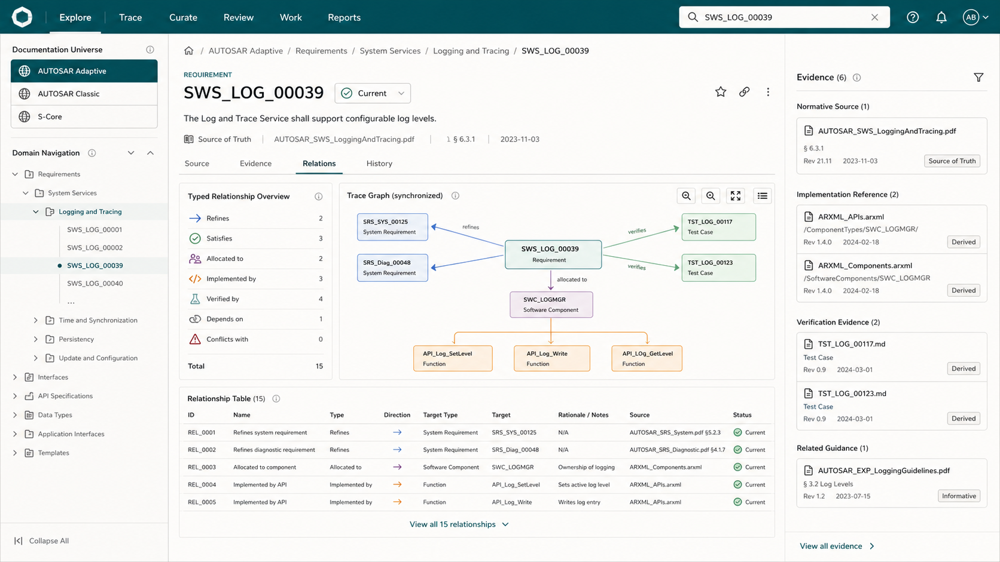
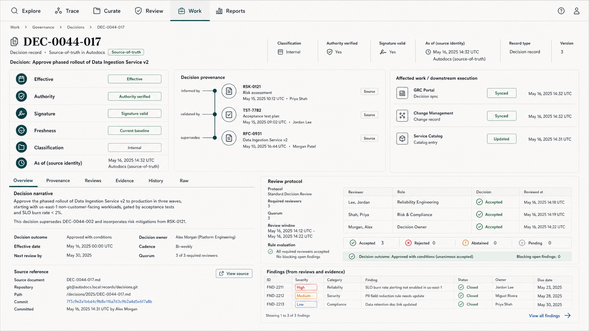
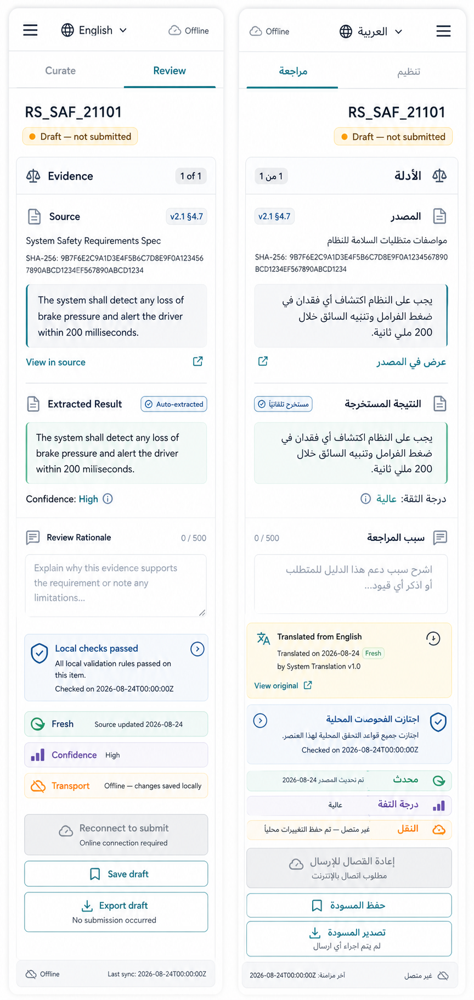

# UI/UX visual reference set

These generated bitmap mockups test the written design contracts. They are
non-normative: generated names, dates, example relations, and prose are
illustrative and must never be treated as repository authority. Routes,
statuses, copy, tokens, interaction, accessibility, and provenance semantics
come from the adjacent Markdown contracts and future code-native components.

## 1. Explore + Trace desktop



Demonstrates the six-domain shell; equal AUTOSAR Adaptive, AUTOSAR Classic, and
S-Core hierarchy; exact-ID search; record identity; source-of-truth label;
Relations/Evidence/History tabs; typed graph plus synchronized table; and
evidence rail.

Validation notes:

- preserve the overall hierarchy, calm palette, and graph/table pairing;
- replace illustrative identifiers/relations with canonical registry data;
- add the complete source REF/digest/freshness/classification header from the
  written contract;
- rename `Current` to its exact dimension (for example `Current source
  version`); show assertion/review/freshness separately and include Reviews/Raw
  through visible tabs or an explicit overflow;
- graph row detail must carry assertion, evidence, rule version, validity,
  review, classification, selected-node equivalence, focus, and legend;
- icon-only controls require accessible names, visible focus, tooltips, and
  compliant hit areas;
- at narrow widths, convert the evidence rail into a drawer without hiding
  record identity.

SHA-256: `133caab7aadcdbbd7c65aee589a5870f04a925d48f375c17cda90a0a2d42ed01`

## 2. Governance record desktop



Demonstrates decision-specific lifecycle, authority, signature, freshness, and
classification; typed decision provenance; affected downstream work separated
from the record; exact source identity; and internally consistent review-rule
evaluation.

Validation notes:

- the invented decision narrative, people, dates, repository path, and review
  results are generator examples only;
- the six global domains are invariant; Governance is context under Work;
- `Internal` demonstrates classification, not a decision about this record;
- review votes must follow the actual applicable protocol and never imply that
  visible people or quorum create authority;
- production must label the exact authoritative registry/artifact and this
  rendered page's projection status; `Autodocs source-of-truth` is illustrative
  shorthand and not acceptable production copy;
- keep separate state rows and evidence-first layout; add explicit stale,
  invalidated, and signature-verification fixtures.

SHA-256: `5945db7354a0d666b49756ac8858003b68dd400d7f0625233ae04a4153111260`

## 3. Mobile + Arabic RTL review



Demonstrates the same `RS_SAF_21101` entity in English and Arabic, 320 px
reflow, large targets, evidence comparison, translation provenance, separate
local-validation/freshness/confidence/transport states, export-only offline
behavior, and mirrored Arabic layout with technical values isolated LTR.

Validation notes:

- the two columns are separate screens, not a production split-screen layout;
- the first screen label `English` must be an autonymic locale control and not a
  flag-only selector;
- production action wording must distinguish `local checks passed`, `ready`,
  `submitted`, `ingested`, `reviewed`, and `accepted`; the screenshot is a
  draft, offline, with submission disabled and export/save only;
- Arabic copy requires human linguistic review; the visual validates layout and
  bidi intent only;
- offline mode must disable submission and offer an exportable draft, even if
  all local checks passed.

SHA-256: `4b13abaa0401663e1e812de6e71da17074cb67fc29d391d067f25d975565e6da`

The first governance/mobile variants remain in the branch solely as critique
provenance. They are rejected as implementation references because they
conflated Decision and work-item states, offered an unsafe-looking offline
action, and compared different entities across locales.

## Generation method and prompts

Generated with the built-in image generation tool (`ui-mockup` taxonomy), one
call per distinct artifact. Final files were copied into the project worktree;
the originals remain in the tool-managed generated-image directory.

### Prompt A — Explore + Trace

```text
High-fidelity desktop AUTOSAR and S-Core documentation exploration screen;
six-domain navigation; exact-ID search; three equal documentation universes;
requirement detail; typed relationship graph plus accessible table; evidence
rail; calm technical editorial system with warm neutral surfaces, deep ink,
restrained teal, precise grid; no decorative evidence effects; status uses
text, icon, and shape.
```

### Prompt B — Governance

```text
High-fidelity governance decision record; decision lifecycle, authority,
signature, freshness, classification, and exact as-of/source identity as
separate rows; downstream work clearly separated; typed decision provenance;
consistent review-rule evaluation; unified six-domain shell; evidence-first and
no generic Done state.
```

### Prompt C — Mobile + RTL

```text
Paired high-fidelity narrow mobile curation/review and Arabic RTL screens for
the same EntityRef/version/state; evidence comparison, translation provenance,
draft rationale, local checks distinct from transport; offline submission
disabled with Save/Export draft and explicit “no submission occurred”; mirrored
navigation while IDs, SHA, code, and timestamp remain LTR isolated.
```

The complete structured prompts are retained in the generating session record;
the concise forms above capture the durable design intent.
