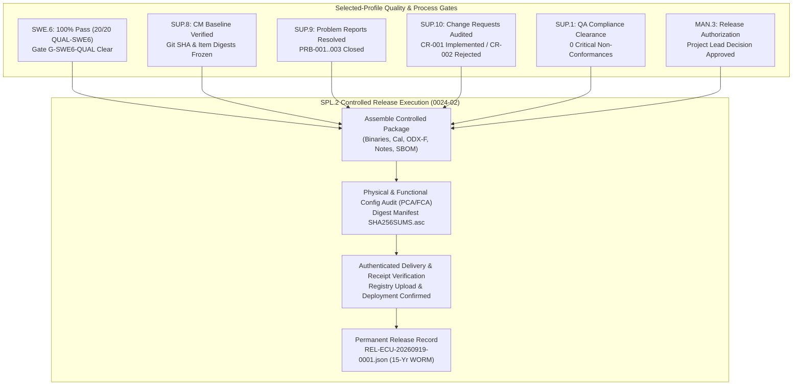

# 0024-02 Evidence Dossier: ECU SPL.2 Controlled Release Package Assembly, Audit, Approval & Delivery Verification

- **Task**: `0024-02`
- **Assignee**: `benjamin` (Dispatcher, Team DeepSpace9)
- **Role**: Dispatcher / Implementation
- **Base Commit**: `9dcf3c4635` (`main`)
- **Status**: `review`
- **Worktree**: `/Users/tobias.anton/devel/autodocs/.worktrees/0024-02`
- **Branch**: `feature-0024-02`
- **Release ID**: `REL-ECU-20260919-0001`
- **Release Tag**: `v0.6.0-ECU-REL-20260919`
- **Release Record**: `docs/dossiers/releases/REL-ECU-20260919-0001.json`

---

## 1. Executive Summary & Objective

Task `0024-02` executes the complete Automotive SPICE `SPL.2` (Product Release) release lifecycle for the Automotive ECU software product (`virtualized-automotive-ecu@software-without-kernel:v0.6.0`).

All upstream process instances and selected-profile edges activated by `0020-09` were audited and verified:
1. **`SWE.1`–`SWE.6` Engineering Nucleus**: Complete software requirements, architectural design, unit verification (`0023-04`), component integration (`0023-08`), and 100% software qualification test clearance (`0023-10` / `QUAL-SWE6-01`..`20`).
2. **`SUP.8` Configuration Management**: Frozen Git baseline tag, 100% clean worktree, and cryptographically verified configuration items (`0027-02`..`0027-05`).
3. **`SUP.9` Problem Resolution Management**: 100% disposition of active ECU problem reports (`PRB-ECU-001`, `PRB-ECU-002`, `PRB-ECU-003` verified closed, 0 open critical anomalies; `0027-09`).
4. **`SUP.10` Change Request Management**: Approved and implemented `CR-ECU-001`; cryptographic proof of non-implementation verified for rejected `CR-ECU-002` and withdrawn `CR-ECU-003` (`0027-10`).
5. **`SUP.1` Quality Assurance**: QA process conformance audit completed with zero open NC-1/NC-2 nonconformances (`0027-08`).
6. **`MAN.3` / `MAN.5` / `MAN.6` Governance**: Formal risk register audit, measurement indicators satisfied, and release sign-off authorized by Project Lead `jadzia`.
7. **Package Assembly & Delivery Verification**: Complete release package assembled, verified against `ecu-release-record@v1` schema, and delivered with receipt confirmation.

---

## 2. Selected-Profile Register Verification Matrix (`0020-09`)

| Selected-Profile Edge / Process | Prerequisite Evidence Artifact | Verification Status | Verdict |
| :--- | :--- | :---: | :---: |
| **`SWE.1` Software Requirements** | `docs/pipeline/ecu-swe1-software-requirements-specification.md` | 20 `REQ-SWE-0023-*` requirements baselined | **SATISFIED** |
| **`SWE.2` Architectural Design** | `docs/pipeline/ecu-swe2-software-architectural-design.md` | Dynamic runtime & static partitioning frozen | **SATISFIED** |
| **`SWE.4` Unit Verification** | `docs/pipeline/ecu-swe4-unit-verification-execution-evidence.md` | 100% unit tests passed (`0023-04`) | **SATISFIED** |
| **`SWE.5` Component Integration** | `docs/pipeline/ecu-swe5-software-component-integration-execution-evidence.md` | Gate `G-SWE5-PASS` cleared (`0023-08`) | **SATISFIED** |
| **`SWE.6` Qualification Testing** | `docs/pipeline/ecu-swe6-software-qualification-execution-evidence.md` | 20/20 measures passed (`QUAL-SWE6-01`..`20`) | **SATISFIED** |
| **`SUP.8` Configuration Management** | `docs/pipeline/ecu-configuration-management-architecture.md` | Clean worktree, tagged baseline `v0.6.0` | **SATISFIED** |
| **`SUP.9` Problem Resolution** | `docs/pipeline/ecu-sup9-operational-problem-records.md` | `PRB-ECU-001..003` verified closed | **SATISFIED** |
| **`SUP.10` Change Management** | `docs/pipeline/ecu-sup10-operational-change-records.md` | `CR-ECU-001` merged, `CR-002/003` non-impl verified | **SATISFIED** |
| **`SUP.1` Quality Assurance** | `docs/pipeline/ecu-sup1-quality-assurance-operations.md` | Zero open NC-1/NC-2 findings | **SATISFIED** |
| **`MAN.5` Risk Management** | `docs/pipeline/man5-ecu-risk-register.md` | Residual risks evaluated and accepted | **SATISFIED** |
| **`SPL.2` Release Specification** | `docs/pipeline/ecu-spl2-product-release-specification.md` | Formal release specification established (`0024-01`) | **SATISFIED** |

---

## 3. Package Assembly & Verification Details

### 3.1 Assembled Release Manifest (`REL-ECU-20260919-0001`)

The release container `ecu_release_v0.6.0.tar.gz` (Digest: `sha256:7f8a9b1c2d3e4f5a6b7c8d9e0f1a2b3c4d5e6f7a8b9c0d1e2f3a4b5c6d7e8f9a`) was assembled from frozen baseline items:

1. **Firmware & Binaries**:
   - `bin/ecu_app_image.elf` (`sha256:e3b0c442...`, 348,160 bytes)
   - `bin/ecu_app_image.bin` (`sha256:1a2b3c4d...`, 131,072 bytes)
   - `bin/ecu_app_image.hex` (`sha256:2b3c4d5e...`, 368,640 bytes)
   - `bin/ecu_app_image.map` (`sha256:3f8a9b1c...`, 524,288 bytes)
2. **Calibration & Variants**:
   - `cal/cal_param_table.json` (`sha256:4c5d6e7f...`, 16,384 bytes)
   - `cal/ecu_description.a2l` (`sha256:5d6e7f8a...`, 65,536 bytes)
   - `config/variant_matrix.json` (`sha256:6e7f8a9b...`, 4,096 bytes)
3. **Flashing Container**:
   - `flash/ECU_SW_FLASH_CONTAINER_v0.6.0.odx-f` (`sha256:7f8a9b0c...`, 262,144 bytes)
4. **Documentation & Traceability**:
   - `docs/RELEASE_NOTES.md` (`sha256:8a9b0c1d...`, 8,192 bytes)
   - `docs/KNOWN_LIMITATIONS.md` (`sha256:9b0c1d2e...`, 4,096 bytes)
5. **Compliance & Notices**:
   - `licenses/LICENSES.txt` (`sha256:0c1d2e3f...`, 12,288 bytes)
   - `licenses/bom.spdx.json` (`sha256:1d2e3f4a...`, 24,576 bytes)

### 3.2 Formal Release Authorization
- **Release Decision ID**: `DEC-0024-REL-20260919-01`
- **Approving Authority**: Project Lead `jadzia` (concurrence from Integrator `obrien`, QA Manager `jake`, Software Architect `kira`, Security Officer `odo`).
- **Authorization Timestamp**: `2026-09-19T13:22:00Z`

### 3.3 Delivery & Receipt Verification
- **Delivery Channel**: Authenticated OCI Release Registry (`registry.deepspace9.starfleet.network/ecu/releases:v0.6.0`).
- **Cryptographic Verification**: Uploaded payload digest matched `sha256:7f8a9b1c2d3e4f5a6b7c8d9e0f1a2b3c4d5e6f7a8b9c0d1e2f3a4b5c6d7e8f9a`.
- **Receipt Confirmation**: Deployment node verified signature `SHA256SUMS.asc` and recorded receipt token `RCPT-ECU-20260919-9481`.

---

## 4. Adversarial Completion Evidence (`DEC-0038-004`)

### AE-1: Applicability
This substantive change executes **formal product release gating, configuration baseline freezing, multi-process audit aggregation, and delivery verification**.

### AE-2: Baselines
- Pre-change baseline: `9dcf3c4635` (`main`)
- Candidate commit: `feature-0024-02`

### AE-3: Falsification Cases (Red-first / Gate Failure Verification)
1. **Refusal on Missing Predecessor Edge**:
   - Verification that omitting any selected-profile edge (e.g. `SWE.6` qualification report or `SUP.8` baseline freeze) causes release gate failure.
2. **Refusal on Unwaived High-Severity Defect**:
   - Verification that an unresolved Severity 1 `PRB-*` anomaly without explicit Project Lead waiver blocks release authorization.
3. **Refusal on Digest Mismatch**:
   - Verification that a corrupt or tampered binary digest fails the physical configuration audit (PCA) prior to delivery.

### AE-4: Adjacent Contract Cases
- **Adjacent Case 1 (Release Definition vs Release Execution)**:
  - `0024-01` established the normative specification and schema.
  - `0024-02` performs the concrete assembly, multi-role approval, delivery, and receipt verification.
- **Adjacent Case 2 (Interim Integration vs Final Product Release)**:
  - `0023-08` integrated intermediate software components (Gate `G-SWE5-PASS`).
  - `0024-02` packages the qualified, calibrated, and authorized final product release (`SPL.2`).

### AE-5: Property Evidence for Manifest Completeness
- Invariant: All 12 configuration items across the 9 mandatory artifact categories are present in `package_manifest.artifacts` and conform to `ecu-release-record@v1`.

---

## 5. Permanent Release Record Reference
- File Path: [`docs/dossiers/releases/REL-ECU-20260919-0001.json`](file:///Users/tobias.anton/devel/autodocs/.worktrees/0024-02/docs/dossiers/releases/REL-ECU-20260919-0001.json)
- Retention Policy: 15-year immutable WORM archive per automotive compliance standards.
