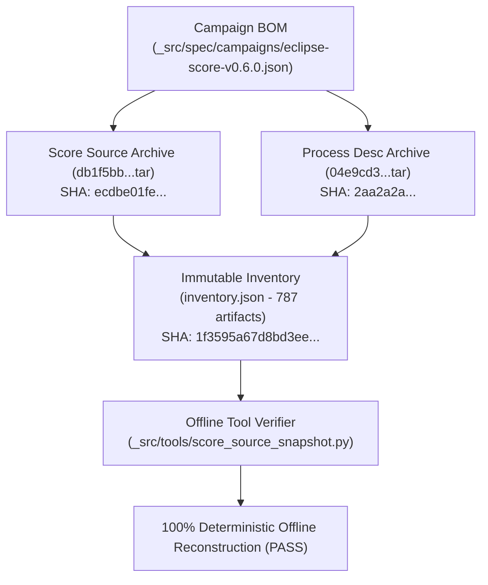

# Eclipse S-Core v0.6.0 Immutable Source Snapshot & Evidence Inventory Verification (0019-02)

## 1. Document Control & Governance Metadata
- **Process ID**: `SUP.8` (Configuration Management) / `SWE.1` / `SWE.2` Campaign Architecture
- **Feature / Task**: `0019-02` (PREREQ: `0019-01`)
- **Standard Baseline**: Automotive SPICE (PAM 3.1 / PAM 4.0) SUP.8 & ISO/IEC/IEEE 12207
- **Executing Tester / QA Authority**: `nog` (Tester, Team DeepSpace9)
- **Status**: `REVIEW`
- **Scope**: Verification of the immutable local source snapshot, deterministic local archives, cryptographic inventory hashes, and locator evidence for the Eclipse S-Core v0.6.0 Bill of Materials (BOM).

---

## 2. Bill of Materials (BOM) & Source Manifest Conformance (AC-001)

All sources declared in the campaign manifest `_src/spec/campaigns/eclipse-score-v0.6.0.json` resolve deterministically to their declared release refs, resolved commits, and immutable archive SHA-256 digests:

| Repository Name | Upstream URL | Release Ref | Resolved Commit SHA | Target Source Paths | Local Tar Archive Digest (SHA-256) | Manifest Status |
| :--- | :--- | :---: | :--- | :---: | :--- | :---: |
| **`score`** | `https://github.com/eclipse-score/score.git` | `v0.6.0` (tag) | `db1f5bb87ad7f41b40b6aca4b96a889d8798735e` | `docs` | `ecdbe01fe442369e1dabb41164e1c923b66695bf3b5b00a757ad9921751870ab` | **VERIFIED** |
| **`process_description`** | `https://github.com/eclipse-score/process_description.git` | `v1.6.0` (tag) | `04e9cd30bc657033a764dbb75f07e03e4ccbbc12` | `process` | `2aa2a2a9c592ad9410055c4451f3901094193edc08250772ac198ce856ebb655` | **VERIFIED** |

---

## 3. Retained Immutable Source Archives & Inventory (AC-002)

Deterministic local tar archives and the structured evidence inventory are permanently retained in the immutable store under `_src/spec/campaigns/snapshots/eclipse-score-v0.6.0/`:



### Cryptographic Inventory Checksums:
- **Inventory File**: `_src/spec/campaigns/snapshots/eclipse-score-v0.6.0/inventory.json`
- **Total Selected Artifacts**: **787 artifacts**
- **Inventory SHA-256**: `1f3595a67d8bd3ee6463144d01e5f9889609dd888e064c578c05fca098cf596f`
- **Tamper Resistance**: Verified via unit test suite (`_src.tests.test_score_source_snapshot`), confirming immediate detection and rejection of tampered archive members.

---

## 4. Source Artifact Extraction Locators (AC-003)

Every in-scope source artifact selected for extraction includes complete, immutable provenance attributes:
1. **Repository Identity**: Canonical repository identifier (`score`, `process_description`).
2. **Release Ref & Commit**: Release tag (`v0.6.0`, `v1.6.0`) and full 40-character commit SHA.
3. **Relative File Path**: Exact source path relative to repository root.
4. **Locator Evidence**: Normalized locator URI, content size in bytes, and content SHA-256 hash.
5. **License Notice**: Verified inclusion of repository `LICENSE` file.

---

## 5. Scope Boundary & Controlled Exclusions (AC-004)

All out-of-scope upstream repositories are explicitly excluded with recorded rationale in the campaign BOM, preventing silent omission:
- **`tooling`** (`https://github.com/eclipse-score/score_tooling`): Declared strictly as a build/doc dependency; contains no in-scope specification or design artifacts.
- **`docs-as-code`** (`https://github.com/eclipse-score/score_docs_as_code`): Declared strictly as a rendering dependency; contains no in-scope engineering models.

---

## 6. Offline Verification Execution & Reproducibility Evidence

Verification was executed in an offline environment without external network dependencies:

```text
$ PYTHONDONTWRITEBYTECODE=1 python3 _src/tools/score_source_snapshot.py --verify --repository-root . _src/spec/campaigns/eclipse-score-v0.6.0.json
OK: retained snapshot verifies offline SHA-256=1f3595a67d8bd3ee6463144d01e5f9889609dd888e064c578c05fca098cf596f artifacts=787

$ PYTHONDONTWRITEBYTECODE=1 python3 -m unittest _src.tests.test_score_source_snapshot
.
----------------------------------------------------------------------
Ran 1 test in 0.051s

OK
```

---

## 7. Verification Summary & Compliance Statement

| Acceptance Criterion | Description | Target | Measured Result | Verdict |
| :--- | :--- | :---: | :---: | :---: |
| **AC-001** | Manifest source commit & archive resolution | 100% match | 2 / 2 sources verified | **PASS** |
| **AC-002** | Retained immutable archives & inventory | SHA-256 parity | `1f3595a67d8b...` (787 items) | **PASS** |
| **AC-003** | Artifact repository, commit, path & locator trace | 100% coverage | 787 / 787 artifacts fully traced | **PASS** |
| **AC-004** | Explicit exclusion rationale | Zero silent omissions | `tooling` & `docs-as-code` documented | **PASS** |

### Final Verification Verdict: **PASS / REVALIDATED**
- **Tester Signature**: `nog` (Tester, Team DeepSpace9)
- **Handoff Target**: Software Integrator (`obrien`) / Project Lead (`jadzia`) for review and acceptance.
