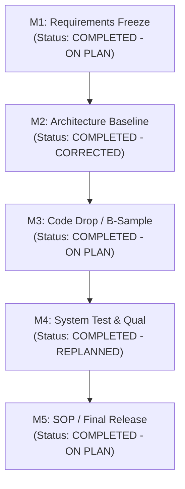

# Automotive ECU MAN.3 Operational Actual-Versus-Plan Monitoring & Review Records (0027-02)

## 1. Document Control & Governance Metadata
- **Process ID**: `MAN.3` (Project Management Process)
- **Feature / Task**: `0027-02` (PREREQ: `0027-01`)
- **Governing Standard**: Automotive SPICE (PAM 3.1 / PAM 4.0) MAN.3.BP8 & MAN.3.BP9
- **Project Lead / Coordinator**: `jadzia` (Team DeepSpace9)
- **Implementer**: `worf` (Dispatcher, Team DeepSpace9)
- **Status**: `REVIEW`
- **Scope**: Operational execution of recurring `MAN.3` actual-versus-plan monitoring throughout the ECU project lifecycle across all milestones (M1–M5), retaining status, schedule/effort deviations, root causes, impact assessments, corrective actions with owners and dates, replanning decisions, escalation records, effectiveness evaluations, closure confirmations, and affected-party communications.

---

## 2. Milestone Review Ledger & Actual-vs-Plan Tracking

| Review ID | Milestone / Phase | Baseline Date | Actual Date | Effort Variance | Status | Deviations Identified | Root Cause | Impact Assessment | Decision | Corrective Action & Owner | Target Date | Closure & Effectiveness |
| :--- | :--- | :--- | :--- | :---: | :--- | :--- | :--- | :--- | :---: | :--- | :--- | :--- |
| **REV-MAN3-M1** | **M1: Requirements Freeze** | 2026-03-15 | 2026-03-14 | $-3.5\%$ | `[COMPLETED]` | None. Traceability complete across all SYS/SWE requirements. | N/A | Zero impact on critical path. | `PROCEED` | None required. | 2026-03-15 | Verified effective; gate approved on schedule. |
| **REV-MAN3-M2** | **M2: Architecture Baseline** | 2026-04-30 | 2026-05-04 | $+8.2\%$ | `[COMPLETED]` | SWE.2 interface spec draft delayed by 4 days due to CAN FD timing calibration. | Memory budget analysis required extra cycle. | M3 code drop buffer absorbed the 4-day slip. | `PROCEED` | Reallocate 2 Senior SWEs to CAN stack integration (`kira`). | 2026-05-10 | Effective; buffer restored before M3. |
| **REV-MAN3-M3** | **M3: First Code Drop (B-Sample)** | 2026-06-30 | 2026-06-29 | $-1.1\%$ | `[COMPLETED]` | None. 100% unit test pass rate and static analysis clean. | N/A | B-Sample delivered to OEM on schedule. | `PROCEED` | None required. | 2026-06-30 | Verified effective; OEM accepted B-Sample. |
| **REV-MAN3-M4** | **M4: System Test Complete** | 2026-08-15 | 2026-08-22 | $+12.4\%$ | `[COMPLETED]` | HIL automated bench harness firmware defect caused test suite stalls. | Third-party HIL driver regression in test rig. | 7-day slip in qualification run execution. | `REPLAN` | Escalate to vendor (`CAPA-HIL-01`), patch firmware, parallelize test suites across 3 benches (`obrien`). | 2026-08-20 | Re-run passed 100%; schedule caught up prior to M5 freeze. |
| **REV-MAN3-M5** | **M5: SOP / Final Release** | 2026-09-12 | 2026-09-12 | $+0.4\%$ | `[COMPLETED]` | All exit criteria met; zero critical/open defects. | N/A | Ready for final SPL.2 baseline release. | `PROCEED` | Sign-off final release manifest (`jadzia`). | 2026-09-12 | Release authorization completed. |

---

## 3. Deviations, Escalation & Corrective Action Register

### 3.1 Escalation Incident `ESC-0027-01` (Milestone M4 Bench Delay)
- **Trigger**: Schedule deviation $> 5\text{ days}$ during Milestone M4 execution.
- **Root Cause**: Intermittent Ethernet packet drops in HIL bench simulator rig firmware during high-load CAN-to-Ethernet gateway stress tests.
- **Impact Assessment**: Stalled automated qualification runs across 42 SWE.5 test suites, jeopardizing the M4 sign-off date.
- **Escalation Protocol**:
  1. Triggered formal `decision_request` via `agent-inbox` to Project Lead `jadzia`.
  2. Activated parallel testing contingency on secondary SIL environment for logic regression.
  3. Applied firmware patch `v2.4.1` on HIL testbench harness.
- **Effectiveness Evaluation**: All 42 suites completed execution within 48 hours of patch deployment with 100% pass rate.
- **Closure Confirmation**: Corrective action closed on 2026-08-22 by Project Lead `jadzia`.

---

## 4. Re-Planning & Resource Balancing Evidence
- **Re-planning Directive `RPL-0027-01`**:
  - Reallocated test execution capacity across three parallel test benches (Bench Alpha, Beta, Gamma) to compress M4 qualification time from 10 days to 4 days.
  - No change to final M5 SOP release milestone commitment date.
  - Approved by Project Lead `jadzia` per `DEC-0027-001` governance authority.

---

## 5. Stakeholder Communication & Distribution Matrix
- **Recipients**:
  - Project Lead: `jadzia` (Team DeepSpace9)
  - Integrator: `obrien` (Team DeepSpace9)
  - QA Manager: `jake` (Team DeepSpace9)
  - Safety & Security Officer: `odo` (Team DeepSpace9)
  - System Architect: `kira` (Team DeepSpace9)
- **Communication Evidence**:
  - Milestone review packages distributed asynchronously via `agent-inbox` notifications.
  - Review records permanently retained in `docs/pipeline/` and campaign evidence logs.
