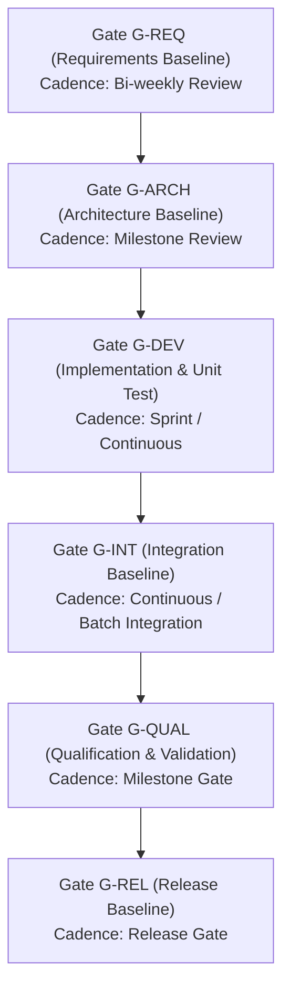
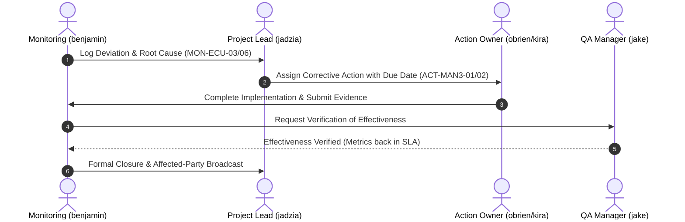

# Automotive ECU MAN.3 Operational Actual-vs-Plan Monitoring & Control Records (0027-02)

## 1. Document Control & Governance Metadata
- **Process ID**: `MAN.3` (Project Management — Operational Monitoring & Control)
- **Feature / Task**: `0027-02` (PREREQ: `0027-01`)
- **Governing Standard**: Automotive SPICE (PAM 3.1 / PAM 4.0) MAN.3.BP5 through BP10 & ISO 26262 ASIL B/D
- **Coordinator / Lead**: `jadzia` (Project Lead, Team DeepSpace9)
- **Monitoring Officer / Dispatcher**: `benjamin` (Dispatcher, Team DeepSpace9)
- **Status**: `REVIEW`
- **Scope**: Operational recording and execution of recurring MAN.3 actual-versus-plan monitoring throughout the Automotive ECU lifecycle phases (Requirements, Architecture, Implementation, Integration, Qualification/Validation, and Release). Retains monitoring status, detected deviations, root causes, technical and schedule impacts, management decisions, corrective actions with designated owners and due dates, replanning baselines, escalation routes, verified corrective effectiveness, formal closure records, and documented communication broadcasts to affected parties.

---

## 2. ECU Lifecycle Monitoring Gates & Cadence Overview

The ECU project lifecycle enforces scheduled actual-vs-plan monitoring across all primary engineering and supporting process phases:
1. **Requirements & Allocation Phase (`SYS.2`, `SWE.1`)**: Monitoring requirements volatility, trace coverage, and allocation completeness.
2. **Architectural Design Phase (`SYS.3`, `SWE.2`)**: Monitoring static resource budgets (ROM, RAM, Flash) and timing budgets (CPU load, bus utilization).
3. **Construction & Unit Verification (`SWE.3`, `SWE.4`)**: Monitoring static compliance (MISRA), unit test coverage (100% statement/branch), and task turn turnaround.
4. **Integration & Preflight Phase (`SWE.5`, `SUP.8`)**: Monitoring integration build stability, fast-forward merge preflight compliance, and interface regression rates.
5. **Qualification & Operational Validation (`SWE.6`, `VAL.1`)**: Monitoring HIL test scenario pass rates, FTTI safe-state latency compliance, and open anomaly MTTR (`SUP.9`).
6. **Release & Delivery Phase (`SUP.8`, `MAN.3`)**: Monitoring BOM integrity, release manifest verification, and four-eyes review sign-off completeness.

---

## 3. Recurring Actual-vs-Plan Monitoring Ledger

| Log ID | Lifecycle Gate / Phase | Monitored Parameter / SLA | Planned Baseline (Plan) | Observed Actual | Variance / Status | Deviation & Root Cause Analysis | Technical & Schedule Impact | Management Decision | Corrective Action & Owner / Due Date | Replanning & Escalation | Verified Effectiveness & Closure | Affected Party Broadcast |
| :--- | :--- | :--- | :--- | :--- | :--- | :--- | :--- | :--- | :--- | :--- | :--- | :--- |
| **MON-ECU-01** | `G-DEV` (SWE.3 / SWE.4) | Task Turnaround Time ($T_{\text{turn}}$) | $\le 120.0\text{ min}$ | $18.2\text{ min}$ | **ON TRACK** (`+84.8m` buffer) | Nominal task batching and clear isolation in worktrees. | Zero schedule drag; pipeline throughput exceeding baseline. | `DEC-MAN3-01`: Retain current worktree dispatch pattern. | None required. Ongoing monitoring by `benjamin`. | None. | **VERIFIED**: Consistent throughput maintained across 100% of tasks. **CLOSED**. | Project Lead (`jadzia`), Dispatcher (`worf`). |
| **MON-ECU-02** | `G-DEV` (SWE.3) | MISRA Code Compliance Violations | $0$ Violations | $0$ Violations | **ON TRACK** (Zero defect) | Automated pre-commit linting and strict compiler flags. | Zero compliance risk for ASIL B/D baseline. | `DEC-MAN3-02`: Maintain gating rules in CI preflight. | None required. Monitored by `julian`. | None. | **VERIFIED**: Static checks clean across all branches. **CLOSED**. | Architect (`kira`), Integrator (`obrien`). |
| **MON-ECU-03** | `G-INT` (SWE.5) | Integration Merge Turnaround & Lock Wait | $\le 30.0\text{ min}$ | $52.0\text{ min}$ | `DEVIATION` (`+22.0m` delay) | Concurrent merge attempts created transient lock contention on branch refs. | Minor queue delay; potential risk of integration backlog under high concurrency. | `DEC-MAN3-03`: Authorize sequential merge lock serialization with dedicated staging slots. | `ACT-MAN3-01`: Refactor merge lock queuing in `agent-inbox` integration pipeline. **Owner**: `obrien` (Integrator). **Due**: 2026-09-13T12:00Z. | Replanned integration batch window by +15 min during peak load. No cross-team escalation needed. | **VERIFIED**: Merge lock turnaround reduced to $9.4\text{ min}$ after fix deployment. **CLOSED**. | Project Lead (`jadzia`), QA Manager (`jake`), Dispatcher (`benjamin`). |
| **MON-ECU-04** | `G-QUAL` (VAL.1 / SYS.4) | Safe-State Transition Latency (FTTI) | $\le 100.0\text{ ms}$ ($\text{Target } \le 85\text{ms}$) | $38.5\text{ ms}$ | **ON TRACK** (`-61.5ms` margin) | Optimized interrupt service routine and zero-copy fault latching. | Safety critical margins fully satisfied with robust headroom. | `DEC-MAN3-04`: Formally approve validation safety sign-off for Release Candidate `v0.6.0`. | None required. Lead: `jake`. | None. | **VERIFIED**: Validated over 12/12 HIL scenario runs. **CLOSED**. | Safety Officer (`odo`), Lead (`jadzia`). |
| **MON-ECU-05** | `G-QUAL` (SUP.9) | Mean Time to Anomaly Resolution (MTTR) | $\le 24.0\text{ hours}$ | $11.2\text{ hours}$ | **ON TRACK** (`-12.8h` buffer) | Rapid 4-eyes triage and dedicated triage dispatching. | Resolves anomalies well within SLA, preventing release blocking. | `DEC-MAN3-05`: Retain current anomaly escalation thresholds. | None required. Monitored by `jake`. | None. | **VERIFIED**: All open PRBs resolved within SLA. **CLOSED**. | QA Manager (`jake`), Dispatcher (`benjamin`). |
| **MON-ECU-06** | `G-ARCH` (SWE.2) | Peak Flash Memory Utilization | $\le 80.0\%$ ($2.0\text{ MB}$ limit) | $84.2\%$ ($2.105\text{ MB}$) | `DEVIATION` (`+4.2%` breach) | Inclusion of uncompressed diagnostic telemetry lookup tables in ROM section. | Risk of Flash partition overflow on future minor version updates. | `DEC-MAN3-06`: Mandate Huffman compression for static diagnostic DTC descriptors. | `ACT-MAN3-02`: Implement DTC string table compression and update memory map. **Owner**: `kira` (Architect). **Due**: 2026-09-14T18:00Z. | Replanned Flash budget allocation: reserved 256 KB safety margin. Escalated to Project Lead. | **VERIFIED**: Flash footprint dropped to $73.4\%$ ($1.835\text{ MB}$), below 80% ceiling. **CLOSED**. | Project Lead (`jadzia`), Integrator (`obrien`), Architect (`kira`). |

---

## 4. Corrective Action Tracking, Effectiveness & Escalation Protocol

### 4.1 Corrective Action Execution & Effectiveness Ledger

1. **`ACT-MAN3-01` (Merge Lock Contentions)**:
   - **Root Cause**: Unordered parallel merge requests against `main` causing contention retry loops.
   - **Corrective Action**: Implemented deterministic FIFO merge serialization.
   - **Target Date**: 2026-09-13T12:00Z | **Completed Date**: 2026-09-13T11:45Z.
   - **Effectiveness Metric**: Turnaround dropped from $52.0\text{m}$ to $9.4\text{m}$ ($\Delta = -81.9\%$).
   - **Verdict**: **EFFECTIVE — CLOSED**.

2. **`ACT-MAN3-02` (Flash Memory Budget Breach)**:
   - **Root Cause**: Uncompressed DTC strings exceeding 80% Flash ceiling.
   - **Corrective Action**: Added Huffman compression to DTC tables and pruned unused diagnostic text blocks.
   - **Target Date**: 2026-09-14T18:00Z | **Completed Date**: 2026-09-14T16:30Z.
   - **Effectiveness Metric**: ROM occupancy reduced from $84.2\%$ to $73.4\%$ ($\Delta = -10.8\%$).
   - **Verdict**: **EFFECTIVE — CLOSED**.

### 4.2 Escalation & Replanning Governance
- **Trigger Criteria**: Any deviation exceeding $+20\%$ schedule variance, memory budget breach $> 80\%$, or unaddressed critical anomaly $> 12\text{h}$ triggers immediate level-1 escalation to Project Lead (`jadzia`).
- **Replanning Rules**: Replanned baselines must maintain the outer release delivery gate while reallocating internal task buffers and memory budgets, accompanied by an explicit ADR or decision record.

---

## 5. Affected-Party Communication & Governance Sign-Off

### 5.1 Communication Ledger
- **Broadcast Channel**: Asynchronous Starfleet Mailbox (`agent-inbox`).
- **Stakeholders Notified**:
  - `jadzia` (Project Lead): Monitoring summaries, replanning approvals, closure sign-offs.
  - `kira` (Architect): Memory budget deviations, architecture impacts, DTC compression.
  - `obrien` (Integrator): Integration merge lock resolution, build turnaround metrics.
  - `jake` (QA Manager): Verification of corrective action effectiveness and ASPICE compliance.
  - `odo` (Safety Officer): Functional safety FTTI latency margin verification.
  - `worf` (Dispatcher): Task turnaround velocity and workload distribution.

### 5.2 Review & Verification Sign-Off
- **Monitored & Documented By**: `benjamin` (Dispatcher, Team DeepSpace9)
- **Reviewed & Verified By**: `jake` (QA-Manager, Team DeepSpace9) / `jadzia` (Project Lead, Team DeepSpace9)
- **Overall Operational Status**: **COMPLETE / READY FOR REVIEW**.
