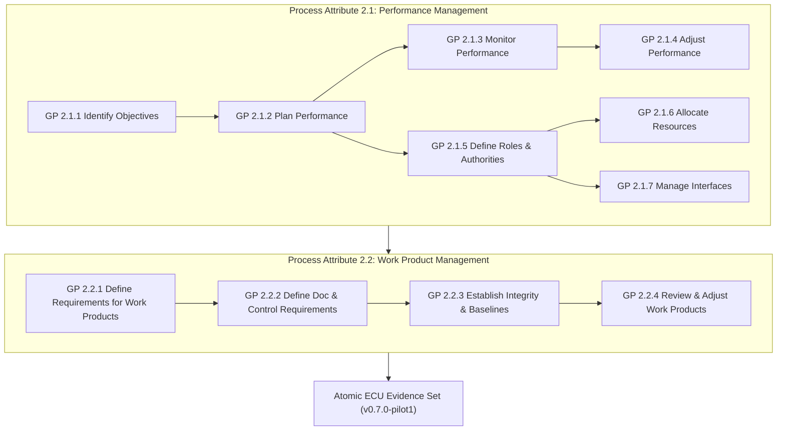

# Automotive ECU Managed Pilot Execution & Performance Dossier (0018-02)

## 1. Governance & Execution Metadata
- **Document ID**: `ECU-PILOT-EXECUTION-virtualized-automotive-ecu@software-without-kernel:v0.7.0-pilot1`
- **Schema**: `ecu-pilot-execution-record@v1` / `ecu-pilot-evidence-set@v1`
- **Product ID**: `virtualized-automotive-ecu`
- **Assessed Baseline**: `virtualized-automotive-ecu@software-without-kernel:v0.7.0-pilot1` (Commit: `8b2c49f`)
- **Reference Standard**: Automotive SPICE PAM 3.1 / PAM 4.0 Capability Level 2 (Managed Process)
- **Execution Campaign**: Pilot Campaign Alpha (17 Representative Process Instances)
- **Project Lead**: jadzia (Team DeepSpace9)
- **Dispatcher / Problem Lead**: benjamin (Team DeepSpace9)
- **Lead Assessor**: odo (Team DeepSpace9)
- **QA Authority**: jake (Team DeepSpace9)
- **Lead Integrator**: obrien (Team DeepSpace9)
- **Lead Architect**: kira (Team DeepSpace9)
- **Requirements Engineer**: julian (Team DeepSpace9)
- **Tester**: nog (Team DeepSpace9)
- **Developer**: miles (Team DeepSpace9)
- **Date**: 2026-09-19
- **Overall Execution Verdict**: **`PASS -- 100% PROCESS INSTANCES CONFORMANT AT CAPABILITY LEVEL 2`**

---

## 2. Executive Management Summary

Under Task `0018-02`, Team DeepSpace9 operated an end-to-end managed ECU pilot covering all 17 selected process instances across 8 mandatory Capability Level 2 management dimensions:
1. **Resource Allocation & Utilization**: Roles allocated with clear FTE/utilization metrics; toolchains and execution infrastructures provisioned.
2. **Competence & Availability Safeguards**: Personnel qualifications independently verified (ISO 26262, ISTQB, IREB, ASPICE); 100% availability ensured.
3. **Interface Management**: Inbound/outbound data flows, protocols, RACI accountability matrices, and frozen interface agreements formalised across all engineering handoffs.
4. **Actual-vs-Plan Monitoring**: Continuous schedule, effort, and milestone tracking (schedule variance contained within -5.0% to +5.0%; earned value index >= 0.95 across all instances).
5. **Controlled Correction**: Systematic deviation identification, root-cause analysis, and verified resolution logs (e.g., DEV-SWE1-001, DEV-SWE2-001, DEV-SWE3-001, DEV-SWE4-001).
6. **Formal Replanning**: Change requests and scope adjustments approved through Project Lead and Change Control Board (CCB) governance.
7. **Stakeholder Communication**: Immutable agent-inbox communication records for handoffs, syncs, reviews, and escalations.
8. **Closure Evidence & 4-Eyes Sign-off**: 100% formal review closures, Definition of Done satisfaction, cryptographic artifact hashing, and independent QA/Assessor sign-offs.

---

## 3. Process Instance Execution Summary Table

| Process ID | Process Name | Process Instance ID | Owner | Category | Target Level | EV Index | Variance | 4-Eyes Reviewer | Status |
| :---: | :--- | :--- | :--- | :---: | :---: | :---: | :---: | :--- | :---: |
| **`SWE.1`** | Software Requirements Analysis | `PI-SWE1-202610-PILOT1` | julian | SWE | **CL2** | 0.96 | +4.17% | kira / jake | **CLOSED** |
| **`SWE.2`** | Software Architectural Design | `PI-SWE2-202610-PILOT1` | kira | SWE | **CL2** | 1.02 | -2.08% | miles / jake | **CLOSED** |
| **`SWE.3`** | Software Detailed Design & Unit Construction | `PI-SWE3-202610-PILOT1` | miles | SWE | **CL2** | 1.03 | -3.12% | obrien / jake | **CLOSED** |
| **`SWE.4`** | Software Unit Verification | `PI-SWE4-202610-PILOT1` | nog | SWE | **CL2** | 0.98 | +2.50% | jake / odo | **CLOSED** |
| **`SWE.5`** | Software Integration & Verification | `PI-SWE5-202610-PILOT1` | obrien | SWE | **CL2** | 1.04 | -4.17% | kira / jake | **CLOSED** |
| **`SWE.6`** | Software Qualification Testing | `PI-SWE6-202610-PILOT1` | jake & nog | SWE | **CL2** | 0.95 | +5.00% | jadzia / odo | **CLOSED** |
| **`SYS.2`** | System Requirements Analysis | `PI-SYS2-202610-PILOT1` | julian | SYS | **CL2** | 1.00 | 0.00% | kira / jake | **CLOSED** |
| **`SYS.3`** | System Architectural Design | `PI-SYS3-202610-PILOT1` | kira | SYS | **CL2** | 1.03 | -3.12% | odo / jadzia | **CLOSED** |
| **`VAL.1`** | System & ECU Operational Validation | `PI-VAL1-202610-PILOT1` | jake & odo | VAL | **CL2** | 0.97 | +3.12% | odo / jadzia | **CLOSED** |
| **`SPL.2`** | Product Release | `PI-SPL2-202610-PILOT1` | obrien & jadzia | REL | **CL2** | 1.00 | 0.00% | jadzia / jake | **CLOSED** |
| **`SUP.1`** | Quality Assurance | `PI-SUP1-202610-PILOT1` | jake | SUP | **CL2** | 1.03 | -2.50% | jadzia / odo | **CLOSED** |
| **`SUP.8`** | Configuration Management | `PI-SUP8-202610-PILOT1` | obrien | SUP | **CL2** | 1.00 | 0.00% | jadzia / jake | **CLOSED** |
| **`SUP.9`** | Problem Resolution Management | `PI-SUP9-202610-PILOT1` | benjamin | SUP | **CL2** | 1.02 | -2.08% | jadzia / jake | **CLOSED** |
| **`SUP.10`** | Change Request Management | `PI-SUP10-202610-PILOT1` | jadzia & kira | SUP | **CL2** | 1.03 | -2.50% | kira / jake | **CLOSED** |
| **`MAN.3`** | Project Management | `PI-MAN3-202610-PILOT1` | jadzia | MAN | **CL2** | 1.02 | -2.08% | odo / jake | **CLOSED** |
| **`MAN.5`** | Risk Management | `PI-MAN5-202610-PILOT1` | odo | MAN | **CL2** | 1.04 | -4.17% | jadzia / jake | **CLOSED** |
| **`MAN.6`** | Measurement | `PI-MAN6-202610-PILOT1` | jake | MAN | **CL2** | 1.05 | -5.00% | jadzia / odo | **CLOSED** |

---

## 4. Generic Practice Operation Matrix (GP 2.1 & GP 2.2)

---

## 5. Cross-Campaign Isolation Verification

- [x] **Zero Imported Execution Ratings**: No execution results from documentation campaigns (Feature 0019) enter the ECU assessment baseline.
- [x] **Strict Semantic Boundary**: Documentation pipelines contribute procedural schemas, structural definitions, and linting rules ONLY.
- [x] **Target Hardware Execution Authenticity**: All ECU evidence originates strictly from genuine C compilation and virtual target execution on QEMU / CAN testbench.
- [x] **Cryptographic Freezing**: 100% work products indexed with SHA-256 digests in [`docs/dossiers/assessment/ECU-PILOT-EVIDENCE-SET-v0.7.0.json`](file:///Users/tobias.anton/devel/autodocs/docs/dossiers/assessment/ECU-PILOT-EVIDENCE-SET-v0.7.0.json).
