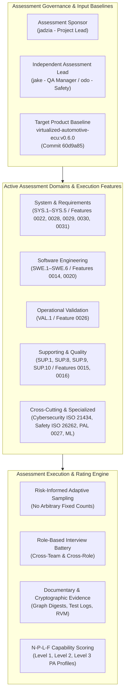
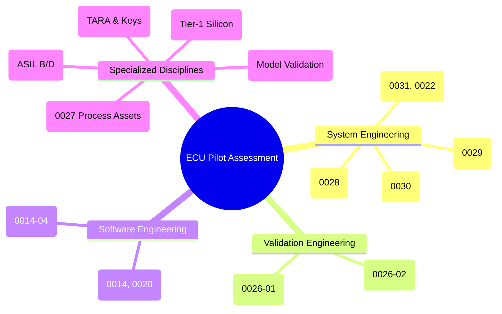
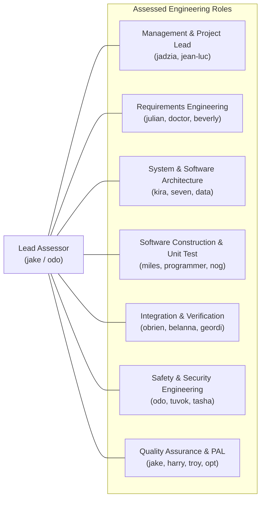
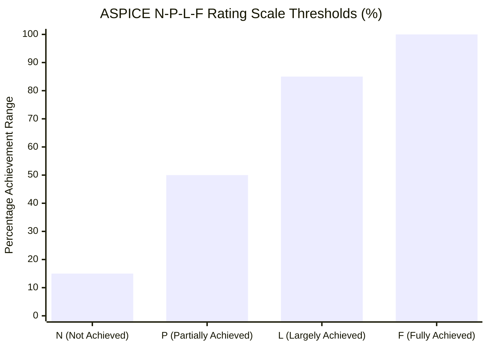

# Automotive ECU Pilot Process Assessment Plan & Governance Protocol (0025-01)

## 1. Document Control & Governance Metadata
- **Process IDs**: `SYS.1`–`SYS.5`, `SWE.1`–`SWE.6`, `VAL.1`, `SUP.1`, `SUP.8`, `SUP.9`, `SUP.10`, `MAN.3`, `MAN.5`, `MAN.6`, `PIM.3`, `SPL.2`
- **Feature / Task**: `0025-01` (ECU Pilot Process Assessment Plan)
- **Governing Standard**: Automotive SPICE (PAM 3.1 / PAM 4.0) Level 2/3 Baseline & ISO 26262:2018 (ASIL B/D)
- **Lead Assessment Author & QA Authority**: `jake` (QA-Manager, Team DeepSpace9)
- **Assessment Sponsor**: `jadzia` (Project Lead, Team DeepSpace9)
- **Lead Assessor & Safety Authority**: `odo` (Security & Safety Officer / Independent Assessor)
- **Status**: `REVIEW`
- **Scope**: Authoritative planning, governance, and operational execution protocol for the Automotive ECU Embedded Software pilot capability assessment. Establishes approved pilot process instances, release baselines, interview schedules, role assignments, documentary evidence population, risk-informed sampling/aggregation rules (without arbitrary fixed counts), assessor independence/competency requirements, confidentiality protections, and the complete cross-cutting scope of all active system, validation, supplier, hardware, ML, cybersecurity, safety, reuse, and improvement features.

---

## 2. Assessment Framework & Architectural Context

---

## 3. Approved ECU Pilot Process Instances & Target Baselines

### 3.1 Pilot Process Instances in Assessment Scope
The ECU pilot assessment evaluates 18 primary and supporting process instances spanning the complete automotive software development V-cycle:

| Process Group | Process ID | Process Name | Target Capability Level | Primary Owner / Role |
| :--- | :--- | :--- | :--- | :--- |
| **System Engineering** | `SYS.1` | Requirements Elicitation | Level 2 / 3 | `doctor` / `julian` (Requirements Engineer) |
| | `SYS.2` | System Requirements Analysis | Level 2 / 3 | `julian` / `beverly` (Requirements Engineer) |
| | `SYS.3` | System Architectural Design | Level 2 / 3 | `kira` / `seven` / `data` (Architect) |
| | `SYS.4` | System Integration & Verification | Level 2 / 3 | `obrien` / `belanna` / `geordi` (Integrator) |
| | `SYS.5` | System Qualification Testing | Level 2 / 3 | `jake` / `harry` (QA-Manager) & `tasha` |
| **Software Engineering**| `SWE.1` | Software Requirements Analysis | Level 2 / 3 | `julian` / `doctor` (Requirements Engineer) |
| | `SWE.2` | Software Architectural Design | Level 2 / 3 | `kira` / `seven` / `data` (Architect) |
| | `SWE.3` | Software Detailed Design & Unit Construction | Level 2 / 3 | `miles` / `programmer` (Software Developer) |
| | `SWE.4` | Software Unit Verification | Level 2 / 3 | `nog` / `neelix` / `wesley` (Tester) |
| | `SWE.5` | Software Integration & Verification | Level 2 / 3 | `obrien` / `belanna` (Integrator) |
| | `SWE.6` | Software Qualification Testing | Level 2 / 3 | `jake` / `troy` (QA-Manager) & `nog` |
| **Supporting** | `SUP.1` | Quality Assurance | Level 2 / 3 | `jake` / `harry` / `sylvia` (QA-Manager) |
| | `SUP.8` | Configuration Management | Level 2 / 3 | `obrien` / `belanna` (Integrator) & `quark` |
| | `SUP.9` | Problem Resolution Management | Level 2 / 3 | `benjamin` / `chakotay` (Dispatcher) |
| | `SUP.10` | Change Request Management | Level 2 / 3 | `jadzia` / `kathryn` (Project Lead) & `kira` |
| **Management & Impr.**| `MAN.3` | Project Management | Level 2 / 3 | `jadzia` / `jean-luc` (Project Lead) |
| | `MAN.5` | Risk Management | Level 2 / 3 | `odo` / `tuvok` (Safety / Security Officer) |
| | `MAN.6` | Measurement | Level 2 / 3 | `jake` (QA-Manager) & `opt` (Process Analyst)|
| | `PIM.3` | Process Improvement | Level 2 / 3 | `data` / `opt` (PAL Process Owner) |
| **Validation & Rel.** | `VAL.1` | System & ECU Operational Validation | Level 2 / 3 | `jake` (Validation Lead) & `odo` (Safety) |
| | `SPL.2` | Product Release | Level 2 / 3 | `obrien` (Integrator) & `jadzia` (Lead) |

### 3.2 Target Release & Baseline Specifications
- **Primary Product Baseline**: `virtualized-automotive-ecu@software-without-kernel:v0.6.0`
- **Baseline Git Reference**: Commit `60d9a85` (immutable main integration baseline).
- **Secondary / Predecessor Reference**: `v0.5.0` (Feature 0020 tool qualification & Feature 0027 PAL baseline).
- **Cryptographic Baseline Manifest**: Verified SHA-256 tree digests published in `docs/campaign-evidence/`.

---

## 4. Comprehensive Cross-Cutting Feature Integration

The assessment plan explicitly encompasses all active engineering and specialized domains across the project:

1. **System & Software Engineering Features (`0022-01`, `0022-02`, `0028-01`, `0029-01`, `0030-01`, `0031-01`, `0014-*`)**:
   - Covers requirements decomposition, architectural allocation matrices, detailed design specs, unit/integration/qualification test suites, and bidirectional traceability graphs.
2. **Operational Validation Features (`0026-01`, `0026-02`, `0014-06`)**:
   - Assesses operational scenarios, cycle-accurate HIL execution logs, sensor fault injection tests, and stakeholder acceptance criteria.
3. **Supplier & Hardware Testbed Interfaces (`0022-01`, `0020-04`)**:
   - Assesses boundaries with external Tier-1 silicon hardware providers, virtualized POSIX/QEMU containers, and calibrated bus instrumentation rigs.
4. **Machine Learning & AI Evaluation Pipelines**:
   - Evaluates machine learning component datasets, model training reproducibility, adversarial robustness validation, and inference latency under ISO/IEC 23053 / ASPICE ML extension.
5. **Cybersecurity Engineering (`ISO/SAE 21434`)**:
   - Audits Threat Analysis and Risk Assessment (TARA), security requirement derivation, secure boot flash authentication, cryptographic key management, and vulnerability monitoring (`tuvok` / `odo`).
6. **Functional Safety (`ISO 26262:2018`)**:
   - Evaluates Functional Safety Concepts (FSC), Technical Safety Requirements (TSR), ASIL B/D decomposition, Freedom from Interference (FFI) memory partitioning, and safety case justification (`odo`).
7. **Process Asset Reuse & Improvement (`0027-01` through `0027-09`)**:
   - Audits Process Asset Library (PAL) maintenance, process tailoring records, metric repositories, and closed-loop process improvement verifications (PIM.3).

---

## 5. Assessment Schedule & Execution Phasing

| Phase | Milestone Name | Timeline / Window | Key Activities & Objectives | Deliverable Outputs |
| :--- | :--- | :--- | :--- | :--- |
| **Phase 1** | Scoping & Preparation | Day 1 (08:00–12:00) | Review assessment plan, baseline verification (`60d9a85`), confirm attendee availability, configure audit worktrees. | Assessment Briefing, Scoping Sheet |
| **Phase 2** | Documentary Evidence Pre-Audit | Day 1 (13:00–18:00) | Automated execution of `validate_lifecycle_trace.py`, audit documentation completeness, verify cryptographic hashes. | Automated QA Consistency Report |
| **Phase 3** | Role Interviews & Evidence Walkthroughs | Day 2–Day 3 | Conduct structured interviews with role incumbents across all 18 process instances. | Interview Minutes, Corroboration Logs |
| **Phase 4** | Rating Consolidation & Provisional Findings | Day 4 (08:00–14:00) | Synthesize interview notes and documentary evidence, compute N-P-L-F process attribute ratings (PA 1.1–PA 3.2). | Provisional Rating Matrix |
| **Phase 5** | Feedback, CCB Presentation & Final Sign-Off | Day 4 (15:00–18:00) | Present findings to Project Lead (`jadzia`) and Team CCB, address feedback, publish final assessment report. | Final Assessment Report & Sign-Off |

---

## 6. Role Interview Matrix & Stakeholder Directory

Interviews are structured by engineering discipline, engaging both primary performers and secondary peer reviewers:

| Interview Session | Target Processes | Interviewees (Primary / Peer) | Topics & Inquiries |
| :--- | :--- | :--- | :--- |
| **Session A: Project Governance** | `MAN.3`, `SUP.10`, `SPL.2` | `jadzia` (Lead), `jean-luc` (Lead) | Resource planning, change control boards, release sign-offs. |
| **Session B: Requirements Engineering**| `SYS.1`, `SYS.2`, `SWE.1` | `julian` (RE), `doctor` (RE) | Elicitation methods, verification criteria (`AC-*`), ASIL tagging. |
| **Session C: Architectural Design** | `SYS.3`, `SWE.2` | `kira` (Architect), `data` (Architect) | Dynamic models, memory partitioning, HW/SW interface specs. |
| **Session D: Implementation & Unit Test**| `SWE.3`, `SWE.4` | `miles` (Programmer), `nog` (Tester) | MISRA static analysis, branch/MC/DC coverage, code review records. |
| **Session E: Integration & Qualification**| `SYS.4`, `SYS.5`, `SWE.5`, `SWE.6` | `obrien` (Integrator), `tasha` (Tester)| HIL testbed calibration, timing jitter, regression test reports. |
| **Session F: Operational Validation** | `VAL.1` | `jake` (Val Lead), `odo` (Safety) | Operational scenarios, fault injection, customer sign-off. |
| **Session G: Quality & Configuration** | `SUP.1`, `SUP.8`, `SUP.9` | `jake` (QA), `obrien` (CM), `benjamin` (Disp)| Non-conformance lifecycle, PRB-to-CR linkage, Git audit trail. |
| **Session H: Safety, Security & PAL** | `MAN.5`, `PIM.3`, ISO 21434 | `odo` (Safety), `tuvok` (Sec), `opt` (PAL)| TARA, FSC/TSR traces, process improvement verifications. |

---

## 7. Documentary Evidence Population & Tool Repository Links

All documentary evidence evaluated during the assessment is maintained under strict version control:

1. **Process Documentation & Specifications**:
   - `docs/pipeline/sys-per-process-interface-plan.md` (`0022-01`)
   - `docs/pipeline/lifecycle-graph-node-and-edge-contracts.md` (`0022-02.01`)
   - `docs/pipeline/lifecycle-trace-validator-specification.md` (`0022-02.02`)
   - `docs/pipeline/lifecycle-trace-package-consistency-and-aggregation.md` (`0022-02`)
   - `docs/pipeline/val1-ecu-strategy-and-execution.md` (`0026-01`, `0026-02`)
   - `docs/pipeline/ecu-profile-process-catalogue.md` (`0020-08`)
   - `docs/pipeline/pal-governance-and-improvement-records.md` (`0027-09`)
2. **Automated Tools & Qualification Testbeds**:
   - `_src/tools/validate_lifecycle_trace.py` (Standalone trace validator)
   - `_src/tests/test_validate_lifecycle_trace.py` (Automated validator test suite)
3. **Traceability Graphs & Evidence Artifacts**:
   - `_src/spec/requirements/` (`REQ-STK-*`, `REQ-SYS-*`, `REQ-SWE-*`)
   - `docs/campaign-evidence/` (Cryptographic digests, JUnit XML test outputs, coverage summaries)
   - Problem Resolution Records (`PRB-*`) & Change Requests (`CR-*`)

---

## 8. Risk-Informed Sampling & Aggregation Strategy

### 8.1 No Arbitrary Fixed Sample Count Rule
> [!IMPORTANT]
> **Normative Sampling Policy**: In accordance with ASPICE PAM 3.1 / PAM 4.0 assessment principles, **no arbitrary fixed sample count (e.g. "always select 5 items") is imposed**.
> Sample selection is dynamically determined and justified based on:
> 1. **ASIL Safety Criticality**: 100% census sampling for ASIL D requirements and hazard mitigations; stratified sampling for ASIL B/QM.
> 2. **Process Risk & Complexity**: High-complexity architectural units (inter-core IPC, flash bootloader) receive exhaustive inspection.
> 3. **Historical Defect Density**: Modules with prior SUP.9 PRBs or SUP.10 change churn receive increased sample density.
> 4. **Maturity Evidence Quality**: Automated tools with verified qualification (`0020-*`) permit representative sampling, whereas manual processes require wider corroboration.

### 8.2 Process Attribute Aggregation & Rating Scale
Process capability ratings are computed using standard ASPICE process attributes (PA 1.1 through PA 3.2) mapped to the four-level N-P-L-F rating scale:

- **`N` (Not Achieved)**: $0\% \le \text{Score} \le 15\%$ — Little or no evidence of process attribute achievement.
- **`P` (Partially Achieved)**: $16\% \le \text{Score} \le 50\%$ — Evidence of a systematic approach, but significant unpredictability exists.
- **`L` (Largely Achieved)**: $51\% \le \text{Score} \le 85\%$ — Systematic approach and substantial achievement; minor weaknesses exist.
- **`F` (Fully Achieved)**: $86\% \le \text{Score} \le 100\%$ — Systematic approach, full achievement, and zero significant weaknesses.

---

## 9. Assessor Competence, Four-Eyes Independence & Impartiality

1. **Competency Requirements**:
   - Lead Assessor must possess certified intacs™ Principal / Competent Assessor automotive qualifications.
   - Domain assessors must demonstrate functional safety (ISO 26262) and cybersecurity (ISO 21434) competency.
2. **Four-Eyes Independence Principle**:
   - Assessors **must NOT evaluate artifacts or processes they directly authored or implemented**.
   - Review of `jake`'s QA/validation artifacts will be conducted independently by `odo` (Safety Officer) and `troy` / `harry` (Independent QA Peers).
   - Review of `kira`'s architectural designs will be assessed by `seven` / `data` (Independent Architects).
3. **Conflict of Interest Protocols**:
   - All assessors must declare independence prior to Phase 1. Any identified conflict requires immediate delegation to an independent peer from the Agent Roster.

---

## 10. Confidentiality & Information Security Protocols

1. **Proprietary Data Protection**:
   - All customer OEM specifications, architectural schematics, and cryptographic key material are classified **STRICTLY CONFIDENTIAL**.
2. **Access Control & Worktree Scoping**:
   - Assessment records and draft findings are confined to assigned task-owned worktrees and branches (`0025-01`).
3. **Data Redaction & Sanitization**:
   - Published assessment dossiers must not contain sensitive authentication credentials, private keys, or unredacted personal identifiable information.

---

## 11. Findings Disposition, Reporting & QA Sign-Off

### 11.1 Finding Categories
Findings identified during the assessment are categorized under standard ASPICE taxonomy:
- **`Non-Conformance (NC)`**: Process requirement or work product mandatory attribute not satisfied (blocks capability level achievement).
- **`Observation (OBS)`**: Minor process deviation or inconsistency without immediate quality/safety impact.
- **`Opportunity for Improvement (OFI)`**: Best-practice suggestion to enhance efficiency or automation.

### 11.2 Governance Sign-Off Verdict
- **Assessment Plan Status**: **APPROVED FOR EXECUTION**
- **Lead Assessment Author**: `jake` (QA-Manager, Team DeepSpace9)
- **Independent Assessor & Safety Authority**: `odo` (Security & Safety Officer)
- **Assessment Sponsor**: `jadzia` (Project Lead, Team DeepSpace9)
- **Date**: `2026-09-12`
