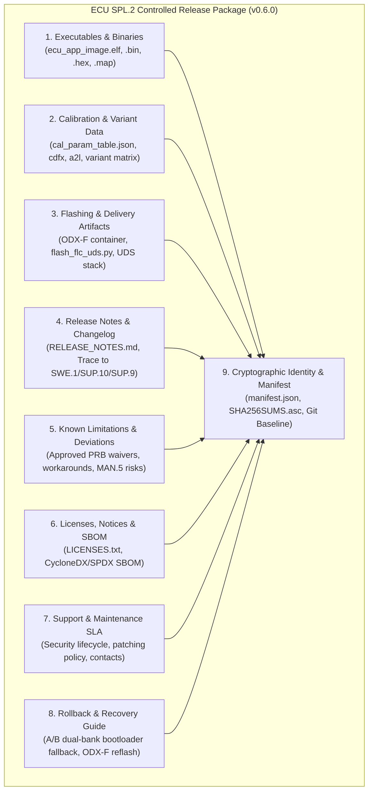
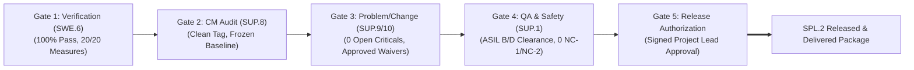

# Automotive ECU SPL.2 Product Release Content, Criteria, and Delivery Specification (0024-01)

## 1. Document Control & Governance Metadata
- **Process ID**: `SPL.2` (Product Release) / Automotive SPICE PAM 3.1 & PAM 4.0 Level 2/3
- **Feature / Task**: `0024-01` (PREREQ: `0020-08`, `0027-05`, `0023-10`)
- **Target Baseline**: `virtualized-automotive-ecu@software-without-kernel:v0.6.0`
- **Release Authority**:
  - **Project Lead / Release Authorization**: `jadzia` (Project Lead, Team DeepSpace9)
  - **Integrator / Release Packaging Lead**: `obrien` (Integrator, Team DeepSpace9)
  - **QA Authority / Audit Clearance**: `jake` (QA-Manager, Team DeepSpace9)
  - **System & Software Architect**: `kira` (Architect, Team DeepSpace9)
  - **Security & Safety Officer**: `odo` (Security Engineer, Team DeepSpace9)
- **Status**: `REVIEW`
- **Scope**: Authoritative engineering standard defining the formal requirements, content topology, cryptographic identity, approval criteria, vehicle/hardware compatibility, flashing artifacts, release notes, licenses, rollback procedures, recipient delivery controls, and retention rules for Automotive ECU Product Releases (`SPL.2`).

---

## 2. Release Package Content & Structural Topology

An ECU Product Release package assembled under `SPL.2` MUST be a hermetic, cryptographically verifiable distribution container (`.tar.gz` / `.zip`) comprising nine mandatory categories of artifacts:



### 2.1 Artifact Breakdown & Requirements

| Artifact Group | Mandatory Filename / Path | Description & Content Requirements |
| :--- | :--- | :--- |
| **1. Firmware & Executables** | `bin/ecu_app_image.elf`<br>`bin/ecu_app_image.bin`<br>`bin/ecu_app_image.hex`<br>`bin/ecu_app_image.map` | Compiled, stripped, and linked ECU release binary built from the frozen Git baseline tag with full symbol/memory mapping. |
| **2. Calibration & Configuration** | `cal/cal_param_table.json`<br>`cal/cal_parameters.cdfx`<br>`cal/ecu_description.a2l`<br>`config/variant_matrix.json` | Pinned parameter dataset, ASAM MCD-2MC (A2L) description, and variant configuration parameters for target ECU operating modes. |
| **3. Flashing & Delivery** | `flash/ECU_SW_FLASH_CONTAINER.odx-f`<br>`flash/flash_flc_uds.py`<br>`flash/security_access_key.asc` | ISO 22900 / ISO 14229 (UDS) compliant diagnostic flashing container with automated flashing script and security access key verification. |
| **4. Release Notes** | `docs/RELEASE_NOTES.md` | Formal release notes detailing version identity, new features fulfilled (`SWE.1`), bug fixes (`SUP.9`), and change requests integrated (`SUP.10`). |
| **5. Known Limitations** | `docs/KNOWN_LIMITATIONS.md` | Exhaustive record of accepted open anomalies, residual risks (`MAN.5`), environmental constraints, and approved deviations. |
| **6. Licenses & Notices** | `licenses/LICENSES.txt`<br>`licenses/bom.spdx.json` | Explicit software licenses (Apache-2.0 / MIT / proprietary), third-party attribution notices, and SPDX 2.3 machine-readable Software Bill of Materials. |
| **7. Support & SLA** | `docs/SUPPORT_POLICY.md` | Support classification tier, security patch lifecycle (minimum 5 years automotive maintenance), and escalation contact paths. |
| **8. Rollback & Recovery** | `docs/ROLLBACK_PROCEDURE.md` | Deterministic rollback procedure: A/B partition fallback trigger and manual diagnostic re-flashing instructions to restore prior baseline. |
| **9. Release Manifest** | `manifest.json`<br>`SHA256SUMS`<br>`SHA256SUMS.asc` | Canonical JSON release record containing item digests, build environment metadata, and detached GPG/Ed25519 signature of the Release Authority. |

---

## 3. Release Identification & Cryptographic Identity

### 3.1 Canonical Versioning Scheme
Every ECU release package MUST follow the strict semantic versioning format with mandatory release campaign suffix:
$$\text{Tag Format: } \mathbf{v\langle Major\rangle.\langle Minor\rangle.\langle Patch\rangle[-RC\langle N\rangle]-ECU-\langle Campaign\rangle}$$
- *Example Final Release*: `v0.6.0-ECU-REL-20260919`
- *Example Release Candidate*: `v0.6.0-RC2-ECU-REL-20260918`

### 3.2 Cryptographic Fingerprint & Traceability
The release package MUST be tied to an immutable `git` commit and tag:
1. **Git Commit SHA**: Full 40-character hexadecimal commit hash representing the exact merged state in the canonical repository.
2. **Build Environment Hash**: Exact compiler triple (`arm-none-eabi-gcc 12.3.rel1`), build flags, and linker script digest.
3. **Artifact Digest Table**: SHA-256 digests computed over all packaged files, collected into `SHA256SUMS` and cryptographically signed with the Project Lead's release key.

---

## 4. Hardware, Vehicle & Variant Compatibility Scope

The release specification defines explicit boundaries for compatible hardware execution targets, vehicle network topologies, and functional variant configurations.

### 4.1 Target Silicon & Execution Environments
- **Primary Embedded Target**: ARM Cortex-M4 @ 160 MHz (e.g. STM32F4 / NXP S32K series), 512 KB Flash ROM, 128 KB SRAM.
- **Virtualized Emulation Target**: QEMU ARM Cortex-M4 Emulation Platform (Representative SIL environment `RUN-SWE6-20260913-001`).
- **Target Electrical Bus Interfaces**:
  - **CAN-FD**: ISO 11898-1:2015 compliant (500 kbps Nominal / 2 Mbps Data phase).
  - **Automotive Ethernet**: IEEE 802.3bw (100BASE-T1) via virtual TAP hub (`tap0`).
  - **Diagnostic Protocol**: ISO 14229-1 (UDS on CAN-FD and DoIP).

### 4.2 Variant Matrix Configuration
The release package supports three verified variant configurations defined in `config/variant_matrix.json`:

| Variant ID | Variant Name | Supported Network Features | Target Subsystem / Use Case |
| :--- | :--- | :--- | :--- |
| `VAR-STD-01` | **Standard Gateway / Telematics** | CAN-FD (Ch 0, 1) + 100BASE-T1 DoIP | Gateway ECU bridging powertrain CAN to Ethernet backbone. |
| `VAR-POW-02` | **Powertrain & Body Interface** | Dual CAN-FD (Ch 0, 1), Low-power sleep | Direct actuator control and sensor telemetry aggregation. |
| `VAR-SIL-03` | **Virtual SIL CI Emulation** | Linux SocketCAN (`vcan0`) + Linux TAP (`tap0`) | Continuous Integration, automated regression, and HIL pre-test. |

---

## 5. Eligibility, Quality Gates & Approval Criteria

A release candidate is strictly **prohibited** from being promoted to a released package unless it clears all five mandatory quality and process gates:



### 5.1 Gate 1: Verification & Qualification Clearance (`SWE.6`)
- 100% of SWE.6 qualification test measures (`QUAL-SWE6-01` through `QUAL-SWE6-20`) must yield a verified **PASS** verdict in the representative virtual SIL/HIL environment.
- Zero open Critical (Severity 1) or High (Severity 2) anomalies.
- Full bidirectional traceability from 100% of software requirements (`SWE.1` / `REQ-SWE-0023-01..20`) to qualification results.

### 5.2 Gate 2: Configuration Baseline Integrity (`SUP.8`)
- Working tree must be 100% clean (no untracked, modified, or unstaged files).
- The release commit must be tagged with an annotated, GPG-signed Git release tag.
- All configuration items (code, models, calibration, tests, toolchain specifications) must be checked into the baseline.

### 5.3 Gate 3: Problem Resolution & Change Management (`SUP.9` / `SUP.10`)
- 100% of change requests (`CR-*`) planned for the release milestone must be in state `CLOSED` or `INTEGRATED`.
- All unresolved problem reports (`PRB-*`) must be classified, assigned to a subsequent release milestone, and formally approved as an accepted known limitation in the Release Notes by the Project Lead.

### 5.4 Gate 4: Quality Assurance & Safety Conformance (`SUP.1` / ISO 26262)
- QA audit must confirm zero open Non-Conformances in Severity NC-1 (Critical) and NC-2 (Major).
- Security & Safety Officer (`odo`) must certify safety case conformance for ASIL B/D functional safety mechanisms (watchdog monitoring, memory partitioning, E2E bus CRC).

### 5.5 Gate 5: Formal Release Authorization (`MAN.3` / `SPL.2`)
- Formal sign-off via Project Lead `decision_request` (e.g. `DEC-0024-REL-AUTHORIZATION`).
- Unanimous concurrence from Integrator (`obrien`), QA Lead (`jake`), Architect (`kira`), and Security Officer (`odo`).

---

## 6. Flashing, Delivery, Rollback & Post-Release Support

### 6.1 Flashing & Delivery Protocol
1. **Container Format**: The ECU binary is packaged into an ASAM ODX-F (ISO 22900-2) flash container specifying logical block memory offsets, erase routines, programming sessions (UDS Service `0x10 0x02`), and seed-key security access algorithms (`0x27 0x01`).
2. **Delivery Mechanism**: Distribution occurs via an authenticated, encrypted release portal (HTTPS/SFTP/OCI Registry). The recipient verifies delivery completeness using the detached GPG signature (`SHA256SUMS.asc`).

### 6.2 Rollback & Fallback Mechanism
1. **A/B Dual-Bank Partitioning**:
   - The ECU bootloader maintains dual flash banks (`BANK_A` active, `BANK_B` passive).
   - A new release is written to `BANK_B`. If watchdog supervision or self-test fails post-flash during the initial 5 operational boot cycles, the bootloader automatically reverts execution to `BANK_A`.
2. **Manual In-Field Recovery**:
   - If in-field flashing is interrupted (e.g. power loss), the bootloader remains in UDS Boot-Mode (`0x10 0x02`), accepting an emergency re-flash of the previous known-good baseline (`v0.5.0-ECU-REL`) within a Recovery Time Objective (RTO) $\le 5\text{ minutes}$.

### 6.3 Support & Service Level Agreement
- **Maintenance Lifecycle**: Active support for 24 months post-release; critical CVE security patching for 60 months.
- **Incident Escalation**: Critical field anomalies must be reported to the Product Security Incident Response Team (PSIRT) via `security@deepspace9.starfleet.network`.

---

## 7. Permanent Release Record Schema & Retention

Every release execution under `SPL.2` MUST generate an immutable, machine-readable JSON release record stored in `docs/dossiers/releases/` and the long-term evidence archive.

### 7.1 JSON Release Record Schema (`ecu-release-record@v1`)
```json
{
  "$schema": "https://json-schema.org/draft/2020-12/schema",
  "title": "ECU SPL.2 Release Record Schema",
  "type": "object",
  "required": [
    "schema",
    "release_id",
    "release_tag",
    "git_commit_sha",
    "released_at",
    "release_authority",
    "gate_verdicts",
    "package_manifest",
    "compatibility_scope",
    "known_limitations",
    "retention_policy"
  ],
  "properties": {
    "schema": { "type": "string", "const": "ecu-release-record@v1" },
    "release_id": { "type": "string", "pattern": "^REL-ECU-[0-9]{8}-[0-9]{4}$" },
    "release_tag": { "type": "string", "pattern": "^v[0-9]+\\.[0-9]+\\.[0-9]+.*$" },
    "git_commit_sha": { "type": "string", "pattern": "^[0-9a-f]{40}$" },
    "released_at": { "type": "string", "format": "date-time" },
    "release_authority": {
      "type": "object",
      "required": ["approver_role", "approver_id", "decision_id"],
      "properties": {
        "approver_role": { "type": "string" },
        "approver_id": { "type": "string" },
        "decision_id": { "type": "string" }
      }
    },
    "gate_verdicts": {
      "type": "object",
      "required": ["swe6_qualification", "sup8_cm_baseline", "sup9_sup10_disposition", "sup1_qa_clearance"],
      "properties": {
        "swe6_qualification": { "type": "string", "enum": ["PASS", "FAIL"] },
        "sup8_cm_baseline": { "type": "string", "enum": ["VERIFIED", "UNVERIFIED"] },
        "sup9_sup10_disposition": { "type": "string", "enum": ["RESOLVED", "WAIVED"] },
        "sup1_qa_clearance": { "type": "string", "enum": ["APPROVED", "REJECTED"] }
      }
    },
    "package_manifest": {
      "type": "object",
      "required": ["package_name", "package_sha256", "artifacts"],
      "properties": {
        "package_name": { "type": "string" },
        "package_sha256": { "type": "string", "pattern": "^sha256:[0-9a-f]{64}$" },
        "artifacts": {
          "type": "array",
          "items": {
            "type": "object",
            "required": ["path", "sha256", "size_bytes"],
            "properties": {
              "path": { "type": "string" },
              "sha256": { "type": "string", "pattern": "^sha256:[0-9a-f]{64}$" },
              "size_bytes": { "type": "integer", "minimum": 0 }
            }
          }
        }
      }
    },
    "compatibility_scope": {
      "type": "object",
      "required": ["hardware_targets", "network_protocols", "variants"],
      "properties": {
        "hardware_targets": { "type": "array", "items": { "type": "string" } },
        "network_protocols": { "type": "array", "items": { "type": "string" } },
        "variants": { "type": "array", "items": { "type": "string" } }
      }
    },
    "known_limitations": {
      "type": "array",
      "items": {
        "type": "object",
        "required": ["id", "description", "waiver_reference"],
        "properties": {
          "id": { "type": "string" },
          "description": { "type": "string" },
          "waiver_reference": { "type": "string" }
        }
      }
    },
    "retention_policy": {
      "type": "object",
      "required": ["retention_years", "archive_location", "immutable"],
      "properties": {
        "retention_years": { "type": "integer", "minimum": 15 },
        "archive_location": { "type": "string" },
        "immutable": { "type": "boolean", "const": true }
      }
    }
  }
}
```

### 7.2 Retention Requirements
- **Automotive Liability Duration**: All release records, constituent binary artifacts, calibration tables, qualification test logs, and authorization signatures MUST be archived for a minimum of **15 years** in accordance with ISO 26262 and automotive product liability regulations.
- **Immutability**: Write-Once-Read-Many (WORM) storage or append-only cryptographically signed archives.
