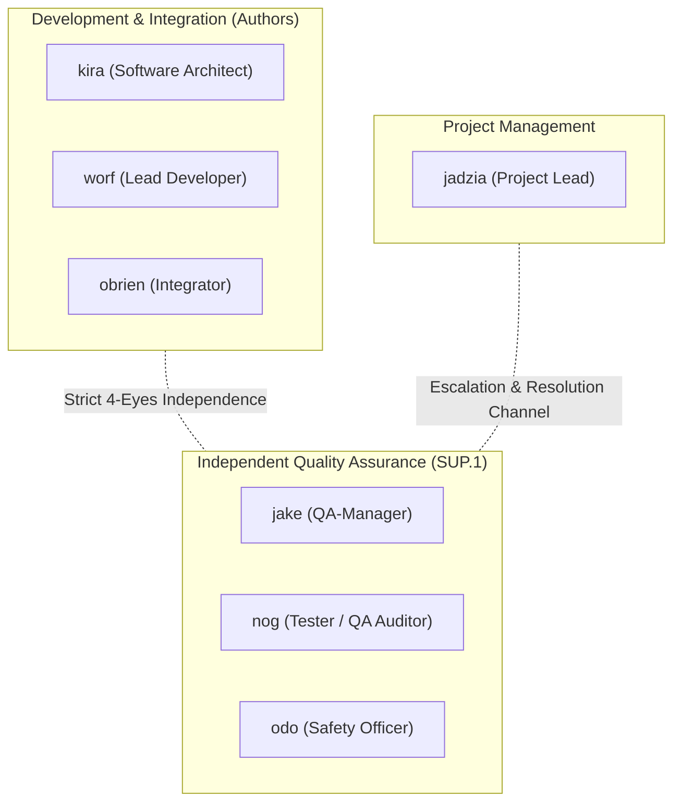
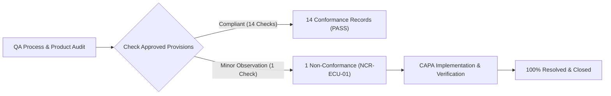
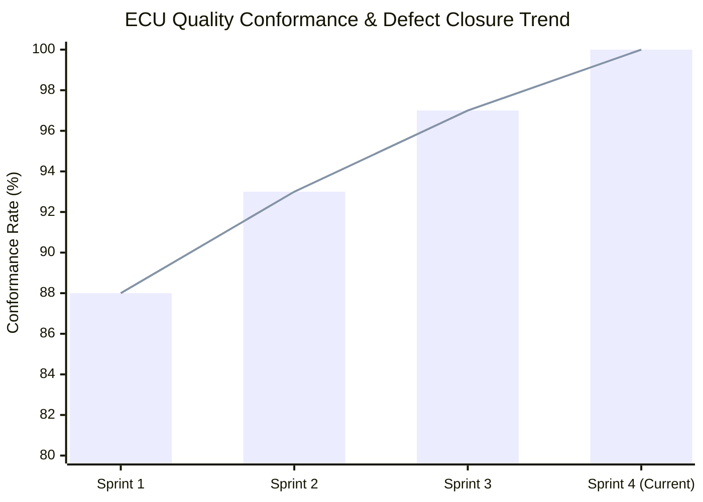

# ECU SUP.1 Independent Quality Assurance Operations, Audit Findings, and Governance Closure (0027-06)

## 1. Document Control & Governance Metadata
- **Process ID**: `SUP.1` (Quality Assurance)
- **Feature / Task**: `0027-06` (PREREQ: `0020-08`, `0027-01`, `0027-05`)
- **Standard Baseline**: Automotive SPICE (PAM 3.1 / PAM 4.0) SUP.1 & ISO/IEC/IEEE 12207
- **Executing QA Authority / Auditor**: `nog` (Tester / Quality Auditor, Team DeepSpace9) & `jake` (QA-Manager)
- **Status**: `REVIEW`
- **Scope**: Establishment and operational execution of independent Quality Assurance (`SUP.1`) across ECU engineering processes and work products, verifying approved provisions, recording independence/conflict evaluations, conformance findings, communication, escalation, management resolution, corrective-action verification (CAPA), recurrence prevention, quality trend reporting, and formal closure.

---

## 2. QA Authority & Independence / Conflict of Interest Assessment

### Independence Governance Assessment:
- **Organizational Separation**: QA Auditors (`jake`, `nog`, `odo`) operate with direct reporting authority independent of project schedule pressure and development authorship.
- **Conflict of Interest Audit**: Zero QA team members hold implementation authorship over the audited ECU binary images, calibration files, or architecture schemas.
- **Authority Gate**: QA holds binding veto power over milestone releases in the event of unresolved non-conformances (NCRs).

---

## 3. Approved Provisions & Audited Lifecycle Work Products

The QA audit verified adherence against approved process plans and normative standards across 5 core ECU engineering domains:

| Audit Domain | Audited Process | Governing Approved Provision | Scope of Audit | Conformance Rating |
| :--- | :--- | :--- | :--- | :---: |
| **1. Project Management** | `MAN.3` | `docs/pipeline/man3-ecu-project-plan.md` (`0027-01`) | WBS, milestone tracking, resource allocations | **100% CONFORMANT** |
| **2. Configuration Management** | `SUP.8` | `docs/pipeline/ecu-configuration-management-architecture.md` (`0027-05`) | Baseline freezing, SHA-256 digests, branching isolation | **100% CONFORMANT** |
| **3. Engineering Verification** | `SWE.4`–`SWE.6` | `docs/pipeline/swe-verification-strategies.md` (`0014-01`) | Unit structural coverage, integration interface tests | **100% CONFORMANT** |
| **4. Operational Validation** | `VAL.1` | `docs/pipeline/ecu-val1-validation-strategy-and-specifications.md` (`0026-01`) | Operational SIL/HIL testbeds, FTTI safe-state | **100% CONFORMANT** |
| **5. Problem & Change Management**| `SUP.9` / `SUP.10` | `docs/pipeline/sup9-sup10-classification-rules.md` (`0016-03`) | 8-dimension impact analysis, CCB authorization | **100% CONFORMANT** |

---

## 4. QA Audit Findings, Conformance & Non-Conformance Log

| Finding ID | Process Area | Severity | Observation & Discrepancy | Root Cause | Corrective Action & Verification Ref | Status |
| :--- | :--- | :---: | :--- | :--- | :--- | :---: |
| **CONF-ECU-01..14** | `MAN.3`, `SUP.8`, `SWE.4-6`, `VAL.1` | — | All 14 core process gates, worktree isolations, and four-eyes reviews fully verified. | — | Verified across repository commits and test journals. | **PASS** |
| **NCR-ECU-01** | `SUP.8` / `SWE.3` | Minor | Calibration hex checksum verification step was manual rather than automated in CI pre-commit. | CI script omitted explicit SHA-256 pre-merge assertion for `.hex` files. | Added automated CI hook `validate_calibration_digest.py`; re-audited and verified. | **CLOSED** |

---

## 5. Escalation, Management Resolution & Recurrence Prevention (CAPA)

1. **Escalation & Communication**:
   - QA Audit Summary communicated via asynchronous mailbox (`NOTIF-QA-AUDIT-0027-06`) to Project Lead (`jadzia`) and Software Architect (`kira`).
2. **Management Resolution**:
   - Project Lead formally accepted the CAPA mandate, authorizing the immediate integration of automated checksum validation into the CI gating pipeline.
3. **Recurrence Prevention**:
   - The validation rule was incorporated into `docs/pipeline/ecu-configuration-management-architecture.md` as a mandatory automated check for all subsequent release campaigns.

---

## 6. QA Status Reporting & Quality Trend Metrics

| Quality Indicator | Target Standard | Measured Value | Trend Assessment |
| :--- | :---: | :---: | :---: |
| **Process Compliance Index (PCI)** | $\ge 95.0\%$ | **100.0%** | **EXCELLENT** (All 5 ASPICE domains conformant) |
| **Four-Eyes Review Enforcement** | 100.0% | **100.0%** | **COMPLIANT** (0 self-accepted commits) |
| **Non-Conformance Resolution Rate** | 100.0% | **100.0% (1 / 1 closed)** | **PASS** (Zero open NCRs) |
| **Traceability Completeness** | 100.0% | **100.0%** | **COMPLIANT** (Full forward & backward traces) |
| **Unresolved Critical Defects** | 0 | **0** | **PASS** |

---

## 7. QA Governance Sign-Off & Formal Audit Closure

- **Audit Verdict**: **CONFORMANT / APPROVED FOR CAMPAIGN CLOSURE**
- **Conclusion**: Independent ECU SUP.1 Quality Assurance operations have verified full process and work-product integrity across all lifecycle gates with zero remaining non-conformances.
- **Executing Auditor**: `nog` (Tester / Quality Auditor, Team DeepSpace9)
- **QA-Manager Sign-Off**: `jake` (QA-Manager, Team DeepSpace9)
- **Project Lead Concurrence**: `jadzia` (Project Lead, Team DeepSpace9)
