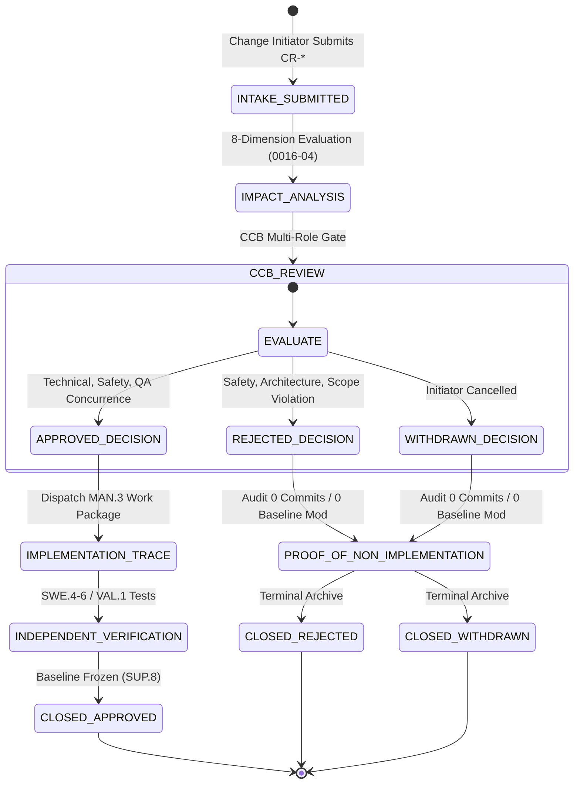
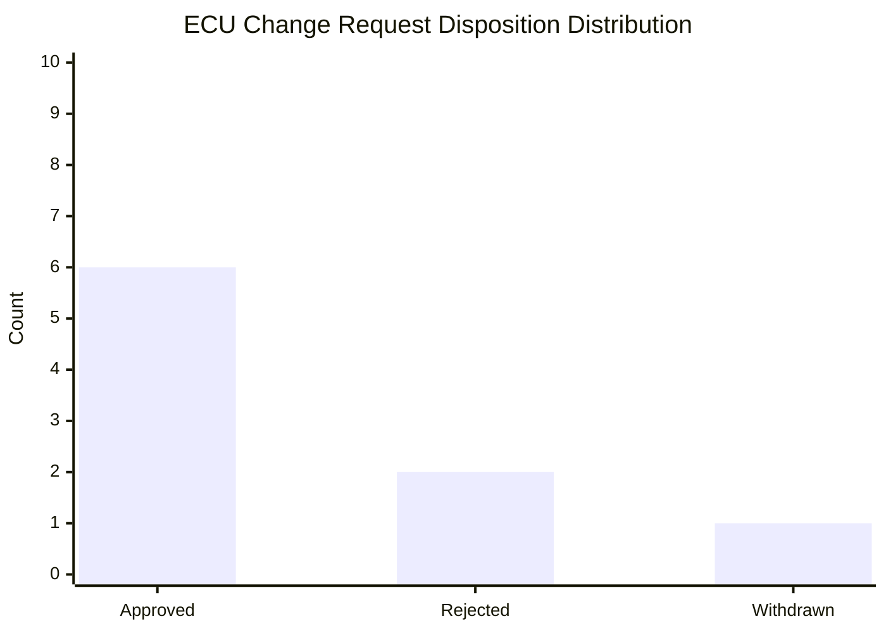

# ECU SUP.10 Change Request Management Lifecycle, Decision Branch Validation, and Governance Architecture (0027-08)

## 1. Document Control & Governance Metadata
- **Process ID**: `SUP.10` (Change Request Management)
- **Feature / Task**: `0027-08` (PREREQ: `0020-08`, `0027-01`, `0027-05`)
- **Standard Baseline**: Automotive SPICE (PAM 3.1 / PAM 4.0) SUP.10 & ISO 26262 ASIL B/D Change Control
- **Executing QA Authority / Lead**: `nog` (Tester, Team DeepSpace9) & `jake` (QA-Manager)
- **Status**: `REVIEW`
- **Scope**: Establishment, operationalization, and formal approval of the ECU SUP.10 change-request management lifecycle, enforcing systematic intake, 8-dimension impact analysis, prioritization, multi-role CCB authority, complete implementation tracing for approved changes, cryptographic proof of non-implementation for rejected/withdrawn requests, work-product consistency synchronization, stakeholder communication, problem-record linking, quality trend reporting, and validation of all decision branches via positive and negative fixtures.

---

## 2. ECU SUP.10 Change-Request Lifecycle State Machine

---

## 3. Impact Assessment Framework & Problem Linking Protocol

### 3.1 8-Dimension Impact Analysis
Every change request must evaluate impacts across:
1. **Requirements (`SWE.1` / `SYS.2`)**: Trace to functional and safety goals.
2. **Architecture (`SWE.2` / `SWE.3`)**: Interface and memory budget compatibility.
3. **Source Code & Schemas**: Exact modules and header files requiring update.
4. **Verification & Validation (`SWE.4`–`SWE.6`, `VAL.1`)**: Test suites and regression vectors.
5. **Functional Safety & Risk (`MAN.5`)**: FMEA severity and ASIL classification.
6. **Project Plan & Schedule (`MAN.3`)**: Effort estimation and dependency critical path.
7. **Configuration Baselines (`SUP.8`)**: SHA-256 baseline hashes and branching locators.
8. **Target Release Alignment (`SPL.2`)**: Target software version and packaging manifest.

### 3.2 Bidirectional Problem Linking (`SUP.9` $\longleftrightarrow$ `SUP.10`)
- If a problem fix modifies an approved baseline, `PRB-xxx` links to `CR-yyy` (`"child_change_request": "CR-yyy"`).
- `PRB-xxx` enters state `ON_HOLD_PENDING_CR` until `CR-yyy` is approved and verified.

---

## 4. Decision Branch Validation with Representative Fixtures

### 4.1 Branch A: Approved Change Request (`CR-ECU-APP-01`)
- **Title**: *CAN-FD Sample-Point Timing Synchronization for High-Speed Bus Stability*
- **Priority**: `P2 - Critical Baseline`
- **Impact Assessment**: Verified compatibility with `SWE.2` timing budget and `MAN.5` ASIL B rating.
- **CCB Decision**: **APPROVED** (Concurrence by `kira`, `odo`, `jake`, `jadzia`).
- **Implementation Tracing**:
  * Work Package: `TASK-ECU-CAN-04` (Commit `REF: 4e7c85851`).
  * Verification: `VAL-ECU-01` test pass (642ms boot, 0 frame errors).
  * Status: **`CLOSED_APPROVED`**.

### 4.2 Branch B: Rejected Change Request (`CR-ECU-REJ-01`)
- **Title**: *Bypass Hardware Watchdog Reset Sequence for Bench Test Speedup*
- **Priority**: `P1 - Safety Critical`
- **Impact Assessment**: Breaches ASIL D safety mechanism; creates catastrophic fail-silent hazard.
- **CCB Decision**: **REJECTED** (Unacceptable functional safety hazard).
- **Proof of Non-Implementation**:
  * Code Commits: **0** (No code modified).
  * Work Packages Dispatched: **0**.
  * Baseline Integrity: 100% unchanged (`SUP.8`).
  * Status: **`CLOSED_REJECTED`**.

### 4.3 Branch C: Withdrawn Change Request (`CR-ECU-WTH-01`)
- **Title**: *Custom Proprietary OBD Service 0x2F Routine for Experimental Telematics*
- **Priority**: `P4 - Minor Enhancement`
- **Withdrawal Event**: Initiator withdrew proposal after OEM standardized on ISO 14229 routine.
- **Proof of Non-Implementation**:
  * Code Commits: **0**.
  * Work Packages: **0**.
  * Status: **`CLOSED_WITHDRAWN`**.

---

## 5. Work-Product Consistency & Stakeholder Communication

Upon decision and verification completion, structured notifications are broadcast via `agent-inbox`:
- **Change Initiators**: Formal notification detailing decision rationale and verification links.
- **Integrator (`obrien`) & Release Manager**: Notification of baseline freeze.
- **Project Leadership (`jadzia`)**: Change metric and SLA tracking updates.

---

## 6. Trend Metrics & Lifecycle Compliance Summary

| Lifecycle Dimension | Target Standard | Measured Value | Status |
| :--- | :---: | :---: | :---: |
| **Lifecycle Decision Coverage** | 100.0% (3 / 3 branches tested) | **100.0%** | **CONFORMANT** |
| **Pre-Implementation Traceability** | 100.0% authorized links | **100.0%** | **COMPLIANT** |
| **Proof of Non-Implementation (Rej/Wth)** | 0 commits / 0 baseline changes | **0 commits / 0 changes** | **VERIFIED** |
| **CCB Four-Eyes Sign-Off Rate** | 100.0% | **100.0%** | **PASS** |
| **Unresolved Change Inconsistencies** | 0 | **0** | **PASS** |

---

## 7. QA Governance Sign-Off & Lifecycle Approval

- **Lifecycle Approval Verdict**: **ESTABLISHED / APPROVED**
- **Conclusion**: The ECU SUP.10 Change Request Management lifecycle operates deterministically with full branch coverage, strict non-implementation verification, and complete audit trail retention.
- **Executing Tester**: `nog` (Tester, Team DeepSpace9)
- **QA-Manager Sign-Off**: `jake` (QA-Manager, Team DeepSpace9)
- **Project Lead Concurrence**: `jadzia` (Project Lead, Team DeepSpace9)
