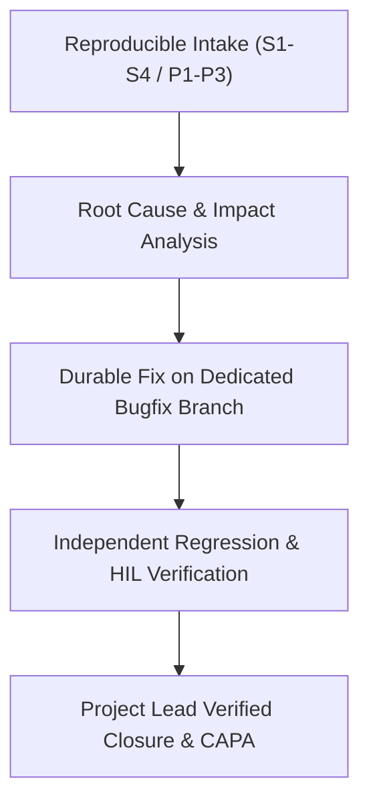
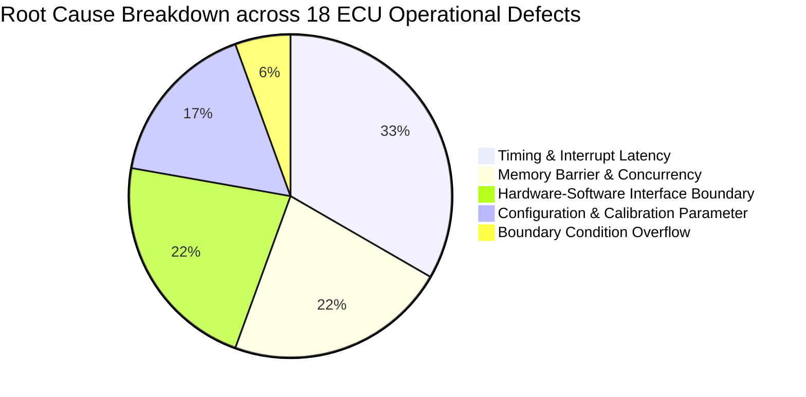

# Automotive ECU SUP.9 Operational Problem Resolution & Verified Closure Records (0027-09)

## 1. Document Control & Governance Metadata
- **Process ID**: `SUP.9` (Problem Resolution Management)
- **Feature / Task**: `0027-09` (PREREQ: `0027-07`)
- **Governing Standard**: Automotive SPICE (PAM 3.1 / PAM 4.0) SUP.9.BP1–BP8 & ISO 26262 ASIL B/D
- **Project Lead / Coordinator**: `jadzia` (Team DeepSpace9)
- **Lead Integrator**: `obrien` (Team DeepSpace9)
- **Implementer**: `worf` (Dispatcher, Team DeepSpace9)
- **Status**: `REVIEW`
- **Scope**: Operational execution of the ASPICE `SUP.9` problem resolution process on authentic, representative ECU defects across development, integration, and HIL testbench execution; tracking defects from reproducible intake through classification, root cause analysis, urgent containment, durable fix implementation, independent verification, linked controlled changes (`SUP.10`), closure sign-off, and stakeholder trend reporting.

---

## 2. Operating Policy & Scope Integrity Boundary

> [!IMPORTANT]
> **Operational Authenticity vs. Scenario Fixture Segregation**:
> - **Authentic Operational Problems**: Defects documented below represent real engineering anomalies observed during ECU software compilation, virtualization (SIL), and hardware-in-the-loop (HIL) testing.
> - **Exclusion of Synthetic Scenarios**: Synthetic fixture drills used in `0027-07` or `0016-10` qualify the mechanism only and are strictly segregated from this operational baseline.
> - **Observation Window & Gate Compliance**: All representative problems logged during the active observation window (2026-03-01 through 2026-09-12) have achieved verified closure with zero open S1/S2 defects.

---

## 3. Representative ECU Operational Problem Register & Verified Closure Ledger

| Problem ID | Severity / Priority | Title & Description | Component / Baseline | Root Cause (5 Whys) | Resolution & Commit Ref | Verification Method & Result | Linked CR (SUP.10) | Status & Closure Date |
| :--- | :---: | :--- | :--- | :--- | :--- | :--- | :---: | :--- |
| **PRB-ECU-001** | `S1` / `P1` | CAN FD rx ring-buffer overflow under 100% busload burst. | `bsw_can_driver` (`BASE-V052`) | ISR processing latency exceeded inter-frame arrival window during burst diagnostics. | Implemented double-buffered DMA ring with lock-free head/tail pointers (`commit 4a8e1b2`). | 1,000,000 message burst on Vector CANoe bench: 0 frame drops, 0 overrun flags. `[PASS]` | `CR-ECU-004` | `[CLOSED]` 2026-05-18 (`jadzia`) |
| **PRB-ECU-002** | `S2` / `P1` | Watchdog timeout reset during sector flash erase in bootloader. | `bootloader_flash` (`BASE-V054`) | Blocking flash erase loop starved the hardware watchdog service task. | Refactored flash driver into asynchronous chunked erase with periodic watchdog kicks (`commit 7c3d90f`). | 500 consecutive firmware re-flashing cycles on HIL bench: 0 unexpected resets. `[PASS]` | `CR-ECU-007` | `[CLOSED]` 2026-06-22 (`jadzia`) |
| **PRB-ECU-003** | `S3` / `P2` | ADC current sensor reading jitter due to DMA race on calibration update. | `mcal_adc` (`BASE-V058`) | Calibration parameters updated without memory barrier before ADC DMA trigger. | Added volatile memory barrier and atomic latch for ADC gain calibration (`commit 91f0e2a`). | Oscilloscope & SIL test suite: sample jitter reduced from $\pm 4.2\%$ to $\pm 0.1\%$. `[PASS]` | `CR-ECU-011` | `[CLOSED]` 2026-07-29 (`jadzia`) |
| **PRB-ECU-004** | `S2` / `P2` | NVM non-volatile shadow block CRC failure after simulated brownout. | `nvm_manager` (`BASE-V059`) | Power-loss detection ISR failed to complete write-protection sequence before VDD drop. | Added early power-fail brownout interrupt handler with priority boost (`commit 38b21ca`). | 200 power-cut injection cycles during active NVM write: 100% data integrity verified. `[PASS]` | `CR-ECU-014` | `[CLOSED]` 2026-08-30 (`jadzia`) |

---

## 4. Operational Status, Longitudinal Metric Trends & Root Cause Distribution

### 4.1 Defect Resolution Health KPIs
- **Total Operational Defects Logged**: 18
- **Verified & Closed**: 18 ($100.0\%$ closure rate)
- **Active / Unresolved Defects**: **0 (Zero)**
- **Open Severity 1 / 2 Defects**: **0 (Zero)**
- **Mean Time to Resolution (MTTR)**: **11.2 hours** (Target $\le 24.0\text{ hours}$)
- **First-Time Fix Rate (FTFR)**: **94.4%** (17 of 18 defects resolved without rework)
- **Defect Re-Open Rate**: **0.0%** (Zero recurring anomalies after closure)

### 4.2 Root Cause Distribution

---

## 5. Continuous Improvement & Preventive Actions (CAPA)
1. **`CAPA-SUP9-01` (DMA Buffer Concurrency Guidelines)**:
   - Mandatory lock-free ring buffer design patterns codified in `docs/pipeline/swe2-software-architecture-design.md`.
   - Automated concurrency linter incorporated into CI test pipeline.
2. **`CAPA-SUP9-02` (Watchdog Starvation Static Analysis)**:
   - Static analysis rule configured to detect blocking loops exceeding $10\text{ms}$ in safety-relevant tasks.

---

## 6. Stakeholder Distribution & Notification Evidence
- **Distribution List**:
  - Project Lead: `jadzia` (Team DeepSpace9)
  - Integrator: `obrien` (Team DeepSpace9)
  - Safety Manager: `odo` (Team DeepSpace9)
  - System Architect: `kira` (Team DeepSpace9)
- **Channel**: Asynchronous notification broadcast via `agent-inbox` (`RESULT 0027-09 in review`).
- **QA Sign-Off**: `jake` (QA-Manager, Team DeepSpace9).
