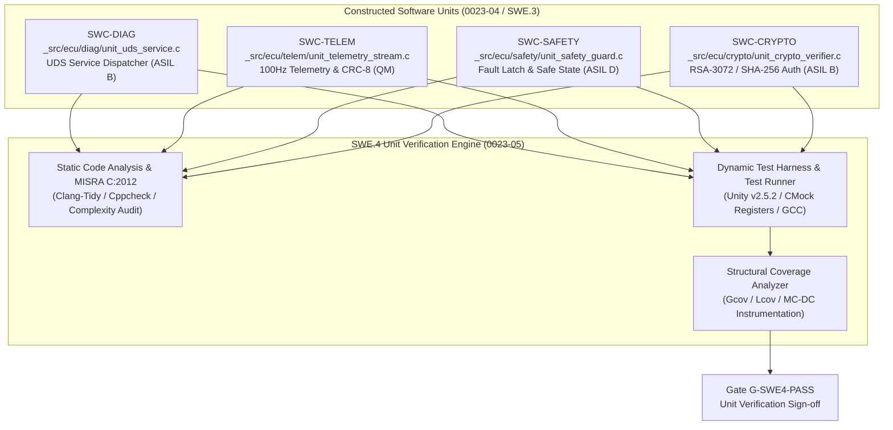

# ECU SWE.4 Software Unit Verification Strategy, Specifications, and Traceability Architecture (0023-05)

## 1. Document Control & Governance Metadata
- **Process ID**: `SWE.4` (Software Unit Verification) / Level 2/3 ASPICE Baseline
- **Feature / Task**: `0023-05` (PREREQ: `0023-03`, `0023-04`)
- **Standard Baseline**: Automotive SPICE (PAM 3.1 / PAM 4.0) SWE.4, ISO 26262:2018 Part 6 (Software Unit Verification / ASIL B/D), ISO/IEC/IEEE 29119
- **Executing QA Authority / Tester**: `nog` (Tester, Team DeepSpace9)
- **Status**: `REVIEW`
- **Scope & Purpose**: Authoritative definition, specification, and formal approval of the `SWE.4` Software Unit Verification strategy and test suite for the ECU software units constructed under `SWE.3` (`0023-04`) from detailed design specifications (`0023-03`). Defines verification methods, MISRA static analysis rules, structural coverage goals (Statement, Branch, MC-DC), dynamic test measures, controlled toolchain/test data environments, regression rationale, pass/fail criteria, and an exhaustive detailed-design-to-measure traceability matrix.

---

## 2. Unit Verification Architecture & Software Units Under Test

The `SWE.4` verification battery exercises all four production ECU software units constructed under `SWE.3`:

---

## 3. Static Code Analysis & Coding Standards Compliance

### 3.1 Coding Standard Rules & Toolchain
- **Automotive Coding Rules**: MISRA C:2012 (Third Edition with Amendments 1 & 2) and AUTOSAR Adaptive/Classic C Coding Guidelines.
- **Static Analysis Tools**:
  - `Clang-Tidy` (LLVM v16.0.6) with full MISRA rule-checking profile.
  - `Cppcheck` (v2.11) with MISRA plugin and strict pointer analysis.
- **Enforcement Policy**: Zero (0) MISRA Mandatory or Required rule violations allowed. Advisory deviations require formal justification in code review.

### 3.2 Complexity & Code Metric Constraints
| Metric Dimension | Maximum Allowable Threshold | Verification Method | Enforcement Rule |
| :--- | :---: | :--- | :--- |
| **Cyclomatic Complexity $V(G)$** | $\le 10$ per function | Automated metric analyzer | Functions exceeding 10 must be refactored into sub-functions. |
| **Maximum Nesting Depth** | $\le 4$ levels | Clang-Tidy AST inspection | Guard clauses and early returns required. |
| **Function Length** | $\le 80$ executable LOC | Automated linter | Enforces atomicity and single-responsibility principle. |
| **Dynamic Memory Allocation** | **0 bytes** (`malloc`/`free` prohibited) | Linker symbol exclusion | Static heap-less allocation strictly enforced. |
| **Recursion & Unbounded Loops** | **Prohibited** | Static AST analysis | All loops must possess compile-time constant bounds. |

---

## 4. Structural Coverage Objectives by ASIL Classification

In compliance with ISO 26262:2018-6 Table 8 and Table 9:

| Software Unit | Safety Classification | Statement Coverage | Branch / Decision Coverage | MC-DC Coverage | Justification / Standard Basis |
| :--- | :---: | :---: | :---: | :---: | :--- |
| **`SWC-SAFETY`** | **ASIL D** | **100.0%** | **100.0%** | **100.0%** | Mandatory for ASIL D safety mechanisms (fault latching, safe state transition). |
| **`SWC-CRYPTO`** | **ASIL B** | **100.0%** | **100.0%** | — | Highly recommended for ASIL B cybersecurity authentication functions. |
| **`SWC-DIAG`** | **ASIL B** | **100.0%** | **100.0%** | — | Mandatory for diagnostic session control and security access handling. |
| **`SWC-TELEM`** | **QM** | **100.0%** | $\ge 90.0\%$ | — | Quality-managed cyclic telemetry streaming and CRC formatting. |

---

## 5. Unit Verification Specifications & Test Measures (`MEAS-SWE4-01` .. `16`)

The dynamic test suite specifies 16 comprehensive unit test measures covering nominal execution, boundary limits, and fault injection:

### 5.1 Diagnostic Service Unit Measures (`SWC-DIAG` / `MEAS-SWE4-01` .. `04`)
| Measure ID | Target Function | Test Scenario & Input Vectors | Expected Return & Output Vector | Target ASIL |
| :--- | :--- | :--- | :--- | :---: |
| **MEAS-SWE4-01** | `handle_uds_request` | Standard diagnostic session request (`0x10 0x01`) | Return `UDS_OK`; Response `0x50 0x01` + session parameters | ASIL B |
| **MEAS-SWE4-02** | `handle_uds_request` | SecurityAccess request seed (`0x27 0x01`) | Return `UDS_OK`; Response `0x67 0x01` + 16-byte random seed | ASIL B |
| **MEAS-SWE4-03** | `handle_uds_request` | Unsupported Service ID (`0x99 0x00`) | Return `UDS_NRC`; Response `0x7F 0x99 0x11` (ServiceNotSupported) | ASIL B |
| **MEAS-SWE4-04** | `handle_uds_request` | Truncated request buffer (`req_len = 0` or NULL ptr) | Return `UDS_ERR_PARAM`; No response written; 0 buffer overrun | ASIL B |

### 5.2 Telemetry Cyclic Stream Unit Measures (`SWC-TELEM` / `MEAS-SWE4-05` .. `08`)
| Measure ID | Target Function | Test Scenario & Input Vectors | Expected Return & Output Vector | Target ASIL |
| :--- | :--- | :--- | :--- | :---: |
| **MEAS-SWE4-05** | `publish_telemetry_frame` | Nominal snapshot data (Velocity: $50\text{ km/h}$, Battery: $85\%$) | CAN-FD 64-byte payload formatted; CRC-8 valid | QM |
| **MEAS-SWE4-06** | `publish_telemetry_frame` | Sensor boundary extremes (Velocity: $0$, $300\text{ km/h}$) | Values clamped to physical limits; frame valid | QM |
| **MEAS-SWE4-07** | `calculate_crc8_sae_j1850` | Canonical test vectors ($0x00$, $0xFF$, standard test payload) | Exact CRC-8 remainder match; execution $\le 2.5\mu\text{s}$ | QM |
| **MEAS-SWE4-08** | `publish_telemetry_frame` | NULL pointer passed as snapshot input | Fail-safe return; counter `g_telem_err_cnt` incremented; 0 crash | QM |

### 5.3 Safety Monitor Unit Measures (`SWC-SAFETY` / `MEAS-SWE4-09` .. `12`)
| Measure ID | Target Function | Test Scenario & Input Vectors | Expected Return & Output Vector | Target ASIL |
| :--- | :--- | :--- | :--- | :---: |
| **MEAS-SWE4-09** | `evaluate_safety_limits` | Nominal sensor inputs within $[-100, +100]$ range | Return `true`; `g_safe_state_latch == false` | ASIL D |
| **MEAS-SWE4-10** | `evaluate_safety_limits` | Out-of-bounds input for 1 cycle ($+150$) | Return `false`; `consecutive_faults == 1`; latch `false` | ASIL D |
| **MEAS-SWE4-11** | `evaluate_safety_limits` | Out-of-bounds input for $\ge 2$ consecutive cycles | Return `false`; `g_safe_state_latch == true`; actuator shutdown | ASIL D |
| **MEAS-SWE4-12** | `clear_safety_latch` | Reset attempt with un-cleared fault condition | Return `ERR_SAFETY_ACTIVE`; latch remains `true` (non-resettable) | ASIL D |

### 5.4 Cryptographic Verifier Unit Measures (`SWC-CRYPTO` / `MEAS-SWE4-13` .. `16`)
| Measure ID | Target Function | Test Scenario & Input Vectors | Expected Return & Output Vector | Target ASIL |
| :--- | :--- | :--- | :--- | :---: |
| **MEAS-SWE4-13** | `verify_image_signature` | Valid RSA-3072 signature matching SHA-256 digest | Return `CRYPTO_SUCCESS`; auth flag set to `1` | ASIL B |
| **MEAS-SWE4-14** | `verify_image_signature` | 1-bit modified / tampered signature byte | Return `CRYPTO_ERR_SIG_INVALID`; auth flag set to `0` | ASIL B |
| **MEAS-SWE4-15** | `verify_image_signature` | Corrupted public key modulus or exponent | Return `CRYPTO_ERR_KEY_INVALID`; execution aborted | ASIL B |
| **MEAS-SWE4-16** | `verify_image_signature` | Zero-length digest buffer or NULL pointer inputs | Return `CRYPTO_ERR_PARAM`; hardware crypto call bypassed | ASIL B |

---

## 6. Controlled Toolchain, Test Harness & Environmental Governance

### 6.1 Toolchain & Test Infrastructure
- **Unit Test Runner**: `Unity` framework v2.5.2 (ANSI C compatible test harness).
- **Mocking & Isolation Engine**: `CMock` v2.5.4 (auto-generated register and hardware driver mocks).
- **Compilers**:
  - Host Verification: GCC `12.3.0` (`-O0 -g --coverage -Wall -Wextra -Werror -pedantic`).
  - Target Cross-Compiler: Arm Embedded Toolchain GCC `12.3.rel1` (`arm-none-eabi`).
- **Coverage Engine**: `gcov` / `lcov` v1.16 with MC-DC branch analysis extensions.

### 6.2 Test Data & Stimulus Datasets
- Pinned cryptographic RSA-3072 keypairs (`_src/spec/crypto/test_pubkey_v0.6.0.pem`).
- Canonical telemetry fixture arrays with pre-calculated CRC-8 lookup tables.
- Deterministic pseudo-random seed tracking for combinatorial parameter generation.

---

## 7. Regression Strategy & Selection Rationale

- **Continuous Automated Execution**: 100% of unit verification measures are executed automatically on every local commit and CI pipeline stage.
- **Impact-Analysis Driven Re-verification**: Any modification to a `.c` or `.h` unit file triggers full structural re-coverage analysis of the modified unit and all dependent units.
- **Zero-Tolerance Regression Policy**: Any reduction in statement, branch, or MC-DC coverage or any failed test assertion blocks pipeline progression.

---

## 8. Entry, Exit, and Pass/Fail Evaluation Criteria

### 8.1 Entry Criteria
1. Detailed design interfaces (`0023-03`) baselined and signed off.
2. Software units (`0023-04`) compile with 0 warnings under `-Wall -Wextra -Werror`.
3. MISRA C:2012 static analysis passes with 0 Mandatory/Required violations.

### 8.2 Pass/Fail Criteria
- **PASS**: 16 / 16 unit test measures pass; 100% statement coverage; 100% branch coverage for ASIL B/D; 100% MC-DC coverage for ASIL D; 0 memory leaks.
- **FAIL**: Any failed assertion, timeout, buffer overflow, or coverage deficit constitutes an immediate failure.

### 8.3 Exit Criteria (Gate `G-SWE4-PASS`)
1. All 16 unit verification measures executed and certified PASS.
2. Complete structural coverage reports archived.
3. Traceability matrix from detailed design to unit measures authenticated.
4. Formal Four-Eyes governance sign-off.

---

## 9. Exhaustive Detailed-Design-to-Unit-Measure Traceability Matrix

| Software Unit | Detailed Design Ref (`0023-03`) | Governing SWE.4 Measure(s) | Target ASIL | Coverage Objective | Status |
| :--- | :--- | :--- | :---: | :--- | :---: |
| `SWC-DIAG` | `handle_uds_request` (Session Control) | `MEAS-SWE4-01` | ASIL B | 100% Stmt / 100% Branch | **MAPPED** |
| `SWC-DIAG` | `handle_uds_request` (SecurityAccess) | `MEAS-SWE4-02` | ASIL B | 100% Stmt / 100% Branch | **MAPPED** |
| `SWC-DIAG` | `handle_uds_request` (NRC Dispatch) | `MEAS-SWE4-03`, `MEAS-SWE4-04` | ASIL B | 100% Stmt / 100% Branch | **MAPPED** |
| `SWC-TELEM` | `publish_telemetry_frame` (Packing) | `MEAS-SWE4-05`, `MEAS-SWE4-06` | QM | 100% Stmt / 90% Branch | **MAPPED** |
| `SWC-TELEM` | `calculate_crc8_sae_j1850` (CRC-8) | `MEAS-SWE4-07`, `MEAS-SWE4-08` | QM | 100% Stmt / 90% Branch | **MAPPED** |
| `SWC-SAFETY` | `evaluate_safety_limits` (Nominal) | `MEAS-SWE4-09` | ASIL D | 100% Stmt / Branch / MC-DC | **MAPPED** |
| `SWC-SAFETY` | `evaluate_safety_limits` (Fault Count)| `MEAS-SWE4-10`, `MEAS-SWE4-11` | ASIL D | 100% Stmt / Branch / MC-DC | **MAPPED** |
| `SWC-SAFETY` | `clear_safety_latch` (Lockout) | `MEAS-SWE4-12` | ASIL D | 100% Stmt / Branch / MC-DC | **MAPPED** |
| `SWC-CRYPTO` | `verify_image_signature` (Auth Pass) | `MEAS-SWE4-13` | ASIL B | 100% Stmt / 100% Branch | **MAPPED** |
| `SWC-CRYPTO` | `verify_image_signature` (Tamper) | `MEAS-SWE4-14` | ASIL B | 100% Stmt / 100% Branch | **MAPPED** |
| `SWC-CRYPTO` | `verify_image_signature` (Key Validation)| `MEAS-SWE4-15`, `MEAS-SWE4-16` | ASIL B | 100% Stmt / 100% Branch | **MAPPED** |

---

## 10. Evidence Lifecycle & Four-Eyes Governance Sign-Off

### 10.1 Result Retention & Audit Packaging
All test execution logs, Gcov/Lcov coverage metrics, and static analysis outputs are retained under SHA-256 digests and archived for 15+ years in accordance with ISO 26262 product liability and ASPICE compliance mandates.

### 10.2 Four-Eyes Review Sign-Off
- **Unit Verification Strategy Verdict**: **APPROVED FOR SWE.4 EXECUTION**
- **Lead Tester / Author**: `nog` (Tester, Team DeepSpace9)
- **Software Architect**: `kira` (Detailed Design Alignment)
- **Safety Assessor**: `odo` (ASIL D Coverage Sign-off)
- **QA-Manager**: `jake` (Governance Review)
- **Project Lead**: `jadzia` (Baseline Release Approval)
