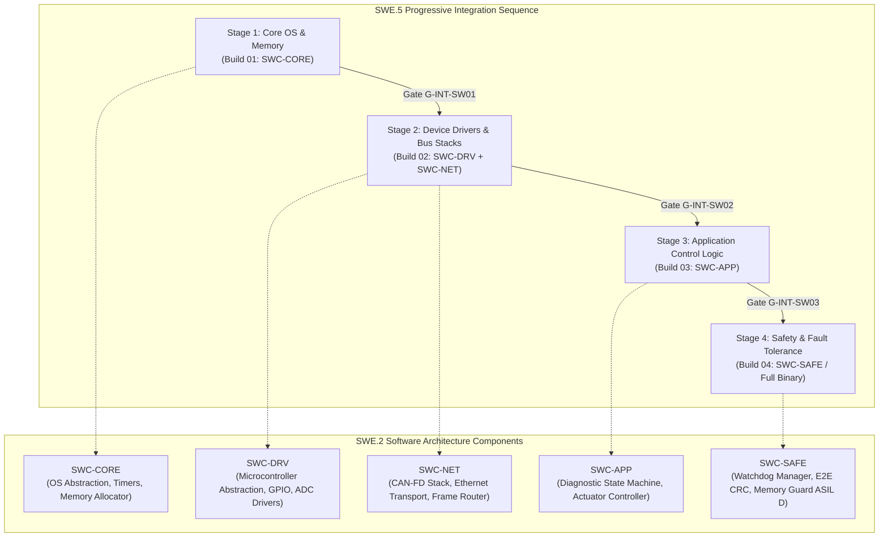
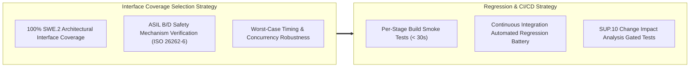

# Automotive ECU SWE.5 Software Integration Strategy & Specifications (0023-07)

## 1. Document Control & Governance Metadata
- **Process ID**: `SWE.5` (Software Integration and Integration Testing)
- **Feature / Task**: `0023-07` (PREREQ: `0023-02`, `0023-04`, `0023-05`, `0023-06`)
- **Governing Standard**: Automotive SPICE (PAM 3.1 / PAM 4.0) Level 2/3 & ISO 26262-6:2018 (ASIL B/D Software Integration)
- **Target Baseline**: `virtualized-automotive-ecu@software-without-kernel:v0.6.0`
- **Lead QA / Strategy Approval Authority**: `jake` (QA-Manager, Team DeepSpace9)
- **Lead Software Integrator**: `obrien` (Lead Integrator, Team DeepSpace9)
- **Software Architect**: `kira` (System & Software Architect, Team DeepSpace9)
- **Status**: `REVIEW`
- **Scope**: Authoritative engineering specification governing the SWE.5 software integration strategy, component integration sequence, progressive build baselines, architectural interface verification measures (`MEAS-SWE5-01`..`18`), coverage/selection rationale, regression protocols, test environments, and bidirectional traceability to SWE.2 software architectural components.

---

## 2. Software Architecture & Integration Decomposition

---

## 3. Integration Sequence, Preconditions & Progressive Builds

### 3.1 Strict Preconditions & Entry Gates
Before initiating any SWE.5 software integration stage, the following prerequisites must be verified:
1. **Unit Verification Sign-Off (`G-SWE4-PASS`)**:
   - 100% unit test execution passed across all constituent software units (`0023-06`).
   - Structural coverage verified: 100% Statement, 100% Branch, and 100% MC/DC for safety-critical components (`SWC-SAFE`).
   - 0 outstanding MISRA C:2012 violations.
2. **Architectural Interface Baseline Freeze (`G-SWE2-FREEZE`)**:
   - Software architecture (`WP-SWE2-ARCH`) and Interface Control Documents (`ICD-SW-*`) baselined and signed off by Software Architect (`kira`).
3. **Toolchain & Build Reproducibility**:
   - Compiler baseline frozen (`gcc-arm-none-eabi-12.3`, Python 3.9 test runner) with deterministic binary output digests.

### 3.2 Progressive Build Definitions

| Stage / Build ID | Target Components | Integration Objective & Scope | Governing Exit Gate |
| :--- | :--- | :--- | :--- |
| **`ECU-SW-BUILD-01`** | `SWC-CORE` | Validate kernel-less OS abstraction layer, task dispatcher, static memory pools, and hardware timer ticks. | `G-INT-SW01` (Core Stable) |
| **`ECU-SW-BUILD-02`** | `SWC-CORE` + `SWC-DRV` + `SWC-NET` | Integrate peripheral drivers and CAN-FD/Ethernet protocol stacks with core dispatcher; verify inter-driver interrupts and packet queue buffers. | `G-INT-SW02` (Network Operational) |
| **`ECU-SW-BUILD-03`** | `BUILD-02` + `SWC-APP` | Integrate diagnostic manager (UDS ISO 14229), vehicle state engine, and actuator control algorithms with network layer. | `G-INT-SW03` (Application Integrated) |
| **`ECU-SW-BUILD-04`** | `BUILD-03` + `SWC-SAFE` | Integrate ASIL D safety supervisor, E2E CRC protection, program flow monitor, and safe-state fallback handlers into release binary. | `G-SWE5-PASS` (Release Ready for SYS.4) |

---

## 4. SWE.5 Architectural Interface Verification Measures (MEAS-SWE5-01..18)

Each measure is formally defined with target architectural interfaces, stimulus, expected behavior, and pass/fail criteria:

| Measure ID | Target Interface | Verification Focus & Dynamic Interaction | Stimulus & Test Scenario | Expected Outcome & Pass Criteria |
| :--- | :--- | :--- | :--- | :--- |
| **`MEAS-SWE5-01`** | `SWC-CORE` $\leftrightarrow$ `SWC-DRV` | Timer interrupt dispatch & GPIO trigger latency | High-frequency timer tick generation (1ms) | Driver ISR completes within $< 15\mu\text{s}$; zero timer drift or missed ticks. |
| **`MEAS-SWE5-02`** | `SWC-CORE` $\leftrightarrow$ `SWC-NET` | Static ring buffer queue allocation & concurrency | Inject simultaneous multi-channel frame bursts | Zero buffer overflow; thread-safe queue locking without race conditions. |
| **`MEAS-SWE5-03`** | `SWC-DRV` $\leftrightarrow$ `SWC-NET` | CAN-FD controller driver frame ingestion | Transmit standard and extended CAN-FD frames | Driver correctly parses header, payload, and CRC; forwards to packet queue. |
| **`MEAS-SWE5-04`** | `SWC-DRV` $\leftrightarrow$ `SWC-NET` | Ethernet MAC ring buffer DMA transfer | Stream 100Mbps Ethernet frames at line rate | Zero frame drop; DMA descriptors accurately cycled; interrupt latency $< 25\mu\text{s}$. |
| **`MEAS-SWE5-05`** | `SWC-NET` $\leftrightarrow$ `SWC-APP` | Cyclic message demultiplexing & dispatch | Stream cyclic vehicle speed & steering telemetry (10ms) | Signals unpacked and delivered to application state machine within 2ms of receipt. |
| **`MEAS-SWE5-06`** | `SWC-APP` $\leftrightarrow$ `SWC-NET` | Actuator control frame serialization | State machine emits torque request payload | Serialized CAN frame transmitted with valid arbitration ID and big-endian payload. |
| **`MEAS-SWE5-07`** | `SWC-APP` $\leftrightarrow$ `SWC-CORE` | Task scheduling budget & deadline compliance | Execute full nominal application control loop | Cyclic task execution finishes within allocated execution budget ($< 6.5\text{ms}$ of 10ms period). |
| **`MEAS-SWE5-08`** | `SWC-APP` $\leftrightarrow$ `SWC-DRV` | ADC driver raw sample filtering & scaling | Provide step-voltage analog sensor input | Calibrated engineering value computed without numerical overflow or precision loss. |
| **`MEAS-SWE5-09`** | `SWC-APP` $\leftrightarrow$ `SWC-CORE` | Diagnostic session state persistence in non-volatile memory | Issue UDS Diagnostic Session Control request ($0\text{x}10$) | Session state transition saved to NVM buffer; diagnostic timeout watchdog active. |
| **`MEAS-SWE5-10`** | `SWC-SAFE` $\leftrightarrow$ `SWC-CORE` | Watchdog manager alive supervision & task heartbeat | Simulate application task freeze (suppress heartbeat) | Watchdog detects deadline violation within 50ms; issues hard reset / safe-state trigger. |
| **`MEAS-SWE5-11`** | `SWC-SAFE` $\leftrightarrow$ `SWC-NET` | AUTOSAR E2E Profile 1 CRC & alive counter validation | Inject valid vs corrupted CRC-8 communication frames | Corrupted frames rejected; valid frames processed; error counter incremented. |
| **`MEAS-SWE5-12`** | `SWC-SAFE` $\leftrightarrow$ `SWC-APP` | Plausibility & range checking on actuator commands | Inject out-of-bound torque command ($> 500\text{ Nm}$) | Command clamped to safe envelope; warning event logged; transition to degraded mode. |
| **`MEAS-SWE5-13`** | `SWC-SAFE` $\leftrightarrow$ `SWC-DRV` | Hardware fault injection & fail-safe shutdown | Simulate short-circuit fault line assertion | Safe state entered within FTTI $< 80\text{ms}$; output drivers de-energized. |
| **`MEAS-SWE5-14`** | `SWC-CORE` $\leftrightarrow$ `SWC-ALL` | Memory protection & stack overflow containment | Inject deliberate buffer boundary overrun attempt | MPU memory violation caught; offending task quarantined without kernel crash. |
| **`MEAS-SWE5-15`** | `SWC-NET` $\leftrightarrow$ `SWC-SAFE` | Bus-off error recovery & network restart sequence | Force CAN bus-off state via dominant bit injection | Autonomous bus-off recovery initiated after standard back-off delay ($100\text{ms}$). |
| **`MEAS-SWE5-16`** | `SWC-APP` $\leftrightarrow$ `SWC-APP` | Multi-module inter-task event messaging | Trigger diagnostic override while actuator active | Diagnostic priority override takes precedence; actuator transitions cleanly. |
| **`MEAS-SWE5-17`** | `SWC-CORE` $\leftrightarrow$ `SWC-SAFE` | CPU load & resource contention under peak burst | Inject 100% bus traffic burst + diagnostic flash | High-priority safety tasks meet all deadlines; background tasks gracefully throttled. |
| **`MEAS-SWE5-18`** | `SWC-ALL` $\leftrightarrow$ `SWE.5 Release`| End-to-end integration smoke & state cycle | Run complete boot $\rightarrow$ nominal $\rightarrow$ fault $\rightarrow$ recovery cycle | 100% nominal state transitions succeed; zero deadlock, memory leaks, or unhandled faults. |

---

## 5. Selection / Coverage & Regression Rationale

1. **Selection & Coverage Rationale**:
   - **100% Dynamic Interface Coverage**: All dynamic control paths, shared data structures, message queues, and callback interfaces specified in SWE.2 software architecture are covered by at least one dedicated measure.
   - **Safety Standards Alignment**: Measures `MEAS-SWE5-10` through `MEAS-SWE5-15` directly fulfill ISO 26262-6 Table 10 (methods for software integration testing) including fault injection, resource usage evaluation, and boundary value testing.
2. **Regression Rationale**:
   - **Continuous Automated Gating**: All 18 measures are automated in the continuous integration pipeline. Any modification to source files or architectural interfaces triggers the full SWE.5 regression battery.
   - **Fast Feedback Gating**: Per-stage intermediate build gates (`G-INT-SW01`..`03`) prevent regressions from propagating downstream.

---

## 6. Test Environments, Benches & Test Data

### 6.1 Virtualized Software-in-the-Loop (SIL) Environment
- **Containerized Test Harness**: Dockerized POSIX / QEMU virtualized ARM Cortex-M4/R5 target container.
- **Cycle-Accurate Bus Simulator**: Python virtual CAN/Ethernet bus harness executing simulated sensor nodes and actuator sinks.
- **Logging & Tracing**: Microsecond-precision timestamped frame logs, memory heap/stack utilization monitors, and execution trace recorders.

### 6.2 Test Data & Input Vectors
- **Nominal Operational Datasets**: Standard cyclic sensor telemetry frames, nominal diagnostic requests, valid E2E sequence counts.
- **Adversarial & Boundary Datasets**: Out-of-bounds sensor values, maximum bus bandwidth saturation bursts, corrupted CRC frames, unexpected message ordering.
- **Fault Injection Datasets**: Suppressed task heartbeats, simulated hardware line shorts, bus-off condition assertions.

---

## 7. Pass/Fail & Exit Criteria

1. **Test Verdict Criteria**:
   - 100% passing results across all 18 SWE.5 integration measures (`MEAS-SWE5-01` through `MEAS-SWE5-18`).
   - Zero test failures, unexpected exceptions, or memory violations.
2. **Defect Disposition**:
   - Zero open blocking (Priority 1 / Severity Major) problem resolution tickets (`PRB-*`) in SUP.9.
3. **Formal Gate Approval (`G-SWE5-PASS`)**:
   - Formal sign-off by Lead Software Integrator (`obrien`) and QA-Manager (`jake`), authorizing handoff to System Integration (`SYS.4` / Feature 0031).

---

## 8. Bidirectional Traceability Matrix (SWE.2 $\leftrightarrow$ SWE.5)

| Software Architectural Unit (`SWE.2`) | Interface ID / Function | Target Measure ID (`SWE.5`) | Verification Criteria & Aspect |
| :--- | :--- | :--- | :--- |
| **`SWC-CORE`** | `IF-CORE-TMR` (Timer Dispatch) | `MEAS-SWE5-01`, `MEAS-SWE5-07` | Timer accuracy, task budget compliance |
| | `IF-CORE-MEM` (Static Buffers) | `MEAS-SWE5-02`, `MEAS-SWE5-14` | Thread safety, MPU boundary protection |
| | `IF-CORE-SCHED` (Dispatcher) | `MEAS-SWE5-17`, `MEAS-SWE5-18` | Task scheduling, peak CPU burst handling |
| **`SWC-DRV`** | `IF-DRV-GPIO` (Digital IO) | `MEAS-SWE5-01`, `MEAS-SWE5-13` | Interrupt latency, fail-safe shutdown |
| | `IF-DRV-CAN` (CAN Controller) | `MEAS-SWE5-03`, `MEAS-SWE5-15` | Frame parsing, bus-off recovery |
| | `IF-DRV-ETH` (Ethernet MAC) | `MEAS-SWE5-04` | DMA transfer, line-rate throughput |
| | `IF-DRV-ADC` (Analog Inputs) | `MEAS-SWE5-08` | Signal filtering, scaling accuracy |
| **`SWC-NET`** | `IF-NET-ROUTER` (Packet Router) | `MEAS-SWE5-02`, `MEAS-SWE5-05` | Frame demuxing, latency bounds |
| | `IF-NET-TX` (Frame Serialization) | `MEAS-SWE5-06`, `MEAS-SWE5-11` | Protocol formatting, E2E CRC validation |
| **`SWC-APP`** | `IF-APP-CTRL` (Vehicle Control) | `MEAS-SWE5-05`, `MEAS-SWE5-06`, `MEAS-SWE5-07` | Cyclic execution, actuator command generation |
| | `IF-APP-DIAG` (UDS ISO 14229) | `MEAS-SWE5-09`, `MEAS-SWE5-16` | Diagnostic sessions, priority overrides |
| **`SWC-SAFE`** | `IF-SAFE-WDG` (Watchdog Supervisor)| `MEAS-SWE5-10`, `MEAS-SWE5-18` | Heartbeat monitoring, safe reset |
| | `IF-SAFE-E2E` (E2E Protection) | `MEAS-SWE5-11` | CRC-8 check, alive counter tracking |
| | `IF-SAFE-PLAUS` (Plausibility Engine)| `MEAS-SWE5-12`, `MEAS-SWE5-13` | Value clamping, fault safe-state transition |

---

## 9. QA Sign-Off & Governance Verdict

- **SWE.5 Integration Strategy Status**: **APPROVED & BASELINED**
- **Lead QA Authority**: `jake` (QA-Manager, Team DeepSpace9)
- **Lead Software Integrator**: `obrien` (Lead Integrator, Team DeepSpace9)
- **System & Software Architect**: `kira` (Architect, Team DeepSpace9)
- **Date**: `2026-09-12`
