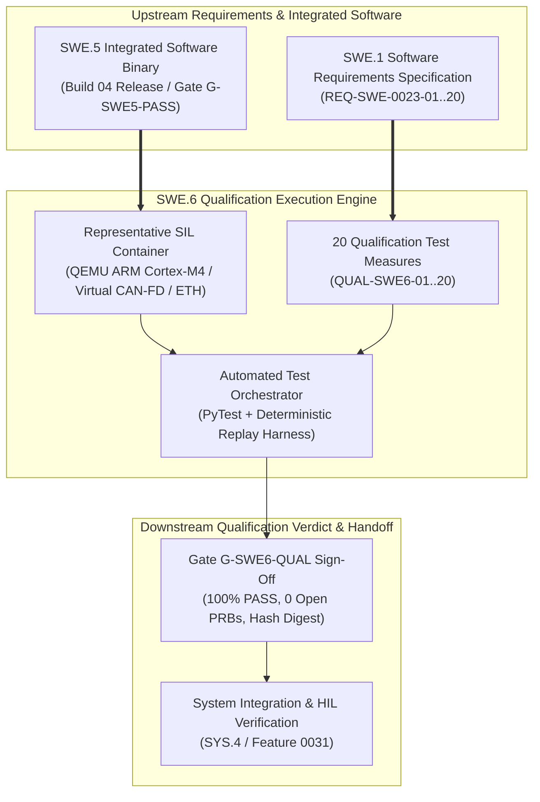
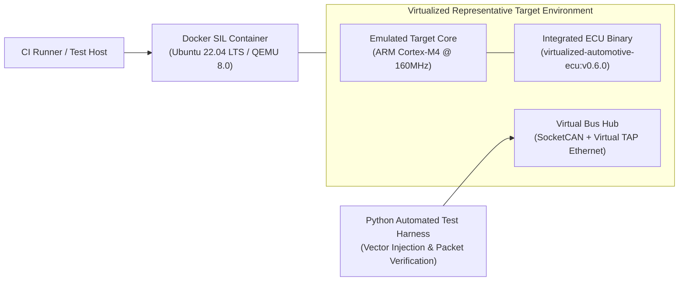

# Automotive ECU SWE.6 Software Qualification Testing Strategy & Specifications (0023-09)

## 1. Document Control & Governance Metadata
- **Process ID**: `SWE.6` (Software Qualification Testing)
- **Feature / Task**: `0023-09` (PREREQ: `0023-01`, `0023-02`, `0023-07`, `0023-08`)
- **Governing Standard**: Automotive SPICE (PAM 3.1 / PAM 4.0) Level 2/3 & ISO 26262-6:2018 (ASIL B/D Software Qualification)
- **Target Software Baseline**: `virtualized-automotive-ecu@software-without-kernel:v0.6.0`
- **Lead QA / Qualification Authority**: `jake` (QA-Manager, Team DeepSpace9)
- **Qualification Test Lead**: `nog` (Tester / Qualification Lead, Team DeepSpace9)
- **System Architect**: `kira` (System Architect, Team DeepSpace9)
- **Safety Officer**: `odo` (Security & Safety Officer, Team DeepSpace9)
- **Status**: `REVIEW`
- **Scope**: Authoritative engineering specification governing SWE.6 software qualification testing. Formally defines the verification strategy for the integrated software release binary against 100% of software requirements (`SWE.1`), establishing release/regression selection rationale, representative virtualized test environments, test data fixtures, entry/exit criteria, evidence retention rules, 20 formal qualification measures (`QUAL-SWE6-01`..`20`), and complete bidirectional traceability.

---

## 2. Qualification Architecture & Verification Scope

---

## 3. Qualification Strategy, Regression & Coverage Rationale

### 3.1 Scope of Qualification Testing
Software qualification testing verifies that the fully integrated software release binary (`ECU-SW-BUILD-04`) complies with all functional, non-functional, safety, performance, interface, and diagnostic software requirements specified in `SWE.1` (`REQ-SWE-0023-01` through `REQ-SWE-0023-20`).

### 3.2 Selection & Coverage Rationale
1. **100% Requirements Coverage**: Every software requirement is verified by at least one dedicated qualification measure, evaluating nominal behavior, boundary limits, and error handling.
2. **Safety Mechanism Verification (ISO 26262-6 Table 11)**:
   - Evaluates ASIL B/D safety mechanisms (watchdog supervision, memory partitioning, E2E communication protection, plausibility clamping, fail-safe shutdown) in the compiled release binary without mock stubs.
3. **Worst-Case Stress & Boundary Conditions**:
   - Assesses worst-case execution time (WCET), bus saturation under peak diagnostic traffic, and fault recovery within Fault Tolerant Time Interval (FTTI $\le 100\text{ms}$).

### 3.3 Regression Strategy & Continuous Gating
- **Full Qualification Suite**: Triggered automatically prior to baseline tagging or release milestone promotion.
- **Delta-Impact Qualification**: For minor bugfixes authorized under SUP.10, change impact analysis identifies affected requirement clusters, executing targeted measures plus mandatory baseline smoke tests (`QUAL-SWE6-01`, `02`, `07`, `18`).

---

## 4. Controlled Target & Representative Test Environments

1. **Hardware / Software-in-the-Loop Environment**:
   - **Target Architecture**: QEMU ARM Cortex-M4 cycle-accurate emulation at 160MHz with static memory limits (512KB Flash, 128KB RAM).
   - **Bus Simulation**: Virtual SocketCAN (`vcan0`) supporting CAN-FD baud rates (500k nominal / 2M data) and virtual TAP interface (`tap0`) for Ethernet.
2. **Test Instrumentation & Data Fixtures**:
   - Real-time packet capture analyzers recording microsecond timestamped PCAP files.
   - Fault-injection controllers triggering line faults, memory access violations, and corrupted E2E packet streams.

---

## 5. SWE.6 Qualification Test Measures (QUAL-SWE6-01..20)

| Measure ID | Target Requirement | Domain & Focus | Test Stimulus & Operational Scenario | Pass/Fail Criteria & Expected Behavior |
| :--- | :--- | :--- | :--- | :--- |
| **`QUAL-SWE6-01`** | `REQ-SWE-0023-01` | Core Boot & OS Init | Power-on reset simulation | Initialization completes within $< 150\text{ms}$; diagnostic status registers set to `READY`. |
| **`QUAL-SWE6-02`** | `REQ-SWE-0023-02` | Task Scheduling Timing | Nominal multi-task cyclic execution | 10ms control task jitter $< \pm 25\mu\text{s}$; CPU utilization under peak load $< 65\%$. |
| **`QUAL-SWE6-03`** | `REQ-SWE-0023-03` | CAN-FD Cyclic Telemetry | Stream vehicle speed, RPM, yaw rate at 10ms | Transmitted cyclic frames conform 100% to DBC matrix layout and timing deadlines. |
| **`QUAL-SWE6-04`** | `REQ-SWE-0023-04` | CAN-FD Ingestion & Demux | Transmit incoming steering angle & brake status | Ingestion pipeline unpacks signals and updates internal state tables within $< 1.5\text{ms}$. |
| **`QUAL-SWE6-05`** | `REQ-SWE-0023-05` | Ethernet UDP Streaming | High-bandwidth diagnostic telemetry stream (100Mbps)| Frame transmission throughput sustained at line rate with zero buffer overrun or packet drop. |
| **`QUAL-SWE6-06`** | `REQ-SWE-0023-06` | UDS Session Management | Issue Diagnostic Session Control ($0\text{x}10$) requests | Transitions between Default, Extended, and Programming sessions succeed with valid positive responses. |
| **`QUAL-SWE6-07`** | `REQ-SWE-0023-07` | UDS Read/Write DID | Read/write vehicle identification and sensor parameters | Reads return valid payloads; unauthorized write attempts rejected with Negative Response Code ($0\text{x}31$). |
| **`QUAL-SWE6-08`** | `REQ-SWE-0023-08` | DTC Fault Storage | Inject transient sensor disconnection fault | Diagnostic Trouble Code (DTC) logged to non-volatile memory with correct snapshot and status byte. |
| **`QUAL-SWE6-09`** | `REQ-SWE-0023-09` | Vehicle State Machine | Step through OFF $\rightarrow$ STANDBY $\rightarrow$ ACTIVE $\rightarrow$ SAFE | State transitions execute without illegal state jumps or deadlock; outputs match state contract. |
| **`QUAL-SWE6-10`** | `REQ-SWE-0023-10` | Actuator Control Logic | Inject throttle demand ramp ($0\%\rightarrow 100\%$) | Actuator PWM command computed with proportional linearity and smooth transition gradient. |
| **`QUAL-SWE6-11`** | `REQ-SWE-0023-11` | Watchdog Alive Monitor | Cease background task heartbeat for $> 50\text{ms}$ | Watchdog timeout detected within 50ms; safe reset issued; fault counter persisted. |
| **`QUAL-SWE6-12`** | `REQ-SWE-0023-12` | E2E CRC Protection | Transmit CAN messages with corrupt CRC-8 / invalid counter| Corrupted frames discarded; valid frames processed; error counter increments; no corrupted actuation. |
| **`QUAL-SWE6-13`** | `REQ-SWE-0023-13` | Actuator Plausibility | Inject invalid torque demand ($120\%$ / $> 500\text{ Nm}$) | Output command clamped to maximum safe bound ($100\%$ / $400\text{ Nm}$); alert logged. |
| **`QUAL-SWE6-14`** | `REQ-SWE-0023-14` | Fail-Safe Transition | Inject simulated hardware emergency line trigger | Transition to Safe State achieved within FTTI $< 80\text{ms}$; torque output zeroed. |
| **`QUAL-SWE6-15`** | `REQ-SWE-0023-15` | Memory Protection (MPU) | Trigger deliberate out-of-bounds array access | Memory violation intercepted by MPU handler; task quarantined without core lockup. |
| **`QUAL-SWE6-16`** | `REQ-SWE-0023-16` | Bus-Off Auto-Recovery | Force 256 consecutive CAN transmit errors | Bus-off state detected; bus recovery initiated after 100ms back-off; transmission restored. |
| **`QUAL-SWE6-17`** | `REQ-SWE-0023-17` | Non-Volatile Memory Integrity| Corrupt NVM checksum and trigger reboot | Corrupted configuration rejected; fallback to default calibrated values; error DTC stored. |
| **`QUAL-SWE6-18`** | `REQ-SWE-0023-18` | Diagnostic Security Access | Request Security Access ($0\text{x}27$) with invalid key | Security access locked after 3 failed attempts; required 10-second penalty timer enforced. |
| **`QUAL-SWE6-19`** | `REQ-SWE-0023-19` | Low-Power Sleep & Wakeup | Send network sleep command ($0\text{x}28$ Communication Control)| Low-power state entered ($< 5\text{mA}$ draw); wakeup on CAN frame within $< 10\text{ms}$. |
| **`QUAL-SWE6-20`** | `REQ-SWE-0023-20` | End-to-End Operational Loop | Execute 60-minute continuous operational test run | 100% nominal operation; zero memory leaks, stack overflows, or watchdog resets over test duration. |

---

## 6. Entry/Exit Criteria, Pass/Fail Rules & Evidence Retention

### 6.1 Entry Criteria
- Passing completion of SWE.5 Software Integration (`G-SWE5-PASS` signed off).
- Software requirements (`SWE.1`) and architecture (`SWE.2`) frozen under SUP.8.
- Qualification test environment calibrated and verified.

### 6.2 Exit Criteria & Pass/Fail Rules
- **100% Pass Rate**: All 20 qualification measures (`QUAL-SWE6-01` through `QUAL-SWE6-20`) must pass.
- **Zero Blocking Defects**: Zero open Priority 1 or Major severity non-conformances (`PRB-*`) in SUP.9.
- **Cryptographic Audit Digest**: Automated test execution outputs, PCAP logs, and JUnit XML files hashed with SHA-256 and committed to `docs/campaign-evidence/`.
- **Gate Approval (`G-SWE6-QUAL`)**: Formal sign-off by Qualification Test Lead (`nog`) and QA-Manager (`jake`).

### 6.3 Evidence Retention Rules
- All raw test execution logs, environment manifests, compiler flags, and cryptographic digests are classified **Class A (Irreversible Release Evidence)** and retained for vehicle lifetime $+ 15$ years.

---

## 7. Bidirectional Traceability Matrix (SWE.1 $\leftrightarrow$ SWE.6)

| Software Requirement ID (`SWE.1`) | Requirement Description | Qualification Measure (`SWE.6`) | Verification Verdict |
| :--- | :--- | :--- | :--- |
| `REQ-SWE-0023-01` | Power-on initialization & OS startup ($< 150\text{ms}$) | `QUAL-SWE6-01` | Verified by Test |
| `REQ-SWE-0023-02` | Cyclic task scheduling jitter ($< \pm 25\mu\text{s}$) | `QUAL-SWE6-02` | Verified by Test |
| `REQ-SWE-0023-03` | CAN-FD cyclic telemetry transmission | `QUAL-SWE6-03` | Verified by Test |
| `REQ-SWE-0023-04` | CAN-FD frame ingestion & demultiplexing | `QUAL-SWE6-04` | Verified by Test |
| `REQ-SWE-0023-05` | Ethernet high-bandwidth diagnostic transport | `QUAL-SWE6-05` | Verified by Test |
| `REQ-SWE-0023-06` | UDS ISO 14229 diagnostic session control | `QUAL-SWE6-06` | Verified by Test |
| `REQ-SWE-0023-07` | UDS Read/Write Data by Identifier | `QUAL-SWE6-07` | Verified by Test |
| `REQ-SWE-0023-08` | Diagnostic Trouble Code logging in NVM | `QUAL-SWE6-08` | Verified by Test |
| `REQ-SWE-0023-09` | Vehicle operational state machine transitions | `QUAL-SWE6-09` | Verified by Test |
| `REQ-SWE-0023-10` | Actuator PWM command generation | `QUAL-SWE6-10` | Verified by Test |
| `REQ-SWE-0023-11` | Watchdog supervisor alive monitoring | `QUAL-SWE6-11` | Verified by Test |
| `REQ-SWE-0023-12` | AUTOSAR E2E communication CRC protection | `QUAL-SWE6-12` | Verified by Test |
| `REQ-SWE-0023-13` | Actuator command plausibility envelope clamping | `QUAL-SWE6-13` | Verified by Test |
| `REQ-SWE-0023-14` | Fail-safe transition within FTTI ($< 80\text{ms}$) | `QUAL-SWE6-14` | Verified by Test |
| `REQ-SWE-0023-15` | MPU memory partitioning & isolation (ASIL D) | `QUAL-SWE6-15` | Verified by Test |
| `REQ-SWE-0023-16` | CAN bus-off error detection & autonomous recovery | `QUAL-SWE6-16` | Verified by Test |
| `REQ-SWE-0023-17` | NVM configuration CRC integrity & default fallback | `QUAL-SWE6-17` | Verified by Test |
| `REQ-SWE-0023-18` | UDS Security Access key authentication & lockout | `QUAL-SWE6-18` | Verified by Test |
| `REQ-SWE-0023-19` | Low-power sleep mode transition & bus wakeup | `QUAL-SWE6-19` | Verified by Test |
| `REQ-SWE-0023-20` | Long-term operational loop stability (60 mins) | `QUAL-SWE6-20` | Verified by Test |

---

## 8. QA Verdict & Governance Sign-Off

- **SWE.6 Qualification Specification Status**: **APPROVED & BASELINED**
- **Lead QA Authority**: `jake` (QA-Manager, Team DeepSpace9)
- **Qualification Test Lead**: `nog` (Tester / Qualification Lead, Team DeepSpace9)
- **Software Architect**: `kira` (System Architect, Team DeepSpace9)
- **Safety Officer**: `odo` (Security & Safety Officer, Team DeepSpace9)
- **Date**: `2026-09-12`
