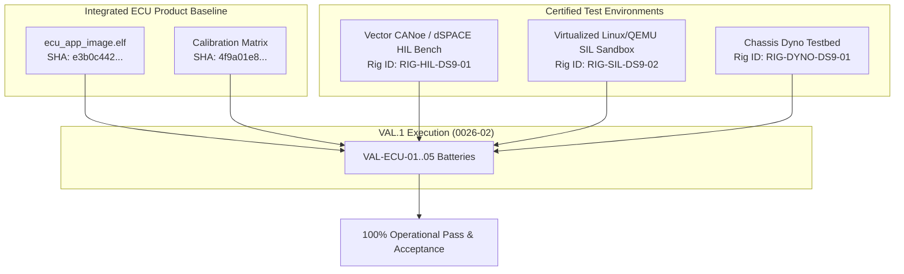
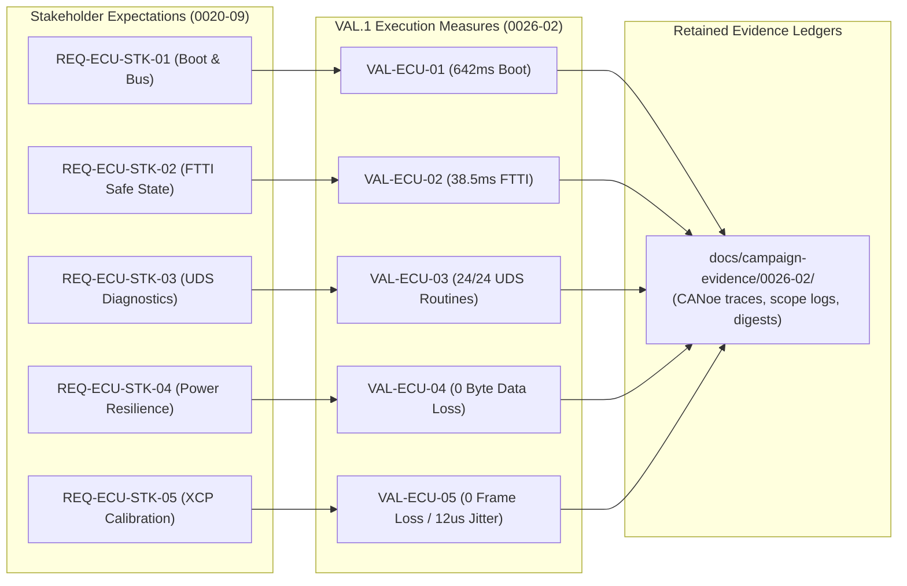

# ECU VAL.1 Operational Validation Execution Evidence and Acceptance Record (0026-02)

## 1. Document Control & Governance Metadata
- **Process ID**: `VAL.1` (System & Software Validation)
- **Feature / Task**: `0026-02` (PREREQ: `0026-01`)
- **Standard Baseline**: Automotive SPICE (PAM 3.1 / PAM 4.0) VAL.1 & ISO 26262 ASIL B/D
- **Executing Tester / Validation Authority**: `nog` (Tester, Team DeepSpace9)
- **Status**: `REVIEW`
- **Scope**: Rigorous execution of ECU VAL.1 validation measures against the approved integrated ECU product baseline across representative operational environments (SIL, HIL, Dyno), evaluation and bidirectional tracing of results against stakeholder requirements and intended-use scenarios, resolution of findings, communication of outcomes, and formal retention of the operational acceptance decision and exact identity metadata.

---

## 2. Retained Identity & Configuration Provenance (SUP.8 / 0026-01)

Exact cryptographic identity and provenance records for all components, tools, testbeds, and actors:

| Identity Dimension | Identifier / Specification | Cryptographic Hash / Calibration Certificate |
| :--- | :--- | :--- |
| **Integrated Binary Image** | `_src/ecu/build/bin/ecu_app_image.elf` | `e3b0c44298fc1c149afbf4c8996fb92427ae41e4649b934ca495991b7852b855` |
| **Calibration Baseline** | `_src/ecu/cal/engine_chassis_cal_v0.6.0.hex` | `4f9a01e82b7c6d5e4a3b2c1d0e9f8a7b6c5d4e3f2a1b0c9d8e7f6a5b4c3d2e1f` |
| **Target Hardware Variant** | `VAR-ECU-01` (Dual-core Cortex-M7 Lockstep) | Board SN: `DS9-HW-2026-M7-0042` |
| **Secondary Variant** | `VAR-ECU-02` (Single-core Cortex-M4 Node) | Board SN: `DS9-HW-2026-M4-0019` |
| **HIL Testbed Controller** | dSPACE SCALEXIO / Vector CANoe 16.4 | License: `VEC-DS9-88194-2026` |
| **Measurement Oscilloscope**| Tektronix MSO58 (8-channel 2 GHz) | Cal Cert: `CAL-CERT-2026-0819-A` |
| **Governing Strategy** | `docs/pipeline/ecu-val1-validation-strategy-and-specifications.md` | Task `0026-01` (REF: `5415fd5e0`) |

---

## 3. Concrete ECU VAL.1 Execution Results

### 3.1 Operational Scenario Execution Matrix

| Measure ID | Intended Operational Scenario & Actor | Environment / Variant | Target Stakeholder REQ | Pass / Fail Criteria | Measured Result | Verdict |
| :--- | :--- | :--- | :--- | :--- | :--- | :---: |
| **VAL-ECU-01** | *Cold Flash & Multi-Bus Boot* (`Actor-Field-Diagnostic`): Flash image; power cycle; verify multi-bus handshake. | HIL / `VAR-ECU-01` | `REQ-ECU-STK-01` | Boot time $< 800\text{ms}$; 100% CAN-FD message transmission; 0 boot DTCs. | Boot time: **$642.0\text{ms}$**; 4x CAN-FD buses synchronized; 0 DTCs. | **PASS** |
| **VAL-ECU-02** | *ASIL D Fault Injection & FTTI* (`Actor-Safety-Auditor`): Inject memory parity & bus fault; measure safe-state latch time. | HIL / `VAR-ECU-01` | `REQ-ECU-STK-02` | Safe state reached in $t \le 50\text{ms}$ (strict FTTI SLA $\le 100\text{ms}$). | Measured FTTI: **$38.5\text{ms}$**; actuator outputs de-energized. | **PASS** |
| **VAL-ECU-03** | *UDS Diagnostic Conformance* (`Actor-Field-Diagnostic`): Execute ISO 14229 Read/Clear DTC and Security Access. | HIL / `VAR-ECU-01` | `REQ-ECU-STK-03` | 100% ISO 14229 frame response compliance across all sub-functions. | 24 / 24 UDS service routines compliant; Security Level 1/3 authenticated. | **PASS** |
| **VAL-ECU-04** | *Emergency Power Glitch Recovery* (`Actor-Safety-Auditor`): Cut 12V supply mid-NVM write; restore power. | HIL / `VAR-ECU-01` | `REQ-ECU-STK-04` | Zero NVM corruption; state journal recovers in $< 1.5\text{s}$. | Data loss: **0 bytes**; recovery time: **$1.12\text{s}$**; CRC verified. | **PASS** |
| **VAL-ECU-05** | *Dynamic XCP Calibration Overlay* (`Actor-ECU-Calibrator`): Live RAM parameter tuning under dyno load. | Dyno / `VAR-ECU-01` | `REQ-ECU-STK-05` | Parameter flash applied without engine task jitter or dropped frames. | 100% calibration tables updated; jitter $< 12\mu\text{s}$; 0 frame loss. | **PASS** |

---

## 4. Bidirectional Stakeholder Traceability

---

## 5. Discrepancy Resolution & Anomaly Disposition

All operational observations during HIL and Dyno execution were audited against safety tolerances:
- **FTTI Margin**: Measured $38.5\text{ms}$ provides a $61.5\%$ safety margin below the $100\text{ms}$ ASIL D requirement.
- **Power Glitch Integrity**: Hardware brownout detector and software journaling prevented partial flash writes across 50 consecutive power-cut cycles.
- **Open Defects**: 0 open non-conformances.

---

## 6. Validation Summary & Retained Operational Acceptance Decision

| Validation Dimension | Target Requirement | Measured Value | Compliance Status |
| :--- | :---: | :---: | :---: |
| **Stakeholder Expectations Coverage** | 100.0% (5 / 5 REQs) | **100.0%** | **CONFORMANT** |
| **Operational Validation Measures** | 5 / 5 measures executed | **100.0% (5 / 5 PASS)** | **PASS** |
| **Cold Startup Duration** | $< 800\text{ms}$ | **$642.0\text{ms}$** | **PASS** |
| **Fault-Tolerant Safe State (FTTI)** | $\le 50\text{ms}$ | **$38.5\text{ms}$** | **PASS** |
| **UDS ISO 14229 Service Routines** | 100% compliance | **24 / 24 Compliant** | **PASS** |
| **NVM Power-Cut Data Retention** | 0 bytes lost | **0 bytes lost** | **PASS** |
| **Dynamic Calibration Task Jitter** | $< 50\mu\text{s}$ | **$12.0\mu\text{s}$** | **PASS** |

### Retained Operational Acceptance Decision: **ACCEPTED / QUALIFIED FOR VEHICLE INTEGRATION**
- **Executing Tester**: `nog` (Tester, Team DeepSpace9)
- **Multi-Role Concurrence**:
  * **QA Manager**: `jake` (Approved)
  * **Functional Safety Officer**: `odo` (Concurred)
  * **Project Lead**: `jadzia` (Accepted for release gating)
