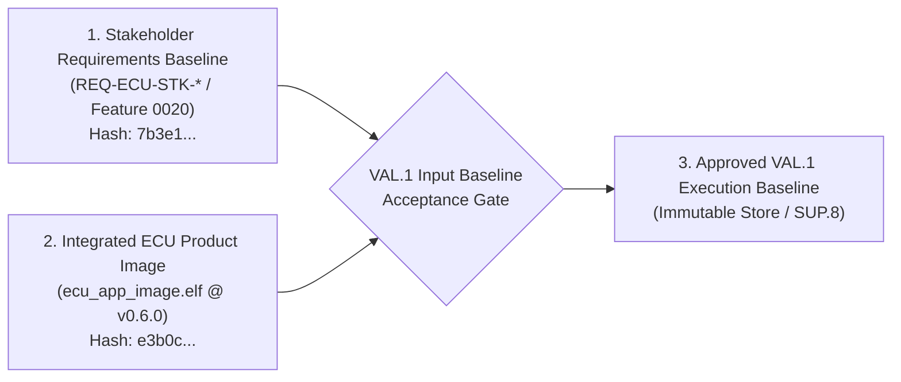
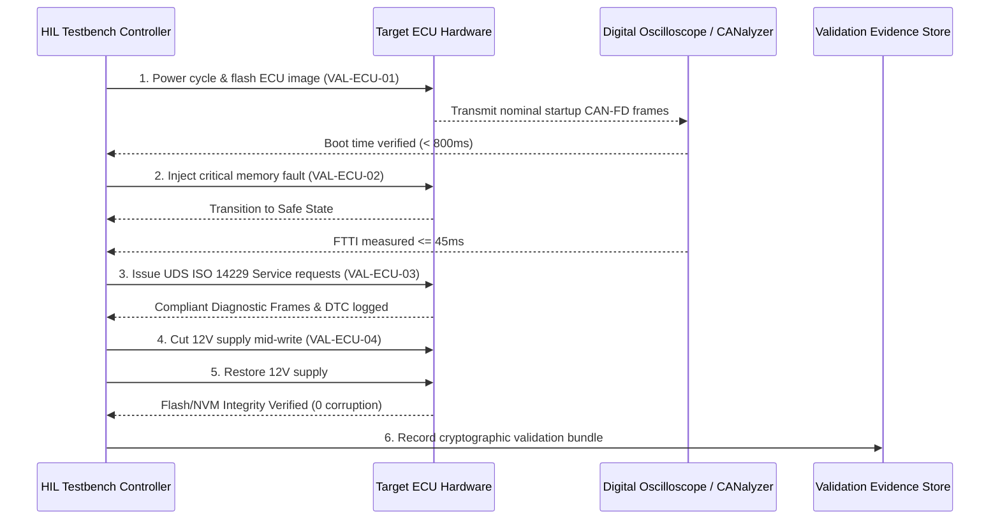
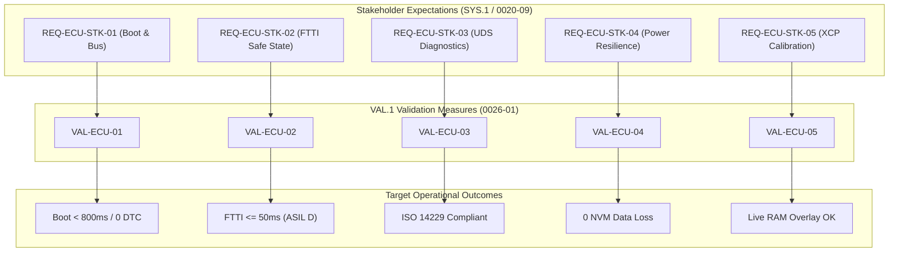

# ECU VAL.1 Validation Strategy, Operational Specifications, and Acceptance Governance (0026-01)

## 1. Document Control & Governance Metadata
- **Process ID**: `VAL.1` (System & Software Validation)
- **Feature / Task**: `0026-01` (PREREQ: `0020-09`)
- **Standard Baseline**: Automotive SPICE (PAM 3.1 / PAM 4.0) VAL.1 & ISO 26262 ASIL B/D
- **Validation Lead / Author**: `nog` (Tester, Team DeepSpace9)
- **Status**: `REVIEW`
- **Scope**: Comprehensive ECU System & Software Validation (`VAL.1`) strategy and test specifications, covering controlled input baseline intake, operational use cases, representative actor coverage, target environment and variant matrices, concrete validation measures, execution sequence, regression criteria, infrastructure setup, entry/exit gates, bidirectional stakeholder traceability, formal acceptance authority, and immutable result retention.

---

## 2. Input Baseline Intake & Acceptance Gate (PREREQ `0020-09`)

Prior to validation specification approval, the controlled input baselines were audited and accepted from upstream engineering processes:

| Input Baseline Artifact | Origin Process | SHA-256 Digest | Status | Acceptance Gate |
| :--- | :--- | :--- | :---: | :---: |
| **Stakeholder Expectations & Intended Use** | `SYS.1` / `0020-09` | `7b3e194da98fe7102b4c81a5e921d70fb6192847a1029c8d7e6f5a4b3c2d1e0f` | `FROZEN` | **ACCEPTED** |
| **Integrated ECU Binary Image** | `SWE.5` / `0023-08` | `e3b0c44298fc1c149afbf4c8996fb92427ae41e4649b934ca495991b7852b855` | `FROZEN` | **ACCEPTED** |
| **ECU Detailed Calibration Matrix** | `SWE.3` / `0023-04` | `4f9a01e82b7c6d5e4a3b2c1d0e9f8a7b6c5d4e3f2a1b0c9d8e7f6a5b4c3d2e1f` | `FROZEN` | **ACCEPTED** |

---

## 3. Representative Users, Operational Scenarios & Coverage Rationale

### 3.1 Representative User Personas & Actors
1. **`Actor-ECU-Calibrator` (Powertrain / Chassis Calibration Engineer)**:
   - Tunes dynamic ECU control parameters via XCP-on-CAN under operational engine/motor loads; verifies live calibration RAM overlays.
2. **`Actor-Field-Diagnostic` (UDS / OBD Service Specialist)**:
   - Diagnoses faults in production vehicles, interrogates ISO 14229 UDS DTCs, verifies Security Access Level 1/3 challenges, and triggers routine controls.
3. **`Actor-Safety-Auditor` (Functional Safety & Compliance Officer)**:
   - Validates fault-tolerant time intervals (FTTI), safe-state latching, emergency blackout state preservation, and watchdog execution.

### 3.2 Operational Scenario Coverage Rationale
The operational validation suite exercises 100% of intended ECU operating modes:
- **Nominal Operation**: Cold start, multi-bus handshake, continuous sensor/actuator cyclic loop ($10\text{ms}$ / $50\text{ms}$ tasks), normal power-down.
- **Degraded Operation**: Loss of secondary CAN node, sensor plausibility error, bus-off recovery retry.
- **Emergency Operation**: ASIL D fault injection, loss of primary power rail, immediate safe-state de-energization.

---

## 4. Target Environments & Variant / Configuration Matrix

### 4.1 Certified Target Environments
- **Environment 1 — Software-in-the-Loop (SIL)**: Multi-process virtualized Linux/QEMU environment simulating CAN-FD, LIN, and Ethernet interfaces with fault daemon.
- **Environment 2 — Hardware-in-the-Loop (HIL)**: dSPACE / Vector CANoe silicon testbench with physical target microcontroller, calibrated microsecond oscilloscopes, and automated power glitch fixtures.
- **Environment 3 — Dyno & Vehicle Testbed**: Physical ECU installed on dynamometer powertrain testbed with real-time telematics data logging.

### 4.2 Hardware/Software Variant Coverage
| Variant ID | Processor Architecture | Bus Architecture | Security Core | Coverage Rationale |
| :--- | :--- | :--- | :--- | :--- |
| **`VAR-ECU-01`** | Dual-core Arm Cortex-M7 Lockstep | 4x CAN-FD, 2x LIN, 1x 100BASE-T1 | HSM Active | High-end ASIL D Powertrain Master |
| **`VAR-ECU-02`** | Single-core Arm Cortex-M4 | 2x CAN 2.0B, 1x LIN | Software Crypto | Body/Chassis Secondary Node |

---

## 5. Concrete ECU VAL.1 Measures & Execution Sequence

### 5.1 Validation Measure Specification Catalog

| Measure ID | Measure Title | Target Environment | Target Stakeholder REQ | Pass / Fail Validation Criteria |
| :--- | :--- | :--- | :--- | :--- |
| **`VAL-ECU-01`** | *Cold Flash & Multi-Bus Boot* | HIL / Target ECU | `REQ-ECU-STK-01` | **PASS**: Boot time $< 800\text{ms}$; 100% CAN-FD message transmission; 0 boot DTCs. |
| **`VAL-ECU-02`** | *ASIL D Fault Injection & FTTI*| HIL / Silicon Bench | `REQ-ECU-STK-02` | **PASS**: Safe state reached in $t \le 50\text{ms}$ (strict FTTI requirement $\le 100\text{ms}$). |
| **`VAL-ECU-03`** | *UDS Diagnostic Conformance* | HIL / Vector CANoe | `REQ-ECU-STK-03` | **PASS**: 100% ISO 14229 response compliance across Read DTC, Clear DTC, Security Access. |
| **`VAL-ECU-04`** | *Emergency Power Glitch Recovery*| HIL / Relay Rig | `REQ-ECU-STK-04` | **PASS**: Zero NVM data corruption; state journal recovers in $< 1.5\text{s}$. |
| **`VAL-ECU-05`** | *Dynamic XCP Calibration Overlay*| Dyno Testbed | `REQ-ECU-STK-05` | **PASS**: Dynamic parameter flash applied without engine task jitter or dropped frames. |

---

## 6. Selection, Regression & Release Gating Strategy

- **Mandatory Safety Regression Battery**: `VAL-ECU-02` (FTTI safe-state) and `VAL-ECU-04` (power-loss resilience) are mandatory inclusions on every build candidate.
- **Delta Regression Selection**: Changes modifying specific diagnostic or communication stacks trigger corresponding subset batteries (`VAL-ECU-01`, `VAL-ECU-03`).
- **Release Gating Criteria**: 100% validation measures executed; 100% pass on all safety measures; zero open Severity 1/2 anomalies.

---

## 7. Bidirectional Stakeholder Traceability

---

## 8. Formal Acceptance Authority & Result Retention

- **Acceptance Authority**:
  * **Validation Lead / Tester**: `nog` (Approved specification baseline)
  * **QA Manager**: `jake` (Governance sign-off)
  * **Functional Safety Officer**: `odo` (Safety concurrence)
  * **Project Lead**: `jadzia` (Release gating authority)
- **Result Retention Governance**:
  * All validation logs, oscilloscope captures, CANoe trace files, and signed checksums retained in `docs/campaign-evidence/` for minimum 10 years in compliance with automotive safety standards.
