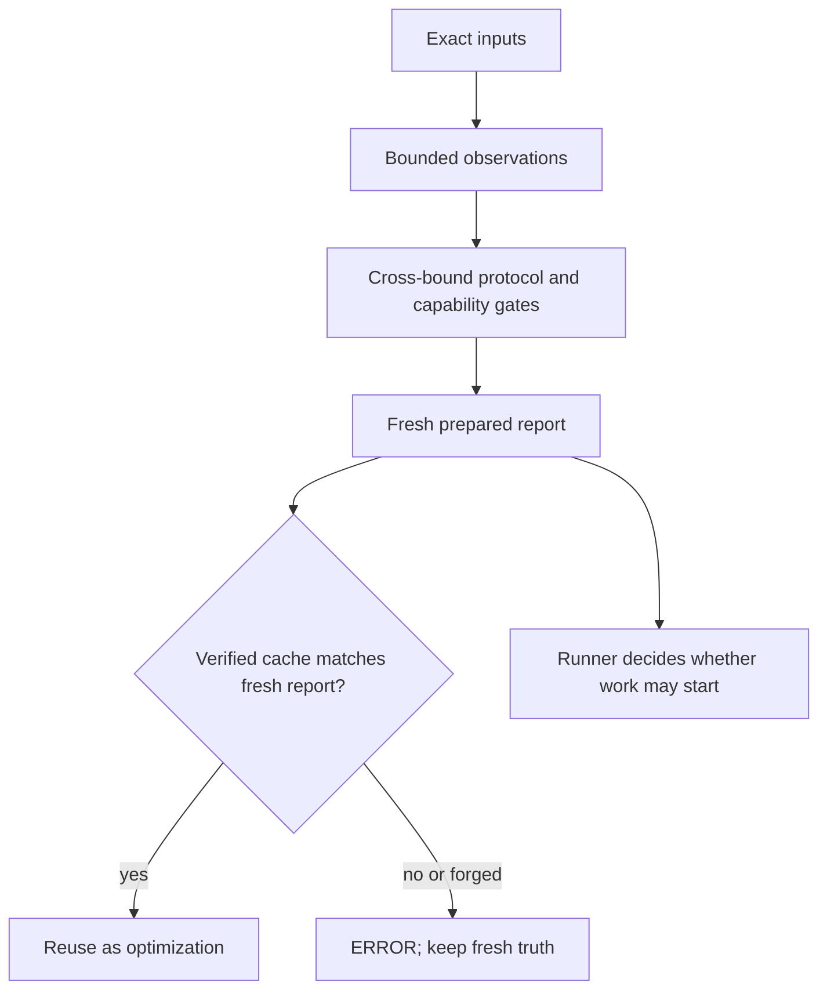

# Environment doctor

`_src/tools/environment_doctor.py` is the read-only preparation check used before work that depends on a known execution environment. It produces a canonical `prepared-environment@v1` report and a content-addressed environment ID.

## Where it is used

An orchestrator or runner invokes the doctor with the repository root, the exact workflow requirements, and the exact environment profile. It can receive hermetic observations from a runner, or collect bounded local metadata with its built-in adapter. A later attempt may reuse a cache member only when the current bootstrap, instruction bundle, requirements, profile, doctor code, and observed environment still produce the same fingerprint.

Typical invocation:

```text
python3 _src/tools/environment_doctor.py \
  --root . \
  --requirements path/to/requirements.json \
  --profile path/to/profile.json \
  --observations path/to/observations.json \
  --cache-root /tmp/autodocs-environment-cache \
  --write-cache
```

The JSON report is the machine contract. `--summary` emits a short human-readable view without replacing the report.

## What it checks

The report separates gates for bootstrap and protocol compatibility, repository and runner authority, capability and sandbox, resources, writable temporary/cache roots, Python and modules, tools, browser/font support, locale/timezone, watchdog/process-group support, and network/credential policy. Statuses distinguish `READY`, `MISSING`, `UNSUPPORTED`, `UNAVAILABLE`, `STALE`, `FORBIDDEN`, and `ERROR`; the first required non-ready gate is included as an actionable diagnosis.



## Critical trust boundary

The doctor does not repair the machine and does not grant authority. It must not probe the network, inspect secret values, install packages, change permissions, control services, or perform credential operations. The built-in adapter only performs bounded local metadata checks and an allowlisted set of version probes; runners can provide observations for capabilities that require privileged knowledge.

The cache is untrusted derived data. A cache member cannot override a freshly reconstructed report. Its schema, fingerprint, freshness inputs, age, digest, and report equivalence are checked. A malformed, tampered, stale, or self-consistent forged member is not reused; a mismatch with fresh truth is surfaced as `cache.status: ERROR`.

If the doctor malfunctions, the dangerous failure is a false `READY`: work could run with incompatible authority, missing dependencies, an unsafe sandbox, stale instructions, or an invalid writable root. Callers should therefore fail closed on `INCOMPLETE`, `ERROR`, or any required blocking gate, and should treat the environment ID as valid only together with the freshness inputs represented in the report.

## Outputs and recovery

- `PREPARED` (`exit_code: 0`) means all required gates are ready.
- `BLOCKED` (`exit_code: 1`) identifies a real missing, unsupported, unavailable, stale, or forbidden prerequisite.
- `INCOMPLETE` (`exit_code: 2`) means the report or its required preparation evidence is not trustworthy, including malformed inputs and cache-write failure.

Cache writes use a temporary file, restrictive permissions, `fsync`, and an atomic same-directory replacement. A write failure never promotes a prepared result to reusable cache evidence; it returns an actionable `cache_write` gate instead.
