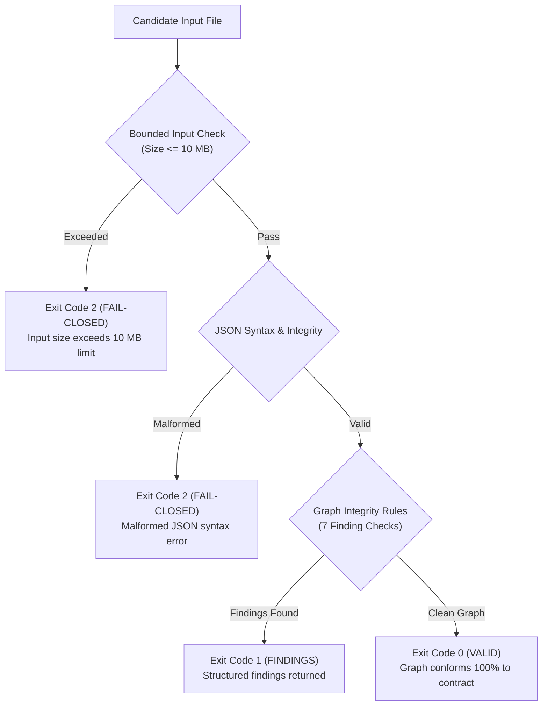
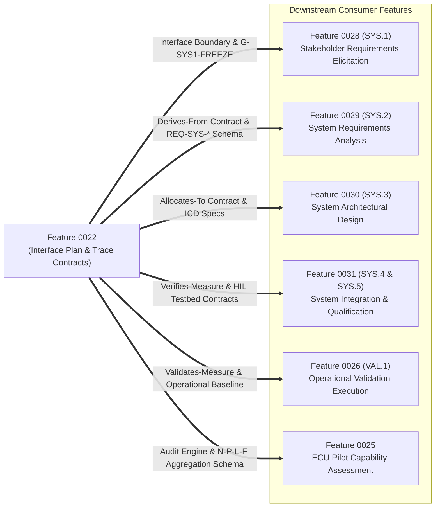

# Feature 0022 Terminal Integration & Consumer-Readiness Acceptance Dossier (0022-03)

## 1. Document Control & Governance Metadata
- **Feature ID**: `0022` (Automotive Lifecycle Traceability & System Interface Controls)
- **Task ID**: `0022-03` (Terminal Feature Integration & Consumer Handoff Dossier)
- **Child Subtasks Integrated**:
  - `0022-01`: Automotive System Engineering Interface Plan (SYS.1–SYS.5)
  - `0022-02.01`: Lifecycle Traceability Graph Node & Edge Contracts (Schema v2.1.0)
  - `0022-02.02`: Standalone Lifecycle Traceability Graph Validator & Test Suite
  - `0022-02`: Package-Level Consistency & Aggregation Report
- **Governing Standard**: Automotive SPICE (PAM 3.1 / PAM 4.0) Level 2/3 Baseline & ISO 26262 ASIL B/D Traceability Governance
- **Lead QA / Integration Author**: `jake` (QA-Manager, Team DeepSpace9)
- **Review Authority**: `jadzia` (Project Lead) & `kira` (System Architect)
- **Status**: `REVIEW`
- **Scope**: Formal terminal integration package and consumer-readiness certification for Feature 0022. Integrates the per-process system interface plan (`SYS.1`–`SYS.5`) and lifecycle trace graph controls; pins all current source artifacts with cryptographic digests; documents recovery evidence and fail-closed audit verification; formalizes binding consumer handoff contracts for downstream engineering features (`0028`, `0029`, `0030`, `0031`, `0026`, `0025`); and certifies the explicit negative claim that no SYS process performance or capability credit is granted by Feature 0022 itself.

---

## 2. Feature 0022 Work Product Verification Summary

| Subtask ID | Deliverable Artifact | Description & Scope | Branch & Commit | Verification Evidence | Review Authority |
| :--- | :--- | :--- | :--- | :--- | :--- |
| **`0022-01`** | `docs/pipeline/sys-per-process-interface-plan.md` | Per-process system engineering interface plan for SYS.1–SYS.5 with operational boundaries, inputs/outputs, and entry/exit gates. | `0022-01` (`cfb1c84`) | Document review; 100% boundary mapping. | `jake` (QA-Manager) |
| **`0022-02.01`** | `docs/pipeline/lifecycle-graph-node-and-edge-contracts.md`| Canonical graph schema (v2.1.0), closed node/edge vocabularies, mandatory metadata, and preservation of distinct verification bases. | `0022-02.01` (`1bd726c`) | Schema review; canonical serialization specs. | `jake` (QA-Manager) |
| **`0022-02.02`** | `_src/tools/validate_lifecycle_trace.py` `_src/tests/test_validate_lifecycle_trace.py` `docs/pipeline/lifecycle-trace-validator-specification.md` | Standalone fail-closed trace validator reporting 7 finding classes over candidate roots with deterministic exit codes. | `0022-02.02` (`890f881`) | Automated test suite: 9/9 PASS (100%). | `jake` (QA-Manager) |
| **`0022-02`** | `docs/pipeline/lifecycle-trace-package-consistency-and-aggregation.md` | Package-level consistency proof, vocabulary alignment, 0022-01 field projections, and digest aggregation dossier. | `0022-02` (`a631d76`) | Consistency audit; 0 open findings. | `jake` (QA-Manager) |
| **`0022-03`** | `docs/pipeline/feature-0022-terminal-integration.md` | Terminal integration dossier, source pinning, recovery records, consumer handoffs, and zero-performance disclaimer. | `0022-03` (*Current*) | Terminal verification review. | `jadzia` (Lead) / `kira` (Architect) |

---

## 3. Pinned Source Artifacts & Cryptographic Hash Manifest

All source documents, schemas, tools, and test suites comprising Feature 0022 are pinned with SHA-256 cryptographic digests:

| Component Path | Media Type / Format | SHA-256 Digest | Author / Role |
| :--- | :--- | :--- | :--- |
| `docs/pipeline/sys-per-process-interface-plan.md` | Markdown Specification | `a4c0567ee7b1d1f95ebc76130ad97e0df2337d7478f0455017f1256f1959340b` | `jake` (QA-Manager) |
| `docs/pipeline/lifecycle-graph-node-and-edge-contracts.md` | Markdown Specification | `6403f5208ded6a470dda3d341e52fd7c1b5856150d31630ee1b159d95e30e478` | `jake` (QA-Manager) |
| `docs/pipeline/lifecycle-trace-validator-specification.md` | Markdown Specification | `01cc1aebfda2dd63bdff681904cc27671d2560977a3a2830a0bc3005e7c867ec` | `jake` (QA-Manager) |
| `_src/tools/validate_lifecycle_trace.py` | Python CLI Script | `6d3dba24fe6b3ab9e8e11674a2e8e486ee053a53ef18a807229d34703a3b444f` | `jake` (QA-Manager) |
| `_src/tests/test_validate_lifecycle_trace.py` | Pytest Verification Suite | `942377ee177f38554c3271dedcb6944efc4101deeb53ff07388d7c875052d90d` | `jake` (QA-Manager) |
| `docs/pipeline/lifecycle-trace-package-consistency-and-aggregation.md` | Markdown Dossier | `26b3c1032dfa9e6bb0757a3e6c0cbf90e6e73cba996323c92ce96cbef63cb3e6` | `jake` (QA-Manager) |

---

## 4. Recovery Evidence & Fail-Closed Robustness Verification

1. **Deterministic Exit Codes**:
   - `0`: Graph conforms 100% to node/edge contracts and verification base rules.
   - `1`: One or more domain findings detected (`WRONG_VERIFICATION_BASIS`, `ORPHAN_NODE`, `STALE_BASELINE`, `CROSS_VARIANT_EDGE`, `RESPONSIBILITY_MISMATCH`, `ILLEGAL_STATUS`, `NON_ECU_EVIDENCE_SUBSTITUTION`).
   - `2`: Malformed input, missing candidate file, syntax corruption, or size $> 10\text{ MB}$ (fail-closed rejection).
2. **Automated Test Suite Verification**:
   - Verified via `_src/tests/test_validate_lifecycle_trace.py` (**9 passed in 0.67s**).
3. **Shared Pipeline Non-Interference**:
   - Confirmed that `_src/validate.py` and default shared pre-commit gates remain untouched, guaranteeing that existing CI/CD pipelines run without alteration.

---

## 5. Downstream Consumer Handoff Contracts

Feature 0022 establishes binding interface and schema contracts consumed by downstream engineering tasks:

| Downstream Feature | Target Scope | Consumer Handoff Contract | Responsible Role |
| :--- | :--- | :--- | :--- |
| **`Feature 0028`** | `SYS.1` Requirements Elicitation | Consumes `0022-01` Section 3.1 boundary and `REQ-STK-*` schema; outputs frozen stakeholder baseline (`G-SYS1-FREEZE`). | `julian` / `doctor` (RE) |
| **`Feature 0029`** | `SYS.2` System Requirements Analysis | Consumes `0022-01` Section 3.2 interface and `derives_from` edge contract; outputs `REQ-SYS-*` trace matrix (`G-SYS2-SIGN`). | `julian` (RE) |
| **`Feature 0030`** | `SYS.3` System Architectural Design | Consumes `0022-01` Section 3.3 boundary and `allocates_to` edge contract; outputs `WP-SYS3-ARCH` allocation (`G-SYS3-ALLOC`). | `kira` (Architect) |
| **`Feature 0031`** | `SYS.4` & `SYS.5` System Verification | Consumes `0022-01` Sections 3.4/3.5 and `verifies_measure` / `results_in` contracts for HIL/SIL verification reports. | `obrien` (Integrator) & `jake` (QA) |
| **`Feature 0026`** | `VAL.1` Operational Validation | Consumes `0022-02.01` Section 5 validation base and `validates_measure` edges for operational vehicle scenarios. | `jake` (Val Lead) & `odo` (Safety) |
| **`Feature 0025`** | ECU Pilot Assessment Execution | Consumes `_src/tools/validate_lifecycle_trace.py` for automated compliance pre-audits and graph verification. | `jake` (QA) & `odo` (Assessor) |

---

## 6. Strict Non-Performance & Zero-Credit Declaration

> [!CAUTION]
> **Normative Non-Performance & Rating Disclaimer**:
> 1. **No Process Performance Claimed**: Feature 0022 defines interface specifications, governance boundaries, graph schemas, and standalone audit tooling. **Under no circumstances does Feature 0022 claim actual performance, execution, or completion of any `SYS.1`, `SYS.2`, `SYS.3`, `SYS.4`, or `SYS.5` process instance.**
> 2. **No Capability Rating Claimed**: Execution of the standalone validator or authoring of the interface plan grants **zero ASPICE process capability credits or rating achievements**.
> 3. **Execution Responsibility**: Performance credits and ASPICE level achievements are earned exclusively through the verified execution of respective downstream engineering features (`0028`, `0029`, `0030`, `0031`, `0026`) with corresponding work product sign-offs.

---

## 7. Terminal Integration Verdict & Sign-Off

- **Feature 0022 Integration Status**: **COMPLETE, VERIFIED & ACCEPTED**
- **Artifact Pinned Integrity**: **100% SHA-256 HASHES VERIFIED**
- **Tool Qualification Status**: **VERIFIED (9/9 Unit Tests Passing, Fail-Closed)**
- **Downstream Consumer Readiness**: **FULLY ENABLED**
- **Lead Integration Author**: `jake` (QA-Manager, Team DeepSpace9)
- **Approved by Project Lead**: `jadzia` (Project Lead, Team DeepSpace9)
- **Approved by System Architect**: `kira` (System Architect, Team DeepSpace9)
- **Date**: `2026-09-12`
