# Authority Cutover and Rollback Without Event Loss

Status: review-ready contract for Task `0037-06.03`. It composes with `migration-state@v1`, `upgrade-record@v1`, `provenance-event@v1`, and `issue-regeneration-dag@v1`; it does not activate a cutover.

## Invariants

- Exactly one authority is writable in every epoch: legacy backlog authority or the canonical Git-native issue store; no interval permits writes to both.
- Source, candidate, decision, control-base, and cutover watermarks are immutable Git object IDs plus canonical SHA-256 digests.
- Candidate trees are immutable once prepared. A changed candidate needs a new transaction ID and a new candidate digest; no in-place refresh or last-writer-wins merge is allowed.
- Control/audit events are append-only and may be added during freeze/rollback. They never mutate issue-item text, claim state, closure records, or legacy backlog state.
- All cutover transactions are protected, append-only, fast-forward-only, compare-and-swap updates under `refs/autodocs/cutover/0037/<transaction-id>`; approvals use dedicated refs branching from the recorded control base and never advance the integration parent.

## Epoch state machine

```mermaid
stateDiagram-v2
  [*] --> legacy_active
  legacy_active --> legacy_frozen: freeze accepted; final legacy watermark pinned
  legacy_frozen --> prepared: candidate + closure delta validated
  prepared --> issue_store_active: one atomic selector commit
  prepared --> legacy_restored: abort before selector switch
  issue_store_active --> post_cutover_audit: signed audit begins
  post_cutover_audit --> legacy_restored: rollback before 0037-40; no issue writes
  post_cutover_audit --> point_of_no_return: 0037-40 signed completion
  point_of_no_return --> write_frozen_repair: emergency response
  write_frozen_repair --> issue_store_active: forward repair/export/restore
```

`legacy_active` accepts only legacy writes. `legacy_frozen`, `prepared`, and `post_cutover_audit` reject all legacy and issue-item writes, except provenance-only control/audit events. `issue_store_active` accepts only issue-store writes. `legacy_restored` reinstates the matching legacy instruction epoch and legacy authority; issue-store writes remain rejected. `point_of_no_return` forbids routine return to legacy authority; any return requires a separately authorized reverse migration.

## Transaction record

`cutover-control-ledger@v1` is one immutable record per control transition. It includes:

- `transaction_id`, `sequence`, `previous_control_digest`, `event_id`, and `recorded_at`
- `epoch` (`legacy_active`, `legacy_frozen`, `prepared`, `issue_store_active`, `post_cutover_audit`, `legacy_restored`, `point_of_no_return`, `write_frozen_repair`)
- `source_watermark`, `candidate_watermark`, `decision_watermark`, `control_base`, `cutover_watermark`, and their SHA-256 digests
- `actor_ref`, `authorization_ref`, `approval_ref` (when required), and `event_kind`
- `allowed_write_authority` (`legacy`, `issue-store`, `provenance-only`, or `none`)
- `preconditions_digest`, `postconditions_digest`, and `abort_reason` (when aborted)

A validator rejects skipped/duplicate sequence numbers, a changed `previous_control_digest`, a non-fast-forward transaction ref, an event whose digest does not match its pinned watermarks, or an epoch/action combination that permits dual authority writes.

## Freeze and promotion

1. **Freeze ownership:** the recorded control actor performs a compare-and-swap append of `legacy_frozen`, naming the final legacy source watermark and its digest. The selector changes to the corresponding `legacy-frozen` instruction epoch atomically with that event.
2. **Freeze enforcement:** new or mutating legacy sessions reject the frozen selector epoch before opening a write. Existing sessions must prove their write began before the final watermark; otherwise they abort with a stable `legacy-freeze-rejected` finding.
3. **Prepared candidate:** `0037-34.01` produces a final authority tree from the immutable candidate plus deterministic closure delta for `0037-31` and `0037-34.01`. It does not close those legacy/issue markers itself.
4. **Promotion audit:** `0037-32` audits both the candidate and exact final authority tree. `0037-33` and dedicated approval refs add signed decision evidence from the fixed control base without moving the integration parent.
5. **Atomic switch:** only after all prepared-patch, audit, approval, DAG, and selector-digest checks pass may one commit update the live authority selector to `issue_store_active`. The commit records the exact final authority-tree digest and cutover ledger digest.

After the final legacy watermark, Tasks `0037-31`, `0037-34.01`, `0037-32`, and `0037-33` remain `[p]`; their gate evidence is represented only in the immutable control ledger and approval refs. The selected cutover profile lets the validator satisfy their start gates from signed ledger evidence. Task `0037-40` alone materializes their item closures after the signed post-cutover audit.

## Abort and rollback

Before the selector commit, failure of any precondition appends a provenance-only abort event, leaves legacy authority frozen or restores it through an explicit `legacy_restored` event, and discards the prepared candidate root. No candidate text is merged back into legacy.

From selector switch through the signed completion of `0037-40`, rollback is allowed only as a no-issue-write transaction: append a `legacy_restored` control event, restore the matching legacy instruction epoch and selector, pin the prior source watermark/digest, and preserve all issue-store/cutover evidence as provenance-only records. The rollback rehearsal runs in a detached worktree and must verify that no `issues/**/index.md`, `claim.json`, or `closure.json` write is attempted.

After `0037-40`, routine rollback is prohibited. Emergency response first enters `write_frozen_repair`, then follows the forward repair/export/restore process specified by Task `0037-44`; a reverse migration to legacy authority needs separate authorization and a new transaction.

## Rehearsal and fixtures

The fixture suite must validate:

1. A successful freeze -> prepared -> single atomic selector switch with all digests pinned.
2. A rejected dual-authority write attempt in every freeze/audit epoch.
3. A stale candidate, changed selector digest, non-fast-forward ref, and invalid approval-base rejection.
4. A detached-worktree rollback with only provenance/control events and no issue-item writes.
5. Rejection of a routine legacy rollback after `point_of_no_return`.
