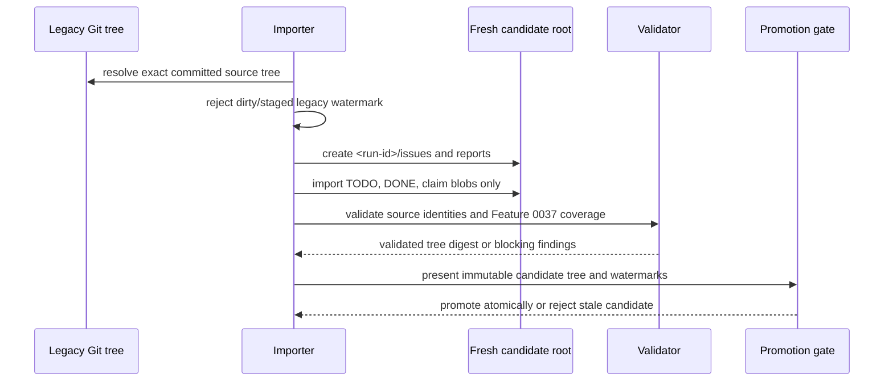

# Immutable Legacy-Source Watermarks and Shadow Imports

Status: review-ready contract for task 0037-06.01. It defines `migration-state@v1`; it does not switch authority away from `TODO.md`/`DONE.md`.

## Immutable source boundary

A shadow import reads **only** `TODO.md`, `DONE.md`, and claim blobs from one exact committed Git tree. It must never read working-tree files, staged blobs, generated views, or ad-hoc manual edits. Before a final source watermark is recorded, the legacy backlog source must be clean and unstaged; otherwise emit a blocking `dirty-legacy-source` finding.

The import state records the source commit, source tree object, canonical tree digest, importer commit/digest, and all schema versions. A changed legacy commit creates a new source watermark; it never mutates an earlier candidate.

## Watermarks and candidates

`baseline` is the accepted source commit from which migration began, `latest_source` is the exact committed legacy source being imported, and `candidate` is the source commit represented by this run. Each run ID creates fresh roots:

- `_src/output/issue-migration/<run-id>/issues/`
- `_src/output/issue-migration/<run-id>/reports/`

A candidate records its immutable Git tree object and tree digest. Promotion is permitted only when source equals the candidate watermark, the candidate is validated, the candidate tree/digest match, all required Feature `0037` items are represented, and no blocking finding exists. A stale candidate is rejected rather than merged or refreshed in place; manual edits inside a shadow root never win.

## Import sequence

## Scenarios

| Scenario | Required behavior |
|---|---|
| First import | Set all watermarks to exact committed source; create a fresh disposable candidate |
| New legacy commit | Preserve prior candidate, re-import from the new source into a new run root |
| Deleted or reused ID | Emit a stable blocking identity finding; never silently remap history |
| Moved task or changed prerequisite | Rebuild only in a new candidate and validate path/edge identity against the selected source tree |
| Malformed source | Emit blocking finding; candidate is not promotable |
| Interrupted import | Mark `interrupted`; discard/recreate the run root rather than resume mutable partial output |
| Stale candidate | Reject when latest source differs from candidate watermark; create a new run |

## Validation rules

The schema enforces closed state and exact field shapes. Semantic validation additionally requires that all candidate subpaths use the same run ID, source files are exactly the allowed set, candidate watermark equals source commit, a promoted state is promotable with no blocking finding, and candidate-tree identity comes from a validated immutable Git tree. Full re-imports are disposable; no SQLite database or last-writer-wins merge is part of this contract.
