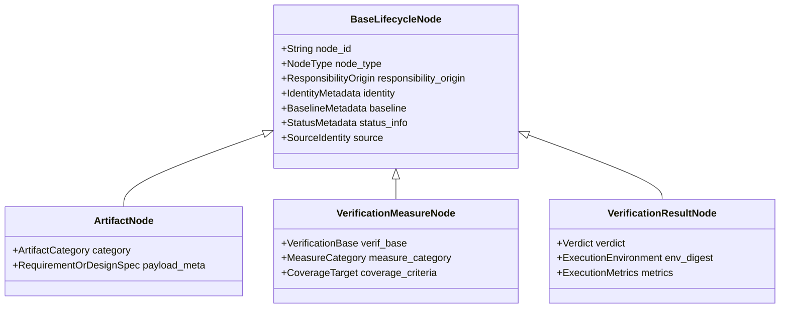
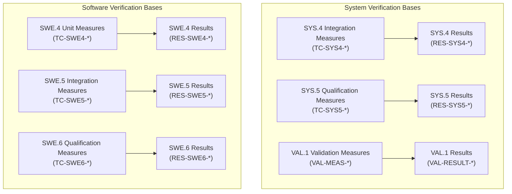

# Lifecycle Traceability Graph Node & Edge Contracts (0022-02.01)

## 1. Document Control & Governance Metadata
- **Process IDs**: `SYS.1`–`SYS.5`, `SWE.1`–`SWE.6`, `VAL.1`, `SUP.8`, `SUP.9`, `SUP.10`
- **Feature / Task**: `0022-02.01` (PREREQ: `0022-01`)
- **Governing Standard**: Automotive SPICE (PAM 3.1 / PAM 4.0) Bidirectional Traceability Baseline & ISO 26262
- **Schema Version**: `2.1.0` (Canonical Graph Contract)
- **Lead QA / Architecture Authority**: `jake` (QA-Manager, Team DeepSpace9)
- **Status**: `REVIEW`
- **Scope**: Formal contract governing the versioned lifecycle traceability graph schema, strictly separating artifact nodes from verification measure and result nodes, establishing closed node/edge vocabularies, mandatory metadata attributes, distinct verification bases across SWE.4, SWE.5, SWE.6, SYS.4, SYS.5, and VAL.1, deterministic canonical serialization, and forward/backward version compatibility.

---

## 2. Graph Node Architecture & Strict Separation



### 2.1 Node Category Definitions
1. **`ArtifactNode`**: Represents engineering specifications, requirements, architecture models, detailed designs, source code units, configuration manifests, and problem/change records.
2. **`VerificationMeasureNode`**: Represents the *prescriptive verification specification* (test cases, test vectors, static analysis rules, audit criteria) designed to verify or validate an `ArtifactNode`.
3. **`VerificationResultNode`**: Represents the *empirical execution evidence* (test outputs, junit XML digests, coverage results, pass/fail verdicts) resulting from the execution of a `VerificationMeasureNode`.

---

## 3. Mandatory Node Metadata Contract

Every node in the graph must serialize the following mandatory schema fields:

```json
{
  "$schema": "https://schemas.starfleet.network/lifecycle-graph/v2.1.0/node.json",
  "node_id": "REQ-SYS-0020-01",
  "node_type": "ArtifactNode",
  "responsibility_origin": {
    "agent": "doctor",
    "role": "Requirements Engineer",
    "team": "DeepSpace9",
    "organization": "Starfleet Engineering"
  },
  "identity": {
    "product_id": "virtualized-automotive-ecu",
    "project_id": "ECU-DEV-2026",
    "process_id": "SYS.2"
  },
  "baseline": {
    "baseline_id": "BASE-20260912-V060",
    "revision_id": "rev-004",
    "variant_id": "variant-dual-core-posix"
  },
  "status_info": {
    "status": "APPROVED",
    "rationale": "Signed off by System Architect and Safety Officer",
    "timestamp_utc": "2026-09-12T22:45:00Z"
  },
  "source": {
    "source_uri": "file://docs/pipeline/ecu-system-requirements.md#L45-L60",
    "content_hash_sha256": "4a72e8b912c3f910482d1fe50092bc7a3f81e6a9082bd1a73f9102c8901ef234"
  }
}
```

---

## 4. Closed Edge Vocabulary & Typed Role Contracts

Edges represent strictly typed, directional relationships between valid node categories:

| Edge Type (`edge_type`) | Source Node Type | Target Node Type | Typed Semantics & Invariant |
| :--- | :--- | :--- | :--- |
| **`derives_from`** | `ArtifactNode` | `ArtifactNode` | Downstream artifact derived from upstream requirement (e.g. `SWE.1` $\rightarrow$ `SYS.2`). |
| **`allocates_to`** | `ArtifactNode` | `ArtifactNode` | System requirement allocated to architectural subsystem (e.g. `SYS.2` $\rightarrow$ `SYS.3`). |
| **`implements`** | `ArtifactNode` | `ArtifactNode` | Source code module implements detailed design unit (e.g. `SWE.3` $\rightarrow$ `SWE.2`). |
| **`verifies_measure`** | `VerificationMeasureNode` | `ArtifactNode` | Test specification verifies an architectural unit, design, or requirement. |
| **`validates_measure`** | `VerificationMeasureNode` | `ArtifactNode` | Validation test case validates a stakeholder need (`VAL.1` $\rightarrow$ `SYS.1`). |
| **`results_in`** | `VerificationResultNode` | `VerificationMeasureNode` | Execution result produced by running a specific verification measure. |
| **`mitigates`** | `ArtifactNode` | `ArtifactNode` | Safety mechanism or requirement mitigates an identified hazard (`MAN.5`). |
| **`supersedes`** | `ArtifactNode` | `ArtifactNode` | New version replaces invalidated/deprecated artifact (`SUP.10`). |

---

## 5. Preservation of Distinct Verification Bases

The graph schema maintains isolated, non-conflated subgraphs for each distinct ASPICE verification level:



- **`SWE.4` Base**: Target detailed design units (`SWE.3`); measures structural coverage (statement/branch/MC/DC).
- **`SWE.5` Base**: Target software architecture interfaces (`SWE.2`); measures inter-module contracts and state transitions.
- **`SWE.6` Base**: Target software requirements (`SWE.1`); measures functional requirement satisfaction.
- **`SYS.4` Base**: Target system architectural design (`SYS.3`); measures HW/SW boundary integration on HIL/SIL.
- **`SYS.5` Base**: Target system requirements (`SYS.2`); measures end-to-end system qualification.
- **`VAL.1` Base**: Target stakeholder operational needs (`SYS.1`); measures real-world user operational suitability.

---

## 6. Canonical Serialization, Key Ordering & Hash Digests

To guarantee deterministic, tamper-evident cryptographic hashing:
1. **Key Sorting**: JSON object keys must be sorted lexicographically in ascending ASCII order.
2. **Whitespace & Encoding**: UTF-8 encoding without BOM, zero trailing whitespace, standard Unix `\n` line delimiters.
3. **Graph Digest Calculation**:
   $$\text{GraphDigest} = \text{SHA-256}\left(\text{Canonical}(\text{Nodes}) \,\|\, \text{Canonical}(\text{Edges})\right)$$

---

## 7. Version Compatibility & Evolution Governance
- **Semantic Versioning**: Contract follows `MAJOR.MINOR.PATCH` (`v2.1.0`).
- **Backward Compatibility**: New optional metadata fields may be added in minor releases without breaking existing parsers.
- **Closed Vocabulary Guard**: Adding a new `node_type` or `edge_type` requires an architectural decision (`DEC-*`) and major/minor schema bump.
- **QA Sign-Off**: `jake` (QA-Manager, Team DeepSpace9).
