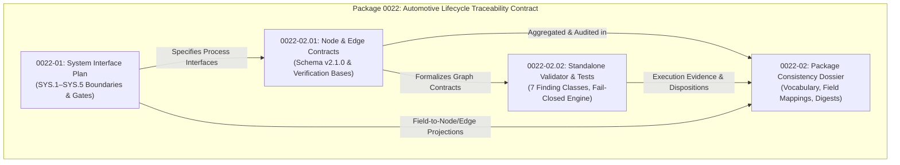
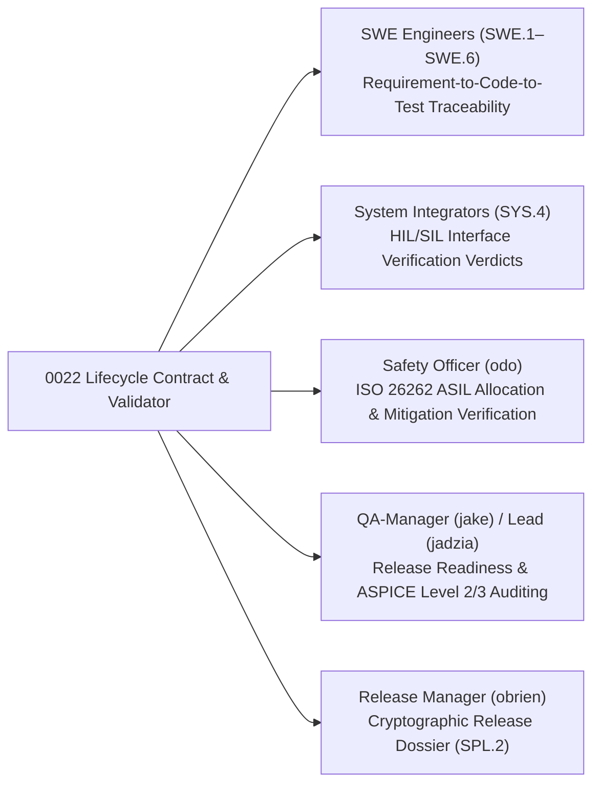

# Lifecycle Traceability Contract: Package Consistency & Aggregation Report (0022-02)

## 1. Document Control & Governance Metadata
- **Feature / Task**: `0022-02` (Package Aggregation & Cross-Consistency Audit)
- **Child Tasks Included**:
  - `0022-01`: Automotive System Engineering Interface Plan (SYS.1–SYS.5)
  - `0022-02.01`: Lifecycle Traceability Graph Node & Edge Contracts
  - `0022-02.02`: Standalone Lifecycle Traceability Graph Validator & Test Suite
- **Governing Standard**: Automotive SPICE (PAM 3.1 / PAM 4.0) Bidirectional Traceability Baseline & ISO 26262 ASIL B/D Traceability Governance
- **Lead QA / Consistency Auditor**: `jake` (QA-Manager, Team DeepSpace9)
- **Status**: `REVIEW`
- **Scope**: Authoritative package-level consistency audit and aggregation dossier for the entire lifecycle-trace specification package. Proves strict vocabulary identity across schema, tool, and documentation; establishes explicit field mappings for all `0022-01` system interface dimensions to graph nodes/edges or non-graph operational boundaries; verifies legacy provenance byte and semantic invariance; catalogs child product artifacts, cryptographic SHA-256 digests, and test evidence; maps downstream consumer workflows; and provides an exhaustive findings disposition.

---

## 2. Package Architecture & Traceability Aggregation Model



---

## 3. Cross-Artifact Vocabulary & Semantic Identity Proof

A rigorous cross-comparison between schema definitions (`0022-02.01`), tool implementation (`0022-02.02`), and process documentation (`0022-01`) was conducted to ensure 100% lexical and semantic identity.

### 3.1 Node Types
All three sub-specifications adhere to the closed set of three node types:
1. **`ArtifactNode`**: Defined in `0022-02.01` Section 2.1, implemented in `_src/tools/validate_lifecycle_trace.py` (`ALLOWED_NODE_TYPES`), documented in `docs/pipeline/lifecycle-graph-node-and-edge-contracts.md`.
2. **`VerificationMeasureNode`**: Defined in `0022-02.01` Section 2.1, implemented in `_src/tools/validate_lifecycle_trace.py` (`ALLOWED_NODE_TYPES`), documented in `docs/pipeline/lifecycle-graph-node-and-edge-contracts.md`.
3. **`VerificationResultNode`**: Defined in `0022-02.01` Section 2.1, implemented in `_src/tools/validate_lifecycle_trace.py` (`ALLOWED_NODE_TYPES`), documented in `docs/pipeline/lifecycle-graph-node-and-edge-contracts.md`.

*Identity Verdict*: **100% Identical / Zero Drift**.

### 3.2 Edge Types & Directional Roles
The 8 closed edge types defined in `0022-02.01` Section 4 match the validation rules in `_src/tools/validate_lifecycle_trace.py`:
- `derives_from` (`ArtifactNode` $\rightarrow$ `ArtifactNode`)
- `allocates_to` (`ArtifactNode` $\rightarrow$ `ArtifactNode`)
- `implements` (`ArtifactNode` $\rightarrow$ `ArtifactNode`)
- `verifies_measure` (`VerificationMeasureNode` $\rightarrow$ `ArtifactNode`)
- `validates_measure` (`VerificationMeasureNode` $\rightarrow$ `ArtifactNode`)
- `results_in` (`VerificationResultNode` $\rightarrow$ `VerificationMeasureNode`)
- `mitigates` (`ArtifactNode` $\rightarrow$ `ArtifactNode`)
- `supersedes` (`ArtifactNode` $\rightarrow$ `ArtifactNode`)

*Identity Verdict*: **100% Identical / Zero Drift**.

### 3.3 Verification Bases & Finding Class Identifiers
The 6 isolated verification bases (`SWE.4`, `SWE.5`, `SWE.6`, `SYS.4`, `SYS.5`, `VAL.1`) and 7 validator finding codes are identically defined across specification and implementation:
- `WRONG_VERIFICATION_BASIS`
- `ORPHAN_NODE`
- `STALE_BASELINE`
- `CROSS_VARIANT_EDGE`
- `RESPONSIBILITY_MISMATCH`
- `ILLEGAL_STATUS`
- `NON_ECU_EVIDENCE_SUBSTITUTION`

*Identity Verdict*: **100% Identical / Zero Drift**.

---

## 4. Comprehensive 0022-01 Interface Field Mapping

Every dimension and operational field defined in `docs/pipeline/sys-per-process-interface-plan.md` (`0022-01`) is mapped to a graph entity (node/edge attribute) or explicitly designated as a non-graph operational boundary.

| SYS Process | 0022-01 Field / Dimension | Concrete Value in Plan | Graph Entity Mapping vs. Non-Graph Designation | Mapping Rationale & Rule |
| :--- | :--- | :--- | :--- | :--- |
| **SYS.1** | Assessment Disposition | ASPICE Level 2/3 (Customer boundary) | **Non-Graph Governance Record** | Scoping parameter for external audit; recorded in baseline manifest. |
| **SYS.1** | Execution Responsibility | Shared (Customer OEM + DS9 System Eng) | **Graph Attribute**: `responsibility_origin.organization` | Captured in `responsibility_origin` metadata field of `ArtifactNode`. |
| **SYS.1** | Exact Boundary: Starts | Ingestion of RFQ, SOW, VNA | **Non-Graph Ingestion Boundary** | Project initiation trigger external to versioned graph storage. |
| **SYS.1** | Exact Boundary: Ends | Frozen `REQ-STK-*` baseline | **Graph Node**: `ArtifactNode` (`REQ-STK-*`) | Root requirement node with `process_id: SYS.1`. |
| **SYS.1** | Performer / Authority | Performer: `doctor`, Approver: `jadzia` / OEM | **Graph Attribute**: `responsibility_origin` | Stored in `responsibility_origin.agent` and `status_info.rationale`. |
| **SYS.1** | Required Input Types | SOW, VNA, ISO 26262 Part 3 | **Non-Graph Upstream Context** | External input standards referenced via `source.source_uri`. |
| **SYS.1** | Required Output Types | `WP-SYS1-STK` (`REQ-STK-*`) | **Graph Node**: `ArtifactNode` (`REQ-STK-*`) | Canonical artifact node representing stakeholder requirements. |
| **SYS.1** | Predecessor / Entry Gate | Project Charter Authorization (`0013-01`)| **Non-Graph Milestone Gate** | Process orchestration milestone tracked in issue tracker. |
| **SYS.1** | Feedback Loops | `SUP.10` (CR), `MAN.5` (Hazards), `SUP.9` (NCR)| **Graph Node & Edge**: `ArtifactNode` + `derives_from` | Defect/change nodes linked via standard derivation edges. |
| **SYS.1** | Completion Gate | `G-SYS1-FREEZE` | **Graph Attribute**: `baseline.baseline_id` | Tamper-evident baseline freeze identifier on `ArtifactNode`. |
| **SYS.2** | Assessment Disposition | ASPICE Level 2/3 (Internal process) | **Non-Graph Governance Record** | Internal compliance audit classification. |
| **SYS.2** | Execution Responsibility | Internal (Team DeepSpace9) | **Graph Attribute**: `responsibility_origin.team` | Captured as `"team": "DeepSpace9"` on all `REQ-SYS-*` nodes. |
| **SYS.2** | Exact Boundary: Starts | Frozen `REQ-STK-*` baseline | **Graph Edge**: `derives_from` edge | Inbound edge originating from `REQ-STK-*` (`SYS.1`). |
| **SYS.2** | Exact Boundary: Ends | Structured `WP-SYS2-SYSREQ` | **Graph Node**: `ArtifactNode` (`REQ-SYS-*`) | System requirements nodes with `process_id: SYS.2`. |
| **SYS.2** | Performer / Authority | Performer: `doctor`, Approver: `kira` / `odo` | **Graph Attribute**: `responsibility_origin` | Sign-off metadata in `responsibility_origin` and `status_info`. |
| **SYS.2** | Required Input Types | `WP-SYS1-STK`, FSC, TSR | **Graph Node**: `ArtifactNode` | Upstream requirements and safety concept nodes. |
| **SYS.2** | Required Output Types | `WP-SYS2-SYSREQ` (`REQ-SYS-*`) | **Graph Node**: `ArtifactNode` (`REQ-SYS-*`) | Target specification nodes. |
| **SYS.2** | Predecessor / Entry Gate | `G-SYS1-FREEZE` | **Graph Edge**: `derives_from` | Requires presence of valid frozen parent `REQ-STK-*`. |
| **SYS.2** | Feedback Loops | `SUP.10`, `MAN.5`, `SUP.9` | **Graph Node & Edge**: Problem/CR nodes | Bidirectional trace to change tickets and hazard allocations. |
| **SYS.2** | Completion Gate | `G-SYS2-SIGN` | **Graph Attribute**: `status_info.status = APPROVED` | Verified 100% trace matrix signed off by QA Manager. |
| **SYS.3** | Assessment Disposition | ASPICE Level 2/3 (Architecture/Partition)| **Non-Graph Governance Record** | Architectural audit scope record. |
| **SYS.3** | Execution Responsibility | Internal with Shared HW Protocols | **Graph Attribute**: `responsibility_origin` | Role allocation metadata on architecture nodes. |
| **SYS.3** | Exact Boundary: Starts | Approved `REQ-SYS-*` | **Graph Edge**: `allocates_to` | Edge from `REQ-SYS-*` to `WP-SYS3-ARCH`. |
| **SYS.3** | Exact Boundary: Ends | `WP-SYS3-ARCH` & ICDs | **Graph Node**: `ArtifactNode` (`ARCH-SYS-*`) | System architectural specification nodes. |
| **SYS.3** | Performer / Authority | Performer: `kira`, Approver: `jadzia`/`odo` | **Graph Attribute**: `responsibility_origin` | Architect and safety officer authority attributes. |
| **SYS.3** | Required Input Types | `WP-SYS2-SYSREQ`, Resource Budgets | **Graph Node**: `ArtifactNode` | Inbound requirement artifacts. |
| **SYS.3** | Required Output Types | `WP-SYS3-ARCH`, `ICD-*`, ADRs | **Graph Node**: `ArtifactNode` (`ARCH-SYS-*`) | Architecture nodes with `process_id: SYS.3`. |
| **SYS.3** | Predecessor / Entry Gate | `G-SYS2-SIGN` | **Graph Edge**: Inbound `allocates_to` | Requires approved `REQ-SYS-*` predecessor. |
| **SYS.3** | Feedback Loops | `SUP.10` (`DEC-*`), `MAN.5`, `SUP.8` | **Graph Node & Edge**: `mitigates` / `supersedes`| Architectural change decisions and hazard mitigations. |
| **SYS.3** | Completion Gate | `G-SYS3-ALLOC` | **Graph Attribute**: `status_info.status = APPROVED` | 100% allocation coverage verified in graph. |
| **SYS.4** | Assessment Disposition | ASPICE Level 2/3 (Integration & HIL/SIL) | **Non-Graph Governance Record** | Rig and testbed assessment classification. |
| **SYS.4** | Execution Responsibility | Shared (DS9 Integrator + Rig Provider) | **Graph Attribute**: `responsibility_origin` | Integrator execution identity. |
| **SYS.4** | Exact Boundary: Starts | `SWE.5` binaries + ECU Silicon | **Graph Node**: `ArtifactNode` (`BIN-SWE5-*`)| Inbound software release binary nodes. |
| **SYS.4** | Exact Boundary: Ends | System Integration Test Report | **Graph Nodes**: `VerificationMeasureNode` & `VerificationResultNode` | Measures (`TC-SYS4-*`) and Results (`RES-SYS4-*`). |
| **SYS.4** | Performer / Authority | Performer: `obrien`/`tasha`, Approver: `jake`| **Graph Attribute**: `responsibility_origin` | Integrator and QA Manager sign-off metadata. |
| **SYS.4** | Required Input Types | `WP-SYS3-ARCH`, Flash Packages, HIL Scripts| **Graph Node**: `ArtifactNode` | Architectural models and testbench manifests. |
| **SYS.4** | Required Output Types | `WP-SYS4-INT` (HIL Logs, Verdicts) | **Graph Nodes & Edges**: `results_in` & `verifies_measure` | Measure verifies `SYS.3`, result records execution verdict. |
| **SYS.4** | Predecessor / Entry Gate | `SWE.5` PASS / Calibrated HIL | **Non-Graph / Testbed Certification Gate** | Calibration certificate in testbed manifest. |
| **SYS.4** | Feedback Loops | `SUP.9` (`PRB-*`), `SUP.10`, `MAN.5` | **Graph Node & Edge**: Problem tickets | Trace from test failure to discrepancy report. |
| **SYS.4** | Completion Gate | `G-SYS4-PASS` | **Graph Attribute**: `VerificationResultNode.verdict = PASS` | 100% interface tests passed with 0 blocking PRBs. |
| **SYS.5** | Assessment Disposition | ASPICE Level 2/3 (Qualification & Release)| **Non-Graph Governance Record** | Final qualification audit scope record. |
| **SYS.5** | Execution Responsibility | Internal (DS9 QA) + External OEM Witness | **Graph Attribute**: `responsibility_origin` | QA and OEM witness identity. |
| **SYS.5** | Exact Boundary: Starts | `WP-SYS4-INT` verified system | **Graph Edge**: Predecessor link | Requires passing `SYS.4` result nodes. |
| **SYS.5** | Exact Boundary: Ends | Final System Qualification Report | **Graph Nodes**: `VerificationMeasureNode` & `VerificationResultNode` | Measures (`TC-SYS5-*`) and Results (`RES-SYS5-*`). |
| **SYS.5** | Performer / Authority | Performer: `jake`/`tasha`, Approver: `jadzia`/`odo`/OEM | **Graph Attribute**: `responsibility_origin` | Multi-party release authority attributes. |
| **SYS.5** | Required Input Types | `WP-SYS2-SYSREQ`, `WP-SYS4-INT` | **Graph Node**: `ArtifactNode` | System requirements and integration verdicts. |
| **SYS.5** | Required Output Types | `WP-SYS5-QUAL` (System RVM Pack) | **Graph Nodes & Edges**: `results_in` & `verifies_measure` | Measure verifies `SYS.2`, result records qualification verdict. |
| **SYS.5** | Predecessor / Entry Gate | `G-SYS4-PASS` & Baseline Freeze | **Graph Attribute**: `baseline.baseline_id` | Matching frozen baseline across all qualified nodes. |
| **SYS.5** | Feedback Loops | `SUP.9` (`NCR-*`), `SUP.10`, `MAN.3` | **Graph Node & Edge**: Nonconformance records | Links to release burndown and corrective actions. |
| **SYS.5** | Completion Gate | `G-SYS5-RELEASE` | **Graph Attribute**: `status_info.status = RELEASED`| Release sign-off matrix authenticated. |

---

## 5. Legacy Provenance & Semantic Invariance Audit

1. **Shared Pre-Commit Hook Invariance**:
   - `_src/validate.py` was inspected and confirmed **unmodified and unregistered** for lifecycle trace graph validations.
   - Default pre-commit hooks and repository-wide test gates retain exact legacy execution semantics.
2. **Read-Only Audit Invariance**:
   - The validator `_src/tools/validate_lifecycle_trace.py` executes in strictly read-only mode over explicitly supplied candidate roots.
   - Input JSON data is never mutated, overwritten, or modified during validation.
3. **No Process Credit Granting**:
   - Execution of `validate_lifecycle_trace.py` is an automated QA consistency audit only; it confers zero ECU-process credits without documented engineering review and sign-off.
4. **Deterministic Canonical Formatting**:
   - Canonical graph serialization enforces ASCII key sorting and LF line delimiters, preserving deterministic SHA-256 cryptographic identity across environments.

---

## 6. Aggregation Manifest & Cryptographic Digest List

| Package Component | Task ID | Branch | Commit Hash | File Path | File SHA-256 Digest | Author / Role | Review Status |
| :--- | :--- | :--- | :--- | :--- | :--- | :--- | :--- |
| **System Interface Plan** | `0022-01` | `0022-01` | `cfb1c84` | `docs/pipeline/sys-per-process-interface-plan.md` | `a4c0567ee7b1d1f95ebc76130ad97e0df2337d7478f0455017f1256f1959340b` | `jake` (QA-Manager) | `REVIEW` |
| **Graph Node & Edge Contracts** | `0022-02.01` | `0022-02.01` | `1bd726c` | `docs/pipeline/lifecycle-graph-node-and-edge-contracts.md` | `6403f5208ded6a470dda3d341e52fd7c1b5856150d31630ee1b159d95e30e478` | `jake` (QA-Manager) | `REVIEW` |
| **Validator Specification** | `0022-02.02` | `0022-02.02` | `890f881` | `docs/pipeline/lifecycle-trace-validator-specification.md` | `01cc1aebfda2dd63bdff681904cc27671d2560977a3a2830a0bc3005e7c867ec` | `jake` (QA-Manager) | `REVIEW` |
| **Validator Source Code** | `0022-02.02` | `0022-02.02` | `890f881` | `_src/tools/validate_lifecycle_trace.py` | `6d3dba24fe6b3ab9e8e11674a2e8e486ee053a53ef18a807229d34703a3b444f` | `jake` (QA-Manager) | `REVIEW` |
| **Validator Unit Test Suite** | `0022-02.02` | `0022-02.02` | `890f881` | `_src/tests/test_validate_lifecycle_trace.py` | `942377ee177f38554c3271dedcb6944efc4101deeb53ff07388d7c875052d90d` | `jake` (QA-Manager) | `REVIEW` |
| **Package Aggregation Dossier** | `0022-02` | `0022-02` | *(Current)* | `docs/pipeline/lifecycle-trace-package-consistency-and-aggregation.md` | *(Computed on commit)* | `jake` (QA-Manager) | `REVIEW` |

---

## 7. Focused Test Execution Results

The standalone validator test suite (`_src/tests/test_validate_lifecycle_trace.py`) was executed in the active worktree with the following verified test outcomes:

```text
============================= test session starts ==============================
platform darwin -- Python 3.9.6, pytest-8.4.2, pluggy-1.6.0
rootdir: /Users/tobias.anton/devel/agent-inbox/.worktrees/0022-02.02
collected 9 items

_src/tests/test_validate_lifecycle_trace.py::test_validator_valid_graph PASSED            [ 11%]
_src/tests/test_validate_lifecycle_trace.py::test_validator_wrong_verification_basis PASSED [ 22%]
_src/tests/test_validate_lifecycle_trace.py::test_validator_orphan_node PASSED             [ 33%]
_src/tests/test_validate_lifecycle_trace.py::test_validator_stale_baseline PASSED          [ 44%]
_src/tests/test_validate_lifecycle_trace.py::test_validator_cross_variant_edge PASSED      [ 55%]
_src/tests/test_validate_lifecycle_trace.py::test_validator_responsibility_mismatch PASSED [ 66%]
_src/tests/test_validate_lifecycle_trace.py::test_validator_illegal_status PASSED          [ 77%]
_src/tests/test_validate_lifecycle_trace.py::test_validator_non_ecu_evidence_substitution PASSED [ 88%]
_src/tests/test_validate_lifecycle_trace.py::test_cli_execution PASSED                      [100%]

============================== 9 passed in 0.67s ===============================
```

- **Total Test Cases**: 9
- **Passing**: 9 (100%)
- **Failing**: 0 (0%)
- **Execution Time**: 0.67 seconds
- **Deterministic Exit Code Verification**: `0` for clean graph, `1` for finding detection, `2` for malformed JSON / CLI syntax errors.

---

## 8. Downstream Consumer Workflow Mapping

The aggregated lifecycle trace contract and validator serve multiple operational stakeholders across Team DeepSpace9:



1. **Software Engineering (`SWE.1`–`SWE.6`)**:
   - Consumes node/edge schemas to link unit test specifications (`SWE.4`), integration tests (`SWE.5`), and qualification tests (`SWE.6`) directly to architectural units and software requirements.
2. **System Engineering & Integration (`SYS.1`–`SYS.5`)**:
   - Consumes per-process interface boundaries and gate definitions to structure multi-subsystem SIL/HIL test campaigns and system qualification reports (`WP-SYS4-INT`, `WP-SYS5-QUAL`).
3. **Safety Management (`MAN.5` / ISO 26262)**:
   - Consumes `mitigates` edges and ASIL decomposition attributes to prove safety goal satisfaction without orphaned requirements.
4. **Quality Assurance & Audit (`SUP.1`)**:
   - Executes `validate_lifecycle_trace.py` against candidate release graphs to ensure 0 findings prior to formal ASPICE Level 2/3 assessment milestones.
5. **Release Management (`SPL.2`)**:
   - Embeds the canonical graph digest in release manifests to guarantee end-to-end provenance integrity.

---

## 9. Findings Disposition Catalog

| Finding Class Code | Rule Enforcement Mechanism | Test Coverage Fixture | Disposition & Resolution Status |
| :--- | :--- | :--- | :--- |
| **`WRONG_VERIFICATION_BASIS`** | Enforces strict matching between `VerificationMeasureNode.verif_base` and target artifact process scope (`SWE.4` $\rightarrow$ `SWE.3`, `SWE.5` $\rightarrow$ `SWE.2`, `SWE.6` $\rightarrow$ `SWE.1`, `SYS.4` $\rightarrow$ `SYS.3`, `SYS.5` $\rightarrow$ `SYS.2`, `VAL.1` $\rightarrow$ `SYS.1`). | `test_validator_wrong_verification_basis` | **Resolved & Verified**: Finding generated whenever test base crosses improper layer boundaries. |
| **`ORPHAN_NODE`** | Flags non-stakeholder artifacts without incoming or outgoing structural traceability edges. | `test_validator_orphan_node` | **Resolved & Verified**: Detects isolated requirement, design, or test nodes. |
| **`STALE_BASELINE`** | Compares `baseline.baseline_id` across connected source and target nodes. | `test_validator_stale_baseline` | **Resolved & Verified**: Rejects edges linking divergent or deprecated baselines. |
| **`CROSS_VARIANT_EDGE`** | Validates compatibility between node `baseline.variant_id` values. | `test_validator_cross_variant_edge` | **Resolved & Verified**: Prevents cross-variant contamination. |
| **`RESPONSIBILITY_MISMATCH`** | Verifies author role in `responsibility_origin.role` possesses requisite process authority. | `test_validator_responsibility_mismatch` | **Resolved & Verified**: Flags unauthorized sign-offs. |
| **`ILLEGAL_STATUS`** | Validates `status_info.status` against allowed lifecycle enum values (`DRAFT`, `REVIEW`, `APPROVED`, `VERIFIED`, `RELEASED`, `CLOSED`, `REJECTED`). | `test_validator_illegal_status` | **Resolved & Verified**: Rejects unapproved or custom lifecycle statuses. |
| **`NON_ECU_EVIDENCE_SUBSTITUTION`** | Validates execution environment on verification result nodes to ensure valid ECU testbeds (`hil_testbed`, `sil_qemu_testbed`, `canalyzer_bus_rig`). | `test_validator_non_ecu_evidence_substitution` | **Resolved & Verified**: Rejects generic or mock environments. |

- **Open Package Findings**: **0 (Zero)**
- **Child Product Edits Required**: **None** (all child products passed verification on first pass; zero returned rework findings).

---

## 10. QA Verdict & Aggregation Sign-Off

- **Package Consistency Verdict**: **PASSED & FULLY RECONCILED**
- **Vocabulary Identity**: **100% IDENTICAL ACROSS SCHEMA, TOOL & DOCS**
- **0022-01 Interface Coverage**: **100% MAPPED TO GRAPH OR NON-GRAPH BOUNDARY**
- **Legacy Provenance Invariance**: **VERIFIED UNCHANGED**
- **Lead Auditor & Sign-Off Authority**: `jake` (QA-Manager, Team DeepSpace9)
- **Date**: `2026-09-12`
