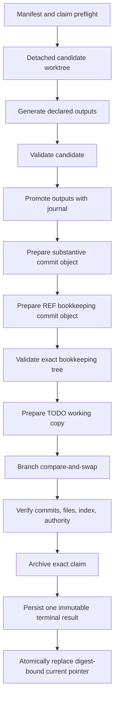

# Fail-closed legacy runner transactions

Status: implemented safety bridge for the legacy singleton runner. This is not the permanent Feature `0037` queue.

## Why this exists

Legacy `run.sh` files repeatedly copied the same dangerous sequence:

1. generate;
2. validate;
3. edit `TODO.md`;
4. delete a claim;
5. stage paths;
6. commit.

Small mistakes caused real repair work: validation errors were represented only in output, bookkeeping happened before validation, wildcard claim deletion removed recovery state, heredoc/regex mistakes damaged Task blocks, amend changed recorded commit IDs, and the ambient Git index could add unrelated work.

`_src/tools/runner_transaction.py` replaces that handwritten orchestration with one narrow `close-task-v1` transaction. A manifest selects fixed action IDs. It cannot contain a shell command, executable path, pathspec, wildcard, or free-form action.

## Scope and retirement

The helper is a pre-cutover bridge:

- it operates only under the current `legacy-lists` authority;
- it supports one complete Task-closing profile;
- it reuses concepts intended for the typed action queue;
- it must be mapped into or retired by Task `0037-46.01`/`0037-46.02` rather than becoming a competing runner protocol.

It does not change the singleton runner lifecycle in `SANDBOX.md`. A sandboxed agent still publishes one parameterless `run.sh`; the safe envelope merely delegates all phases to this tool.

## Safety model in simple terms

The transaction follows these rules:

- **One identity:** exact Task, request, owner token, claim, manifest, base commit, branch, and authority selector.
- **One declared scope:** exact files only. Directories, globs, pathspec magic, `.git`, symlinks, missing output parents, and runtime-log aliases are rejected.
- **No arbitrary command:** only reviewed action IDs in the source registry are accepted.
- **Work on a candidate:** source inputs are copied into a detached worktree. Generation may change only declared outputs. Validation may not change source or output files.
- **Treat structured errors as failures:** a declared JSON report must be freshly created and contain `success: true`, integer `exit_code: 0`, and a `findings` array with no error/failure values.
- **Promote only after validation:** generated files and the prospective TODO closure are installed with per-file atomic replacement and a retained promotion journal.
- **Never use the ambient index:** exact blobs and trees are prepared through a temporary index. Existing unrelated staged entries are checked before and after publication.
- **Never amend:** the substantive and bookkeeping commits are created as separate objects. The bookkeeping commit records the real substantive hash.
- **Publish once:** both commits are validated first; then the captured branch advances once with `git update-ref <branch> <bookkeeping> <expected-base>`. If another writer wins, compare-and-swap fails and the transaction rolls its files back without replacing the winner.
- **Keep recovery state:** the exact claim remains present through final-tree validation and branch publication. It is moved to retained request evidence only at the final successful archival step.
- **Never print a false PASS:** failure to persist the result is a failed transaction. Before claim archival, only the non-terminal `prepared-result.json` recovery artifact is durable; a terminal `passed` result is written only after successful archival.

## Required claim fields

The active top-level claim filename must contain the exact Task ID and request ID. In addition to normal claim content, it carries these plain, one-line machine fields:

```text
task_id: 0038-01
request_id: example-0038-01-20260816-a1b2c3
owner_token: agent:example:0038-01:example-0038-01-20260816-a1b2c3
base_commit: 0123456789abcdef0123456789abcdef01234567
state: [p]
transaction_profile: close-task-v1
transaction_manifest: output/requests/0038-01/example-0038-01-20260816-a1b2c3.json
transaction_actions_json: [{"id":"generate-site","timeout_seconds":900,"reports":[]},{"id":"validate-project","timeout_seconds":900,"reports":[]}]
transaction_authority_json: {"authority_epoch":"legacy-writable","authority_profile":"legacy-lists","runner_protocol":"runner-request@v1","selector_path":"agent-workflow.json","write_phase":"legacy-writable"}
transaction_commit_message_json: "feat(0038-01): implement the requested change\n\nUser-Prompt-Provenance:\n<verbatim user prompt>"
transaction_bookkeeping_json: {"commit_message":"docs(todo): close Task 0038-01","closure_text":"Implemented and verified the declared change.","todo_path":"TODO.md"}
transaction_read_paths_json: ["_src/generate.py","_src/sources/pages/example.json","_src/validate.py","agent-workflow.json","output/requests/0038-01/example-0038-01-20260816-a1b2c3.json"]
transaction_write_paths_json: ["TODO-example-0038-01-example-0038-01-20260816-a1b2c3.md","TODO.md","_src/sources/pages/example.json","example.html"]
```

The JSON values are compact JSON with no spaces and lexicographically sorted paths. They are intentionally copyable without running a hash command. Every material action/report/timeout, authority, commit/provenance, bookkeeping, read, and write control is bound verbatim; changing one after claim creation fails preflight. The result records SHA-256 digests for the complete normalized contract and the exact manifest bytes actually parsed.

`transaction_read_paths_json` is the sorted union of manifest `read_paths`, `input_paths`, the authority selector, and manifest path. `transaction_write_paths_json` is the sorted union of `substantive_paths`, `TODO.md`, and the exact claim path.

## Manifest

A complete example:

```json
{
  "schema": "legacy-runner-transaction@v1",
  "profile": "close-task-v1",
  "identity": {
    "task_id": "0038-01",
    "request_id": "example-0038-01-20260816-a1b2c3",
    "owner_token": "agent:example:0038-01:example-0038-01-20260816-a1b2c3",
    "claim_path": "TODO-example-0038-01-example-0038-01-20260816-a1b2c3.md",
    "manifest_path": "output/requests/0038-01/example-0038-01-20260816-a1b2c3.json",
    "expected_base": "0123456789abcdef0123456789abcdef01234567"
  },
  "authority": {
    "selector_path": "agent-workflow.json",
    "authority_epoch": "legacy-writable",
    "authority_profile": "legacy-lists",
    "write_phase": "legacy-writable",
    "runner_protocol": "runner-request@v1"
  },
  "scope": {
    "read_paths": [
      "_src/generate.py",
      "_src/validate.py"
    ],
    "input_paths": [
      "_src/sources/pages/example.json"
    ],
    "output_paths": [
      "example.html"
    ],
    "substantive_paths": [
      "_src/sources/pages/example.json",
      "example.html"
    ]
  },
  "actions": [
    {
      "id": "generate-site",
      "timeout_seconds": 900,
      "reports": []
    },
    {
      "id": "validate-project",
      "timeout_seconds": 900,
      "reports": []
    }
  ],
  "commit": {
    "substantive_message": "feat(0038-01): implement the requested change\n\nUser-Prompt-Provenance:\n<verbatim user prompt>"
  },
  "bookkeeping": {
    "todo_path": "TODO.md",
    "closure_text": "Implemented and verified the declared change.",
    "commit_message": "docs(todo): close Task 0038-01"
  }
}
```

### Important preconditions

- `expected_base` is a full 40-character commit ID.
- The selected Task is already committed as `[p]` in `TODO.md` at that base.
- The working `TODO.md` byte-for-byte matches the base blob. This prevents unrelated shared-file edits from entering closure. Commit coordination state before using the close profile.
- The claim may be tracked, modified, or untracked, but its exact bytes must remain unchanged throughout the transaction.
- `input_paths` are pre-existing manually edited source files copied into the candidate.
- `output_paths` are exact generated files. Their parent directories already exist.
- `substantive_paths` is exactly the union of inputs and outputs.
- Every action report path is fresh output from that action. A report is copied into retained request evidence with digest and size.
- The substantive commit message includes the complete verbatim user-prompt provenance required by `AGENTS.md`.
- `closure_text` and the bookkeeping commit subject are single lines, preventing Markdown structure injection.

## Thin `run.sh`

Generate the only accepted envelope form with:

```text
python3 _src/tools/runner_transaction.py render-envelope \
  --manifest output/requests/0038-01/example-0038-01-20260816-a1b2c3.json
```

The resulting one-use request is only:

```bash
#!/bin/bash
set -euo pipefail
cd /tmp/autodocs
exec python3 _src/tools/runner_transaction.py run --manifest output/requests/0038-01/example-0038-01-20260816-a1b2c3.json
```

Check an envelope without executing its transaction:

```text
python3 _src/tools/runner_transaction.py lint-envelope run.sh
```

The linter rejects extra commands, direct generation/validation, inline Python, deletion, Git mutation, and any bytes that differ from the canonical wrapper.

A privileged agent may use `check` for a read-only manifest/preflight check:

```text
python3 _src/tools/runner_transaction.py check \
  --manifest output/requests/0038-01/example-0038-01-20260816-a1b2c3.json
```

Sandboxed agents route all execution through the runner as required by `SANDBOX.md`; these command examples describe the tool interface and are not permission for direct execution.

## Phases



No later node runs after a failed earlier node.

## Evidence and output bounds

Request evidence lives under:

```text
output/logs/<task-id>/<request-id>/
```

It includes:

- complete stdout/stderr files per action, kept out of conversation output;
- retained and digested structured reports;
- `promotion-journal.json`;
- `prepared-result.json` before branch publication;
- exactly one immutable terminal `result.json` for that Task/request attempt;
- `claim-before-finalize.md` and, on success, `finalized-claim.md`;
- final-tree validation logs.

The Task-level `output/logs/<task-id>/current.json` is the only mutable result
pointer. It is atomically replaced **only after** the target `result.json` has
been durably written. The pointer names Task/request identity, the exact
relative result path, the SHA-256 of the immutable result bytes, terminal
verdict and lifecycle state. Readers verify all of those fields against the
referenced bytes; malformed, stale, missing, or digest-mismatched pointers are
invalid, never a fallback to a log. A valid `failed`, unpublished pointer proves
only a retained unsuccessful attempt, never completion. Retrying requires a
fresh request ID, so a later attempt moves this pointer without overwriting
earlier attempt evidence; a same-request rerun fails without changing its
journal, result, or pointer.

`output/run-current.log`, `output/run-current.sh`, a retained runner script,
and a journal on their own are operational traces only. They are never
interpreted as Task pending/completed state and cannot replace a valid
`current.json` plus immutable result. Partial attempts retain an explicit
transaction-journal lifecycle marker, such as `result-persisted` or
`result-persisted-pointer-pending`.

Conversation-facing output is one line per phase plus one final verdict. Complete child-process output stays in files.

## Recovery semantics

Every mutation boundary is recorded in
`output/logs/<task-id>/<request-id>/transaction-journal.json`. The journal binds
PID plus process-start identity, Task/request/owner, expected base, manifest and
contract digests, the **exact claim path**, branch ref, prepared commit objects,
publication state, and claim-finalization state. Signal handlers for `SIGTERM`,
`SIGHUP`, and `SIGINT` persist failure/journal evidence, attempt only drift-safe
rollback, release their own lock, and exit non-zero.

| Result/journal state | Meaning | Safe next action |
|---|---|---|
| No journal, claim present | Preflight did not establish durable transaction state | Inspect the exact claim, lock, HEAD, and request directory; do not rerun blindly |
| `failed`, `published: false` | No transaction commit was published | Run `recover`; preserve the claim/journal/backups, resolve any rollback drift, then issue a fresh request ID against the current base |
| `prepared` | Commit objects and TODO candidate existed, but branch publication was not confirmed | Run `recover`; dangling objects are evidence, not completion |
| `failed`, `published: true` plus a `failed` current pointer | The final commit may be reachable, but the immutable attempt records a failure | Retain claim/result and reconcile the recorded failure; `finalize-claim` refuses a failed or mismatched pointer |
| `published`, no pointer or a valid exact `passed` pointer, claim retained | A hard stop occurred after CAS before terminal recovery completed | Run `recover`; its exact `finalize-claim` action validates the journal, archives the claim, then materializes the missing immutable result/pointer from `prepared-result.json` when necessary |
| `claim-finalized` | Exact claim archival completed but terminal-result persistence was interrupted | Run the exact `finalize-claim` recovery action; it preserves the archive and reconstructs only the missing journal-bound result/pointer |
| `result-persisted` / `result-persisted-pointer-pending` | Immutable terminal result exists but the current-pointer change is not proven | Preserve the result; inspect/reconcile the exact pointer rather than rerunning the request ID |
| `complete` plus a valid `passed` `current.json` | Commits, cleanup, immutable result, and digest-bound pointer passed | No recovery required |
| `complete` plus a valid `failed` `current.json` | An immutable terminal failure was retained; publication and claim state remain explicit in that result | Retain the claim and result; resolve the recorded finding, then use a fresh request ID |
| `rollback-blocked-by-drift` | A newer file edit appeared after promotion | Never overwrite it; retain backups and reconcile the two versions explicitly before a fresh request |

The privileged/read-only diagnostic command is:

```text
python3 _src/tools/runner_transaction.py doctor --root <repo>
```

It reports the lock holder/staleness, every non-complete transaction journal,
and every Task-level current-pointer validation result; it never deletes a lock
or changes repository state. A transaction may replace a lock only during normal
acquisition after PID **and process-start identity** prove that the recorded
holder is dead.

The read-only recovery planner is:

```text
python3 _src/tools/runner_transaction.py recover \
  --root <repo> --request-id <exact-request-id>
```

It requires exactly one matching journal. Zero matches fail `RTX-RECOVER-NOT-FOUND`;
multiple matches fail `RTX-RECOVER-AMBIGUOUS` rather than choosing one. It reports
the exact claim, state, and current-pointer validation. A proven
published-but-unfinalized transaction returns this deterministic command when
the pointer is absent or is a valid, journal-bound `passed` record; a malformed,
failed, or different-request pointer fails closed instead:

```text
python3 _src/tools/runner_transaction.py finalize-claim \
  --root <repo> --task-id <task-id> --request-id <request-id>
```

`finalize-claim` refuses any existing live **or stale** lock, unpublished or
unreachable commit, malformed/non-passing/different-request pointer, Task
mismatch, branch/commit mismatch, claim whose Task/request/owner differs from
the journal, ambiguous journal, or conflicting archive. It moves only the exact
journal-bound claim and leaves competing claims untouched. When a hard stop left
no terminal result or pointer, it reconstructs one immutable `result.json` from
the already retained `prepared-result.json`, binds it to the verified journal
commit/base/manifest/contract, and only then atomically installs `current.json`.
It never replaces an existing result, glob-selects an arbitrary claim, deletes a
lock, or overwrites a changed pointer.

## Supported Profiles

The transaction runner supports four declared execution profiles:

1. `close-task-v1`: Full Task closure profile requiring a generator phase, a validator phase, generated outputs, a substantive commit, and a parented REF bookkeeping commit that closes the Task in `TODO.md`.
2. `verify-and-commit-v1`: Scoped validation and path-limited commit profile. Allows validation-only action sequences without invoking unrelated site generators, permits empty `output_paths`, requires a substantive commit with provenance, and makes `bookkeeping` optional so focused substantive work can be safely published without forcing `TODO.md` closure.
3. `legacy-editor-candidate-v1`: Promotes an already-planned `legacy_task_editor.py` (Task `0038-05.01`) candidate — see [`legacy-task-editor.md`](legacy-task-editor.md) — through this coordinator's journal/lock/promote/rollback machinery. See "The editor-candidate profile" below.
4. `branch-merge-v1`: Typed `base-branch`/`merge-prereqs` bridge (Task `0038-20`), described in "`branch-merge-v1`: the typed branch/merge bridge" below.

## The editor-candidate profile (Task `0038-05.02`)

`legacy_task_editor.py plan` produces a content-addressed candidate directory
(`candidate.json` plus `blobs/`) and its own `promote` subcommand only
re-verifies that candidate and returns `LTE-PROMOTE-COORDINATOR-REQUIRED`
evidence — it never writes, because portable stdlib cannot make several
independent file paths atomically visible or provide race-safe rollback. The
`legacy-editor-candidate-v1` profile is that missing authoritative writer: it
consumes the candidate as a single typed action instead of a second parser or
a second promotion mechanism.

A manifest using this profile carries no `actions` (empty list — no
generate/validate subprocess runs) and no `bookkeeping` (the candidate's own
`TODO.md` change, if any, is already part of the single substantive commit;
there is no separate REF-closure commit). It adds one new top-level object:

```json
"editor": {
  "operation_path": "output/editor-candidates/0038-01-finalize.operation.json",
  "candidate_dir": "output/editor-candidates/0038-01-finalize",
  "candidate_manifest_path": "output/editor-candidates/0038-01-finalize/candidate.json",
  "expected_candidate_sha256": "<64-hex sha256 of candidate.json>"
}
```

`scope.output_paths` must equal `scope.substantive_paths` and must equal —
exactly, as a set — the paths named by the candidate's own `changes` array
(computed by `legacy_task_editor.plan_operation`, e.g. a `closure`/`wontfix`
Task-marker flip, or the three paths a `claim-finalization`/`claim-handoff`
touches: `TODO.md`, the original claim, and its archive).

Preflight calls `legacy_task_editor.verify_candidate_for_promotion` — the
exact same re-verification `legacy_task_editor.py promote` performs — which
rechecks the candidate manifest digest, every blob digest/size, the diff, the
full `read_set` (including every sibling `TODO-*.md` claim file, via
`_load_sources`), every `absent_paths` entry, and a complete fresh
re-plan/re-render of the embedded operation contract against the *current*
repository state. Any drift in any of those — a stale candidate, a concurrent
edit to `TODO.md` or a claim, or a declared `output_paths` set that disagrees
with the verified candidate — fails closed with an `RTX-EDITOR-*` rule before
any mutation. This recheck runs a second time, immediately before promotion,
inside `materialize_editor_candidate`.

Materialization writes each verified `after` blob into the detached candidate
worktree (or leaves the path absent for a `delete` change) and lets the
existing `promote_outputs`/`rollback_outputs`/promotion-journal machinery —
unchanged, and shared with every other profile — copy those files into the
real repository with per-file atomic replacement, journaled backups, and
fail-closed rollback on any injected or real failure. A single `prepare_substantive`
commit then lands all of the candidate's paths together; there is no second
bookkeeping commit for this profile.

### Retiring the duplicate closure renderer

`render_task_closure()` (used by `close-task-v1`'s `bookkeeping.closure_text`
step) is no longer an independent regex-based Task-boundary detector. It now
delegates Task/Feature/section-boundary structural parsing to
`legacy_task_editor.parse_backlog` — the same digest-bound parser
`legacy_task_editor.py` uses for every typed operation — so there is exactly
one Task-structure parser in this codebase, not two. It intentionally keeps
its own narrower precondition set (active `[p]` marker, no visible REF,
exactly one `Definition of Done` line) rather than also requiring
`legacy_task_editor`'s `**Claim (...):**` pointer/base-commit cross-check:
this coordinator's own coordination claim binds `base_commit` to the
*current* transaction's `expected_base` (see "Required claim fields" above),
not the Task's original pickup base, so the two are not generally equal and
`legacy_task_editor`'s closure operation's `_assert_pointer` invariant does
not apply to this unrelated, already-accepted convention.

## `branch-merge-v1`: the typed branch/merge bridge

`branch-merge-v1` implements the **`base-branch`** and **`merge-prereqs`** typed
actions specified by [`branch-merge-actions.md`](branch-merge-actions.md) (Task
`0038-19`) on top of this file's existing lock/journal/signal/resume/rollback
machinery (Task `0038-02`) and its validation/commit profile conventions (Task
`0038-18`). It never runs a generator/validator action (`actions` must be `[]`
and `input_paths`/`output_paths` must be empty) and never carries a `commit` or
`bookkeeping` block — a request that tries to smuggle either through this
profile fails closed with `BMA-COMMIT-FORBIDDEN` or
`BMA-ACCEPTANCE-RECORD-FORBIDDEN` at manifest-load time, before any Git
mutation is attempted.

A manifest using this profile carries an additional top-level `branch` object:

```json
{
  "schema": "legacy-runner-transaction@v1",
  "profile": "branch-merge-v1",
  "identity": { "...": "as above" },
  "authority": { "...": "as above" },
  "scope": {
    "read_paths": [],
    "input_paths": [],
    "output_paths": [],
    "substantive_paths": ["work-02.txt"]
  },
  "actions": [],
  "branch": {
    "typed_action": "merge-prereqs",
    "item_id": "0038-20",
    "target_branch": "0038-20",
    "capability_class": "unprivileged",
    "idempotence_key": "merge-prereqs:0038-20:0038-19",
    "sources": [
      { "dependency": "0038-19", "branch": "0038-19", "tip": "1111111111111111111111111111111111111a" }
    ]
  }
}
```

For `base-branch`, `branch.sources` is `[]` and `branch.parent_branch` names
the topology parent (`branch-workflow.md`); the loader rejects a
`base-branch` manifest that also declares non-empty `substantive_paths` (the
new ref's tree is always identical to the parent's), and rejects a
`merge-prereqs` manifest that declares a `parent_branch` at all (the loader
itself adds `"parent_branch": null` to the normalized in-memory shape, but
that key must never appear in the manifest bytes on disk — its presence there
is exactly what the loader's `BMA-PARENT-BRANCH-FORBIDDEN` rejects). The
claim's `transaction_branch_json` field must match the **normalized** branch
object `load_manifest` produces (including that `parent_branch: null`), not
the raw bytes written to the manifest file.

Authority is enforced structurally, not just by convention: the item's own
branch is the only legal `target_branch` for both typed actions implemented
here. A request whose `target_branch` differs from `branch.item_id` (a
Feature branch or `main`) is treated as crossing an integration checkpoint —
`integrate-checkpoint` — which this legacy bridge does not implement at all
(`BMA-ACTION-UNSUPPORTED`); if the bound `capability_class` is
`sandboxed-grunt` or `unprivileged`, the checkpoint-crossing attempt is
rejected first and more specifically as `BMA-AUTHORITY-VIOLATION`. Both
rejections happen during `load_manifest`, before Git is touched.

`merge-prereqs` performs one standard 2-parent merge commit per declared
source, strictly in sequence (never an octopus merge), inside a disposable
detached worktree; only after every source merges cleanly does it attempt a
single compare-and-swap `git update-ref <target> <final-tip> <expected-base>`
against the caller's own already-checked-out branch, then synchronizes exactly
the declared `substantive_paths` into the real working tree and appends
append-only "merged prerequisite branches" evidence — including every
`merged-branch-tip:.../merge-commit:...` pair — to the item's own active
claim. A content conflict aborts that merge step exactly like `git merge
--abort` (`BMA-MERGE-CONFLICT`); the destination branch and working tree are
left untouched and no partial merge is ever published. A conflict confined to
a `TODO-<agent-id>.md` claim path whose `owner_token:` line is byte-identical
on both sides is instead auto-unioned append-only (never rewriting the
`owner_token:` line); a claim conflict with **different** `owner_token:`
values fails closed as `BMA-CLAIM-FOREIGN-TOKEN` instead, exactly like a
generic conflict, but under a distinct rule ID.

`recover_transaction` recognizes an interrupted `branch-merge-v1` attempt
(`typed_action` in its journal) and reports `branch-published` /
`branch-unpublished` instead of the close-profile's finalize-claim states,
since branch/merge actions never archive the claim — it always travels
forward on the branch per `branch-workflow.md`, not into retained request
evidence.

Hermetic coverage lives in `BranchMergeTransactionTests` in
`_src/tools/test_runner_transaction.py`: base-off-parent, stale-parent-tip
rejection, single- and multi-source (sequential, non-octopus) merges,
same-owner-token claim-record auto-union, foreign-owner-token claim rejection,
a generic content conflict with full rollback, stale/undeclared source
rejection, sandboxed Task→Feature authority rejection, `integrate-checkpoint`
non-implementation, unrelated tracked-byte preservation, and a
publish-then-crash scenario recovered via `recover_transaction`.

## Current fixed actions

| Action ID | Phase | Command owned by the registry |
|---|---|---|
| `generate-site` | generate | current Python interpreter + `_src/generate.py` |
| `validate-project` | validate | current Python interpreter + `_src/validate.py` |
| `test-runner-transaction` | validate | current Python interpreter + `-m unittest _src.tools.test_runner_transaction -v` |

Adding an action requires a source change, tests, documentation, and review. A manifest cannot define one.

## Known boundaries

Version 1 intentionally:

- accepts exact files, not directory scopes;
- requires existing output parent directories;
- requires committed `[p]` TODO coordination state;
- does not provision dependencies, use credentials, access networks, or publish remotes;
- does not replace the future typed queue, issue-store closure, evidence store, task doctor, artifact garbage collector, or environment doctor;
- does not automatically resolve `rollback-blocked-by-drift`; it retains exact backups and journals and requires explicit reconciliation rather than overwriting newer bytes;
- does not retry an unpublished interrupted transaction under the same request ID; recovery preserves evidence and requires a fresh request bound to the current base;
- relies on the repository-wide coordination rules to avoid non-cooperating editors changing the same exact file during a short publication boundary. It detects resulting drift and retains recovery state rather than claiming success.

Stale-lock diagnosis, signal-safe hard-kill evidence, deterministic recovery
planning, and exact post-publication claim finalization are implemented. Future
queue/issue-store work may replace this legacy adapter, but must preserve these
fail-closed guarantees.

## Validation

The hermetic suite is:

```text
python3 -m unittest _src/tools/test_runner_transaction.py
```

It creates temporary Git repositories and covers manifest rejection, material claim-binding changes, parsed-manifest byte drift, generator failure, validator failure, timeout with per-action status/duration, signal cancellation, exit-zero structured errors, generator/input mutation, validator/tree mutation, promotion rollback, surfaced rollback failure, rollback blocked by newer bytes, dirty shared TODO rejection, unrelated staged-index preservation, two-commit REF closure, exact and competing claim archival, unpublished/locked finalization refusal, ambiguous recovery-journal refusal, deterministic interrupted-state planning, verified stale-lock replacement, post-CAS and post-claim-archive crash recovery, branch CAS loss, immutable terminal-result persistence, result-before-pointer crash boundaries, fresh-retry preservation, pointer/request/result digest tampering, runtime-parent symlink rejection, candidate symlink escape, dry-run behavior, closure-profile enforcement, hostile envelope paths, and structural Task-boundary rejection.
