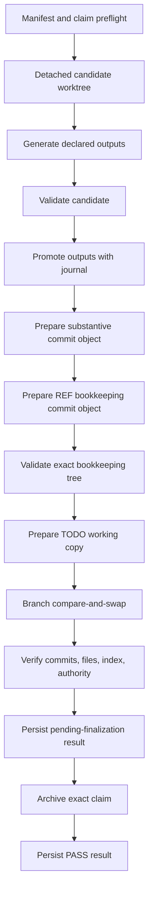

# Fail-closed legacy runner transactions

Status: implemented safety bridge for the legacy singleton runner. This is not the permanent Feature `0037` queue.

## Why this exists

Legacy `run.sh` files repeatedly copied the same dangerous sequence:

1. generate;
2. validate;
3. edit `TODO.md`;
4. delete a claim;
5. stage paths;
6. commit.

Small mistakes caused real repair work: validation errors were represented only in output, bookkeeping happened before validation, wildcard claim deletion removed recovery state, heredoc/regex mistakes damaged Task blocks, amend changed recorded commit IDs, and the ambient Git index could add unrelated work.

`_src/tools/runner_transaction.py` replaces that handwritten orchestration with one narrow `close-task-v1` transaction. A manifest selects fixed action IDs. It cannot contain a shell command, executable path, pathspec, wildcard, or free-form action.

## Scope and retirement

The helper is a pre-cutover bridge:

- it operates only under the current `legacy-lists` authority;
- it supports one complete Task-closing profile;
- it reuses concepts intended for the typed action queue;
- it must be mapped into or retired by Task `0037-46.01`/`0037-46.02` rather than becoming a competing runner protocol.

It does not change the singleton runner lifecycle in `SANDBOX.md`. A sandboxed agent still publishes one parameterless `run.sh`; the safe envelope merely delegates all phases to this tool.

## Safety model in simple terms

The transaction follows these rules:

- **One identity:** exact Task, request, owner token, claim, manifest, base commit, branch, and authority selector.
- **One declared scope:** exact files only. Directories, globs, pathspec magic, `.git`, symlinks, missing output parents, and runtime-log aliases are rejected.
- **No arbitrary command:** only reviewed action IDs in the source registry are accepted.
- **Work on a candidate:** source inputs are copied into a detached worktree. Generation may change only declared outputs. Validation may not change source or output files.
- **Treat structured errors as failures:** a declared JSON report must be freshly created and contain `success: true`, integer `exit_code: 0`, and a `findings` array with no error/failure values.
- **Promote only after validation:** generated files and the prospective TODO closure are installed with per-file atomic replacement and a retained promotion journal.
- **Never use the ambient index:** exact blobs and trees are prepared through a temporary index. Existing unrelated staged entries are checked before and after publication.
- **Never amend:** the substantive and bookkeeping commits are created as separate objects. The bookkeeping commit records the real substantive hash.
- **Publish once:** both commits are validated first; then the captured branch advances once with `git update-ref <branch> <bookkeeping> <expected-base>`. If another writer wins, compare-and-swap fails and the transaction rolls its files back without replacing the winner.
- **Keep recovery state:** the exact claim remains present through final-tree validation and durable result publication. It is moved to retained request evidence only at the final successful step.
- **Never print a false PASS:** failure to persist the result is a failed transaction. Before claim finalization the durable verdict is `published-pending-finalization`, never `passed`.

## Required claim fields

The active top-level claim filename must contain the exact Task ID and request ID. In addition to normal claim content, it carries these plain, one-line machine fields:

```text
task_id: 0038-01
request_id: example-0038-01-20260816-a1b2c3
owner_token: agent:example:0038-01:example-0038-01-20260816-a1b2c3
base_commit: 0123456789abcdef0123456789abcdef01234567
state: [p]
transaction_profile: close-task-v1
transaction_manifest: output/requests/0038-01/example-0038-01-20260816-a1b2c3.json
transaction_actions_json: [{"id":"generate-site","timeout_seconds":900,"reports":[]},{"id":"validate-project","timeout_seconds":900,"reports":[]}]
transaction_authority_json: {"authority_epoch":"legacy-writable","authority_profile":"legacy-lists","runner_protocol":"runner-request@v1","selector_path":"agent-workflow.json","write_phase":"legacy-writable"}
transaction_commit_message_json: "feat(0038-01): implement the requested change\n\nUser-Prompt-Provenance:\n<verbatim user prompt>"
transaction_bookkeeping_json: {"commit_message":"docs(todo): close Task 0038-01","closure_text":"Implemented and verified the declared change.","todo_path":"TODO.md"}
transaction_read_paths_json: ["_src/generate.py","_src/sources/pages/example.json","_src/validate.py","agent-workflow.json","output/requests/0038-01/example-0038-01-20260816-a1b2c3.json"]
transaction_write_paths_json: ["TODO-example-0038-01-example-0038-01-20260816-a1b2c3.md","TODO.md","_src/sources/pages/example.json","example.html"]
```

The JSON values are compact JSON with no spaces and lexicographically sorted paths. They are intentionally copyable without running a hash command. Every material action/report/timeout, authority, commit/provenance, bookkeeping, read, and write control is bound verbatim; changing one after claim creation fails preflight. The result records SHA-256 digests for the complete normalized contract and the exact manifest bytes actually parsed.

`transaction_read_paths_json` is the sorted union of manifest `read_paths`, `input_paths`, the authority selector, and manifest path. `transaction_write_paths_json` is the sorted union of `substantive_paths`, `TODO.md`, and the exact claim path.

## Manifest

A complete example:

```json
{
  "schema": "legacy-runner-transaction@v1",
  "profile": "close-task-v1",
  "identity": {
    "task_id": "0038-01",
    "request_id": "example-0038-01-20260816-a1b2c3",
    "owner_token": "agent:example:0038-01:example-0038-01-20260816-a1b2c3",
    "claim_path": "TODO-example-0038-01-example-0038-01-20260816-a1b2c3.md",
    "manifest_path": "output/requests/0038-01/example-0038-01-20260816-a1b2c3.json",
    "expected_base": "0123456789abcdef0123456789abcdef01234567"
  },
  "authority": {
    "selector_path": "agent-workflow.json",
    "authority_epoch": "legacy-writable",
    "authority_profile": "legacy-lists",
    "write_phase": "legacy-writable",
    "runner_protocol": "runner-request@v1"
  },
  "scope": {
    "read_paths": [
      "_src/generate.py",
      "_src/validate.py"
    ],
    "input_paths": [
      "_src/sources/pages/example.json"
    ],
    "output_paths": [
      "example.html"
    ],
    "substantive_paths": [
      "_src/sources/pages/example.json",
      "example.html"
    ]
  },
  "actions": [
    {
      "id": "generate-site",
      "timeout_seconds": 900,
      "reports": []
    },
    {
      "id": "validate-project",
      "timeout_seconds": 900,
      "reports": []
    }
  ],
  "commit": {
    "substantive_message": "feat(0038-01): implement the requested change\n\nUser-Prompt-Provenance:\n<verbatim user prompt>"
  },
  "bookkeeping": {
    "todo_path": "TODO.md",
    "closure_text": "Implemented and verified the declared change.",
    "commit_message": "docs(todo): close Task 0038-01"
  }
}
```

### Important preconditions

- `expected_base` is a full 40-character commit ID.
- The selected Task is already committed as `[p]` in `TODO.md` at that base.
- The working `TODO.md` byte-for-byte matches the base blob. This prevents unrelated shared-file edits from entering closure. Commit coordination state before using the close profile.
- The claim may be tracked, modified, or untracked, but its exact bytes must remain unchanged throughout the transaction.
- `input_paths` are pre-existing manually edited source files copied into the candidate.
- `output_paths` are exact generated files. Their parent directories already exist.
- `substantive_paths` is exactly the union of inputs and outputs.
- Every action report path is fresh output from that action. A report is copied into retained request evidence with digest and size.
- The substantive commit message includes the complete verbatim user-prompt provenance required by `AGENTS.md`.
- `closure_text` and the bookkeeping commit subject are single lines, preventing Markdown structure injection.

## Thin `run.sh`

Generate the only accepted envelope form with:

```text
python3 _src/tools/runner_transaction.py render-envelope \
  --manifest output/requests/0038-01/example-0038-01-20260816-a1b2c3.json
```

The resulting one-use request is only:

```bash
#!/bin/bash
set -euo pipefail
cd /tmp/autodocs
exec python3 _src/tools/runner_transaction.py run --manifest output/requests/0038-01/example-0038-01-20260816-a1b2c3.json
```

Check an envelope without executing its transaction:

```text
python3 _src/tools/runner_transaction.py lint-envelope run.sh
```

The linter rejects extra commands, direct generation/validation, inline Python, deletion, Git mutation, and any bytes that differ from the canonical wrapper.

A privileged agent may use `check` for a read-only manifest/preflight check:

```text
python3 _src/tools/runner_transaction.py check \
  --manifest output/requests/0038-01/example-0038-01-20260816-a1b2c3.json
```

Sandboxed agents route all execution through the runner as required by `SANDBOX.md`; these command examples describe the tool interface and are not permission for direct execution.

## Phases



No later node runs after a failed earlier node.

## Evidence and output bounds

Request evidence lives under:

```text
output/logs/<task-id>/<request-id>/
```

It includes:

- complete stdout/stderr files per action, kept out of conversation output;
- retained and digested structured reports;
- `promotion-journal.json`;
- `prepared-result.json` before branch publication;
- `result.json` with final or recoverable state;
- `claim-before-finalize.md` and, on success, `finalized-claim.md`;
- final-tree validation logs.

Conversation-facing output is one line per phase plus one final verdict. Complete child-process output stays in files.

## Recovery semantics

Every mutation boundary is recorded in
`output/logs/<task-id>/<request-id>/transaction-journal.json`. The journal binds
PID plus process-start identity, Task/request/owner, expected base, manifest and
contract digests, the **exact claim path**, branch ref, prepared commit objects,
publication state, and claim-finalization state. Signal handlers for `SIGTERM`,
`SIGHUP`, and `SIGINT` persist failure/journal evidence, attempt only drift-safe
rollback, release their own lock, and exit non-zero.

| Result/journal state | Meaning | Safe next action |
|---|---|---|
| No journal, claim present | Preflight did not establish durable transaction state | Inspect the exact claim, lock, HEAD, and request directory; do not rerun blindly |
| `failed`, `published: false` | No transaction commit was published | Run `recover`; preserve the claim/journal/backups, resolve any rollback drift, then issue a fresh request ID against the current base |
| `prepared` | Commit objects and TODO candidate existed, but branch publication was not confirmed | Run `recover`; dangling objects are evidence, not completion |
| `failed`, `published: true` | The final commit is reachable but working-tree or claim finalization is incomplete | Run `recover`; if all bindings pass it returns the exact `finalize-claim` command rather than repeating generation |
| `published-pending-finalization` | Commits and working TODO are verified; exact claim archival/final result is pending | Execute only the exact `finalize-claim` command returned by `recover` |
| `passed`/`complete`, `claim_finalized: true` | Commits, working files, result, and exact journal-bound claim archival passed | No recovery required |
| `rollback-blocked-by-drift` | A newer file edit appeared after promotion | Never overwrite it; retain backups and reconcile the two versions explicitly before a fresh request |

The privileged/read-only diagnostic command is:

```text
python3 _src/tools/runner_transaction.py doctor --root <repo>
```

It reports the lock holder/staleness and every non-complete transaction journal;
it never deletes a lock or changes repository state. A transaction may replace a
lock only during normal acquisition after PID **and process-start identity** prove
that the recorded holder is dead.

The read-only recovery planner is:

```text
python3 _src/tools/runner_transaction.py recover \
  --root <repo> --request-id <exact-request-id>
```

It requires exactly one matching journal. Zero matches fail `RTX-RECOVER-NOT-FOUND`;
multiple matches fail `RTX-RECOVER-AMBIGUOUS` rather than choosing one. It reports
the exact claim and state. For a proven published-but-unfinalized transaction it
returns this deterministic command:

```text
python3 _src/tools/runner_transaction.py finalize-claim \
  --root <repo> --task-id <task-id> --request-id <request-id>
```

`finalize-claim` refuses any existing live **or stale** lock, unpublished or
unreachable commit, Task mismatch, branch/commit mismatch, claim whose
Task/request/owner differs from the journal, ambiguous journal, or pre-existing
archive. It moves only the exact journal-bound claim and leaves competing claims
untouched. It then marks the journal `complete`; it never glob-selects an
arbitrary claim, deletes a lock, or overwrites newer edits.

## Supported Profiles

The transaction runner supports two declared execution profiles:

1. `close-task-v1`: Full Task closure profile requiring a generator phase, a validator phase, generated outputs, a substantive commit, and a parented REF bookkeeping commit that closes the Task in `TODO.md`.
2. `verify-and-commit-v1`: Scoped validation and path-limited commit profile. Allows validation-only action sequences without invoking unrelated site generators, permits empty `output_paths`, requires a substantive commit with provenance, and makes `bookkeeping` optional so focused substantive work can be safely published without forcing `TODO.md` closure.

## Current fixed actions

| Action ID | Phase | Command owned by the registry |
|---|---|---|
| `generate-site` | generate | current Python interpreter + `_src/generate.py` |
| `validate-project` | validate | current Python interpreter + `_src/validate.py` |
| `test-runner-transaction` | validate | current Python interpreter + `-m unittest _src.tools.test_runner_transaction -v` |

Adding an action requires a source change, tests, documentation, and review. A manifest cannot define one.

## Known boundaries

Version 1 intentionally:

- accepts exact files, not directory scopes;
- requires existing output parent directories;
- requires committed `[p]` TODO coordination state;
- does not provision dependencies, use credentials, access networks, or publish remotes;
- does not replace the future typed queue, issue-store closure, evidence store, task doctor, artifact garbage collector, or environment doctor;
- does not automatically resolve `rollback-blocked-by-drift`; it retains exact backups and journals and requires explicit reconciliation rather than overwriting newer bytes;
- does not retry an unpublished interrupted transaction under the same request ID; recovery preserves evidence and requires a fresh request bound to the current base;
- relies on the repository-wide coordination rules to avoid non-cooperating editors changing the same exact file during a short publication boundary. It detects resulting drift and retains recovery state rather than claiming success.

Stale-lock diagnosis, signal-safe hard-kill evidence, deterministic recovery
planning, and exact post-publication claim finalization are implemented. Future
queue/issue-store work may replace this legacy adapter, but must preserve these
fail-closed guarantees.

## Validation

The hermetic suite is:

```text
python3 -m unittest _src/tools/test_runner_transaction.py
```

It creates temporary Git repositories and covers manifest rejection, material claim-binding changes, parsed-manifest byte drift, generator failure, validator failure, exit-zero structured errors, generator/input mutation, validator/tree mutation, promotion rollback, surfaced rollback failure, rollback blocked by newer bytes, dirty shared TODO rejection, unrelated staged-index preservation, two-commit REF closure, exact and competing claim archival, unpublished/locked finalization refusal, ambiguous recovery-journal refusal, deterministic interrupted-state planning, signal termination, verified stale-lock replacement, post-publication recovery, branch CAS loss, durable-result failure without stale PASS, runtime-path alias rejection, candidate symlink escape, dry-run behavior, closure-profile enforcement, hostile envelope paths, and structural Task-boundary rejection.
