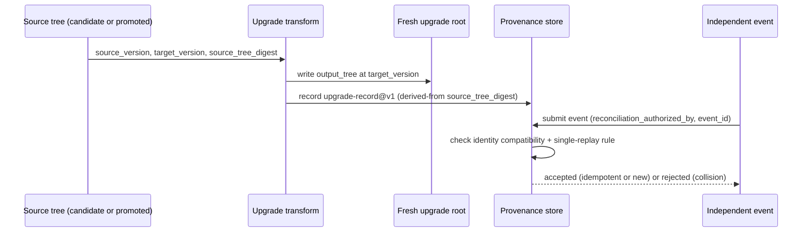

# Schema Upgrades and Independently Authored Event Reconciliation

Status: review-ready contract for task 0037-06.02. Depends on `migration-state@v1` (issue-migration-shadow-import.md) and `provenance-event@v1` (provenance-contract.md); it composes with both without duplicating their identity, storage, or authority rules.

## Purpose

Define how a shadow-imported or already-promoted candidate tree is upgraded from one schema version to a newer one, and how provenance/reconciliation events authored independently of an import run (e.g. by a privileged agent or a parallel session) are replayed against candidate state without violating immutability or promotion guarantees.

## Upgrade model: pure version-to-version transform

A schema upgrade is modeled as a pure function `upgrade(source_version, target_version, input_tree) -> output_tree` that:

- Never mutates the input tree or any existing run root in place.
- Writes its result into a **fresh** root `_src/output/schema-upgrade/<upgrade-run-id>/<target_version>/`, following the same disposable-root convention as `migration-state@v1` run roots.
- Must produce output that is **semantically equal** to a clean import of the same logical source performed directly at `target_version` (byte-for-byte equality is not required; field-for-field semantic equality after normalization is required).
- Is only defined for a declared, linear sequence of adjacent schema versions; multi-step upgrades are composed by chaining single-step transforms, never by a direct skip-version transform.
- Records `source_version`, `target_version`, `source_tree_digest`, `output_tree_digest`, and the upgrade-run ID in an `upgrade-record@v1` object colocated with the fresh root.

## Post-import provenance placement

Provenance/reconciliation state describing *what happened to* imported or upgraded items (findings, decisions, reconciliation events) is never stored inside a disposable candidate/upgrade tree (`_src/output/issue-migration/<run-id>/...` or `_src/output/schema-upgrade/<upgrade-run-id>/...`). It is stored under the standing provenance store defined by `provenance-contract.md`, referencing the disposable tree's immutable tree digest via `derived-from` / `produced-by` edges. Deleting or discarding a disposable root never deletes the provenance events that reference it.

## Independently authored event reconciliation

An event authored independently of the upgrade run currently executing (e.g. a manually filed finding, or an event produced by a separate agent session) may be reconciled against upgraded state only when:

1. **Identity compatibility** — the event's referenced URIs (`typed-reference@v1`) resolve to kinds and endpoints valid under the *target* schema version's relation table.
2. **Explicit authorization** — the event carries a `reconciliation_authorized_by` field naming the decision/session that permitted cross-run replay; absent this field the event is not eligible for replay.
3. **Single replay** — an event ID (UUIDv7) already present in the target provenance store as a canonical payload is replayed **at most once**; a second replay attempt with an identical payload is a no-op idempotent replay (per `provenance-contract.md` identity rule), and a second replay attempt with a *different* payload under the same ID is a rejected collision.

Reconciliation never rewrites the independently authored event's original payload or timestamp; it only creates the linking edges required to attach it to the upgraded tree's digest.

## Never-overwrite and conflict rules

The following conditions are never silently merged. Each produces a stable, named blocking finding instead:

| Condition | Finding kind |
|---|---|
| Upgrade target already has independently authored text/state at a colliding path | `upgrade-overwrite-conflict` |
| Source watermark used for upgrade input is stale relative to `migration-state@v1.latest_source` | `upgrade-stale-base` |
| Upgrade target path was deleted by an independently authored event before this upgrade ran | `upgrade-target-deleted` |
| Upgraded representation diverges from a clean same-version import beyond declared normalization rules | `upgrade-representation-drift` |
| Same event ID replayed with a non-identical payload | `event-replay-duplicate` |

All five finding kinds are terminal/blocking: an upgrade-run or reconciliation attempt that produces any of them is not promotable and must not be retried in place; a new upgrade-run ID is required after the underlying condition is resolved.

## Sequence

## Coverage required by fixtures

The fixture set `issues/_schema/fixtures/schema-upgrade-reconciliation-v1/` must cover at minimum:

1. One source change plus upgrade — a valid single-step upgrade producing an `upgrade-record@v1` semantically equal to a clean import at the target version.
2. Authorized preservation — an independently authored event with `reconciliation_authorized_by` set, replayed exactly once and accepted.
3. Collision/deletion conflicts — one fixture per blocking finding kind in the table above (5 invalid fixtures).
4. Clean-import equivalence — a fixture pair demonstrating that `upgrade(v1->v2, import(v1_source))` and `import_at_target(v2, same_logical_source)` normalize to the same semantic output.

## Validation rules

The schema enforces closed state and exact field shapes for `upgrade-record@v1`. Semantic validation additionally requires: `source_version` and `target_version` are adjacent per the declared version sequence; `output_tree_digest` is only present when no blocking finding was produced; every reconciled event references a `reconciliation_authorized_by` value; and a rejected collision never mutates the previously stored canonical payload for that event ID.
