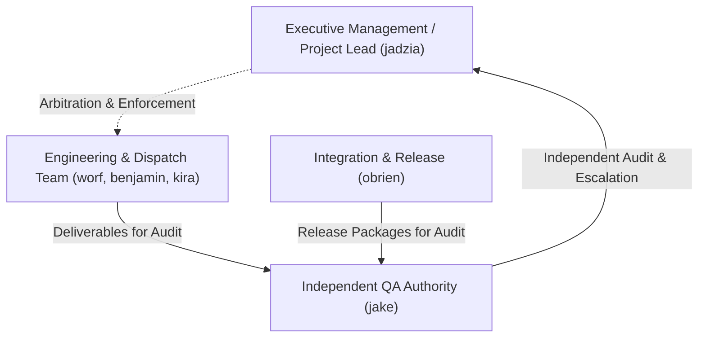
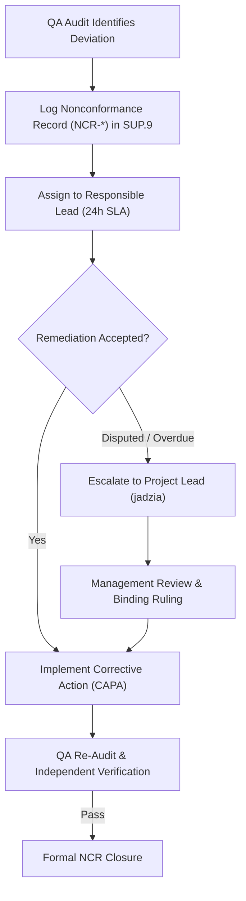

# SUP.1 Quality Assurance Plan & Conformance Framework (0014-07)

## 1. Document Control & Objective QA Purpose
- **Process ID**: `SUP.1` (Quality Assurance)
- **Feature / Task**: `0014-07` (PREREQ: `0011-04`, `0011-05`, `0014-01`, `0014-06`)
- **Governing Standard**: Automotive SPICE (PAM 3.1 / PAM 4.0) SUP.1 & ISO/IEC/IEEE 12207
- **QA Manager / Independent Authority**: `jake` (QA-Manager, Team DeepSpace9)
- **Status**: `REVIEW`
- **Purpose & Scope**: Provide objective, independent assurance that all engineering work products, execution workflows, and governance processes strictly comply with approved quality plans, pipeline standards, and safety contracts, establishing clear nonconformance escalation paths, management resolution protocols, and recurrence prevention mechanisms.

---

## 2. Independence Safeguards & Authority Boundaries

### Independence Principles:
1. **Organizational & Reporting Separation**:
   - The QA Manager (`jake`) operates with independent authority outside the engineering chain of command, reporting audit findings and escalations directly to Project Leadership and Management.
2. **Four-Eyes Prohibition on Self-Auditing**:
   - QA personnel are strictly prohibited from implementing, modifying, or self-reviewing product code or artifacts they are assigned to audit.
3. **Unfettered Audit Mandate**:
   - QA holds unrestricted read access across all worktrees, branches, commit logs, test execution suites, risk logs, and mailbox archives.
4. **Binding Release Veto**:
   - QA holds binding authority to block release gating (`SPL.2`) and baseline freezing upon unaddressed Critical (NC-1) nonconformances.

---

## 3. Process and Work-Product Conformance Checks

### 3.1 Work-Product Conformance Audits
- **Requirements (`SWE.1` / `SYS.2`)**: Verification of unique requirement IDs (`REQ-*`), unambiguous acceptance criteria, ASIL classifications, and bidirectional stakeholder trace links.
- **Architecture & Design (`SWE.2` / `SWE.3`)**: Conformance to architectural style, interface schemas, resource budgets, and Four-Eyes review records.
- **Code Implementation**: Automated static analysis, MISRA compliance, zero unsuppressed compiler warnings, and clean worktree lineage.
- **Verification Evidence (`SWE.4`–`SWE.6`)**: 100% test execution pass rates, structural coverage thresholds (100% statement/branch), and JUnit/pytest XML retention.
- **Configuration & Release Items (`SUP.8` / `SPL.2`)**: Cryptographic commit hashes, clean worktree status, manifest digest verification, and release notes completeness.

### 3.2 Process Execution Conformance Audits
- Strict branch/worktree isolation per task claim (`TODO-*.md`).
- Atomic offer assignment state transitions (`awarded` $\rightarrow$ `in_progress` $\rightarrow$ `review` $\rightarrow$ `accepted`).
- Timely triage and linking of problem records (`SUP.9`) and change requests (`SUP.10`).
- Periodic risk management reviews and mitigation updates (`MAN.5`).

---

## 4. Audit Schedule, Cadence & Inspection Gates

| Audit Tier | Inspection Focus | Frequency / Trigger | Target Artifacts | Lead Auditor | Gate Effect |
| :--- | :--- | :--- | :--- | :--- | :--- |
| **Tier 1: Continuous Preflight** | Automated CI quality checks | Every commit / PR | Linters, type checks, unit tests, schema validators | Automated CI Runner | Blocks PR merge |
| **Tier 2: Task / Sprint Gate** | Claim & work-product review | Feature task completion | Claim files, commit logs, test evidence, trace links | `jake` (QA Manager) | Blocks task acceptance |
| **Tier 3: Milestone Baseline** | Full ASPICE process audit | Release candidate freeze | Complete evidence pack, risk register, audit logs | `jake` & `odo` (Safety) | Blocks release tagging |

---

## 5. Nonconformance Records, Escalation & Management Resolution

### 5.1 Nonconformance Severity Taxonomy
- **NC-1 (Critical)**: Violation of safety gates, process circumvention, unverified claims, missing traceability on safety paths, or direct unreviewed commits to `main`. **Blocks release unconditionally.**
- **NC-2 (Major)**: Missing verification artifacts, untested degraded modes, or unresolved non-blocking test warnings without an approved waiver. Requires corrective action before milestone completion.
- **NC-3 (Minor)**: Formatting deviations, typo in non-normative sections, or minor documentation omissions. Resolved in normal sprint cadence.

### 5.2 Escalation & Management Resolution Protocol
1. QA issues Nonconformance Report (`NCR-YYYYMMDD-SEQ`) logged in `SUP.9`.
2. Responsible engineer/dispatcher has 24 hours to submit root cause analysis and Corrective Action Plan (CAP).
3. If remediation is disputed or overdue, QA immediately escalates to Project Lead (`jadzia`).
4. Project Lead arbitrates and issues a binding resolution directive. Unresolved governance disputes escalate to executive Management.

---

## 6. Recurrence Prevention & Closure Criteria

### 6.1 Systematic Recurrence Prevention (CAPA & PIM.3)
- Root causes evaluated using 5-Whys and Fishbone methodology.
- Prevention mechanisms codified into:
  1. Automated pre-commit and CI admission linting rules (preventing human error recurrence).
  2. Process SOP updates and engineer onboarding curricula (`0015-01`).
  3. Lessons learned repository updates (`docs/pipeline/problem-resolution-lessons-learned.md`).

### 6.2 Formal NCR Closure Criteria
An NCR transitions to `CLOSED` only when:
- [x] Corrective action is implemented on a dedicated item branch.
- [x] Independent QA re-audit confirms 100% compliance with evidence attached.
- [x] Recurrence prevention measure is integrated and active in CI or process baseline.
- [x] Authenticated signature recorded by QA Manager (`jake`).
