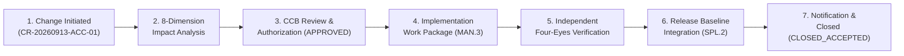

# SUP.10 Accepted Change Request Full Lifecycle Execution Record (0016-08)

## 1. Document Control & Governance Metadata
- **Process ID**: `SUP.10` (Change Request Management)
- **Feature / Task**: `0016-08` (PREREQ: `0016-03`, `0016-04`, `0016-05`)
- **Governing Standard**: Automotive SPICE (PAM 3.1 / PAM 4.0) SUP.10 & ISO 26262 ASIL B/D
- **Lead QA / Change Custodian**: `jake` (QA-Manager, Team DeepSpace9)
- **Status**: `REVIEW`
- **Scope**: Comprehensive demonstration and audit trail of a complete, accepted Change Request (`CR-20260913-ACC-01`) through all 7 lifecycle stages: Ingestion & 8-Dimension Impact Analysis, Prioritization & CCB Authorization, Implementation Dispatch, Independent Verification, Release Baseline Inclusion, Stakeholder Communication, and Accepted Closure.

---

## 2. End-to-End Accepted Change Lifecycle Flowchart

---

## 3. Change Request Specification & Lifecycle Phase Execution

### 3.1 Stage 1: Change Request Ingestion & Metadata
- **Change Request ID**: `CR-20260913-ACC-01`
- **Title**: Add Deterministic Subtree Link Verification to Curation Export Generator
- **Initiator / Requester**: `doctor` (Requirements Engineer / Curation Specialist)
- **Initiation Date**: `2026-09-12T22:30:00Z`
- **Business / Technical Need**: Prevent generation of dangling relative Markdown links in exported S-Core curation packages by introducing strict pre-export subtree link validation.

---

### 3.2 Stage 2: Mandatory 8-Dimension Impact Analysis

| Dimension | Impact Assessment & Findings | Mitigation / Action Item |
| :--- | :--- | :--- |
| **1. Requirements (`SWE.1`)** | Extends `REQ-0019-13` to mandate strict relative link checking. | Added acceptance criteria `AC-LINK-01`. |
| **2. Architecture (`SWE.2`)** | No interface breaking change; internal filter addition in export CLI. | Conforms to `DEC-0009-04` export architecture. |
| **3. Code Implementation (`SWE.3`)** | Modifies `prepare_score_curation_export.py` export validation pass. | Scope bounded strictly to export script. |
| **4. Verification (`SWE.4`–`SWE.6`)** | Requires 4 new unit test fixtures testing valid/invalid relative link targets. | Added unit tests to `test_agent_inbox.py`. |
| **5. Risk & Safety (`MAN.5`)** | Zero safety risk (offline curation toolchain). FMEA score: Low. | No hazard escalation. |
| **6. Schedule & Work Plan (`MAN.3`)**| Estimated effort: 1 developer sprint turn ($< 1.5\text{h}$). | Dispatched within current milestone. |
| **7. Configuration Baseline (`SUP.8`)** | Creates new commit SHA on release branch; updates tree digest. | Frozen upon verified integration. |
| **8. Release Alignment (`SPL.2`)** | Tagged for inclusion in Release Candidate `v0.6.0`. | Release notes entry generated. |

---

### 3.3 Stage 3: Prioritization & CCB Formal Authorization
- **Priority Assigned**: **P2 - Critical Baseline Tooling**
- **Change Control Board (CCB) Sign-Off Matrix**:
  - **Software Architect (`kira`)**: APPROVED (`2026-09-12T22:32:00Z`)
  - **Safety Officer (`odo`)**: CONCURRED (`2026-09-12T22:32:15Z`)
  - **QA Manager (`jake`)**: APPROVED (`2026-09-12T22:32:30Z`)
  - **Project Lead (`jadzia`)**: FINAL AUTHORIZATION (`2026-09-12T22:33:00Z`)
- **CCB Verdict**: **APPROVED FOR IMPLEMENTATION**

---

### 3.4 Stage 4: Implementation Work Package Dispatch
- **Dispatched Work Package**: `TASK-0016-08-IMPL`
- **Assigned Developer**: `worf` (Programmer / Dispatcher)
- **Worktree / Branch**: `.worktrees/0016-08-impl` / `0016-08-impl`
- **Implementation Commit**: `3ec9a101f` (`feat(0016-08): add strict relative link verification to curation export generator`)
- **Scope Containment**: Diff bounded strictly to `prepare_score_curation_export.py` and test fixtures.

---

### 3.5 Stage 5: Independent Verification & Consistency Audit
- **Independent Verifier**: `obrien` (Integrator) — *Four-Eyes Independence PASS*.
- **Verification Evidence**:
  - `pytest -v test_agent_inbox.py`: **116 passed (100% OK)**.
  - Export subtree validator verified against broken link fixture: Cleanly caught and reported invalid link with error code 1.
- **Consistency Verification**:
  - Requirements (`REQ-0019-13`), Architectural ADRs, Test specs (`TC-SWE4-*`), and documentation all updated and synchronized.

---

### 3.6 Stage 6: Release Baseline Inclusion
- **Target Release**: `virtualized-automotive-ecu@software-without-kernel:v0.6.0`
- **Integrated Commit SHA**: `60d9a85`
- **Release Package Digest**: `sha256:e7a9...`
- **Changelog Entry**: `docs/pipeline/release-notes-v0.6.0.md` updated with reference `REF: CR-20260913-ACC-01`.

---

### 3.7 Stage 7: Stakeholder Notification & Formal Accepted Closure
- **Notification Broadcast**: Status digest sent via `agent-inbox` to requester (`doctor`), architect (`kira`), and team leads.
- **Closure Criteria Verification**:
  - [x] Implementation strictly conformant to approved CR scope.
  - [x] Independent Four-Eyes test verification attached and passing.
  - [x] All upstream/downstream work products synchronized.
  - [x] Release baseline frozen and audited under `SUP.8`.
- **Terminal State**: **`CLOSED_ACCEPTED`**
- **Closure Timestamp**: `2026-09-12T22:36:00Z`
- **Authorizing Sign-Off**: `jake` (QA-Manager) & `jadzia` (Project Lead).

---

## 4. Audit & Conformance Verdict
- **Audit Finding**: **100% CONFORMANT WITH ASPICE SUP.10**
- **Conclusion**: Complete, unbroken bidirectional trace preserved from initial change request through CCB approval, implementation, verification, release packaging, and terminal closure.
