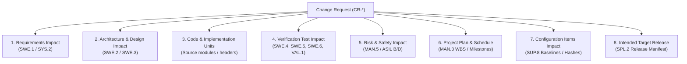
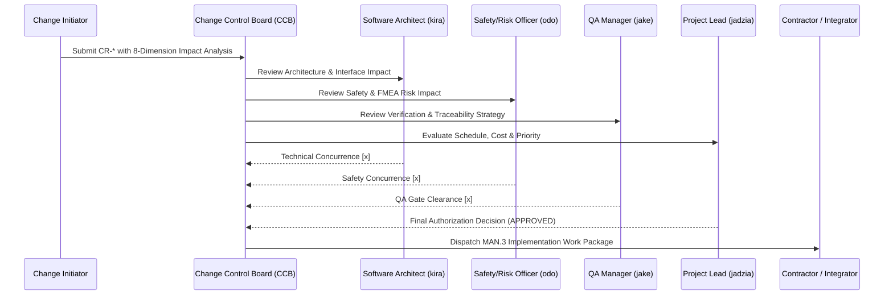

# SUP.10 Change Request Impact Analysis, Prioritization, Authorization, and Pre-Implementation Traceability Enforcement Protocol (0016-04)

## 1. Document Control & Governance Metadata
- **Process ID**: `SUP.10` (Change Request Management)
- **Feature / Task**: `0016-04` (PREREQ: `0016-03`)
- **Standard Baseline**: Automotive SPICE (PAM 3.1 / PAM 4.0) SUP.10 & ISO 26262 ASIL B/D Change Control
- **Lead QA / Change Governance Authority**: `jake` (QA-Manager, Team DeepSpace9)
- **Status**: `REVIEW`
- **Scope**: Mandatory governance procedure enforcing exhaustive impact analysis, systematic prioritization, formal Change Control Board (CCB) authorization, and complete bidirectional pre-implementation traceability across 8 core engineering dimensions prior to authorizing any code modifications.

---

## 2. Mandatory 8-Dimension Change Impact Analysis Framework

Every proposed change request (`CR-*`) must undergo formal impact analysis across all 8 dimensions before CCB submission:

### Impact Dimension Evaluation Rules:
1. **Requirements Impact (`SWE.1` / `SYS.2`)**: Identify affected functional requirements, safety requirements, and new acceptance criteria (`AC-*`).
2. **Architecture & Design Impact (`SWE.2` / `SWE.3`)**: Assess interface alterations, memory/CPU budget adjustments, and architectural decision record (`DEC-*`) requirements.
3. **Code & Unit Impact**: List specific modules, classes, schemas, and header files requiring modification.
4. **Verification Impact (`SWE.4`–`SWE.6` / `VAL.1`)**: Identify new/modified unit tests, integration test harnesses, and regression test suites required.
5. **Risk & Safety Impact (`MAN.5` / ASIL)**: Perform FMEA review to ensure no safety interlock violation or new hazard introduction.
6. **Project Plan & Schedule Impact (`MAN.3`)**: Estimate engineering effort, milestone shifts, and dependency blockages.
7. **Configuration Baseline Impact (`SUP.8`)**: Determine affected configuration items, baseline branch branching points, and manifest hash revisions.
8. **Target Release Alignment (`SPL.2`)**: Specify exact release target version and distribution packaging impacts.

---

## 3. Change Request Prioritization Matrix

| Priority Level | Classification Criteria | CCB Review Turnaround | Typical Example |
| :--- | :--- | :--- | :--- |
| **P1 - Emergency / Safety** | Safety interlock breach, severe security vulnerability, blocking production defect. | $< 4\text{ hours}$ | FTTI deadline violation in drain supervisor. |
| **P2 - Critical Baseline** | Architectural incompatibility blocking multi-team sprint deliverables. | $< 24\text{ hours}$ | Schema migration required for atomic mailbox storage. |
| **P3 - Normal Enhancement** | Planned requirement scope refinement or feature enhancement. | Sprint Planning Cadence | New telemetry dashboard filtering parameter. |
| **P4 - Low / Optimization** | Cosmetic improvement, documentation refactoring, minor optimization. | Backlog Grooming Cadence | Comment clarity and schema description refinement. |

---

## 4. Change Control Board (CCB) Multi-Role Authorization Gate

No change request may proceed to implementation without authenticated multi-role CCB authorization:

---

## 5. Strict Pre-Implementation Traceability Invariant

> [!CAUTION]
> **Zero Implementation Without Authorization Invariant**:
> - Direct code modification on any branch without an APPROVED Change Request (`CR-*`) and associated `MAN.3` Work Package is strictly prohibited.
> - Pre-implementation traceability must establish explicit links connecting:
>   $$\text{CR-ID} \longleftrightarrow \text{REQ-ID} \longleftrightarrow \text{DEC-ID} \longleftrightarrow \text{TASK-ID} \longleftrightarrow \text{TEST-ID} \longleftrightarrow \text{TARGET-RELEASE}$$
> - Any commit lacking an authorized `REF: CR-*` or `REF: TASK-*` is rejected at the CI / SUP.8 admission gate.

---

## 6. Post-Implementation Verification & Closure Protocol
1. Implementation verified against acceptance criteria via four-eyes code review.
2. Complete regression battery passing (`SWE.4`, `SWE.5`, `SWE.6`).
3. Configuration baseline updated with new cryptographic commit SHA (`SUP.8`).
4. Formal CCB verification review transitions `CR-*` from `IMPLEMENTED` $\rightarrow$ `CLOSED`.
5. QA Manager signs off on compliance closure.
