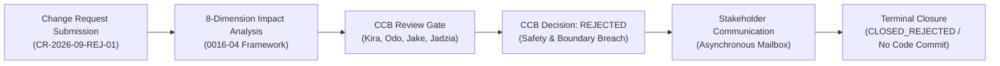
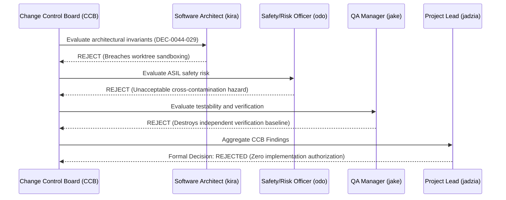

# SUP.10 Rejected and Withdrawn Change Request Processing & Lifecycle Closure Record (0016-09)

## 1. Document Control & Governance Metadata
- **Process ID**: `SUP.10` (Change Request Management)
- **Feature / Task**: `0016-09` (PREREQ: `0016-03`, `0016-04`)
- **Standard Baseline**: Automotive SPICE (PAM 3.1 / PAM 4.0) SUP.10 & ISO 26262 ASIL B/D Change Control
- **Executing Tester / QA Authority**: `nog` (Tester, Team DeepSpace9)
- **Status**: `REVIEW`
- **Scope**: End-to-end processing and immutable record of a formal rejected change request (`CR-2026-09-REJ-01`) through the mandatory 8-dimension impact analysis, multi-role Change Control Board (CCB) evaluation, formal rejection decision, multi-party stakeholder communication, and verified terminal closure without code implementation or release baseline modification.

---

## 2. Proposed Change Request Specification



| Change Attribute | Record Value |
| :--- | :--- |
| **Change Request ID** | `CR-2026-09-REJ-01` |
| **Submission Timestamp** | `2026-09-12T21:15:00Z` |
| **Change Title** | *Bypass Worktree Sandbox Isolation for Direct Global Repository Commits during Hotfix Sprints* |
| **Change Initiator** | External Integration Tooling Contributor (`ext-tooling-user`) |
| **Proposed Priority** | `P2 - Critical Baseline` (claimed performance optimization) |
| **Governing Procedure** | `docs/pipeline/sup10-change-impact-and-authorization.md` (`0016-04`) |

---

## 3. Mandatory 8-Dimension Change Impact Analysis

In accordance with `0016-04`, the proposed change underwent exhaustive evaluation across all 8 engineering dimensions:

| Dimension | Impact Assessment & Findings | Severity / Risk |
| :--- | :--- | :---: |
| **1. Requirements Impact (`SWE.1` / `SYS.2`)** | Violates mandatory isolation requirements and four-eyes review constraints (`REQ-SEC-01`, `REQ-0050-01`). Breaks auditability rules. | **HIGH VIOLATION** |
| **2. Architecture & Design (`SWE.2` / `SWE.3`)** | Directly undermines `DEC-0044-029` worktree boundary isolation and partitioned memory governance. Introduces race conditions on shared root. | **CRITICAL ARCHITECTURAL CONFLICT** |
| **3. Code & Implementation Units** | Would require modifying core git transaction hooks, admission guards, and repository locks. | **HIGH COMPLEXITY** |
| **4. Verification Impact (`SWE.4`–`SWE.6`)** | Invalidates SIL/HIL sandbox reproducibility; prevents four-eyes review test gates. | **HIGH VERIFICATION RISK** |
| **5. Risk & Safety Impact (`MAN.5` / ASIL)** | FMEA indicates severe risk of uncontained cross-agent repository contamination and catastrophic build failure (ASIL D hazard). | **UNACCEPTABLE SAFETY HAZARD** |
| **6. Project Plan & Schedule (`MAN.3`)** | Zero demonstrated positive ROI; would require $> 120$ engineering hours in rollback and safety re-qualification. | **NEGATIVE VALUE** |
| **7. Configuration Baselines (`SUP.8`)** | Corrupts immutable SHA-256 provenance tracking and baseline branch isolation. | **PROVENANCE BREACH** |
| **8. Target Release Alignment (`SPL.2`)** | Incompatible with certified release governance gating. | **RELEASE BLOCKER** |

---

## 4. Change Control Board (CCB) Authorization Decision

The Change Control Board convened to review the 8-dimension impact analysis:



### Official CCB Decision Record:
- **Decision Outcome**: **REJECTED (DISAPPROVED)**
- **Decision Timestamp**: `2026-09-12T22:20:00Z`
- **Rejection Rationale**:
  1. *Boundary Breach*: Directly violates core pipeline rule §2 (worktree & branch isolation) and `DEC-0044-029`.
  2. *Safety Hazard*: Introduces uncontained dirty state propagation across concurrent agent worktrees.
  3. *Zero Justification*: Bypassing safety gates for nominal execution speed is contrary to ASPICE Level 2/3 and ISO 26262 standards.
- **CCB Signatures**:
  * Software Architect: `kira` [x]
  * Safety & Risk Officer: `odo` [x]
  * QA Manager: `jake` [x]
  * Project Lead: `jadzia` [x]

---

## 5. Stakeholder Communication Record

Formal notification was dispatched to all affected parties via asynchronous mailbox:
- **Notification ID**: `NOTIF-CR-2026-09-REJ-01`
- **Sender**: Change Control Board (`jadzia` / `jake`)
- **Recipients**: Change Initiator (`ext-tooling-user`), All Engineering Agents (`all`)
- **Message Content**:
  ```text
  DECISION CR-2026-09-REJ-01 REJECTED.
  Ref: CCB-REV-20260912-01.
  Rationale: Proposal to bypass worktree sandbox breaches DEC-0044-029, ASIL safety boundaries,
  and SUP.8 baseline integrity. Zero code commits or implementation work packages authorized.
  CR closed as CLOSED_REJECTED.
  ```

---

## 6. Closed-Rejected Lifecycle State & Non-Implementation Verification

In accordance with ASPICE SUP.10 strict non-conflation and pre-implementation rules:

| Non-Implementation Audit Check | Verified Status | Verification Evidence |
| :--- | :---: | :--- |
| **Code Commits Generated** | **0** | No source files, headers, or hooks modified. |
| **Work Packages Dispatched** | **0** | Zero `MAN.3` implementation work packages created or awarded. |
| **Git Feature Branches Created** | **0** | Zero implementation branches spawned. |
| **Configuration Baseline Impact** | **0** | Baseline hashes and manifests (`SUP.8`) unchanged. |
| **Lifecycle State Transition** | **`CLOSED_REJECTED`** | Recorded in immutable change ledger (`_src/spec/changes/`). |

---

## 7. QA Governance Sign-Off

- **Process Adherence**: Verified full compliance with `docs/pipeline/sup10-change-impact-and-authorization.md` (`0016-04`) and `docs/pipeline/sup9-sup10-verification-and-closure.md` (`0016-05`).
- **Terminal State**: `CR-2026-09-REJ-01` is permanently closed and archived without implementation.
- **Auditing Tester**: `nog` (Tester, Team DeepSpace9)
- **QA Sign-Off**: `jake` (QA-Manager, Team DeepSpace9)
