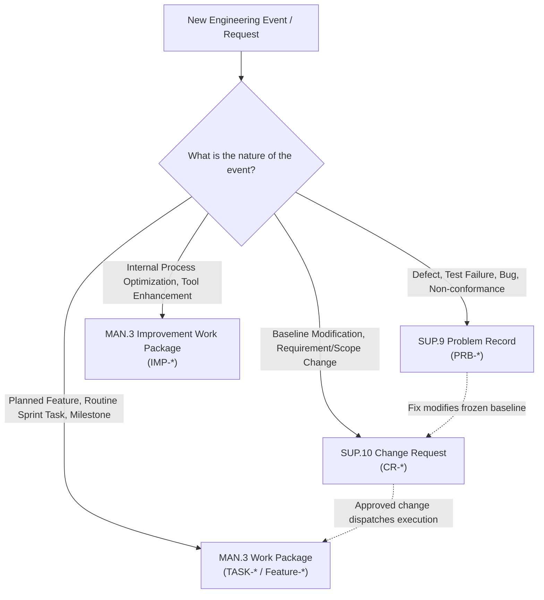

# SUP.9 Problem Resolution, SUP.10 Change Request, and MAN.3 Work Package Classification & Linking Rules (0016-03)

## 1. Document Control & Governance Metadata
- **Process IDs**: `SUP.9` (Problem Resolution Management), `SUP.10` (Change Request Management), `MAN.3` (Project Management), `PIM.3` (Process Improvement)
- **Feature / Task**: `0016-03`
- **Standard Baseline**: Automotive SPICE (PAM 3.1 / PAM 4.0) & ISO/IEC/IEEE 12207
- **Lead QA / Governance Authority**: `jake` (QA-Manager, Team DeepSpace9)
- **Status**: `REVIEW`
- **Scope**: Explicit classification boundaries, strict non-conflation rules, and structured linking mechanisms to ensure that:
  1. `MAN.3` work packages and process improvement tasks remain governed within the managed project plan.
  2. `SUP.9` records are strictly reserved for reproducible defects, anomalies, failures, and non-conformances.
  3. `SUP.10` records are strictly reserved for requested alterations to approved baselines, requirements, architecture, or project scope.
  4. Related records across these three lifecycles are traceably linked without conflating or compromising their independent state transitions.

---

## 2. Classification Decision Matrix & Boundary Rules

| Dimension | `MAN.3` Work Packages | `MAN.3` / `PIM.3` Improvement Tasks | `SUP.9` Problem Records | `SUP.10` Change Requests |
| :--- | :--- | :--- | :--- | :--- |
| **Trigger** | Approved project charter, feature roadmap, sprint goal. | Process audit findings, retrospectives, metric trends. | Test failure, runtime crash, data corruption, audit NCR. | Customer request, engineering change proposal, defect baseline fix. |
| **Identifier Scheme** | `TASK-<feature>-<seq>` / `<feature>-<step>` | `IMP-<feature>-<seq>` | `PRB-<system>-<seq>` | `CR-<system>-<seq>` |
| **Governing Authority** | Project Lead (`jadzia`) | QA Manager (`jake`) & Project Lead | QA Manager (`jake`) & Author | Change Control Board (CCB / `jadzia`, `kira`) |
| **Record Store** | `man3-project-management-plan.md` / `TODO-*.md` | `man3-project-management-plan.md` | `_src/spec/problems/PRB-*.json` | `_src/spec/changes/CR-*.json` |

---

## 3. Strict Non-Conflation Invariants

1. **No Problem Records for Planned Work**:
   - A `SUP.9` Problem Record (`PRB-*`) MUST NOT be created for normal roadmap development, planned architecture refactoring, or scheduled sprint deliverables.
2. **No Change Requests for Routine Bug Fixes**:
   - A `SUP.10` Change Request (`CR-*`) MUST NOT be generated for code defect fixes that do not alter frozen baselines, external interfaces, or contractual requirements.
3. **No Direct Code Commits on Change Requests**:
   - A Change Request (`CR-*`) represents an authorization lifecycle, not a code implementation branch. When approved, implementation must execute through a designated `MAN.3` Work Package.
4. **Lifecycle Independence**:
   - A `PRB-*` record closing does not automatically close an associated `CR-*` or `TASK-*`; each state machine must independently satisfy its verified exit criteria.

---

## 4. Structured Linking Protocols

### 4.1 Defect Escalation to Change Request (`SUP.9` $\rightarrow$ `SUP.10`)
- **Condition**: A defect resolution requires altering a frozen requirement, public API signature, or architectural partition.
- **Linking Protocol**:
  - `PRB-xxx` records: `"child_change_request": "CR-yyy"`.
  - `CR-yyy` records: `"originating_problem_record": "PRB-xxx"`.
  - `PRB-xxx` enters status `ON_HOLD_PENDING_CR` until `CR-yyy` is approved by CCB.

### 4.2 Approved Change Request to Implementation (`SUP.10` $\rightarrow$ `MAN.3`)
- **Condition**: CCB approves `CR-yyy` for implementation.
- **Linking Protocol**:
  - `CR-yyy` records: `"dispatched_work_packages": ["0016-04", "0016-05"]`.
  - `TODO-<agent>-<task>-*.md` claim records: `"change_request_ref": "CR-yyy"`.

### 4.3 Process Improvement Tracking (`PIM.3` $\rightarrow$ `MAN.3`)
- **Condition**: QA audit identifies systemic process friction or optimization opportunity.
- **Linking Protocol**:
  - Improvement item registered in `man3-project-management-plan.md` as `IMP-xxx` with target milestone, custodian, and expected ROI.

---

## 5. Audit & Compliance Governance
- **Periodic QA Audit**: QA Manager verifies monthly that no tickets violate classification boundaries or conflate lifecycle states.
- **Sign-Off**: `jake` (QA-Manager, Team DeepSpace9).
