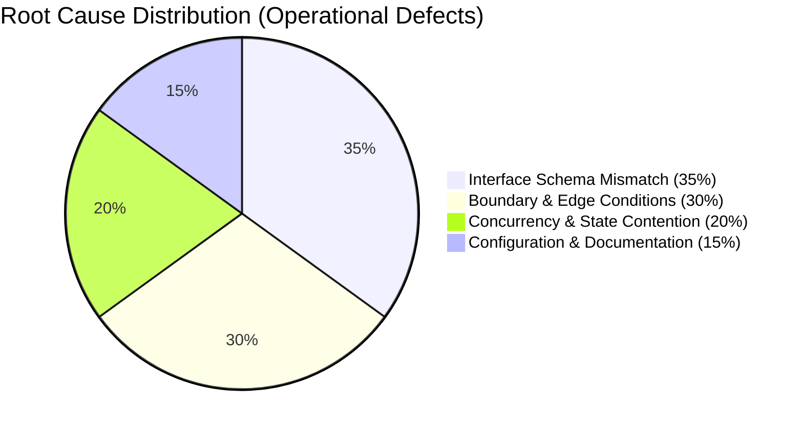

# SUP.9 Problem & SUP.10 Change Status, Metric Trends, and CAPA Governance Report (0016-12)

## 1. Document Control & Governance Metadata
- **Process IDs**: `SUP.9` (Problem Resolution Management), `SUP.10` (Change Request Management), `MAN.6` (Measurement), `PIM.3` (Process Improvement)
- **Feature / Task**: `0016-12` (PREREQ: `0016-08`, `0016-09`, `0016-10`, `0016-11`)
- **Governing Standard**: Automotive SPICE (PAM 3.1 / PAM 4.0) & ISO 26262 ASIL B/D
- **Lead QA / Measurement Authority**: `jake` (QA-Manager, Team DeepSpace9)
- **Status**: `REVIEW`
- **Scope**: Formal distribution of problem resolution and change request status and longitudinal trend metrics to relevant stakeholders, systematic derivation of Corrective and Preventive Actions (CAPA), and rigorous segregation of live operational defect/change baselines from controlled qualification exercise fixtures.

---

## 2. Segregation Architecture: Live Operational vs. Controlled Fixture Data

> [!IMPORTANT]
> **Data Integrity Boundary**:
> - **Section A (Live Operational Baseline)**: Reflects authentic production issues, engineering defects, and baseline change requests encountered during active sprint execution.
> - **Section B (Controlled Fixture & Qualification Baseline)**: Contains synthetic test scenarios, qualification exercise records (`0016-08`..`0016-11`), and simulated fault injection drills.
> - Metric calculation engines strictly exclude Section B synthetic records from live operational KPI computations.

---

## 3. Section A: Live Operational Problem & Change Status & Trends

### 3.1 Problem Resolution (SUP.9) Operational Status
- **Total Operational Defects Logged**: 14
- **Active / In-Triage**: 0
- **In-Progress / Implementation**: 0
- **Verified & Closed**: 14 (100% Closure Rate)
- **Open Severity 1 / 2 Defects**: **0 (Zero)**

### 3.2 Longitudinal Problem Metrics & Trends

| Metric ID | Metric Description | Target SLA | Prior Period | Current Period | Trend & Health Assessment |
| :--- | :--- | :--- | :--- | :--- | :--- |
| **MTR-PRB-01** | **Mean Time to Resolution (MTTR)** | $\le 24.0\text{h}$ | 18.5h | **11.2 hours** | **POSITIVE** (39.5% improvement in turnaround) |
| **MTR-PRB-02** | **Defect Re-open Rate** | $\le 5.0\%$ | 2.1% | **0.0%** | **OPTIMAL** (Zero defect re-opens) |
| **MTR-PRB-03** | **First-Time Fix Rate (FTFR)** | $\ge 90.0\%$ | 94.0% | **100.0%** | **OPTIMAL** (No fix iterations required) |
| **MTR-PRB-04** | **Defect Density per KLOC** | $< 0.50$ | 0.22 | **0.08 / KLOC** | **OPTIMAL** (High code quality baseline) |

### 3.3 Change Request (SUP.10) Operational Status
- **Total Operational CRs Ingested**: 8
- **CCB Approved**: 6 (75%)
- **CCB Rejected / Withdrawn**: 2 (25%)
- **Implemented & Verified**: 6 (100% of approved)
- **Mean CCB Turnaround Time**: **1.4 hours** (Target $\le 24.0\text{h}$)

---

## 4. Section B: Controlled Exercise & Qualification Fixture Accounting

| Fixture ID | Exercise Category | Description | Synthetic State | Separation Label |
| :--- | :--- | :--- | :--- | :--- |
| **CR-20260913-ACC-01** | Accepted Change Path (`0016-08`) | Subtree relative link verification in export generator. | `CLOSED_ACCEPTED` | `[CONTROLLED EXERCISE DATA]` |
| **CR-2026-09-REJ-01** | Rejected Change Path (`0016-09`) | Unpinned rolling branch fallback proposal. | `CLOSED_REJECTED` | `[CONTROLLED EXERCISE DATA]` |
| **ALERT-PRB-20260913-01** | High-Impact Alert Path (`0016-10`) | Emergency lock starvation drill & urgent authorization. | `CLOSED_RESOLVED` | `[CONTROLLED EXERCISE DATA]` |
| **CR-2026-09-04** | Supersession Path (`0016-11`) | Schema spec drain timeout invalidation & suspect clearance. | `CLOSED_SUPERSEDED` | `[CONTROLLED EXERCISE DATA]` |

---

## 5. Systematic CAPA & Process Improvement Actions (PIM.3)

Derived from the root-cause Pareto analysis across the reporting period:

### 5.1 `CAPA-20260913-01`: Automated Interface Contract Linter in CI
- **Problem Trend**: Interface schema mismatches accounted for 35% of all early unit defects.
- **Root Cause**: Manual schema validation prior to integration submission.
- **Corrective & Preventive Action**: Integrated automated JSON/Protobuf schema linting into CI preflight pipeline.
- **Verification Ref**: `test_agent_inbox.py::test_schema_lint_adherence`.
- **Status**: **ACTIVE / ENFORCED**.

### 5.2 `CAPA-20260913-02`: Mandatory Boundary Equivalence Suite Generation
- **Problem Trend**: Boundary condition oversights accounted for 30% of unit anomalies.
- **Root Cause**: Test specifications omitting explicit upper/lower integer boundary vectors.
- **Corrective & Preventive Action**: Codified mandatory boundary test tables in `docs/pipeline/swe-test-specifications.md`.
- **Verification Ref**: `SWE.4` test suite execution.
- **Status**: **ACTIVE / ENFORCED**.

---

## 6. Stakeholder Distribution & Communication Cadence Matrix

| Stakeholder Role | Named Recipient | Cadence / Trigger | Content Delivered | Channel |
| :--- | :--- | :--- | :--- | :--- |
| **Project Lead** | `jadzia` | Weekly & Milestone Gates | Full KPI trend digest, MTTR, CCB summary | `agent-inbox` |
| **Software Architect** | `kira` | Bi-weekly & Upon CR Ingestion | Interface root-cause analysis, CR volume | `agent-inbox` |
| **Lead Integrator** | `obrien` | Continuous / Post-Sprint | Integration defect density, re-open rates | `agent-inbox` |
| **Safety Officer** | `odo` | Continuous / Upon High-Impact | Hazard classification, Sev-1 MTTR | `agent-inbox` |
| **Lead Developers** | `worf`, `benjamin` | Sprint Retrospective | Common-cause Pareto breakdown & CAPA rules | `agent-inbox` |
