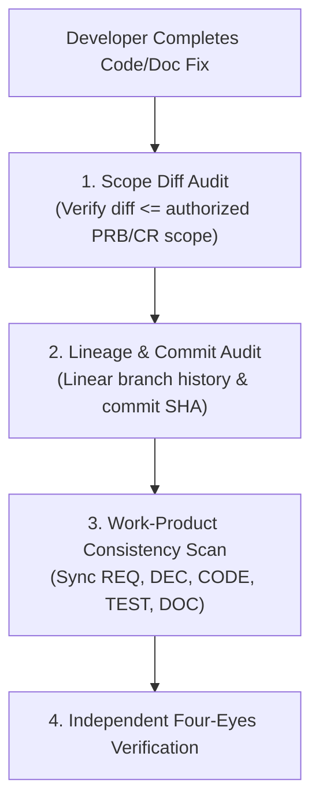
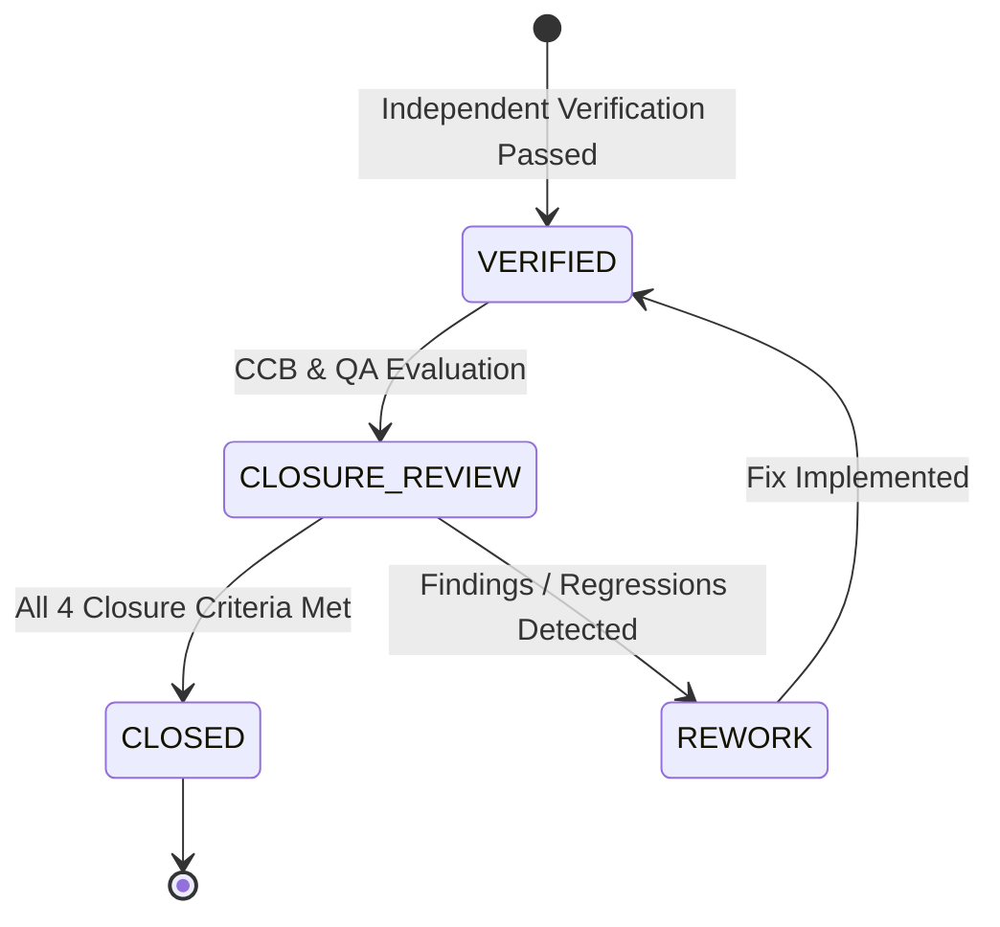

# SUP.9 / SUP.10 Implementation Confirmation, Independent Verification, and Accepted Closure Procedure (0016-05)

## 1. Document Control & Governance Metadata
- **Process IDs**: `SUP.9` (Problem Resolution Management), `SUP.10` (Change Request Management), `PIM.3` (Process Improvement)
- **Feature / Task**: `0016-05` (PREREQ: `0014-13`, `0016-01`, `0016-02`, `0016-03`, `0016-04`)
- **Governing Standard**: Automotive SPICE (PAM 3.1 / PAM 4.0) & ISO 26262 ASIL B/D
- **Lead QA / Closure Authority**: `jake` (QA-Manager, Team DeepSpace9)
- **Status**: `REVIEW`
- **Scope**: Rigorous operational procedure governing the post-implementation phase for all problem records (`PRB-*`) and change requests (`CR-*`), enforcing implementation confirmation, mandatory independent verification, affected-work-product consistency synchronization, multi-party stakeholder communication, formal accepted closure gates, and longitudinal trend/common-cause reporting.

---

## 2. Implementation Confirmation & Scope Containment

### Mandatory Confirmation Steps:
1. **Scope Diff Audit**:
   - The implementation must strictly correspond to the technical specification in the parent `PRB-*` or `CR-*`.
   - Modifying unrelated modules or expanding scope without prior CCB approval is prohibited and immediately rejected at the CI gate.
2. **Commit & Lineage Verification**:
   - Every commit must contain unambiguous traceability markers (`REF: PRB-*` or `REF: CR-*`).
   - Implementation must be developed on an isolated item worktree/branch.

---

## 3. Independent Verification Framework

### 3.1 Four-Eyes Verification Principle
- **Strict Role Separation**: Implementation verification must be conducted by an independent engineer/QA authority (`reviewer != author`). Self-acceptance is void and rejected by repository authority.
- **Verification Gates**:
  1. *Static Analysis Gate*: Zero new linter, compiler, or type-checker warnings (`flake8`, `mypy`, MISRA).
  2. *Unit Verification Gate (`SWE.4`)*: Full regression suite executed with 100% pass and 100% statement/branch coverage on modified units.
  3. *Integration Verification Gate (`SWE.5`)*: Verification of interface contracts and multi-module event flows.
  4. *Qualification & Resilience Gate (`SWE.6`)*: Confirmation that system-level invariants and performance SLAs remain unbroken.

### 3.2 Affected Work-Product Consistency Synchronization
Whenever a defect or change is implemented, the verifying agent must confirm that all linked downstream and upstream artifacts are synchronously updated:
- [x] **Software Requirements (`SWE.1`)**: Acceptance criteria and requirement attributes updated.
- [x] **Software Architecture (`SWE.2`)**: Interface signatures and dynamic diagrams updated.
- [x] **Test Specifications (`SWE.4`–`SWE.6`)**: New positive/negative test cases added to cover the defect/change vector.
- [x] **Risk Register (`MAN.5`)**: FMEA hazard ratings and mitigation states reviewed.
- [x] **Configuration Item Manifest (`SUP.8`)**: New baseline hashes recorded in evidence ledgers.

---

## 4. Stakeholder & Requester Communication Protocol

Upon successful verification, structured asynchronous communication is dispatched via `agent-inbox`:
- **To Change Initiator / Reporter**: Notification of verified fix with direct links to verification evidence and commit SHA.
- **To Affected Module Leads & Integrator**: Technical briefing on modified interfaces or behavior.
- **To Project Leadership (`jadzia`)**: Status transition notification.

---

## 5. Formal Accepted Closure Gates

### Strict Closure Exit Criteria:
A Problem Record (`SUP.9`) or Change Request (`SUP.10`) transitions to `CLOSED` only when:
1. **Independent Verification Proof Attached**: Full test execution logs, commit hashes, and reviewer identity recorded.
2. **Work-Product Consistency Verified**: Zero dangling links, unupdated specs, or orphaned artifacts.
3. **Requester / Affected Party Concurrence**: Change initiator or QA authority formally confirms resolution.
4. **Configuration Baseline Frozen**: Updated artifact integrated into clean baseline under `SUP.8`.

---

## 6. Trend & Common-Cause Reporting (PIM.3 Continuous Improvement)

1. **Defect & Change Indexing**:
   - All closed `PRB-*` and `CR-*` records are aggregated into monthly quality metric logs (`MAN.6`).
2. **Common-Cause Clustering**:
   - Pareto analysis applied across defect categories (e.g., interface schema mismatch, missing boundary tests, concurrency race).
3. **Preventative Action Derivation (CAPA)**:
   - Systemic defects trigger automated linting additions or process SOP improvements to ensure defects cannot recur.

---

## 7. QA Governance Sign-Off
- **Procedure Verdict**: **ESTABLISHED / ENFORCED**
- **QA-Manager Sign-Off**: `jake` (QA-Manager, Team DeepSpace9)
- **Date**: `2026-09-12`
