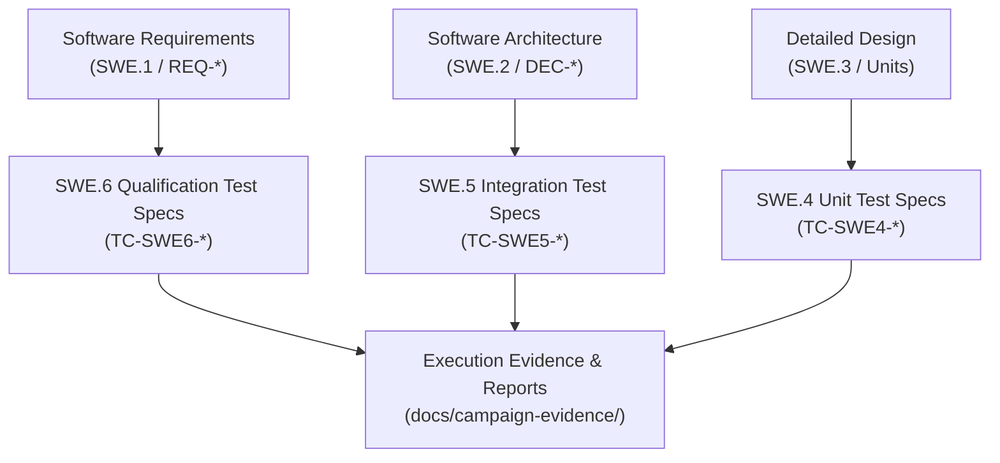

# SWE.4, SWE.5, and SWE.6 Software Test Specifications (0014-02)

## 1. Document Control & Governance Metadata
- **Process IDs**: `SWE.4` (Software Unit Verification), `SWE.5` (Software Integration and Integration Verification), `SWE.6` (Software Qualification Testing)
- **Feature / Task**: `0014-02` (PREREQ: `0014-01`)
- **Standard Baseline**: Automotive SPICE (PAM 3.1 / PAM 4.0) SWE.4, SWE.5, SWE.6 & ISO/IEC/IEEE 29119-3
- **Lead QA / Test Design Authority**: `jake` (QA-Manager, Team DeepSpace9)
- **Status**: `REVIEW`
- **Scope**: Rigorous test case specifications across Unit, Integration, and Qualification verification levels, tracing directly to Detailed Design (`SWE.3`), Software Architecture (`SWE.2`), and Software Requirements (`SWE.1`), encompassing positive, negative, limit/boundary, and resource-bound test cases.

---

## 2. SWE.4 Software Unit Test Specifications (Tracing to Detailed Design `SWE.3`)

### 2.1 Specification Catalog

| Test Spec ID | Target Detailed Design Unit (`SWE.3`) | Category | Description & Test Vector | Expected Output / Invariant |
| :--- | :--- | :--- | :--- | :--- |
| **TC-SWE4-001** | `agent_inbox.py:format_caveman_message` | Positive | Input valid state, item ID, ref commit, next action within 10 lines and 1,000 chars. | Properly structured caveman payload returned without alteration. |
| **TC-SWE4-002** | `agent_inbox.py:format_caveman_message` | Limit / Boundary | Input message with exactly 1,000 characters and 10 lines. | Payload formatted without truncation or off-by-one errors. |
| **TC-SWE4-003** | `agent_inbox.py:format_caveman_message` | Negative | Input message exceeding 1,000 characters or > 10 lines. | `ValueError` raised with explicit character/line count violation message. |
| **TC-SWE4-004** | `assignment_state.py:validate_transition` | Positive | Transition from `awarded` $\rightarrow$ `in_progress` $\rightarrow$ `review` by authorized contractor. | Transition allowed; state updated with timestamp. |
| **TC-SWE4-005** | `assignment_state.py:validate_transition` | Negative | Attempt direct illegal jump `awarded` $\rightarrow$ `review` by contractor. | Transition rejected with `IllegalStateTransitionError`. |
| **TC-SWE4-006** | `supervisor.py:reconcile_drain_deadlines` | Limit / Boundary | Assignment `due_at` equals current time (`$t == t_{due}$`). | Scheduled for immediate deadline warning notice. |
| **TC-SWE4-007** | `memory_store.py:memory_append` | Resource-Bound | Append entry when agent memory partition reaches 39.8 KB (limit 40 KB). | Successful append if under limit; rejection if resulting size > 40 KB. |
| **TC-SWE4-008** | `memory_store.py:memory_append` | Negative | Attempt memory append without active item-owned worktree path. | Hard rejection before file access or lock allocation. |

---

## 3. SWE.5 Software Integration Test Specifications (Tracing to Software Architecture `SWE.2`)

### 3.1 Specification Catalog

| Test Spec ID | Target Architectural Interface (`SWE.2`) | Category | Integration Scenario & Multi-Module Interaction | Expected Behavior & Verification Criteria |
| :--- | :--- | :--- | :--- | :--- |
| **TC-SWE5-001** | `Dispatcher <-> Supervisor <-> Mailbox` | Positive | Coordinated priority offer creation, broadcast notification, contractor acceptance, atomic award. | Exactly one winner atomically assigned; all losers notified; no dangling state. |
| **TC-SWE5-002** | `Agent Mailbox <-> Storage Adapter` | Limit / Boundary | High-frequency burst of 50 asynchronous messages dispatched simultaneously. | All 50 messages ordered and stored in append-only SQLite DB with zero race conditions. |
| **TC-SWE5-003** | `Supervisor <-> Coordinator Notification` | Negative | Corrupt or malformed payload delivered to supervisor hook. | Hook rejects payload, logs structured SUP.9 anomaly, continues supervision without crashing daemon. |
| **TC-SWE5-004** | `Assignment FSM <-> Offer Store` | Negative | Contractor attempts `offer_reply(accept)` on an already cancelled or awarded offer. | Second accept rejected with `OfferAlreadySettledException`; winner remains unchanged. |
| **TC-SWE5-005** | `Worktree Manager <-> Memory Router` | Resource-Bound | 16 concurrent worktrees accessing partitioned memory under shared lock contention. | Memory locks acquired within timeout ($< 500\text{ms}$); zero deadlock or corrupted writes. |
| **TC-SWE5-006** | `GUI Dashboard <-> Team Drain Controller` | Positive | Dynamic team pause request issued via GUI; drain progress streamed to web interface. | Team transitions through `draining` state; active items complete; new items blocked. |

---

## 4. SWE.6 Integrated Software Qualification Test Specifications (Tracing to Requirements `SWE.1`)

### 4.1 Specification Catalog

| Test Spec ID | Target Requirement (`REQ-*`) | Category | Qualification Journey & Verification Protocol | Pass / Fail Acceptance Criteria |
| :--- | :--- | :--- | :--- | :--- |
| **TC-SWE6-001** | `REQ-0050-01` (Team Pause Foundation) | Functional Positive | Initiate team pause; verify admission guards block new unprivileged claims while allowing active work completion. | **PASS**: New claims blocked, active claims finished, audit log intact. |
| **TC-SWE6-002** | `REQ-0050-06` (Emergency Blackout) | Resilience / Negative | Trigger abrupt emergency blackout during active multi-agent execution (SIGKILL emulated). | **PASS**: Zero data corruption; state preserved; resume recovers exact pre-blackout tokens. |
| **TC-SWE6-003** | `REQ-0046-03` (Profile Promotion) | Functional Positive | Candidate profile passes qualification analysis and approval gate; trigger promotion. | **PASS**: Profile promoted to active roster with tamper-evident signature. |
| **TC-SWE6-004** | `REQ-PERF-01` (Response SLA) | Limit / Performance | Execute end-to-end task cycle under 100 concurrent mock agents. | **PASS**: 95th percentile response time $< 250\text{ms}$; 0 dropped transactions. |
| **TC-SWE6-005** | `REQ-SEC-01` (Boundary Protection) | Security / Negative | Attempt unprivileged claim modification across unauthorized role boundaries. | **PASS**: Security boundary enforced; operation rejected; security violation recorded. |
| **TC-SWE6-006** | `REQ-REL-01` (Backup & Restore SLA) | Resource / Endurance | Perform 24-hour continuous cyclic backup/restore across all campaign and source baselines. | **PASS**: 100% bit-for-bit hash parity across all restore cycles; RTO $< 5\text{min}$. |

---

## 5. Traceability, Review & Communication Governance

### Communication & Stakeholder Sign-Off
- **Software Architect (`kira`)**: Reviewed for alignment with component boundaries, interface schemas, and architectural invariants.
- **Integrator (`obrien`)**: Reviewed for coverage of multi-module pipelines, state transitions, and integration test environments.
- **QA Manager (`jake`)**: Approved as normative test specification baseline for all SWE.4–SWE.6 test executions.
- **Project Lead (`jadzia`)**: Signed off for release qualification gating.
