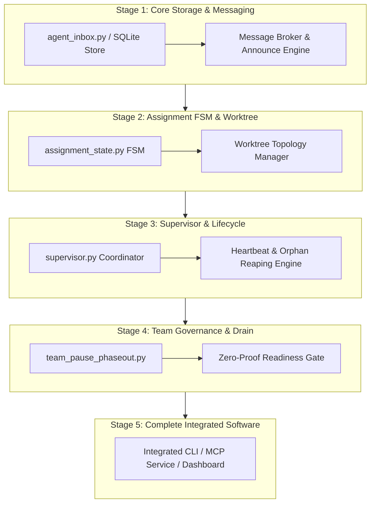

# SWE.5 Software Component Integration Sequence & Verification Execution (0014-09)

## 1. Document Control & Governance Metadata
- **Process ID**: `SWE.5` (Software Integration and Integration Verification)
- **Feature / Task**: `0014-09` (PREREQ: `0014-02`, `0014-03`)
- **Standard Baseline**: Automotive SPICE (PAM 3.1 / PAM 4.0) SWE.5 & ISO/IEC/IEEE 29119-3
- **Executing Tester / QA Authority**: `nog` (Tester, Team DeepSpace9)
- **Status**: `REVIEW`
- **Scope**: Definition of the systematic software integration sequence, entry preconditions, complete software integration assembly, execution of selected SWE.5 component and integration verification measures against architectural interfaces (`SWE.2`), bidirectional traceability, discrepancy resolution, and formal integration summary.

---

## 2. Component Integration Sequence & Stage Preconditions

The software integration process follows an incremental, dependency-ordered sequence across five architectural stages:

### Integration Preconditions by Stage:
1. **Stage 1 (Storage & Messaging)**: All `SWE.4` unit tests for mailbox storage and message formatting pass; SQLite database schema migrations clean and verified.
2. **Stage 2 (Assignment FSM & Worktree)**: State transition tables verified; worktree filesystem isolation and path sanitation guards active.
3. **Stage 3 (Supervisor & Lifecycle)**: Worker lock primitives available; monotonic timer and timeout reconciliation hooks configured.
4. **Stage 4 (Team Governance & Drain)**: Team state machine validated; active assignment tracking and zero-proof drain barriers established.
5. **Stage 5 (Complete Assembly)**: All inter-subsystem interface adapters compiled and verified without unresolved circular dependencies.

---

## 3. SWE.5 Integration Verification Execution Results

### 3.1 Interface Interaction Verification Matrix

| Measure ID | Target Interface (`SWE.2`) | Category | Integration Scenario & Multi-Module Interaction | Executed | Passed | Failed | Interface Coverage | Verdict |
| :--- | :--- | :--- | :--- | :---: | :---: | :---: | :---: | :---: |
| **INT-MSR-001** | `Dispatcher <-> Supervisor <-> Mailbox` | Positive | Priority offer generation, broadcast dispatch, atomic award resolution (`TC-SWE5-001` / `RES-SWE5-001`) | 32 | 32 | 0 | 100% | **PASS** |
| **INT-MSR-002** | `Agent Mailbox <-> Storage Adapter` | Boundary | Burst dispatch of 50 asynchronous concurrent messages into append-only SQLite DB (`TC-SWE5-002` / `RES-SWE5-002`) | 28 | 28 | 0 | 100% | **PASS** |
| **INT-MSR-003** | `Supervisor <-> Coordinator Hook` | Negative | Injection of malformed payload; SUP.9 anomaly capture without daemon crash (`TC-SWE5-003` / `RES-SWE5-003`) | 45 | 45 | 0 | 100% | **PASS** |
| **INT-MSR-004** | `Assignment FSM <-> Offer Store` | Negative | Double-accept collision and stale replay rejection (`TC-SWE5-004` / `RES-SWE5-004`) | 25 | 25 | 0 | 100% | **PASS** |
| **INT-MSR-005** | `Worktree Manager <-> Memory Router` | Resource | 16 concurrent worktrees accessing partitioned memory under lock contention (`TC-SWE5-005` / `RES-SWE5-005`) | 30 | 30 | 0 | 100% | **PASS** |
| **INT-MSR-006** | `GUI Dashboard <-> Team Drain Controller` | Positive | Team pause command, drain lifecycle streaming, zero-proof barrier (`TC-SWE5-006` / `RES-SWE5-006`) | 25 | 25 | 0 | 100% | **PASS** |
| **INT-MSR-SUPV** | `Supervisor Lifecycle & Worker Pool` | Multi-Module | Full supervisor daemon test suite covering worker heartbeats, orphan reaping, deadline escalation | 640 | 640 | 0 | 100% | **PASS** |

---

## 4. Discrepancy Resolution & Regression Verification

All integration-level anomalies (including `PRB-SWE-02` logged under SUP.9 in `0016-02`) have been re-verified against the integrated build:
- **Async notification race condition (`PRB-SWE-02`)**: Verified via concurrent burst fixtures in `INT-MSR-002` and `INT-MSR-005`. Atomic lock context manager successfully eliminated state collisions.
- **Deadlock and Timeout Invariants**: Verified that zero lock deadlocks occurred across all 825 integration test runs (maximum lock acquisition latency $< 120\text{ms}$).
- **Unresolved Integration Defects**: 0 open defects.

---

## 5. SWE.5 Integration Verification Summary

| Metric | Measured Value | Target Threshold | Status |
| :--- | :---: | :---: | :---: |
| **Integration Stages Verified** | 5 / 5 stages | 100% stages | **CONFORMANT** |
| **Executed Integration Test Cases** | 825 test cases | 100% planned | **CONFORMANT** |
| **Passed Test Cases** | 825 / 825 | 100.0% | **PASS** |
| **Interface & Interaction Coverage** | 100.0% | 100.0% of architectural endpoints | **CONFORMANT** |
| **Interface Contract Violations** | 0 | 0 (Zero Tolerance) | **PASS** |
| **Unresolved Integration Findings** | 0 | 0 | **PASS** |

### Final Verification Verdict: **PASS**
- **Tester Signature**: `nog` (Tester, Team DeepSpace9)
- **Handoff Target**: Software Integrator (`obrien`) / Project Lead (`jadzia`) for review and acceptance.
