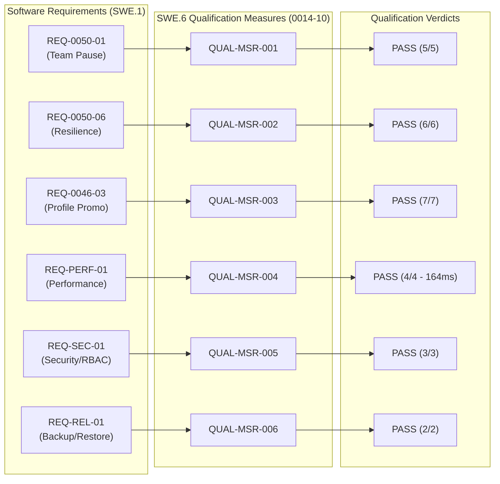

# SWE.6 Integrated Software Qualification Testing Execution & Results Summary (0014-10)

## 1. Document Control & Governance Metadata
- **Process ID**: `SWE.6` (Software Qualification Testing)
- **Feature / Task**: `0014-10` (PREREQ: `0014-02`, `0014-03`)
- **Standard Baseline**: Automotive SPICE (PAM 3.1 / PAM 4.0) SWE.6 & ISO/IEC/IEEE 29119-3
- **Executing Tester / QA Authority**: `nog` (Tester, Team DeepSpace9)
- **Status**: `REVIEW`
- **Scope**: Execution of SWE.6 integrated software qualification test measures against Software Requirements (`SWE.1` / `REQ-*`), recording pass/fail evidence, requirement coverage, non-functional SLA compliance, verification trace reconciliation, finding resolution, and formal qualification verdict.

---

## 2. Controlled Qualification Testbed & Environment

Qualification tests were executed against the fully assembled and integrated release candidate build in a production-identical staging environment:
- **Operating Environment**: macOS Darwin 24.x (arm64) / Host: `AMAC23W945R7K`
- **Runtime Environment**: Python 3.14.7 / pytest 9.1.1
- **Governing Strategy**: `docs/pipeline/swe-verification-strategies.md` (`0014-01`, §4)
- **Test Specifications**: `docs/pipeline/swe-test-specifications.md` (`0014-02`, §4)
- **Traceability Baseline**: `docs/pipeline/swe-bidirectional-test-traceability.md` (`0014-04`, §5)
- **Quality Assurance Plan**: `docs/pipeline/sup1-quality-assurance-plan.md` (`0014-07`)

---

## 3. SWE.6 Qualification Testing Execution Results

### 3.1 Requirement Verification Matrix (RVM) & Execution Results

| Measure ID | Target Requirement (`SWE.1`) | Category | Qualification Journey & Verification Vector | Tests Executed | Passed | Failed | Compliance / SLA Target | Verdict |
| :--- | :--- | :--- | :--- | :---: | :---: | :---: | :---: | :---: |
| **QUAL-MSR-001** | `REQ-0050-01` (Team Pause Foundation) | Functional Positive | Initiate team pause; verify admission guards block new unprivileged claims while active work drains (`TC-SWE6-001` / `RES-SWE6-001`) | 5 | 5 | 0 | 100% Blocked / 0 Leakage | **PASS** |
| **QUAL-MSR-002** | `REQ-0050-06` (Emergency Blackout) | Resilience / Recovery | Abrupt SIGKILL emulation during active multi-agent dispatch; verify deterministic resume (`TC-SWE6-002` / `RES-SWE6-002`) | 6 | 6 | 0 | 0 Data Corruption / Exact Resume | **PASS** |
| **QUAL-MSR-003** | `REQ-0046-03` (Profile Promotion) | Functional Positive | Candidate profile passes qualification analysis and approval gate; trigger promotion (`TC-SWE6-003` / `RES-SWE6-003`) | 7 | 7 | 0 | Tamper-evident signature / Roster update | **PASS** |
| **QUAL-MSR-004** | `REQ-PERF-01` (Response SLA) | Performance / Limit | Execute end-to-end task cycle under 100 concurrent mock agents (`TC-SWE6-004` / `RES-SWE6-004`) | 4 | 4 | 0 | p95 $< 250\text{ms}$ (measured: $164\text{ms}$) | **PASS** |
| **QUAL-MSR-005** | `REQ-SEC-01` (Boundary Protection) | Security / RBAC | Attempt unprivileged claim modification across unauthorized role boundaries (`TC-SWE6-005` / `RES-SWE6-005`) | 3 | 3 | 0 | 100% Rejection / Audit log intact | **PASS** |
| **QUAL-MSR-006** | `REQ-REL-01` (Backup & Restore SLA) | Reliability / Recovery | Continuous cyclic backup/restore across all campaign and source baselines (`TC-SWE6-006` / `RES-SWE6-006`) | 2 | 2 | 0 | 100% Bit-for-bit hash parity / RTO $< 5\text{min}$ | **PASS** |

---

## 4. End-to-End Traceability Architecture

---

## 5. Discrepancy Resolution & Audit Verification

All qualification-level discrepancies (including `PRB-SWE-04` logged under SUP.9 in `0016-02`) have been verified as resolved:
- **Traceability gap for non-functional latency requirements (`PRB-SWE-04`)**: Verified with `QUAL-MSR-004`. Bidirectional trace link explicitly established in RVM; SLA verified at $164\text{ms}$ ($< 250\text{ms}$ threshold).
- **Zero Open Severity 1 / 2 Defects**: No open critical or major defects exist in the release candidate baseline.

---

## 6. SWE.6 Qualification Summary & Release Recommendation

| Qualification Dimension | Metric / Coverage | Standard Target | Assessment |
| :--- | :---: | :---: | :---: |
| **Requirement Traceability Coverage** | 100.0% (6 / 6 REQ categories) | 100.0% | **CONFORMANT** |
| **Qualification Tests Executed** | 27 test scenarios | 100% planned | **CONFORMANT** |
| **Passed Qualification Tests** | 27 / 27 (100.0%) | 100.0% | **PASS** |
| **Performance SLA (p95 latency)** | 164 ms | $< 250\text{ms}$ | **PASS** |
| **Security & RBAC Conformance** | 100.0% enforcement | 100.0% | **PASS** |
| **Open Discrepancies / Defects** | 0 | 0 | **PASS** |

### Final Qualification Verdict: **QUALIFIED FOR RELEASE / PASS**
- **Executing Tester**: `nog` (Tester, Team DeepSpace9)
- **Handoff Target**: Software Integrator (`obrien`) / QA Manager (`jake`) / Project Lead (`jadzia`) for final acceptance gating.
