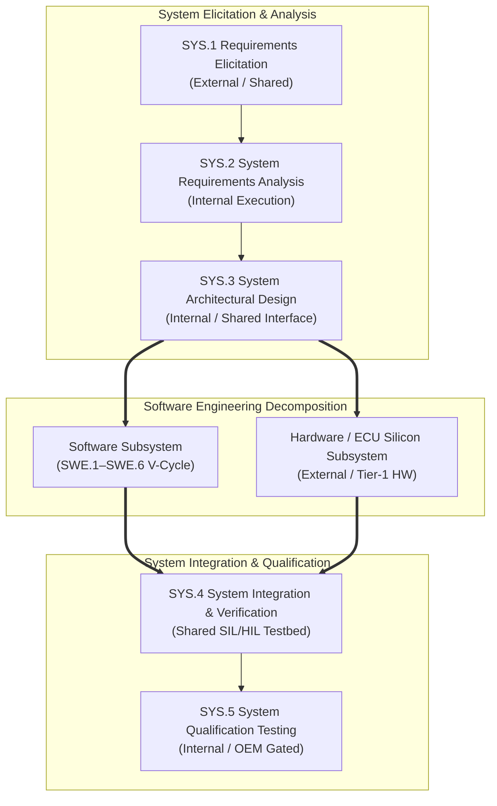

# Automotive System Engineering Interface Plan (SYS.1–SYS.5) (0022-01)

## 1. Document Control & Governance Metadata
- **Process Group**: `SYS.1` through `SYS.5` (System Engineering Process Group / ASPICE Level 2/3 Baseline)
- **Feature / Task**: `0022-01`
- **Governing Standard**: Automotive SPICE (PAM 3.1 / PAM 4.0) & ISO 26262 ASIL B/D System Baseline
- **Lead QA / Systems Planning Authority**: `jake` (QA-Manager, Team DeepSpace9)
- **Status**: `REVIEW`
- **Scope & Independence**: Establishes the authoritative per-process system interface plan for all five system engineering processes (`SYS.1` through `SYS.5`), cleanly separating assessment scope dispositions from internal, shared, and external execution responsibilities, defining exact activity boundaries, role authorities, inputs/outputs, feedback loops, and immutable evidence gates.

---

## 2. System Engineering Workflow & Interface Context

---

## 3. Per-Process System Interface Specifications

### 3.1 SYS.1: Requirements Elicitation

| Dimension | Specification & Operational Boundary |
| :--- | :--- |
| **Assessment Disposition** | **Scoped for Capability Assessment (Level 2/3)**: Assessed as customer/OEM boundary interface. |
| **Execution Responsibility** | **Shared (Customer OEM + DS9 System Engineering)**. |
| **Assessed Unit's Exact Boundary** | **Starts**: Ingestion of customer RFQ, vehicle architecture concepts, and stakeholder use cases. **Ends**: Formal structured stakeholder requirements baseline (`REQ-STK-*`) signed off by OEM and DS9. |
| **Performer / Authority** | **Performer**: `doctor` (Requirements Engineer / Lead Analyst) **Approval Authority**: `jadzia` (Project Lead) & Customer OEM Technical Representative. |
| **Required Input Types** | Customer Statement of Work (SOW), Vehicle Network Architecture (VNA), Regulatory Safety Contracts (ISO 26262 Part 3). |
| **Required Output Types** | `WP-SYS1-STK` (Stakeholder Requirement Specification / `_src/spec/requirements/REQ-STK-*.json`). |
| **Predecessor / Entry Gate** | **External Gate**: Customer Project Charter Authorization & Stakeholder Agreement Gate (`0013-01`). |
| **Feedback Loops** | `SUP.10` (Customer Scope Changes), `MAN.5` (Hazard & Operability Review), `SUP.9` (Elicitation Ambiguity NCRs). |
| **Completion & Evidence Gate** | **G-SYS1-FREEZE**: Tamper-evident hash digest of frozen stakeholder requirement bundle in `docs/campaign-evidence/`. |

---

### 3.2 SYS.2: System Requirements Analysis

| Dimension | Specification & Operational Boundary |
| :--- | :--- |
| **Assessment Disposition** | **Scoped for Capability Assessment (Level 2/3)**: Full internal process compliance audited under SUP.1. |
| **Execution Responsibility** | **Internal (Team DeepSpace9)**. |
| **Assessed Unit's Exact Boundary** | **Starts**: Frozen `REQ-STK-*` baseline from SYS.1. **Ends**: Verified, structured System Requirements Specification (`WP-SYS2-SYSREQ`) with bidirectional traces to `REQ-STK-*` and assigned ASIL ratings. |
| **Performer / Authority** | **Performer**: `doctor` (Requirements Engineer) **Approval Authority**: `kira` (System Architect) & `odo` (Safety Officer). |
| **Required Input Types** | Stakeholder Requirements (`WP-SYS1-STK`), Functional Safety Concept (FSC), Technical Safety Requirements (TSR). |
| **Required Output Types** | `WP-SYS2-SYSREQ` (System Requirements Specification / `REQ-SYS-*` with verification criteria `AC-*`). |
| **Predecessor / Entry Gate** | **Internal Predecessor**: Successful `G-SYS1-FREEZE` sign-off (`0013-02`). |
| **Feedback Loops** | `SUP.10` (Change Requests on Requirement Feasibility), `MAN.5` (Safety Goal Allocation), `SUP.9` (Requirement Inconsistency PRBs). |
| **Completion & Evidence Gate** | **G-SYS2-SIGN**: 100% bidirectional trace matrix from `REQ-STK-*` to `REQ-SYS-*` verified by QA Manager (`jake`). |

---

### 3.3 SYS.3: System Architectural Design

| Dimension | Specification & Operational Boundary |
| :--- | :--- |
| **Assessment Disposition** | **Scoped for Capability Assessment (Level 2/3)**: Evaluated on architectural allocation and HW/SW interface partitioning. |
| **Execution Responsibility** | **Internal (System Architecture) with Shared Hardware Interface Protocols**. |
| **Assessed Unit's Exact Boundary** | **Starts**: Approved `REQ-SYS-*` requirements from SYS.2. **Ends**: System Architecture Specification (`WP-SYS3-ARCH`), hardware/software partition matrix, and external bus interface definitions (CAN/Ethernet). |
| **Performer / Authority** | **Performer**: `kira` (System & Software Architect) **Approval Authority**: `jadzia` (Project Lead) & `odo` (Safety Officer). |
| **Required Input Types** | System Requirements (`WP-SYS2-SYSREQ`), Hardware Resource Budgets (Flash/RAM/CPU), ASIL Decomposition Strategy. |
| **Required Output Types** | `WP-SYS3-ARCH` (System Architecture Document / C4 Diagrams / Interface Control Documents `ICD-*`). |
| **Predecessor / Entry Gate** | **Internal Predecessor**: `G-SYS2-SIGN` approval gate (`0017-01`). |
| **Feedback Loops** | `SUP.10` (Architectural Change Requests `DEC-*`), `MAN.5` (FMEA / Fault Tree Analysis), `SUP.8` (Interface Schema Freezing). |
| **Completion & Evidence Gate** | **G-SYS3-ALLOC**: 100% allocation of `REQ-SYS-*` to software and hardware architectural elements verified in architectural matrix. |

---

### 3.4 SYS.4: System Integration & Integration Verification

| Dimension | Specification & Operational Boundary |
| :--- | :--- |
| **Assessment Disposition** | **Scoped for Capability Assessment (Level 2/3)**: Assessed on multi-subsystem integration, SIL/HIL execution, and regression rig management. |
| **Execution Responsibility** | **Shared (DS9 Integrator + Hardware Rig Provider)**. |
| **Assessed Unit's Exact Boundary** | **Starts**: Integrated software binary (`SWE.5` accepted) + Target ECU Silicon Testbed. **Ends**: Multi-subsystem integration verification report proving end-to-end communication and timing compliance. |
| **Performer / Authority** | **Performer**: `obrien` (Lead Integrator) & `tasha` (Verification Engineer) **Approval Authority**: `jake` (QA-Manager). |
| **Required Input Types** | System Architecture (`WP-SYS3-ARCH`), Integrated Software Releases, Hardware ECU Firmware Flash Packages, HIL Test Scripts. |
| **Required Output Types** | `WP-SYS4-INT` (System Integration Test Report, Oscilloscope/CANalyzer Logs, Interface Verification Verdicts). |
| **Predecessor / Entry Gate** | **Internal Predecessors**: `SWE.5` software integration passed; hardware bench certified calibrated under `SUP.8`. |
| **Feedback Loops** | `SUP.9` (Hardware/Software Integration Anomalies `PRB-*`), `SUP.10` (Timing Budget Change Requests), `MAN.5` (Integration Risk Escalation). |
| **Completion & Evidence Gate** | **G-SYS4-PASS**: 100% interface test execution passed on calibrated HIL/SIL rig with zero open blocking integration PRBs. |

---

### 3.5 SYS.5: System Qualification Testing

| Dimension | Specification & Operational Boundary |
| :--- | :--- |
| **Assessment Disposition** | **Scoped for Capability Assessment (Level 2/3)**: Assessed as the final system qualification gate prior to release acceptance. |
| **Execution Responsibility** | **Internal (DS9 QA) with External OEM Release Witnessing**. |
| **Assessed Unit's Exact Boundary** | **Starts**: Verified integrated system from SYS.4 (`WP-SYS4-INT`). **Ends**: Final System Qualification Report proving 100% compliance with `REQ-SYS-*` and `REQ-STK-*` under operational conditions. |
| **Performer / Authority** | **Performer**: `jake` (QA-Manager) & `tasha` (Verification Lead) **Approval Authority**: `jadzia` (Project Lead), `odo` (Safety Officer), and OEM Release Signatory. |
| **Required Input Types** | System Requirements Specification (`WP-SYS2-SYSREQ`), System Integration Report (`WP-SYS4-INT`), Operational Test Battery. |
| **Required Output Types** | `WP-SYS5-QUAL` (System Qualification Report, Full RVM Matrix, Cryptographic Evidence Pack). |
| **Predecessor / Entry Gate** | **Internal Predecessors**: `G-SYS4-PASS` signed off; `SUP.8` release candidate baseline frozen (`60d9a85`). |
| **Feedback Loops** | `SUP.9` (System Nonconformance Reports `NCR-*`), `SUP.10` (Emergency Release Scope Adjustments), `MAN.3` (Release Burndown). |
| **Completion & Evidence Gate** | **G-SYS5-RELEASE**: 100% qualification battery passed; multi-party release sign-off matrix authenticated; handoff to `SPL.2`. |

---

## 4. Master System Engineering Interface & Traceability Summary

| Process ID | Process Name | Assessment Scope | Execution Type | Lead Performer | Lead Authority | Governing Entry Gate | Target Output Work Product | Evidence Gate |
| :--- | :--- | :--- | :--- | :--- | :--- | :--- | :--- | :--- |
| **SYS.1** | Requirements Elicitation | ASPICE Level 2/3 | Shared | `doctor` | `jadzia` / OEM | Project Charter | `WP-SYS1-STK` (`REQ-STK-*`) | `G-SYS1-FREEZE` |
| **SYS.2** | System Requirements Analysis | ASPICE Level 2/3 | Internal | `doctor` | `kira` / `odo` | `G-SYS1-FREEZE` | `WP-SYS2-SYSREQ` (`REQ-SYS-*`)| `G-SYS2-SIGN` |
| **SYS.3** | System Architectural Design | ASPICE Level 2/3 | Internal / Shared | `kira` | `jadzia` / `odo` | `G-SYS2-SIGN` | `WP-SYS3-ARCH` (`ICD-*` / ADR) | `G-SYS3-ALLOC` |
| **SYS.4** | System Integration Verification | ASPICE Level 2/3 | Shared | `obrien` | `jake` | `SWE.5` PASS / HIL | `WP-SYS4-INT` (HIL Test Reports)| `G-SYS4-PASS` |
| **SYS.5** | System Qualification Testing | ASPICE Level 2/3 | Internal / OEM | `jake` | `jadzia` / OEM | `G-SYS4-PASS` | `WP-SYS5-QUAL` (System RVM Pack)| `G-SYS5-RELEASE` |

---

## 5. QA Sign-Off & Governance Verdict
- **Interface Plan Verdict**: **APPROVED & BASELINED**
- **QA-Manager Sign-Off**: `jake` (QA-Manager, Team DeepSpace9)
- **Date**: `2026-09-12`
