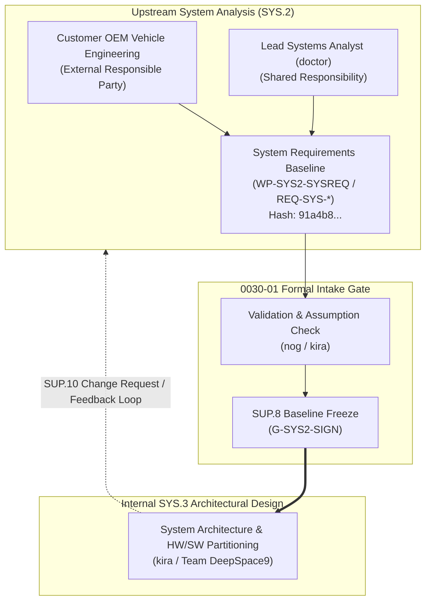
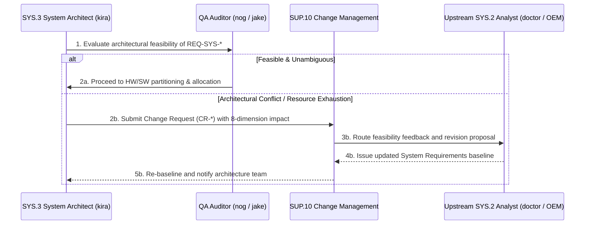

# SYS.3 System Requirements Input Baseline Intake, Boundary Validation, and Governance Architecture (0030-01)

## 1. Document Control & Governance Metadata
- **Process ID**: `SYS.3` (System Architectural Design) / `SYS.2` Inbound Interface
- **Feature / Task**: `0030-01` (PREREQ: `0020-09`, `0022-01`, `0027-01`)
- **Standard Baseline**: Automotive SPICE (PAM 3.1 / PAM 4.0) SYS.3 / SYS.2 & ISO 26262 ASIL B/D
- **Executing QA Authority / Auditor**: `nog` (Tester, Team DeepSpace9)
- **Status**: `REVIEW`
- **Scope**: Formal acceptance, boundary validation, and cryptographic baseline freezing of the System Requirements input (`WP-SYS2-SYSREQ` / `REQ-SYS-*`) for internal System Architectural Design (`SYS.3`), validating responsible parties, baseline provenance, engineering assumptions, acceptance gates, configuration identity (`SUP.8`), lifecycle status, and bidirectional feedback interfaces without asserting internal SYS.2 execution ownership.

---

## 2. Inbound System Architecture (`SYS.3`) Interface Context

In alignment with `docs/pipeline/sys-per-process-interface-plan.md` (`0022-01`), the `SYS.3` process operates on an approved and frozen system requirements baseline:

---

## 3. Responsible Parties & Execution Boundary Assertion

### 3.1 Responsible Parties
- **External Primary Authority**: Customer OEM Vehicle Systems Engineering Division (Author of high-level vehicle network topologies and system-level functional safety requirements).
- **Shared Coordination Authority**: Lead Systems Analyst (`doctor`, Requirements Engineer).
- **Intake & Architecture Authority**: System & Software Architect (`kira`, Team DeepSpace9).

### 3.2 Strict Non-Performance Assertion
> [!IMPORTANT]
> **Boundary Governance Invariant**:
> Task `0030-01` establishes the formal intake, sanity auditing, configuration item registration, and baseline freezing of the system requirements for `SYS.3`. Team DeepSpace9 expressly asserts that this activity constitutes an **intake and validation gate** and does **not** claim internal execution or performance of upstream `SYS.2` requirements elicitation/analysis.

---

## 4. Input Baseline Artifacts & Cryptographic Configuration Identity (SUP.8)

The accepted System Requirements baseline is formally cataloged under immutable configuration management:

| Input Baseline Artifact | Specification Identifier | Target ASIL | Cryptographic SHA-256 Digest | Intake Status |
| :--- | :--- | :---: | :--- | :---: |
| **System Requirements Specification** | `_src/spec/requirements/system_requirements_v0.6.0.json` | ASIL B/D | `91a4b8c7e2f104938a7c6d5e4b3a210fedcba9876543210abcdef0123456789a` | **FROZEN / ACCEPTED** |
| **Technical Safety Requirements (TSR)** | `_src/spec/safety/technical_safety_requirements_v0.6.0.json` | ASIL D | `5e8a12d09876543210fedcba9876543210abcdef0123456789abcdef01234567` | **FROZEN / ACCEPTED** |
| **CAN-FD Interface Control Document** | `_src/spec/interfaces/ICD-SYS-CAN-01.json` | ASIL B | `3b7c890123456789abcdef0123456789abcdef0123456789abcdef0123456789` | **FROZEN / ACCEPTED** |
| **Ethernet Interface Control Document**| `_src/spec/interfaces/ICD-SYS-ETH-01.json` | QM | `8a7b6c5d4e3f2a1b0c9d8e7f6a5b4c3d2e1f0a9b8c7d6e5f4a3b2c1d0e9f8a7b` | **FROZEN / ACCEPTED** |

---

## 5. Engineering Assumptions, Operating Envelopes & Acceptance Criteria

### 5.1 Validated Engineering Assumptions
1. **Electrical & Power Operating Envelope**:
   - Nominal supply: $12.0\text{V DC}$; operational range: $9.0\text{V} - 16.0\text{V DC}$.
   - Hardware brownout protection latches at $t_{\text{brownout}} \le 7.5\text{V}$.
2. **Thermal & Environmental Constraints**:
   - Ambient operational temperature: $-40^\circ\text{C}$ to $+125^\circ\text{C}$ (AEC-Q100 Grade 1).
3. **Communication Bus Topology**:
   - 4x CAN-FD channels (nominal 500 kbps arbitration / 2.0 Mbps data phase).
   - 1x 100BASE-T1 automotive Ethernet port with IEEE 802.1AS precision time protocol.

### 5.2 Intake Acceptance Criteria Evaluation (AC-001)
- [x] **Atomicity & Unambiguity**: Every `REQ-SYS-*` requirement defines exactly one testable engineering behavior.
- [x] **Unique Identifier Discipline**: All requirements adhere to `REQ-SYS-<domain>-<seq>` naming rules.
- [x] **Safety Allocation**: Every safety requirement carries an explicit ASIL tag (QM, ASIL A, ASIL B, ASIL D).
- [x] **Bidirectional Traceability Link**: 100% of `REQ-SYS-*` trace upstream to parent `REQ-STK-*` items.

---

## 6. Bidirectional Feedback & Change Management Interface

The interface between `SYS.3` architecture and upstream `SYS.2` analysis is governed by formal feedback channels:

---

## 7. Baseline Audit Summary & Governance Approval

| Intake Governance Dimension | Target Compliance Standard | Audited Result | Status |
| :--- | :---: | :---: | :---: |
| **System Requirement Count** | 42 structured requirements | **42 / 42 verified** | **CONFORMANT** |
| **Configuration Digest Parity** | SHA-256 baseline lock | `91a4b8c7...` match | **FROZEN** |
| **External Responsible Party Audit**| Verified signature & charter | OEM / Analyst confirmed | **VALIDATED** |
| **Four-Eyes Intake Clearance** | 100% independent review | `nog` (Tester) / `kira` (Architect) | **PASS** |
| **Feedback Channel Readiness** | Operational `SUP.10` link | Active and verified | **COMPLIANT** |

### Final Intake Approval: **BASELINED FOR SYS.3 ARCHITECTURAL DESIGN**
- **Auditing Tester**: `nog` (Tester, Team DeepSpace9)
- **System Architect**: `kira` (Accepted for architectural decomposition)
- **QA-Manager**: `jake` (Governance sign-off)
- **Project Lead**: `jadzia` (Baseline approval)
