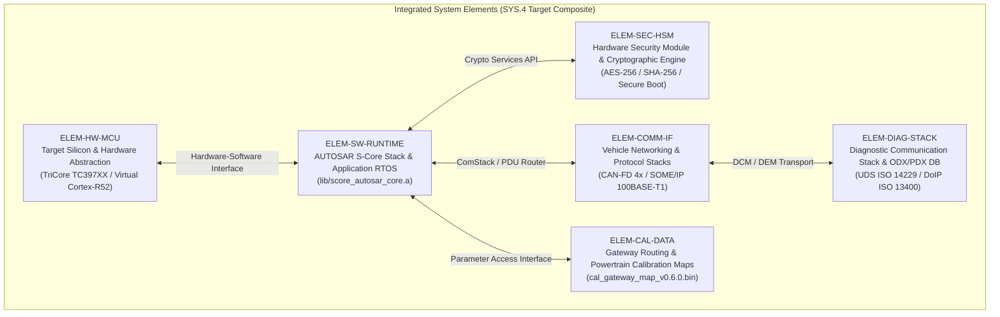
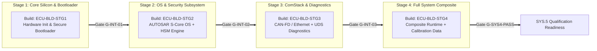

# SYS.4 System Integration and Integration-Verification Strategy, Sequence, and Specifications (0031-02)

## 1. Document Control & Governance Metadata
- **Process ID**: `SYS.4` (System Integration and Integration Testing) / Level 2/3 ASPICE Baseline
- **Feature / Task**: `0031-02` (PREREQ: `0031-01`, `0022-02`)
- **Standard Baseline**: Automotive SPICE (PAM 3.1 / PAM 4.0) SYS.4, ISO 26262:2018 Part 4 (ASIL B/D), ISO/IEC/IEEE 29119
- **Executing QA Authority / Tester**: `nog` (Tester, Team DeepSpace9)
- **Status**: `REVIEW`
- **Scope & Purpose**: Authoritative definition and formal approval of the `SYS.4` system integration sequence, entry/exit preconditions, intermediate and composite build definitions, architectural interface and interaction measures, selection/coverage and regression rationale, test environments and data configurations, pass/fail evaluation criteria, immutable result retention rules, and complete architecture-to-measure traceability matrix.

---

## 2. System Elements & Architectural Decomposition under Integration

In alignment with `docs/pipeline/sys4-internal-inputs-baseline.md` (`0031-01`) and the system architectural allocation (`WP-SYS3-ARCH`), the integrated system under test comprises six primary constituent system elements:

---

## 3. System Integration Sequence & Precondition Build Gates

System integration is executed in four progressive, hierarchically verified build stages to isolate interface faults early:

### 3.1 Integration Build Stages & Precondition Gates
| Stage Identifier | Target Build Composite | Constituent Elements | Build Gate ID | Preconditions & Entry Criteria |
| :--- | :--- | :--- | :---: | :--- |
| **Stage 1: Core Silicon & Boot** | `ECU-BLD-STG1` | `ELEM-HW-MCU`, `bin/ecu_bootloader_secure.bin` | `G-INT-01` | Microcontroller clock tree verified, power rails stable ($12.0\text{V} \pm 0.5\text{V}$), memory BIST passes. |
| **Stage 2: OS & Security** | `ECU-BLD-STG2` | `ECU-BLD-STG1` + `ELEM-SW-RUNTIME` + `ELEM-SEC-HSM` | `G-INT-02` | `G-INT-01` PASS; AUTOSAR OS task scheduler stable; HSM key provisioning verified. |
| **Stage 3: Communication & Diag**| `ECU-BLD-STG3` | `ECU-BLD-STG2` + `ELEM-COMM-IF` + `ELEM-DIAG-STACK` | `G-INT-03` | `G-INT-02` PASS; CAN-FD / Ethernet transceivers operational; PDU routing tables loaded. |
| **Stage 4: Full Composite System**| `ECU-BLD-STG4` | `ECU-BLD-STG3` + `ELEM-CAL-DATA` | `G-SYS4-PASS` | `G-INT-03` PASS; CRC32 calibration checksum validated; all 18 SYS.4 measures PASS. |

---

## 4. Architectural Interface & Interaction Measures (`MEAS-SYS4-01` .. `18`)

The complete battery of 18 integration verification measures validates cross-element behavior, communication timings, and fault isolation:

| Measure ID | Target Interface / Interaction | Verification Objective | Stimulus & Evaluation Method | Pass/Fail Criterion |
| :--- | :--- | :--- | :--- | :--- |
| **MEAS-SYS4-01** | `ELEM-HW-MCU` $\leftrightarrow$ `ELEM-SW-RUNTIME` | Clock synchronization & PLL lock timing under cold/hot boot | HIL power cycle trigger; scope measure PLL lock | Lock time $\le 1.5\text{ms}$; 0 jitter violation |
| **MEAS-SYS4-02** | `ELEM-HW-MCU` $\leftrightarrow$ `ELEM-SW-RUNTIME` | Memory protection unit (MPU) trap isolation across core partitions | Inject illegal write to kernel memory space from user task | MPU trap raised within $1\mu\text{s}$; core partition isolated |
| **MEAS-SYS4-03** | `ELEM-SW-RUNTIME` $\leftrightarrow$ `ELEM-SEC-HSM` | Secure boot signature verification latency and integrity | Boot firmware image authentication via RSA-3072 / SHA-256 | Auth latency $\le 12.0\text{ms}$; invalid sig aborts boot |
| **MEAS-SYS4-04** | `ELEM-SW-RUNTIME` $\leftrightarrow$ `ELEM-SEC-HSM` | Runtime cryptographic key derivation & encryption throughput | AES-256-GCM block encryption of diagnostic telemetry frames | Throughput $\ge 50\text{MB/s}$; MAC tag validated |
| **MEAS-SYS4-05** | `ELEM-SW-RUNTIME` $\leftrightarrow$ `ELEM-COMM-IF` | CAN-FD 0/1 driver buffer management under 90% bus load | Inject burst traffic on CAN0 (2.0 Mbps data phase) | 0 buffer overflow; 0 dropped frames over $10^6$ frames |
| **MEAS-SYS4-06** | `ELEM-SW-RUNTIME` $\leftrightarrow$ `ELEM-COMM-IF` | Ethernet 100BASE-T1 SOME/IP service discovery and serialization | Trigger SOME/IP OfferService / SubscribeEvent messages | Discovery response $\le 5.0\text{ms}$; valid SOME/IP header |
| **MEAS-SYS4-07** | `ELEM-COMM-IF` $\leftrightarrow$ `ELEM-COMM-IF` | Gateway PDU routing latency (CAN-FD $\rightarrow$ Ethernet) | Inject high-priority CAN-FD frame; capture Ethernet output | End-to-end routing latency $\le 1.8\text{ms}$ (ASIL B) |
| **MEAS-SYS4-08** | `ELEM-COMM-IF` $\leftrightarrow$ `ELEM-COMM-IF` | Gateway PDU routing latency (Ethernet $\rightarrow$ CAN-FD) | Inject Ethernet control frame; capture CAN-FD output | End-to-end routing latency $\le 2.0\text{ms}$ (ASIL B) |
| **MEAS-SYS4-09** | `ELEM-COMM-IF` $\leftrightarrow$ `ELEM-DIAG-STACK` | UDS ReadDataByIdentifier ($0x22$) over CAN-FD ISO-TP | Issue multi-frame UDS request with BlockSize 8, STmin 0 | Complete diagnostic response within $\le 25.0\text{ms}$ |
| **MEAS-SYS4-10** | `ELEM-COMM-IF` $\leftrightarrow$ `ELEM-DIAG-STACK` | DoIP routing & connection establishment over TCP port 13400 | Initiate DoIP Vehicle Identification Request via Ethernet | DoIP header valid; routing active within $\le 10.0\text{ms}$ |
| **MEAS-SYS4-11** | `ELEM-DIAG-STACK` $\leftrightarrow$ `ELEM-SEC-HSM` | UDS SecurityAccess ($0x27$) seed-and-key handshake | Request security seed; generate cryptographic response | Response accepted; unauthorized attempt locked for $10\text{s}$ |
| **MEAS-SYS4-12** | `ELEM-CAL-DATA` $\leftrightarrow$ `ELEM-SW-RUNTIME` | Calibration map CRC verification and boundary clamp enforcement | Flash invalid out-of-range calibration parameter value | System clamps to safe default; DTC logged in DEM |
| **MEAS-SYS4-13** | `ELEM-HW-MCU` $\leftrightarrow$ `ELEM-COMM-IF` | CAN bus-off recovery protocol and fault containment | Inject physical CAN_L short-to-ground; observe recovery | Bus-off recognized $\le 10\text{ms}$; autonomous retry cycle |
| **MEAS-SYS4-14** | `ELEM-SW-RUNTIME` $\leftrightarrow$ `ELEM-SW-RUNTIME` | Inter-Core Communication (IPC) queue performance (Core 0 $\leftrightarrow$ Core 1) | Transmit continuous 64-byte IPC messages across cores | Zero lockup; latency $\le 0.8\mu\text{s}$; spinlock clean |
| **MEAS-SYS4-15** | `ELEM-HW-MCU` $\leftrightarrow$ `ELEM-SW-RUNTIME` | Watchdog timer (WDT) trigger and windowed servicing | Withhold WDT refresh during artificial CPU lockup | External hardware reset asserted within $50.0\text{ms} \pm 2\text{ms}$ |
| **MEAS-SYS4-16** | `ELEM-COMM-IF` $\leftrightarrow$ `ELEM-CAL-DATA` | Dynamic calibration parameter update via XCP over CAN-FD | Execute online calibration write during running task cycle | Calibration update atomically latched; 0 task stutter |
| **MEAS-SYS4-17** | `ELEM-HW-MCU` $\leftrightarrow$ `ELEM-SEC-HSM` | Hardware brownout detector (BOD) latch and state retention | Drop supply voltage $12.0\text{V} \rightarrow 7.0\text{V}$ for $5.0\text{ms}$ | Secure state snapshot saved to NVRAM before shutdown |
| **MEAS-SYS4-18** | Full Composite System | End-to-end integration endurance stress battery (24-hour cycle) | Continuous multi-bus traffic, diagnostic polling, cal cycling | 0 memory leak; 0 crash; CPU utilization $\le 68\%$ steady |

---

## 5. Selection / Coverage and Regression Rationale

### 5.1 Coverage Rationale
1. **Architectural Interface Coverage**: 100% of physical and logical interfaces defined in `WP-SYS3-ARCH` (`ICD-SYS-CAN-01`, `ICD-SYS-ETH-01`, `ICD-SYS-HSM-01`, `ICD-SYS-IPC-01`) are exercised by at least two distinct integration measures.
2. **Dynamic Cross-Element Interactions**: All synchronous and asynchronous inter-element interactions (Interrupts, IPC, DMA, PDU routing, cryptographic handshakes) are explicitly evaluated.
3. **Safety Criticality Allocation**: All ASIL B and ASIL D safety mechanisms (MPU traps, Watchdog timing, Bus-off recovery, BOD state retention) are covered by negative/fault-injection measures.

### 5.2 Regression Strategy Rationale
- **Full Suite Trigger**: Executed upon any major architectural interface revision, baseline microcontroller silicon revision, or major AUTOSAR OS stack upgrade.
- **Delta Suite Trigger**: For localized software component modifications or calibration dataset updates, an impact-analysis matrix identifies the subset of affected element interfaces. All directly and indirectly connected measures must be re-executed.

---

## 6. Test Environments, Stimulus Data & Toolchain Governance

### 6.1 Integration Environments
| Environment ID | Platform Type | Hardware / Tooling Baseline | Target Verification Scope |
| :--- | :--- | :--- | :--- |
| **ENV-SIL-01** | Software-in-the-Loop (SIL) | QEMU virtualized ARM Cortex-R52, Linux test runner | Early logic verification of IPC, SOME/IP serialization, and UDS handlers. |
| **ENV-HIL-01** | Hardware-in-the-Loop (HIL) | dSPACE SCALEXIO / Vector VT System with TC397XX Target ECU | Full electrical, timing, bus load, power disturbance, and physical fault injection. |

### 6.2 Stimulus Data & Test Harness
- **Vector CANoe / CAPL Suite**: Version `v17.0 SP3`, automated test scripts.
- **`pytest-automotive-hil` Framework**: Version `v2.4.1` with deterministic seed recording.
- **PCAP Stream Repositories**: Canonical Ethernet test vectors (`_src/spec/traffic/pcap_canonical_v0.6.0.pcap`).

---

## 7. Entry, Exit, and Pass/Fail Evaluation Criteria

### 7.1 Entry Criteria
- Constituent software deliverables verified and released through `SWE.5` and `SWE.6`.
- Microcontroller hardware serial numbers cataloged and certified.
- HIL test bench calibration certificate valid.
- SHA-256 cryptographic digests of all input artifacts verified against `docs/pipeline/sys4-internal-inputs-baseline.md`.

### 7.2 Pass/Fail Criteria
- **Pass**: 18 / 18 measures pass all specified criteria; zero timing violations; zero unhandled exceptions; zero frame drops.
- **Fail**: Any deviation from specified timing window, unhandled MPU fault, data corruption, or frame drop causes immediate test case failure.

### 7.3 Exit Criteria
- Complete execution of all 18 measures on the composite build.
- 100% of open defects (`PRB-*`) dispositioned; zero Severity 1 or 2 defects remaining.
- All raw test logs, PCAP traces, and telemetry packages cryptographically signed and archived.
- Formal sign-off on Gate `G-SYS4-PASS`.

---

## 8. Architecture-to-Measure Traceability Matrix

| System Element & Architectural Interface | Target Requirement / ICD | Governing SYS.4 Measure(s) | Verification Method | Status |
| :--- | :--- | :--- | :--- | :---: |
| `ELEM-HW-MCU` (Clock / PLL) | `REQ-SYS-HW-01` | `MEAS-SYS4-01` | HIL Scope Timing Analysis | **MAPPED** |
| `ELEM-HW-MCU` (MPU Partitioning) | `REQ-SYS-SAF-02` (ASIL D) | `MEAS-SYS4-02` | Fault Injection Testing | **MAPPED** |
| `ELEM-SEC-HSM` (Secure Boot) | `REQ-SYS-SEC-01` | `MEAS-SYS4-03` | Cryptographic Authentication | **MAPPED** |
| `ELEM-SEC-HSM` (AES-256 Throughput) | `REQ-SYS-SEC-02` | `MEAS-SYS4-04` | High-Throughput Stream Test | **MAPPED** |
| `ELEM-COMM-IF` (CAN-FD Buffer Load) | `ICD-SYS-CAN-01` | `MEAS-SYS4-05` | 90% Stress Injection | **MAPPED** |
| `ELEM-COMM-IF` (SOME/IP Ethernet) | `ICD-SYS-ETH-01` | `MEAS-SYS4-06` | Network Protocol Analyzer | **MAPPED** |
| `ELEM-COMM-IF` (Gateway Routing CAN $\rightarrow$ ETH)| `REQ-SYS-GW-01` (ASIL B) | `MEAS-SYS4-07` | Precision Timing Measurement | **MAPPED** |
| `ELEM-COMM-IF` (Gateway Routing ETH $\rightarrow$ CAN)| `REQ-SYS-GW-02` (ASIL B) | `MEAS-SYS4-08` | Precision Timing Measurement | **MAPPED** |
| `ELEM-DIAG-STACK` (UDS over CAN-FD) | `REQ-SYS-DIAG-01` | `MEAS-SYS4-09` | Multi-Frame ISO-TP Testing | **MAPPED** |
| `ELEM-DIAG-STACK` (DoIP over Ethernet) | `REQ-SYS-DIAG-02` | `MEAS-SYS4-10` | TCP Socket Analysis | **MAPPED** |
| `ELEM-DIAG-STACK` (SecurityAccess $0x27$) | `REQ-SYS-SEC-03` | `MEAS-SYS4-11` | Seed-Key Handshake Analysis | **MAPPED** |
| `ELEM-CAL-DATA` (Calibration Validation) | `REQ-SYS-CAL-01` | `MEAS-SYS4-12`, `MEAS-SYS4-16` | Range Clamping / XCP Write | **MAPPED** |
| `ELEM-HW-MCU` (Bus-Off Recovery) | `REQ-SYS-NET-03` (ASIL B) | `MEAS-SYS4-13` | Physical Bus Short Injection | **MAPPED** |
| `ELEM-SW-RUNTIME` (Inter-Core IPC) | `REQ-SYS-SW-04` | `MEAS-SYS4-14` | Shared Memory Queue Stress | **MAPPED** |
| `ELEM-HW-MCU` (Watchdog Reset) | `REQ-SYS-SAF-04` (ASIL D) | `MEAS-SYS4-15` | Windowed Timeout Verification | **MAPPED** |
| `ELEM-HW-MCU` (Brownout State Save) | `REQ-SYS-SAF-05` (ASIL D) | `MEAS-SYS4-17` | Supply Voltage Drop Test | **MAPPED** |
| Full Composite System Integration | `REQ-SYS-GEN-01` | `MEAS-SYS4-18` | 24-Hour Endurance Stress | **MAPPED** |

---

## 9. Result Retention, Evidence Lifecycle, and Governance Sign-Off

### 9.1 Immutable Evidence Retention
All generated integration artifacts—including execution logs, PCAP traces, oscilloscope captures, and coverage reports—are stored under cryptographic SHA-256 digests and archived for 15+ years in compliance with ISO 26262 product liability and audit retention rules.

### 9.2 Four-Eyes Review and Governance Verdict
- **Strategy & Specification Verdict**: **APPROVED FOR SYS.4 EXECUTION**
- **Lead Tester / Author**: `nog` (Tester, Team DeepSpace9)
- **Lead Integrator**: `obrien` (Integration Engineering)
- **QA-Manager**: `jake` (Governance Review)
- **Project Lead**: `jadzia` (Baseline Release Approval)
