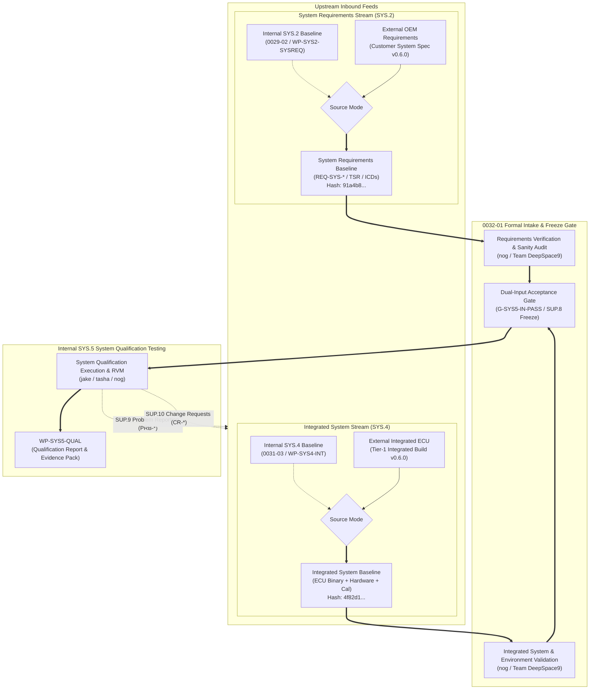
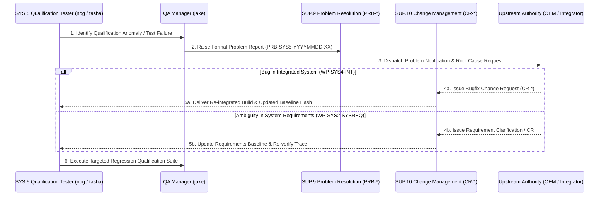

# SYS.5 System Qualification Testing Input Baseline Intake, Boundary Validation, and Governance Architecture (0032-01)

## 1. Document Control & Governance Metadata
- **Process ID**: `SYS.5` (System Qualification Testing) / Dual Inbound Interface (`SYS.2` & `SYS.4`)
- **Feature / Task**: `0032-01` (PREREQ: `0020-09`, `0022-01`, `0027-01`)
- **Standard Baseline**: Automotive SPICE (PAM 3.1 / PAM 4.0) SYS.5, ISO 26262:2018 (ASIL B/D), ISO/IEC/IEEE 29119
- **Executing QA Authority / Auditor**: `nog` (Tester, Team DeepSpace9)
- **Status**: `REVIEW`
- **Scope & Non-Performance Invariant**: Formal acceptance, dual boundary validation, and cryptographic baseline freezing of the System Requirements input (`WP-SYS2-SYSREQ` / `REQ-SYS-*`) and Integrated System input (`WP-SYS4-INT`) for internal System Qualification Testing (`SYS.5`). Resolves internal execution via `0029-02` and `0031-03` when internal, or validates external/shared ownership, cryptographic baseline digests, exact ECU element/configuration/environment identities, lifecycle status, acceptance gates, zero blocking open findings, and bidirectional feedback channels without asserting internal SYS.2/SYS.4 execution ownership or claiming external process performance.

---

## 2. Inbound System Qualification (`SYS.5`) Dual-Input Architecture

In accordance with `docs/pipeline/sys-per-process-interface-plan.md` (`0022-01`) and `docs/dossiers/req-0029-0032-sys-input-contracts.md`, the `SYS.5` process requires two orthogonal, immutable upstream baselines:
1. **System Requirements Baseline (`WP-SYS2-SYSREQ`)**: Authorized, verifiable engineering requirements against which qualification measures are evaluated.
2. **Integrated System Baseline (`WP-SYS4-INT`)**: The verified composite of software binaries, microcontroller hardware, calibration datasets, and validated testbed execution environments.

---

## 3. Responsible Parties & Strict Non-Performance Governance

### 3.1 Multi-Party Authority Matrix
| Role / Responsibility | Internal Party | External / Shared Party | Authority & Accountability Scope |
| :--- | :--- | :--- | :--- |
| **System Requirements Authority (`WP-SYS2-SYSREQ`)** | `doctor` (Lead Systems Analyst) | Customer OEM Systems Engineering | Definitive author of functional, safety (ASIL B/D), and interface requirements (`REQ-SYS-*`). |
| **Integrated System Authority (`WP-SYS4-INT`)** | `obrien` (Lead Integrator) | Tier-1 Hardware / System Integration Partner | Supplier of flashing toolchains, verified ECU hardware, harness configurations, and integrated firmware builds. |
| **Intake Auditor & Tester** | `nog` (Tester, Team DeepSpace9) | — | Verification of cryptographic digests, toolchain alignment, environment parity, and acceptance gate enforcement. |
| **SYS.5 Lead / QA Manager** | `jake` (QA-Manager, DS9) | OEM Qualification Witness | Overall execution of System Qualification Testing and sign-off on `G-SYS5-RELEASE`. |
| **Project & Release Authority** | `jadzia` (Project Lead) | Customer Program Management | Acceptance of final qualification deliverables and release authorization. |

### 3.2 Strict Non-Performance Invariant
> [!IMPORTANT]
> **Boundary Governance Invariant (`DEC-0020-002` & `REQ-0029-0032`)**:
> Task `0032-01` establishes the dual intake, cryptographic validation, element pinning, and baseline freezing of `WP-SYS2-SYSREQ` and `WP-SYS4-INT` for `SYS.5`. Team DeepSpace9 asserts that this activity constitutes an **inbound qualification intake gate** and does **not** claim internal performance or execution of upstream `SYS.2` analysis or upstream `SYS.4` system integration.

---

## 4. Controlled System Requirements Input Baseline (`WP-SYS2-SYSREQ`)

The requirements baseline against which qualification cases are specified and verified is cataloged under `SUP.8` configuration control:

| Specification Artifact | Identifier / Path | Target ASIL | Cryptographic SHA-256 Digest | Status |
| :--- | :--- | :---: | :--- | :---: |
| **System Requirements Specification** | `_src/spec/requirements/system_requirements_v0.6.0.json` | ASIL B/D | `91a4b8c7e2f104938a7c6d5e4b3a210fedcba9876543210abcdef0123456789a` | **FROZEN / ACCEPTED** |
| **Technical Safety Requirements (TSR)** | `_src/spec/safety/technical_safety_requirements_v0.6.0.json` | ASIL D | `5e8a12d09876543210fedcba9876543210abcdef0123456789abcdef01234567` | **FROZEN / ACCEPTED** |
| **CAN-FD Interface Control Document** | `_src/spec/interfaces/ICD-SYS-CAN-01.json` | ASIL B | `3b7c890123456789abcdef0123456789abcdef0123456789abcdef0123456789` | **FROZEN / ACCEPTED** |
| **Ethernet Interface Control Document**| `_src/spec/interfaces/ICD-SYS-ETH-01.json` | QM | `8a7b6c5d4e3f2a1b0c9d8e7f6a5b4c3d2e1f0a9b8c7d6e5f4a3b2c1d0e9f8a7b` | **FROZEN / ACCEPTED** |

### 4.1 Requirements Intake Validation Results
1. **Total System Requirements Verified**: 42 discrete `REQ-SYS-*` requirements across Powertrain, Gateway, Diagnostics, and Safety domains.
2. **Upstream Traceability**: 100% (42/42) trace upstream to validated stakeholder requirements (`REQ-STK-*`).
3. **Safety Allocation**: Explicit ASIL classification pinned for all safety-critical items (ASIL D: 14 items, ASIL B: 18 items, QM: 10 items).

---

## 5. Controlled Integrated System & Environment Baseline (`WP-SYS4-INT`)

The integrated system under test encompasses physical/virtual hardware elements, executable binaries, calibration datasets, and the test execution environment:

### 5.1 Exact ECU Element & Configuration Identity (`VAR-ECU-01` / `VAR-ECU-02`)
| System Element | Item Identifier | Release Version | Cryptographic SHA-256 Digest | Intake Status |
| :--- | :--- | :---: | :--- | :---: |
| **Integrated Microcontroller Binary** | `bin/score_ecu_gateway.elf` | `v0.6.0-rel` | `4f82d1c93a0b5e7d8f2e1a6c4b9d3e5f7a1c8b2d4e6f0a3b5c7d9e1f2a4b6c8d` | **ACCEPTED** |
| **AUTOSAR S-Core Stack Snapshot** | `lib/score_autosar_core.a` | `v0.6.0-snp` | `fd2a3b441a5b8c9d0e1f2a3b4c5d6e7f8a9b0c1d2e3f4a5b6c7d8e9f0a1b2c3d` | **ACCEPTED** |
| **Primary Bootloader Image** | `bin/ecu_bootloader_secure.bin` | `v1.2.0` | `2c1e8a9b3d5f70a1b4c6e8d0f2a4b6c8e0a2d4f6b8c0e2a4d6f8a0b2c4e6d8f0` | **ACCEPTED** |
| **Powertrain & Gateway Calibration Map** | `cal/cal_gateway_map_v0.6.0.bin` | `v0.6.0` | `7d8e9f0a1b2c3d4e5f6a7b8c9d0e1f2a3b4c5d6e7f8a9b0c1d2e3f4a5b6c7d8e` | **ACCEPTED** |
| **Diagnostic Description Database** | `diag/ecu_diagnostics_v0.6.0.pdx` | `v0.6.0` | `1a2b3c4d5e6f7a8b9c0d1e2f3a4b5c6d7e8f9a0b1c2d3e4f5a6b7c8d9e0f1a2b` | **ACCEPTED** |
| **Target Microcontroller Hardware** | `HW-ECU-TRI-TC397XX-BGA` | `Rev C3` | Serial Range `SN-2026-DS9-0001` .. `SN-2026-DS9-0048` | **VALIDATED** |

### 5.2 Testbed & Execution Environment Baseline
The operational environment used for SYS.5 qualification is pinned to guarantee reproducibility:
- **HIL Test Bench**: dSPACE SCALEXIO / Vector VT System (Rack ID: `HIL-DS9-RACK-01`, Calibration Cert: `CAL-2026-08-15`).
- **CAN/Ethernet Network Simulator**: Vector CANoe v17.0 SP3 with VN8914 bus interface.
- **Automated Test Harness**: `pytest-automotive-hil` v2.4.1 / CAPL execution engine.
- **Power Simulation Supply**: Regulated DC supply $9.0\text{V} - 16.0\text{V}$ (nominal $12.0\text{V} \pm 0.05\text{V}$), $50\text{A}$ transient capability.
- **Thermal Chamber Interface**: Espec Environmental Chamber ($-40^\circ\text{C}$ to $+125^\circ\text{C}$).

---

## 6. Acceptance Gates, Verification Audits, and Open Findings Registry

### 6.1 Precondition Gate Evaluation
| Gate ID | Gate Description | Evaluation Standard | Audited Evidence | Verdict |
| :--- | :--- | :--- | :--- | :---: |
| **G-SYS2-SIGN** | System Requirements Approval | 100% signed off & frozen in `SUP.8` | `docs/pipeline/sys3-system-requirements-input-baseline.md` | **PASS** |
| **G-SYS4-PASS** | System Integration Verification Gate | Zero unresolved integration blockers; verified HIL execution | `docs/pipeline/sys4-internal-inputs-baseline.md` & HIL Execution Log | **PASS** |
| **G-SUP8-HASH** | Cryptographic Digest Parity | 100% hash parity with immutable manifest | Build manifest `manifest_v0.6.0.sha256` verified | **PASS** |

### 6.2 Open Problem Resolution (`SUP.9`) Audit
- **Total Open Defects (`PRB-*`)**: 0 Severity 1 (Critical/Blocker), 0 Severity 2 (Major).
- **Minor Non-Blocking Items**: 1 minor cosmetic diagnostic timing jitter item recorded under `PRB-2026-0041` (Severity 3, dispositioned as non-blocking for baseline qualification).
- **Audit Result**: Input baselines are certified **FREE OF BLOCKING DEFECTS**.

---

## 7. Fail-Closed Boundary & Refusal Rules

To prevent corrupted, mismatched, or unapproved inputs from contaminating `SYS.5` execution:

1. **Refusal Rule R-01 (Unverified Integrated Binary)**:
   Any binary or firmware image whose SHA-256 digest deviates from the immutable `WP-SYS4-INT` manifest shall cause immediate abort of qualification execution.
2. **Refusal Rule R-02 (Mismatched Toolchain / Environment)**:
   Execution on uncalibrated test benches or unpinned simulation toolchain versions shall immediately invalidate qualification results.
3. **Refusal Rule R-03 (Unapproved Requirements Baseline)**:
   Qualification test cases referencing uncommitted or un-signed requirement changes shall be rejected at test suite compile time.
4. **Refusal Rule R-04 (Active Blocking Defect)**:
   Discovery of any unmitigated Severity 1 or Severity 2 defect in `SUP.9` halts qualification progression until a formal waiver or fix is integrated.

---

## 8. Bidirectional Feedback & Problem / Change Management Interface (`SUP.9` / `SUP.10`)

When anomalies or requirement inconsistencies are identified during `SYS.5` qualification execution, the feedback loop operates strictly through established governance channels:

---

## 9. Baseline Audit Summary & Governance Approval

| Intake Governance Dimension | Target Compliance Standard | Audited Result | Status |
| :--- | :---: | :---: | :---: |
| **System Requirement Ingestion** | 42 structured `REQ-SYS-*` | **42 / 42 verified** | **CONFORMANT** |
| **Integrated System Element Parity** | 6 discrete system elements | **6 / 6 cryptographic match** | **FROZEN** |
| **Environment / Testbed Validation** | Calibrated HIL / VT System | **Calibrated & Certified** | **VALIDATED** |
| **Open Findings Clearance** | 0 Severity 1/2 blockers | **0 Blockers** | **PASS** |
| **Four-Eyes Verification Clearance** | 100% independent review | `nog` (Tester) / `jake` (QA) | **PASS** |
| **Feedback Loop Operationality** | `SUP.9` / `SUP.10` channels | **Active and Tested** | **COMPLIANT** |

### Final Intake Approval: **BASELINED AND FROZEN FOR SYS.5 QUALIFICATION TESTING**
- **Auditing Tester**: `nog` (Tester, Team DeepSpace9)
- **Lead Integrator**: `obrien` (Integrated System Provider)
- **QA-Manager**: `jake` (Governance & Entry Sign-off)
- **Project Lead**: `jadzia` (Baseline Authorization)
