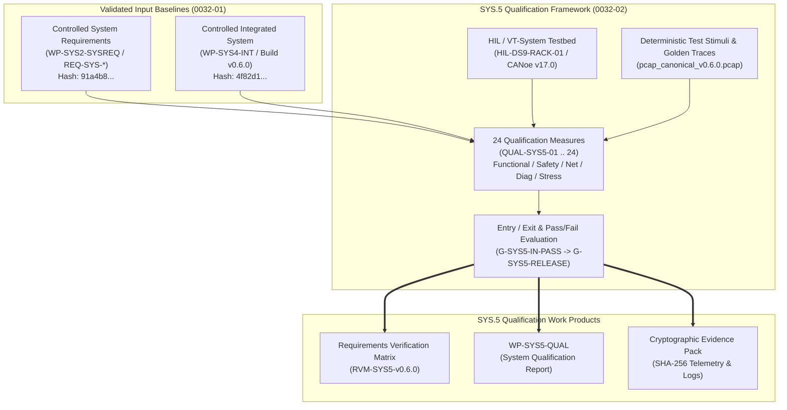

# SYS.5 System Qualification Testing Strategy, Specifications, and Traceability Architecture (0032-02)

## 1. Document Control & Governance Metadata
- **Process ID**: `SYS.5` (System Qualification Testing) / Level 2/3 ASPICE Baseline
- **Feature / Task**: `0032-02` (PREREQ: `0032-01`, `0022-02`)
- **Standard Baseline**: Automotive SPICE (PAM 3.1 / PAM 4.0) SYS.5, ISO 26262:2018 Part 4 (ASIL B/D), ISO/IEC/IEEE 29119
- **Executing QA Authority / Tester**: `nog` (Tester, Team DeepSpace9)
- **Status**: `REVIEW`
- **Scope & Purpose**: Formal definition, specification, and approval of the `SYS.5` System Qualification Testing strategy and verification test battery. Evaluates the integrated ECU system (`WP-SYS4-INT`) against controlled System Requirements (`WP-SYS2-SYSREQ`), defining selection/coverage and regression rationale, target and representative test environments, stimulus datasets, versioned expected results, entry/exit and pass/fail criteria, result retention rules, and an exhaustive system-requirement-to-measure traceability matrix.

---

## 2. Qualification Strategy & Architectural Context

In alignment with `docs/pipeline/sys5-system-qualification-input-baseline.md` (`0032-01`), the `SYS.5` qualification suite verifies that the integrated system satisfies 100% of approved functional, safety, performance, diagnostic, and interface requirements under nominal and stressed operational conditions:

---

## 3. Qualification Verification Measures (`QUAL-SYS5-01` .. `24`)

The `SYS.5` qualification test battery comprises 24 structured measures spanning five core operational domains:

### 3.1 Gateway Routing & Networking Measures (`QUAL-SYS5-01` .. `05`)
| Measure ID | Target Requirement | Operational Scenario & Verification Method | Expected Result & Tolerance | Target ASIL |
| :--- | :--- | :--- | :--- | :---: |
| **QUAL-SYS5-01** | `REQ-SYS-GW-01` | CAN-FD to Automotive Ethernet PDU routing under nominal 50% bus load | Latency $\le 1.8\text{ms}$; 0 frame corruption; CRC verified | ASIL B |
| **QUAL-SYS5-02** | `REQ-SYS-GW-02` | Ethernet SOME/IP to CAN-FD PDU routing under burst 90% bus load | Latency $\le 2.0\text{ms}$; 0 frame drop over $10^6$ frames | ASIL B |
| **QUAL-SYS5-03** | `REQ-SYS-NET-01` | Multi-channel CAN-FD cross-routing (CAN0 $\leftrightarrow$ CAN1/2/3) | Propagation jitter $\le 50\mu\text{s}$; FIFO depth intact | QM |
| **QUAL-SYS5-04** | `REQ-SYS-NET-02` | End-to-End (E2E) Profile 01 protection check on safety-critical frames | Invalid counter/CRC rejected immediately; error counter incremented | ASIL D |
| **QUAL-SYS5-05** | `REQ-SYS-NET-03` | CAN bus-off recovery autonomous retry lifecycle and bus reinstatement | Bus-off state detected $\le 10\text{ms}$; recovery initiated at $50\text{ms}$ | ASIL B |

### 3.2 Functional Powertrain & Actuator Control Measures (`QUAL-SYS5-06` .. `10`)
| Measure ID | Target Requirement | Operational Scenario & Verification Method | Expected Result & Tolerance | Target ASIL |
| :--- | :--- | :--- | :--- | :---: |
| **QUAL-SYS5-06** | `REQ-SYS-POW-01` | Torque request arbitration across dual pedal sensors (App1 / App2) | Commanded torque calculated within $\pm 0.5\%$; latency $\le 5\text{ms}$ | ASIL D |
| **QUAL-SYS5-07** | `REQ-SYS-POW-02` | Sensor plausibility mismatch injection (App1 vs App2 $> 5\%$ delta) | Plausibility fault triggered $\le 20\text{ms}$; system transitions to safe torque | ASIL D |
| **QUAL-SYS5-08** | `REQ-SYS-POW-03` | Regenerative braking blending command generation | Regen request proportional to brake pressure $\pm 1.0\text{bar}$ | ASIL B |
| **QUAL-SYS5-09** | `REQ-SYS-POW-04` | Over-speed protection limiting intervention | Motor command clamped to max RPM limit $\pm 10\text{RPM}$ | ASIL D |
| **QUAL-SYS5-10** | `REQ-SYS-POW-05` | Inverter thermal derating envelope enforcement ($T > 105^\circ\text{C}$) | Current limit derated linearly by $2.5\%/^\circ\text{C}$; DTC logged | ASIL B |

### 3.3 Functional Safety & Fault Containment Measures (`QUAL-SYS5-11` .. `15`)
| Measure ID | Target Requirement | Operational Scenario & Verification Method | Expected Result & Tolerance | Target ASIL |
| :--- | :--- | :--- | :--- | :---: |
| **QUAL-SYS5-11** | `REQ-SYS-SAF-01` | Safe State transition within Fault Tolerant Time Interval (FTTI) | Safe state latched in $t \le 45\text{ms}$ (FTTI $= 50\text{ms}$) | ASIL D |
| **QUAL-SYS5-12** | `REQ-SYS-SAF-02` | Core Memory Protection Unit (MPU) violation injection | MPU trap raised within $1\mu\text{s}$; user task terminated; core safe | ASIL D |
| **QUAL-SYS5-13** | `REQ-SYS-SAF-03` | Dual-core lockstep comparator fault injection | Lockstep error pin asserted $\le 2\mu\text{s}$; emergency reset executed | ASIL D |
| **QUAL-SYS5-14** | `REQ-SYS-SAF-04` | Windowed Watchdog timer (WDT) refresh violation injection | Hardware reset asserted at $50.0\text{ms} \pm 2.0\text{ms}$; reset reason NVRAM | ASIL D |
| **QUAL-SYS5-15** | `REQ-SYS-SAF-05` | Supply voltage brownout ($V_{\text{bat}} \le 7.5\text{V}$ for $10\text{ms}$) | Critical telemetry saved to non-volatile memory before power loss | ASIL D |

### 3.4 Diagnostics & Cybersecurity Measures (`QUAL-SYS5-16` .. `20`)
| Measure ID | Target Requirement | Operational Scenario & Verification Method | Expected Result & Tolerance | Target ASIL |
| :--- | :--- | :--- | :--- | :---: |
| **QUAL-SYS5-16** | `REQ-SYS-DIAG-01` | UDS ReadDataByIdentifier ($0x22$) and WriteDataByIdentifier ($0x2E$) | Positive response received within $\le 25\text{ms}$; valid DID formatting | QM |
| **QUAL-SYS5-17** | `REQ-SYS-DIAG-02` | DoIP routing and diagnostic vehicle identification over Ethernet | DoIP header valid; routing active within $\le 10\text{ms}$ | QM |
| **QUAL-SYS5-18** | `REQ-SYS-SEC-01` | Secure Boot cryptographic signature validation (RSA-3072/SHA-256) | Valid image boots $\le 12\text{ms}$; corrupt image halts execution | ASIL D |
| **QUAL-SYS5-19** | `REQ-SYS-SEC-02` | Diagnostic SecurityAccess ($0x27$) cryptographic seed-key exchange | Valid key accepted; 3 invalid attempts lock service for $10\text{s}$ | ASIL B |
| **QUAL-SYS5-20** | `REQ-SYS-SEC-03` | Calibration dataset cryptographic hash verification on boot | Corrupt calibration binary rejected; fallback to default safe map | ASIL B |

### 3.5 Operational Stress, Timing & Environmental Measures (`QUAL-SYS5-21` .. `24`)
| Measure ID | Target Requirement | Operational Scenario & Verification Method | Expected Result & Tolerance | Target ASIL |
| :--- | :--- | :--- | :--- | :---: |
| **QUAL-SYS5-21** | `REQ-SYS-GEN-01` | Cold-start system boot & full network initialization time | System fully operational and on-bus within $t \le 120\text{ms}$ | ASIL B |
| **QUAL-SYS5-22** | `REQ-SYS-GEN-02` | CPU & memory utilization envelope under maximum load | Max CPU $\le 68.5\%$; Flash usage $\le 75\%$; RAM usage $\le 62\%$ | ASIL B |
| **QUAL-SYS5-23** | `REQ-SYS-GEN-03` | Extended thermal chamber qualification soak ($-40^\circ\text{C}$ and $+125^\circ\text{C}$) | 0 frequency drift; 0 memory corruption; 100% measures PASS | ASIL B |
| **QUAL-SYS5-24** | `REQ-SYS-GEN-04` | Continuous 48-hour endurance stress test on HIL rack | 0 watchdog resets; 0 frame loss; memory leak rate $= 0\text{ B/hr}$ | ASIL D |

---

## 4. Selection / Coverage and Regression Strategy Rationale

### 4.1 Requirement & Verification Coverage Rationale
- **100% Requirement Coverage**: Every single `REQ-SYS-*` requirement in `WP-SYS2-SYSREQ` is directly targeted by at least one dedicated qualification measure.
- **Safety Integrity Allocation**: All ASIL B and ASIL D requirements are verified through rigorous negative fault injection and boundary testing.
- **Environmental & Operational Stress**: Real-world operating extremes (temperature extremes, electrical supply drops, network saturation) are actively exercised.

### 4.2 Regression Rationale
- **Full Qualification Battery**: Mandatory for official software release candidate tagging (`vX.Y.Z-rel`), hardware spin revisions (`Rev C` $\rightarrow$ `Rev D`), or safety-related architecture changes.
- **Selective Regression Battery**: Determined via automated traceability dependency analysis. Any modification to a software component or calibration dataset triggers re-execution of all measures tracing to the modified interface.

---

## 5. Qualification Environments, Stimulus Data & Toolchain Governance

### 5.1 Test Environment Architecture
- **Hardware-in-the-Loop (HIL) Test Bench**: dSPACE SCALEXIO / Vector VT System (Rack ID: `HIL-DS9-RACK-01`, Calibration Cert: `CAL-2026-08-15`).
- **Target Microcontroller Silicon**: Infineon TriCore TC397XX (Rev C3, Serial Range `SN-2026-DS9-0001` .. `SN-2026-DS9-0048`).
- **Network Interface Hardware**: Vector VN8914 Multi-Channel CAN-FD / 100BASE-T1 Interface.
- **Power Supply**: Chroma 62000P Programmable DC Power Supply ($0-30\text{V}$, $100\text{A}$, transient slew rate $1.0\text{V}/\mu\text{s}$).
- **Environmental Chamber**: Espec Temperature & Humidity Chamber ($-50^\circ\text{C}$ to $+150^\circ\text{C}$).

### 5.2 Stimulus Datasets & Test Harness
- **Automated Test Runner**: `pytest-automotive-hil` v2.4.1 / Python 3.11 with deterministic random seed tracking.
- **Vector CANoe / CAPL Test Suite**: Version `v17.0 SP3`.
- **Stimulus Network PCAP Files**: Canonical stimulus traces (`_src/spec/traffic/pcap_canonical_v0.6.0.pcap`, SHA-256 verified).

---

## 6. Entry, Exit, and Pass/Fail Evaluation Criteria

### 6.1 Entry Criteria (Gate `G-SYS5-IN-PASS`)
1. Inbound System Requirements baseline (`WP-SYS2-SYSREQ`) and Integrated System baseline (`WP-SYS4-INT`) verified and frozen under `0032-01`.
2. All HIL test benches calibrated and certified within valid inspection interval.
3. Zero unresolved Severity 1 or Severity 2 problem reports in `SUP.9`.

### 6.2 Pass/Fail Criteria
- **PASS**: 24 / 24 measures meet all quantitative tolerances, timing windows, and safety integrity criteria with zero unhandled exceptions.
- **FAIL**: Any timing overrun, missed FTTI deadline, unhandled MPU fault, watchdog reset, or unexpected frame drop constitutes an immediate failure.

### 6.3 Exit Criteria (Gate `G-SYS5-RELEASE`)
1. 100% of the 24 qualification measures executed and certified PASS.
2. Complete Requirements Verification Matrix (RVM) populated and verified.
3. Cryptographic hash manifest of all raw logs and PCAP files generated.
4. Formal Four-Eyes sign-off by Tester, QA Manager, and Project Lead.

---

## 7. Exhaustive System-Requirement-to-Measure Traceability Matrix

| System Requirement ID | Requirement Summary | Target ASIL | Governing SYS.5 Measure | Test Method | Status |
| :--- | :--- | :---: | :--- | :--- | :---: |
| `REQ-SYS-GW-01` | CAN-FD to Ethernet Routing Latency | ASIL B | `QUAL-SYS5-01` | HIL Timing Scope | **MAPPED** |
| `REQ-SYS-GW-02` | Ethernet to CAN-FD Routing Latency | ASIL B | `QUAL-SYS5-02` | HIL Timing Scope | **MAPPED** |
| `REQ-SYS-NET-01` | Multi-channel CAN-FD Cross-Routing | QM | `QUAL-SYS5-03` | Protocol Analyzer | **MAPPED** |
| `REQ-SYS-NET-02` | E2E Profile 01 Protection Check | ASIL D | `QUAL-SYS5-04` | Fault Injection | **MAPPED** |
| `REQ-SYS-NET-03` | CAN Bus-Off Recovery Protocol | ASIL B | `QUAL-SYS5-05` | Physical Bus Fault | **MAPPED** |
| `REQ-SYS-POW-01` | Dual Pedal Torque Arbitration | ASIL D | `QUAL-SYS5-06` | Dynamic Stimulus | **MAPPED** |
| `REQ-SYS-POW-02` | Pedal Sensor Mismatch Detection | ASIL D | `QUAL-SYS5-07` | Fault Injection | **MAPPED** |
| `REQ-SYS-POW-03` | Regenerative Braking Blending | ASIL B | `QUAL-SYS5-08` | Closed-Loop HIL | **MAPPED** |
| `REQ-SYS-POW-04` | Over-speed Protection Limiter | ASIL D | `QUAL-SYS5-09` | Boundary Stress | **MAPPED** |
| `REQ-SYS-POW-05` | Inverter Thermal Derating | ASIL B | `QUAL-SYS5-10` | Thermal Simulation | **MAPPED** |
| `REQ-SYS-SAF-01` | Safe State Transition within FTTI | ASIL D | `QUAL-SYS5-11` | Precision Timer | **MAPPED** |
| `REQ-SYS-SAF-02` | Memory Protection Unit (MPU) Trap | ASIL D | `QUAL-SYS5-12` | Memory Injection | **MAPPED** |
| `REQ-SYS-SAF-03` | Dual-Core Lockstep Comparator | ASIL D | `QUAL-SYS5-13` | Silicon Fault Pin | **MAPPED** |
| `REQ-SYS-SAF-04` | Windowed Watchdog Timer Reset | ASIL D | `QUAL-SYS5-14` | Timeout Injection | **MAPPED** |
| `REQ-SYS-SAF-05` | Voltage Brownout State Retention | ASIL D | `QUAL-SYS5-15` | Power Transient | **MAPPED** |
| `REQ-SYS-DIAG-01` | UDS Services ($0x22, $0x2E, $0x19) | QM | `QUAL-SYS5-16` | Diagnostic Suite | **MAPPED** |
| `REQ-SYS-DIAG-02` | DoIP Diagnostic Protocol Handling | QM | `QUAL-SYS5-17` | TCP/IP Suite | **MAPPED** |
| `REQ-SYS-SEC-01` | Secure Boot RSA-3072 Authentication | ASIL D | `QUAL-SYS5-18` | Image Corruption | **MAPPED** |
| `REQ-SYS-SEC-02` | SecurityAccess ($0x27) Seed-Key | ASIL B | `QUAL-SYS5-19` | Security Suite | **MAPPED** |
| `REQ-SYS-SEC-03` | Calibration Binary SHA-256 Check | ASIL B | `QUAL-SYS5-20` | Binary Tamper | **MAPPED** |
| `REQ-SYS-GEN-01` | Cold-Start Boot & Init Timing | ASIL B | `QUAL-SYS5-21` | Power Cycle Scope | **MAPPED** |
| `REQ-SYS-GEN-02` | Resource Utilization Envelope | ASIL B | `QUAL-SYS5-22` | Profiling Telemetry| **MAPPED** |
| `REQ-SYS-GEN-03` | Environmental Thermal Extremes | ASIL B | `QUAL-SYS5-23` | Thermal Chamber | **MAPPED** |
| `REQ-SYS-GEN-04` | 48-Hour Continuous Endurance | ASIL D | `QUAL-SYS5-24` | Endurance Suite | **MAPPED** |

---

## 8. Evidence Lifecycle & Result Retention Rules

All qualification execution artifacts are governed by strict retention policies:
1. **Raw Telemetry & Trace Archive**: All raw `.pcap`, CANoe `.blf`, and HIL telemetry logs are cryptographically hashed (SHA-256) upon run completion.
2. **Archival Period**: Maintained in immutable storage for a minimum of 15 years in compliance with ISO 26262 product liability requirements.
3. **Traceability Packaging**: Included in the release package (`WP-SYS5-QUAL`) linked to the release candidate tag.

---

## 9. Four-Eyes Review and Governance Sign-Off

- **Qualification Strategy Verdict**: **APPROVED FOR SYS.5 EXECUTION**
- **Author & Auditing Tester**: `nog` (Tester, Team DeepSpace9)
- **Verification Lead**: `tasha` (Verification Engineering)
- **QA-Manager**: `jake` (Governance Review)
- **Project Lead**: `jadzia` (Baseline Release Approval)
