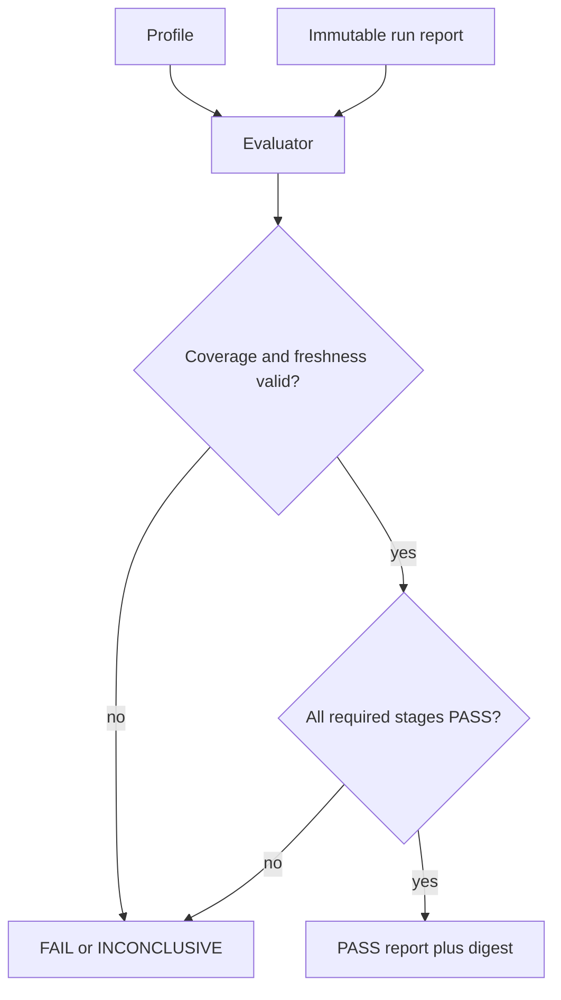

# Task validation profiles

`_src/tools/task_validation.py` evaluates a completed validation run against a versioned profile. It is intentionally an evaluator, not a process runner: stages are executed by the surrounding runner and must report their inputs, outputs, coverage, canaries, duration, and structured findings.

## Contract

A profile (`task-validation-profile@v1`) declares:

- required stage IDs and their exact input/output names;
- freshness fields and optional expected identity values;
- coverage canaries proving that each detector ran;
- duration/resource limits;
- whether a baseline-only run is explicitly allowed;
- allowed mutation declarations for the caller’s policy layer.

A run (`task-validation-run@v1`) supplies one immutable `run_id`, freshness identity, stage records, baseline/determinism flags, and mixed/stale indicators. The evaluator returns `task-validation-report@v1` with a bounded finding list and a digest-bound result.

```text
python3 _src/tools/task_validation.py \
  --profile profile.json \
  --run result.json
```

Exit codes are `0` for `PASS`, `1` for `FAIL`, and `2` for `INCONCLUSIVE` or malformed contracts.

## Why zero exit is not enough

A child process can exit zero while doing no checks, reading stale inputs, omitting a required stage, or reporting an error only inside a structured result. The evaluator therefore fails closed when:

- a required stage is missing or not `PASS`;
- declared inputs or outputs are absent from the stage report;
- detector coverage is zero or a required canary is missing;
- a structured finding has `error` or `critical` severity;
- freshness is missing, mismatched, mixed, or stale;
- a baseline-only run is not explicitly permitted and proven deterministic;
- a stage exceeds its declared duration limit.

The four-url probe, stale i18n zero-open-work, mtime-mixed, and synthetic-only fixtures are intentionally negative examples. Baseline-only determinism is the exception: it passes only when the profile opts in and the run records deterministic evidence.



The tool never installs dependencies, retries a failed stage, mutates the repository, or upgrades a baseline result into production validation. Callers must retain the run report and its input/environment identity as evidence.
