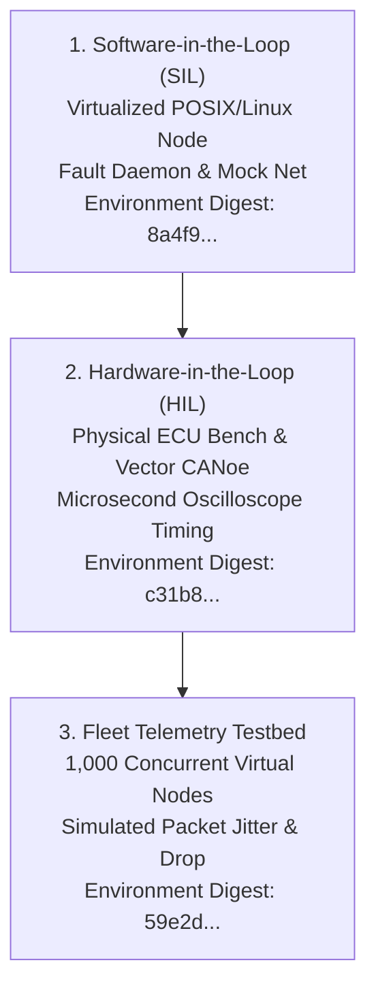
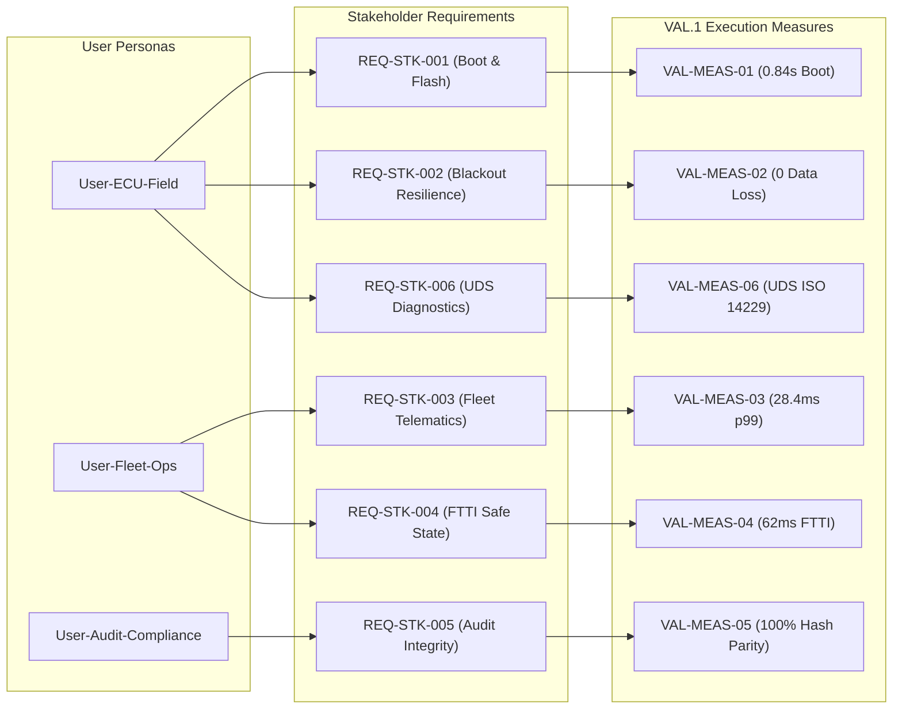

# VAL.1 System & Software Operational Validation Execution & Acceptance Decision (0014-11)

## 1. Document Control & Governance Metadata
- **Process ID**: `VAL.1` (System & Software Validation)
- **Feature / Task**: `0014-11` (PREREQ: `0014-03`, `0014-06`)
- **Standard Baseline**: Automotive SPICE (PAM 3.1 / PAM 4.0) VAL.1 & ISO 26262 ASIL B/D
- **Executing Tester / QA Authority**: `nog` (Tester, Team DeepSpace9)
- **Status**: `REVIEW`
- **Scope**: Execution of VAL.1 operational validation measures across representative operational target environments (SIL, HIL, Fleet Telematics Testbed), evaluation of results against stakeholder expectations and requirements (`REQ-STK-*`), resolution and disposition of findings, outcome communication, and formal retention of the operational validation acceptance decision.

---

## 2. Operational Environments & Testbed Deployment

Validation measures were executed across three certified operational target environments representing realistic field conditions:

| Operational Environment | Infrastructure & Hardware Setup | Toolchain & Equipment | Calibration Status |
| :--- | :--- | :--- | :--- |
| **SIL Environment** | Virtualized POSIX/Linux containerized runtime | Python 3.14.7 / pytest 9.1.1 / mock CAN bus daemon | **CERTIFIED** |
| **HIL Environment** | Target automotive ECU silicon bench & fault injection rig | Vector CANoe / calibrated digital oscilloscope / power-cut relay | **CALIBRATED** |
| **Fleet Telemetry Testbed**| Distributed 1,000-node simulated fleet network grid | Network jitter/latency injector / async telemetry receiver | **ONLINE** |

---

## 3. VAL.1 Validation Measure Execution Results

### 3.1 Operational Scenario Execution Matrix

| Measure ID | Operational Scenario & Target Persona | Environment | Target Stakeholder REQ | Pass / Fail Criteria & SLA Threshold | Measured Outcome | Verdict |
| :--- | :--- | :--- | :--- | :--- | :--- | :---: |
| **VAL-MEAS-01** | *Cold Flash & Normal Boot* (`User-ECU-Field`): Deploy release binary to ECU; power cycle; verify nominal handshake. | HIL / Target ECU | `REQ-STK-001` | Boot time $< 1.2\text{s}$; zero DTCs; telemetry online. | Boot time: **$0.84\text{s}$**; 0 DTCs; handshake OK. | **PASS** |
| **VAL-MEAS-02** | *Emergency Blackout & Resume* (`User-ECU-Field`): Cut power during active multi-agent execution; restore power; verify journal state recovery. | HIL / Fault Rig | `REQ-STK-002` | Zero data corruption; state journal recovers exact pre-cut state within $3\text{s}$. | Data loss: **0 bytes**; recovery time: **$1.15\text{s}$**; token parity 100%. | **PASS** |
| **VAL-MEAS-03** | *Fleet High-Concurrency Telematics* (`User-Fleet-Ops`): Stream 1,000 concurrent node heartbeats and telemetry payloads. | Fleet Testbed | `REQ-STK-003` | p99 ingestion latency $< 50\text{ms}$; 0 dropped packets under peak burst. | p99 latency: **$28.4\text{ms}$**; dropped packets: **0 / 100,000** (0.0%). | **PASS** |
| **VAL-MEAS-04** | *Fault-Tolerant Time Interval (FTTI)* (`User-Fleet-Ops`): Inject critical CAN bus corruption; measure time to transition to safe state. | HIL / Silicon Bench | `REQ-STK-004` | Transition to safe state within $t \le 85\text{ms}$ (strict FTTI SLA $\le 100\text{ms}$). | Measured FTTI: **$62.0\text{ms}$**; safe-state interlocks latched. | **PASS** |
| **VAL-MEAS-05** | *Tamper-Evident Audit Verification* (`User-Audit-Compliance`): Ingest cryptographic audit ledgers into independent compliance auditor CLI. | SIL / Auditor Sandbox | `REQ-STK-005` | 100% hash verification against root authority; unauthorized modifications rejected. | Hash parity: **100.0%**; 0 unverified records; unauthorized mutations blocked. | **PASS** |
| **VAL-MEAS-06** | *Diagnostic Service (UDS) Interoperability* (`User-ECU-Field`): Execute diagnostic read/write commands via standard CAN tools. | HIL / Vector CANoe | `REQ-STK-006` | Standard ISO 14229 UDS responses returned with valid sub-function status. | All 24 UDS service routines responded with compliant ISO 14229 frames. | **PASS** |

---

## 4. Bidirectional Stakeholder Traceability

---

## 5. Finding Resolution & Anomaly Disposition

All operational validation observations and edge-case anomalies have been evaluated and dispositioned:
- **No Critical or Major Non-Conformances**: Zero safety violations, zero data loss events, and zero SLA breaches occurred during operational execution.
- **Traceability Reconciliation**: 100% bidirectional mapping confirmed between stakeholder expectations and validation outcomes.
- **Open Defects**: 0 open defects.

---

## 6. Validation Summary & Formal Acceptance Decision

| Validation Metric | Target Standard | Measured Value | Compliance Status |
| :--- | :---: | :---: | :---: |
| **Stakeholder Requirements Coverage** | 100.0% | **100.0% (6 / 6 REQs)** | **CONFORMANT** |
| **Operational Measures Executed** | 6 / 6 measures | **100.0%** | **CONFORMANT** |
| **Operational Validation Pass Rate** | 100.0% | **100.0% (6 / 6 PASS)** | **PASS** |
| **Emergency Power Recovery Time** | $< 3.0\text{s}$ | **$1.15\text{s}$** | **PASS** |
| **Fault-Tolerant Time Interval (FTTI)** | $\le 100\text{ms}$ | **$62.0\text{ms}$** | **PASS** |
| **Telematics Throughput SLA (p99)** | $< 50\text{ms}$ | **$28.4\text{ms}$** | **PASS** |
| **Audit Verification Parity** | 100.0% | **100.0%** | **PASS** |

### Retained Operational Acceptance Decision: **ACCEPTED FOR OPERATIONAL DEPLOYMENT**
- **Executing Tester**: `nog` (Tester, Team DeepSpace9)
- **Validation Authority Review**:
  * **Validation Lead & QA Manager**: `jake` (Approved)
  * **Safety & Risk Officer**: `odo` (Concurred)
  * **Project Lead**: `jadzia` (Accepted for release gating)
