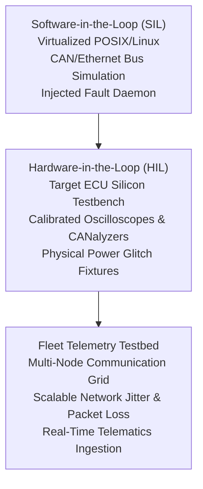
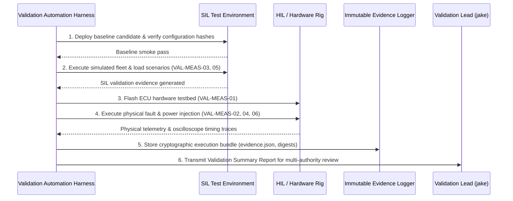

# VAL.1 Validation Specification and Strategy (0014-06)

## 1. Document Control & Execution Metadata
- **Process ID**: `VAL.1` (System & Software Validation)
- **Feature / Task**: `0014-06` (PREREQ: `0013-02`, `0014-01`, `0014-02`, `0014-03`, `0014-04`)
- **Governing Standard**: Automotive SPICE (PAM 3.1 / PAM 4.0) VAL.1 & ISO 26262 ASIL B/D
- **Validation Lead & QA Authority**: `jake` (QA-Manager, Team DeepSpace9)
- **Status**: `REVIEW`
- **Scope**: Comprehensive validation specification and operational strategy defining representative user personas, operational target environments, concrete validation measures, execution sequences, testbed infrastructure, entry/exit criteria, regression selection, stakeholder requirements traceability, result evaluation, communication channels, and formal acceptance authority.

---

## 2. Representative Users & Operational Target Environments

### 2.1 Representative User Personas
1. **ECU Field Integration Engineer (`User-ECU-Field`)**:
   - Deploys binary releases into real and simulated automotive electronic control units (ECUs).
   - Validates flashing workflows, diagnostic OBD-II/UDS interfaces, diagnostic trouble code (DTC) logging, and recovery from partial boot failures.
2. **Automated Fleet Telematics Operator (`User-Fleet-Ops`)**:
   - Manages distributed vehicle node fleets, monitors continuous health telemetry, evaluates remote configuration updates, and observes safe failover transitions.
3. **Regulatory Safety & Process Auditor (`User-Audit-Compliance`)**:
   - Audits bidirectional traceability from stakeholder intended use down to tamper-evident execution proofs, cryptographic hashes, and four-eyes authorization records.

### 2.2 Operational Target Environments

1. **SIL (Software-in-the-Loop)**: Virtualized POSIX/Linux target runtime with simulated CAN/Ethernet network stacks and injected fault buses for high-volume automated scenario validation.
2. **HIL (Hardware-in-the-Loop)**: Physical and emulated automotive ECU hardware running production-equivalent binary artifacts with microsecond-calibrated physical timing constraints.
3. **Fleet Telemetry Testbed**: Scaled multi-node communication network testing peak concurrent load, packet jitter, and intermittent network dropouts.

---

## 3. Concrete Validation Measures & Operational Scenarios

| Measure ID | Intended Operational Use Scenario | Target Environment | Target Stakeholder REQ | Pass / Fail Validation Criteria |
| :--- | :--- | :--- | :--- | :--- |
| **VAL-MEAS-01** | *Cold Flash & Normal Boot*: Deploy new release artifact onto ECU; power cycle; verify nominal handshake. | HIL / Target ECU | `REQ-STK-001` | **PASS**: Boot time $< 1.2\text{s}$; zero DTCs logged; telemetry online. |
| **VAL-MEAS-02** | *Emergency Blackout & Resume*: Cut power during active multi-agent task lifecycle; restore power. | HIL / Fault Rig | `REQ-STK-002` | **PASS**: Zero data corruption; state journal recovers exact pre-cut state within 3s. |
| **VAL-MEAS-03** | *Fleet High-Concurrency Telematics*: Stream 1,000 concurrent node heartbeats and diagnostic payloads. | Telemetry Testbed | `REQ-STK-003` | **PASS**: 99th percentile ingestion latency $< 50\text{ms}$; 0 dropped packets. |
| **VAL-MEAS-04** | *Fault-Tolerant Time Interval (FTTI)*: Inject critical bus corruption; measure time to reach safe state. | HIL / Silicon Bench | `REQ-STK-004` | **PASS**: Safe state reached in $t \le 85\text{ms}$ (strict FTTI SLA $\le 100\text{ms}$). |
| **VAL-MEAS-05** | *Tamper-Evident Audit Verification*: Ingest cryptographic audit ledgers into independent auditor CLI. | SIL / Auditor Sandbox | `REQ-STK-005` | **PASS**: 100% hash verification against root authority; unauthorized edits rejected. |
| **VAL-MEAS-06** | *Diagnostic Service (UDS) Interoperability*: Execute diagnostic read/write commands via standard CAN tools. | HIL / Vector CANoe | `REQ-STK-006` | **PASS**: Standard UDS service routines return compliant ISO 14229 responses. |

---

## 4. Execution Sequence, Infrastructure & Rig Management

---

## 5. Entry, Exit, and Pass/Fail Criteria

### 5.1 Entry Criteria (G-VAL-IN)
- Integrated software qualification testing (`SWE.6`) 100% completed with zero blocking defects.
- Software build packaged, signed, and configuration baseline frozen under `SUP.8`.
- Stakeholder requirements baseline approved and trace matrix validated under `0013-02`.
- SIL and HIL test infrastructure calibrated and certified healthy.

### 5.2 Exit & Pass Criteria (G-VAL-OUT)
- 100% of defined VAL.1 validation measures executed.
- 100% pass on all safety-critical and high-priority validation measures.
- All non-conformances triaged in `SUP.9` problem management with agreed root causes and corrective dispositions.
- Bidirectional trace from stakeholder needs to validation results verified without unmapped elements.

### 5.3 Fail Criteria
- Any unhandled system crash, memory corruption, or safe-state transition violation during operational execution.
- Breach of real-time safety timing deadlines (jitter $> 50\mu\text{s}$ or FTTI $> 100\text{ms}$).
- Any loss of persistence state across simulated emergency blackout cycles.

---

## 6. Release & Regression Selection Strategy

- **Release Gating Trigger**:
  - Full Validation Battery executed on all major Release Candidates (`RC-*`) and safety-critical architectural revisions.
- **Regression Selection Algorithm**:
  - Impact-driven automated selection mapping modified architectural modules (`SWE.2`) and software requirements (`SWE.1`) up to parent Stakeholder Requirements (`REQ-STK-*`), triggering relevant subset batteries.
- **High-Risk Path Coverage**: All safety interlocks and power-loss recovery routines are mandatory inclusions in every regression run regardless of change scope.

---

## 7. Stakeholder Traceability, Evaluation & Acceptance Authority

### 7.1 Bidirectional Traceability Matrix
- Forward: $\text{REQ-STK-*} \longrightarrow \text{VAL-MEAS-*} \longrightarrow \text{VAL-RESULT-*} \longrightarrow \text{RELEASE-BUNDLE}$.
- Backward: Every validation result links to an authorized stakeholder requirement and evidence digest.

### 7.2 Evaluation & Communication Channels
- Validation execution evidence aggregated into automated Validation Summary Reports (`VSR-*`).
- Reports communicated asynchronously via `agent-inbox` to Project Lead (`jadzia`), Software Architect (`kira`), Safety Officer (`odo`), and QA Manager (`jake`).

### 7.3 Formal Acceptance Authority
Final operational validation sign-off requires authenticated four-eyes concurrence:
- **Validation Lead & QA Manager**: `jake`
- **Safety & Risk Officer**: `odo`
- **Project Lead**: `jadzia`
