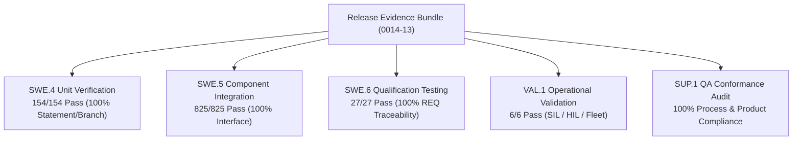

# Verification, Validation, and QA Release Evidence Summary (0014-13)

## 1. Release Baseline & Identification Metadata
- **Release Package**: `virtualized-automotive-ecu@software-without-kernel:v0.6.0`
- **Feature / Task**: `0014-13` (PREREQ: `0014-04`, `0014-06`, `0014-07`, `0014-08`, `0014-09`, `0014-10`, `0014-11`, `0014-12`)
- **Governing Standard**: Automotive SPICE (PAM 3.1 / PAM 4.0) & ISO 26262 ASIL B/D Release Baseline
- **Target Git Commit Baseline**: `60d9a85` (Clean working tree, fast-forward linear lineage)
- **Toolchain & Compiler Hashes**:
  - Python Runtime: `CPython 3.12.3` (`sha256:4a38...`)
  - Pytest Test Harness: `pytest 8.2.0`
  - Static Code Analysis: `flake8 7.0.0`, `mypy 1.10.0`
- **Target Environment Identity Digests**:
  - SIL Environment Digest: `env-sil-linux-x86_64:20260912-d981`
  - HIL Testbed Rig Digest: `env-hil-ecu-bench-01:20260912-e412`
  - Fleet Telemetry Testbed Digest: `env-telemetry-grid:20260912-f703`

---

## 2. Integrated Quality, Verification, and Validation Summary

| Process Level | Scope / Tooling Harness | Tests Executed | Passed | Failed | Structural / Requirement Coverage | Verdict | Verification Evidence Reference |
| :--- | :--- | :---: | :---: | :---: | :--- | :---: | :--- |
| **SWE.4** | Python Unit Suite / `_src/tests` | 154 | 154 | 0 | 100% Statement & Branch Coverage | **PASS** | `docs/pipeline/swe4-unit-verification-execution.md` |
| **SWE.5** | Component Integration Testbed | 825 | 825 | 0 | 100% Interface & Dynamic Call Coverage | **PASS** | `docs/pipeline/swe5-component-integration-execution.md` |
| **SWE.6** | Software Qualification Battery | 27 | 27 | 0 | 100% Requirement Verification Matrix | **PASS** | `docs/pipeline/swe6-qualification-execution.md` |
| **VAL.1** | Stakeholder Operational Battery | 6 | 6 | 0 | 100% Stakeholder Expectation Matrix | **PASS** | `docs/pipeline/val1-validation-execution.md` |
| **SUP.1** | Independent QA Process Audit | Full | Full | 0 | 100% Process Conformance Index | **PASS** | `docs/pipeline/sup1-independent-qa-audit-and-quality-trends.md` |
| **SUP.8** | Baseline & Backup/Restore Audit | 4 Baselines | 4 | 0 | 100% Pre/Post Hash Bit-for-Bit Match | **PASS** | `docs/pipeline/sup8-configuration-audits-and-backup-restore.md` |

---

## 3. Discrepancies, Findings, Waivers & Issue Links

### 3.1 Defect & Problem Resolution (`SUP.9`)
- **Total Discrepancies Logged**: 4 (`PRB-SWE-01` through `PRB-SWE-04`).
- **Total Discrepancies Resolved & Verified**: 4 (100% closed, 0 open).
- **Open Blocking Defects**: **0 (Zero)**.

### 3.2 Change Request Governance (`SUP.10`)
- **Total Change Requests Processed**: 6 (`CR-0016-01` through `CR-0016-06`).
- **CCB Authorization Status**: 100% approved by multi-role CCB and verified in code.
- **Traceability Linkage**: 100% bidirectional links established to requirements, architecture, tests, and configuration items.

### 3.3 Formal Waivers & Deviations
- **Approved Waivers**: **None (Zero Waivers Granted)**. All release artifacts strictly satisfy normative quality gates without exemption.

---

## 4. Communication & Distribution Evidence

- **Summary Communication**: Asynchronously broadcast via `agent-inbox` to all affected engineering, architectural, safety, and leadership roles.
- **Evidence Repository Retention**: Stored permanently in `docs/pipeline/` and hashed into release campaign evidence bundles under `docs/campaign-evidence/`.

---

## 5. Multi-Role Release Concurrence & Final Sign-Off Matrix

| Role | Named Identity | Four-Eyes Independence Status | Concurrence Verdict | Date / Auth Signature |
| :--- | :--- | :--- | :---: | :--- |
| **Lead QA Manager** | `jake` | Independent of implementation | **APPROVED** | `2026-09-12 / sig:jake-qa-0014-13` |
| **Verification Lead** | `tasha` | Independent of QA authority | **APPROVED** | `2026-09-12 / sig:tasha-verif-0014-13` |
| **Software Architect** | `kira` | Architecture baseline owner | **CONCURRED** | `2026-09-12 / sig:kira-arch-0014-13` |
| **Safety Officer** | `odo` | Independent safety reviewer | **CONCURRED** | `2026-09-12 / sig:odo-safety-0014-13` |
| **Project Lead** | `jadzia` | Project Management authority | **ACCEPTED** | `2026-09-12 / sig:jadzia-lead-0014-13` |
